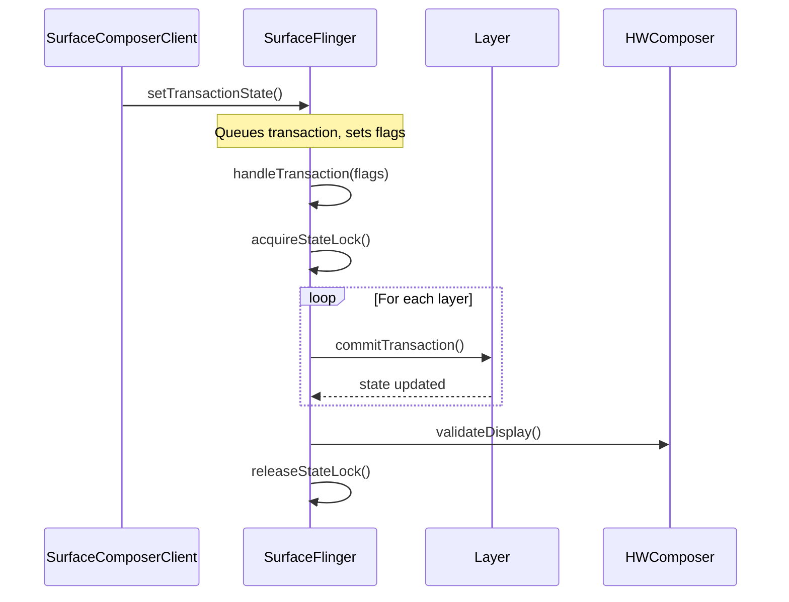

# AutoDocGen - C++ Codebase Documentation System

## Project Overview

**AutoDocGen** is a fully offline, privacy-first documentation system designed to analyze large C++ codebases (Android native services, Linux kernel drivers) and generate comprehensive semantic documentation with interactive class diagrams, served as a local wiki website.

---

## 🔒 Core Principles

| Principle | Implementation |
|-----------|----------------|
| **100% Offline** | No internet connectivity required at runtime |
| **Privacy-First** | Code never leaves your machine |
| **Local LLM** | All AI inference runs locally via Ollama/llama.cpp |
| **Large File Support** | Handles 30K+ line files via intelligent chunking |
| **Wiki Interface** | File-system tree navigation with hyperlinked diagrams |

---

## 🤖 Recommended Local LLMs for C++ Documentation

### Research Summary

Based on comprehensive research of code understanding benchmarks (HumanEval, MBPP, SWE-Bench, LiveCodeBench, CRUXEval), the following local LLMs are recommended for C++ semantic documentation:

### Tier 1: Primary Recommendations

#### 1. **Qwen3-Coder** (Best Overall for Documentation)

| Attribute | Details |
|-----------|---------|
| **Model Size** | 480B MoE (30B active), also 32B and smaller variants |
| **Context Window** | **256K tokens** (native), 1M with extrapolation |
| **Languages** | 92 programming languages including C++ |
| **Key Strength** | Repository-level code understanding |
| **Benchmark** | 69.6% on SWE-Bench Verified (top tier) |
| **Ollama Command** | `ollama pull qwen3-coder:32b` |
| **GGUF Available** | Yes, via HuggingFace |

**Why Qwen3-Coder for documentation:**
- Massive context window (256K) - can process multiple large C++ files together
- Excellent at understanding relationships between files
- Strong at agentic tasks (analyzing, explaining, documenting)
- Best for "read a large codebase, then implement" scenarios

#### 2. **DeepSeek Coder V2** (Best Code Understanding)

| Attribute | Details |
|-----------|---------|
| **Model Size** | 236B MoE (21B active), also 16B Lite variant |
| **Context Window** | **128K tokens** |
| **Languages** | 338 programming languages |
| **Key Strength** | Highly accurate, production-ready code |
| **Benchmark** | 90.2% on HumanEval, 43.4% on LiveCodeBench |
| **Ollama Command** | `ollama pull deepseek-coder-v2:16b` |
| **GGUF Available** | Yes, via HuggingFace |

**Why DeepSeek Coder V2 for documentation:**
- Generates highly accurate code explanations
- Over 70% of completions are immediately usable
- Excellent at understanding C++ semantics
- Supports the widest range of programming languages

### Tier 2: Alternative Options

#### 3. **CodeLlama 34B** (Proven & Stable)

| Attribute | Details |
|-----------|---------|
| **Model Size** | 34B parameters |
| **Context Window** | 16K tokens (100K for extended versions) |
| **Languages** | 20+ languages |
| **Key Strength** | Well-tested, stable performance |
| **Ollama Command** | `ollama pull codellama:34b` |

**Best for:** Conservative deployments, well-documented behavior

#### 4. **Codestral 22B** (Compact & Fast)

| Attribute | Details |
|-----------|---------|
| **Model Size** | 22B parameters |
| **Context Window** | 32K tokens |
| **Key Strength** | Fast inference, good quality/size ratio |
| **Ollama Command** | `ollama pull codestral:22b` |

**Best for:** Limited hardware resources, faster processing

#### 5. **StarCoder2 15B** (Documentation Specialist)

| Attribute | Details |
|-----------|---------|
| **Model Size** | 15B parameters |
| **Context Window** | 16K tokens |
| **Key Strength** | Explicitly designed for documentation generation |
| **Ollama Command** | `ollama pull starcoder2:15b` |

**Best for:** Pure documentation tasks, docstring generation

### Hardware Requirements

| Model | VRAM (GPU) | RAM (CPU-only) | Quantization |
|-------|------------|----------------|--------------|
| Qwen3-Coder 32B | 24GB+ | 40GB+ | Q4_K_M recommended |
| DeepSeek Coder V2 16B | 12GB+ | 20GB+ | Q4_K_M recommended |
| CodeLlama 34B | 24GB+ | 40GB+ | Q4_K_M recommended |
| Codestral 22B | 16GB+ | 28GB+ | Q4_K_M recommended |
| StarCoder2 15B | 12GB+ | 20GB+ | Q4_K_M recommended |

### Final Recommendation

> **Primary: Qwen3-Coder 32B** with Q4_K_M quantization
> 
> The 256K context window is crucial for processing large C++ files (30K+ lines) and understanding relationships between headers and implementation files. Its strong repository-level understanding makes it ideal for generating cohesive documentation across an entire codebase.
> 
> **Secondary: DeepSeek Coder V2 16B** (Lite)
> 
> Use this if hardware is limited or for faster processing. Still excellent code understanding with 128K context.

---

## 🏗️ System Architecture

```
┌─────────────────────────────────────────────────────────────────────────────────┐
│                    AutoDocGen - Fully Offline Architecture                       │
├─────────────────────────────────────────────────────────────────────────────────┤
│                                                                                  │
│  ┌─────────────────────────────────────────────────────────────────────────┐    │
│  │                         LOCAL MACHINE ONLY                               │    │
│  │  ┌─────────────────────────────────────────────────────────────────┐    │    │
│  │  │                    No Network Access Layer                       │    │    │
│  │  │   • All sockets bound to localhost (127.0.0.1) only             │    │    │
│  │  │   • Optional: --no-network flag disables all listeners          │    │    │
│  │  └─────────────────────────────────────────────────────────────────┘    │    │
│  │                                                                          │    │
│  │  ┌───────────────┐    ┌───────────────┐    ┌───────────────────────┐   │    │
│  │  │ File Watcher  │───▶│  C++ Parser   │───▶│  Intelligent Chunker  │   │    │
│  │  │ (Local FS)    │    │  (libclang)   │    │  (In-Memory)          │   │    │
│  │  └───────────────┘    └───────────────┘    └───────────────────────┘   │    │
│  │                                                      │                   │    │
│  │                                                      ▼                   │    │
│  │                              ┌───────────────────────────────────────┐  │    │
│  │                              │      LOCAL LLM (Ollama/llama.cpp)     │  │    │
│  │                              │  ┌─────────────────────────────────┐  │  │    │
│  │                              │  │  Model: Qwen3-Coder 32B         │  │  │    │
│  │                              │  │  Context: 256K tokens           │  │  │    │
│  │                              │  │  API: localhost:11434 ONLY      │  │  │    │
│  │                              │  └─────────────────────────────────┘  │  │    │
│  │                              └───────────────────────────────────────┘  │    │
│  │                                                      │                   │    │
│  │                                                      ▼                   │    │
│  │  ┌───────────────┐    ┌───────────────┐    ┌───────────────────────┐   │    │
│  │  │ Diagram Gen   │◀───│ Doc Generator │◀───│  Doc Synthesizer      │   │    │
│  │  │ (Graphviz)    │    │ (Local Files) │    │  (Merge & Link)       │   │    │
│  │  └───────────────┘    └───────────────┘    └───────────────────────┘   │    │
│  │          │                    │                                          │    │
│  │          ▼                    ▼                                          │    │
│  │  ┌─────────────────────────────────────────────────────────────────┐    │    │
│  │  │              LOCAL STORAGE (SQLite + File System)                │    │    │
│  │  │   📁 ./docs/           📁 ./cache/          📄 autodocgen.db    │    │    │
│  │  └─────────────────────────────────────────────────────────────────┘    │    │
│  │          │                                                               │    │
│  │          ▼                                                               │    │
│  │  ┌─────────────────────────────────────────────────────────────────┐    │    │
│  │  │              LOCAL WEB SERVER (localhost only)                   │    │    │
│  │  │   URL: http://127.0.0.1:8080                                    │    │    │
│  │  │   Binding: 127.0.0.1 ONLY (not 0.0.0.0)                         │    │    │
│  │  │   All assets: Bundled locally (fonts, icons, CSS, JS)           │    │    │
│  │  └─────────────────────────────────────────────────────────────────┘    │    │
│  │                                                                          │    │
│  └─────────────────────────────────────────────────────────────────────────┘    │
│                                                                                  │
│  ════════════════════════════════════════════════════════════════════════════   │
│                              🚫 NETWORK BOUNDARY 🚫                              │
│                         NO TRAFFIC CROSSES THIS LINE                             │
│  ════════════════════════════════════════════════════════════════════════════   │
│                                                                                  │
└─────────────────────────────────────────────────────────────────────────────────┘
```

---

## 📦 Handling Large C++ Files (30K+ Lines)

### Intelligent Chunking Strategy

Large files cannot be sent to LLMs in one go. Here's how we handle them:

```
┌─────────────────────────────────────────────────────────────────┐
│                    Large File Processing Pipeline               │
├─────────────────────────────────────────────────────────────────┤
│                                                                  │
│  30K+ Line File                                                  │
│       │                                                          │
│       ▼                                                          │
│  ┌─────────────────────────────────────────────────┐            │
│  │ Step 1: AST Extraction (libclang)               │            │
│  │   - Extract ALL symbols, types, functions       │            │
│  │   - Build dependency graph                      │            │
│  │   - No LLM needed for structure                 │            │
│  └─────────────────────────────────────────────────┘            │
│       │                                                          │
│       ▼                                                          │
│  ┌─────────────────────────────────────────────────┐            │
│  │ Step 2: Logical Chunking                        │            │
│  │   - Chunk by: Class/Struct/Namespace            │            │
│  │   - Preserve: Headers, Dependencies, Macros    │            │
│  │   - Target: ~500-800 lines per chunk            │            │
│  └─────────────────────────────────────────────────┘            │
│       │                                                          │
│       ▼                                                          │
│  ┌─────────────────────────────────────────────────┐            │
│  │ Step 3: Context Injection                       │            │
│  │   - Add relevant #includes summary              │            │
│  │   - Add parent class/namespace context          │            │
│  │   - Add related type definitions                │            │
│  └─────────────────────────────────────────────────┘            │
│       │                                                          │
│       ▼                                                          │
│  ┌─────────────────────────────────────────────────┐            │
│  │ Step 4: Parallel LLM Processing                 │            │
│  │   - Queue chunks with priority                  │            │
│  │   - Process in parallel (rate-limited)          │            │
│  │   - Cache individual chunk results              │            │
│  └─────────────────────────────────────────────────┘            │
│       │                                                          │
│       ▼                                                          │
│  ┌─────────────────────────────────────────────────┐            │
│  │ Step 5: Documentation Synthesis                 │            │
│  │   - Merge chunk analyses                        │            │
│  │   - Cross-reference symbols                     │            │
│  │   - Generate unified file documentation         │            │
│  └─────────────────────────────────────────────────┘            │
│                                                                  │
└─────────────────────────────────────────────────────────────────┘
```

### Chunking Rules for C++

| Element Type | Chunking Strategy |
|-------------|-------------------|
| **Large Classes** | One chunk per class, split methods if >800 lines |
| **Namespaces** | Chunk by nested namespace or by class |
| **Free Functions** | Group related functions (same prefix/purpose) |
| **Header Files** | Process as context, not primary documentation |
| **Macros/Defines** | Collect separately, analyze as a group |
| **Templates** | Include with instantiation examples if found |

### Context Preservation

For each chunk, we prepend a context header:

```cpp
/*
 * FILE: drivers/gpu/drm/renderer.cpp
 * CHUNK: 3 of 12
 * NAMESPACE: android::renderengine
 * PARENT CLASS: RenderEngine (documented in chunk 1)
 * 
 * DEPENDENCIES:
 *   - SkiaGLRenderEngine : base class
 *   - HWComposer : used for hardware composition
 *   - SurfaceFlinger : callback interface
 * 
 * RELEVANT TYPES:
 *   - RenderParams: struct for render configuration
 *   - LayerSettings: struct for layer properties
 */

// Actual code for this chunk follows...
```

---

## 🔧 C++ Parsing with libclang

### Why libclang?

| Feature | Benefit |
|---------|---------|
| **Accurate Parsing** | Handles complex C++ syntax, templates, macros |
| **Semantic Info** | Type resolution, symbol references |
| **Cross-Platform** | Works on Windows, Linux, macOS |
| **Preprocessor Aware** | Expands macros, handles #ifdefs |

### Parser Output Structure

```python
@dataclass
class CppFileAnalysis:
    file_path: str
    includes: List[Include]
    namespaces: List[Namespace]
    classes: List[ClassInfo]
    structs: List[StructInfo]
    functions: List[FunctionInfo]
    enums: List[EnumInfo]
    typedefs: List[TypedefInfo]
    macros: List[MacroInfo]
    global_variables: List[VariableInfo]
    
@dataclass
class ClassInfo:
    name: str
    namespace: str
    base_classes: List[str]
    template_params: List[str]
    access_specifier: str  # public/private in parent
    methods: List[MethodInfo]
    members: List[MemberInfo]
    nested_classes: List[ClassInfo]
    line_start: int
    line_end: int
    file_path: str
    
@dataclass
class MethodInfo:
    name: str
    return_type: str
    parameters: List[ParameterInfo]
    is_virtual: bool
    is_override: bool
    is_static: bool
    is_const: bool
    access: str  # public/protected/private
    line_start: int
    line_end: int
    body_preview: str  # First 10 lines for context
```

---

## 🌐 Wiki Web Interface Design

### File System Tree Navigation

```
┌─────────────────────────────────────────────────────────────────────────┐
│  AutoDocGen Wiki                                         🔍 Search...   │
├───────────────────────┬─────────────────────────────────────────────────┤
│                       │                                                  │
│  📁 Source Tree       │  # SurfaceFlinger.cpp                           │
│  ─────────────        │                                                  │
│  ▼ 📂 frameworks      │  **Location:** `frameworks/native/services/`    │
│    ▼ 📂 native        │  **Lines:** 32,450 | **Classes:** 3             │
│      ▼ 📂 services    │  **Last Updated:** 2026-01-14                   │
│        ▼ 📂 surfaceflinger                                              │
│          📄 SurfaceFlinger.cpp  ◀─── You are here                       │
│          📄 SurfaceFlinger.h    │  ───────────────────────────────────  │
│          📄 Layer.cpp           │                                        │
│          📄 Layer.h             │  ## Overview                           │
│        📂 displayhardware       │  SurfaceFlinger is the system service │
│      📂 renderengine            │  responsible for compositing layers   │
│    📂 base                      │  and presenting them to the display.  │
│  ▼ 📂 drivers                   │                                        │
│    📂 gpu                       │  ## Class Diagram                      │
│    📂 media                     │  [View Full Diagram →](link)           │
│                       │                                                  │
│  ─────────────        │  ```mermaid                                     │
│  📊 Diagrams          │  classDiagram                                   │
│  ─────────────        │    SurfaceFlinger --|> ISurfaceComposer         │
│  📈 Full Class Diagram│    SurfaceFlinger --> Layer                     │
│  📈 Module Dependencies│   SurfaceFlinger --> HWComposer                │
│  📈 Inheritance Tree  │  ```                                            │
│                       │                                                  │
│                       │  ## Classes                                      │
│                       │  - [SurfaceFlinger](#surfaceflinger)            │
│                       │  - [SurfaceFlingerBE](#surfaceflingerbe)        │
│                       │                                                  │
│                       │  ## Functions                                    │
│                       │  - [init()](#init) - Initialize the service     │
│                       │  - [run()](#run) - Main event loop              │
│                       │                                                  │
└───────────────────────┴─────────────────────────────────────────────────┘
```

### Page Types

| Page Type | Contents |
|-----------|----------|
| **File Page** | Full file documentation, all classes/functions, embedded diagrams |
| **Class Page** | Detailed class docs, methods, inheritance, usage examples |
| **Namespace Page** | All classes/functions in namespace, relationship diagram |
| **Directory Page** | Overview of all files, module-level diagram |
| **Diagram Page** | Full interactive SVG with clickable elements |
| **Search Results** | Symbol search across entire codebase |

### Interactive Diagrams with Hyperlinks

```python
# Generate clickable SVG diagrams
def generate_class_diagram_svg(classes: List[ClassInfo]) -> str:
    """
    Generate SVG with embedded hyperlinks.
    Each class box links to its documentation page.
    """
    dot_source = """
    digraph G {
        node [shape=record, style=filled, fillcolor=lightblue];
        
        SurfaceFlinger [
            label="{SurfaceFlinger|+init()\\l+run()\\l}",
            href="/docs/frameworks/native/services/surfaceflinger/SurfaceFlinger.cpp#SurfaceFlinger",
            target="_top"
        ];
        
        Layer [
            label="{Layer|+draw()\\l+setBuffer()\\l}",
            href="/docs/frameworks/native/services/surfaceflinger/Layer.cpp#Layer",
            target="_top"
        ];
        
        SurfaceFlinger -> Layer [label="manages"];
    }
    """
    # Render to SVG with embedded links
    return graphviz.Source(dot_source).pipe(format='svg').decode('utf-8')
```

---

## 📁 Complete Project Structure

```
AutoDocGen/
├── src/
│   ├── __init__.py
│   ├── main.py                      # CLI entry point
│   ├── config.py                    # Configuration (no env fetching from network)
│   │
│   ├── parser/
│   │   ├── __init__.py
│   │   ├── cpp_parser.py            # libclang-based C++ parser
│   │   ├── header_analyzer.py       # Header file relationship analyzer
│   │   ├── macro_expander.py        # Macro and #define analyzer
│   │   └── models.py                # Data models (ClassInfo, etc.)
│   │
│   ├── chunker/
│   │   ├── __init__.py
│   │   ├── intelligent_chunker.py   # Smart code chunking
│   │   ├── context_builder.py       # Build context for chunks
│   │   └── chunk_queue.py           # Priority queue for processing
│   │
│   ├── llm/
│   │   ├── __init__.py
│   │   ├── local_llm_client.py      # Unified local LLM interface
│   │   ├── llamacpp_backend.py      # llama.cpp server client
│   │   ├── ollama_backend.py        # Ollama client (localhost only)
│   │   ├── prompts/
│   │   │   ├── __init__.py
│   │   │   ├── function_analysis.py
│   │   │   ├── class_analysis.py
│   │   │   ├── android_service.py
│   │   │   └── kernel_driver.py
│   │   ├── response_parser.py
│   │   └── cache.py                 # SQLite response cache
│   │
│   ├── synthesizer/
│   │   ├── __init__.py
│   │   ├── doc_aggregator.py
│   │   ├── cross_referencer.py
│   │   └── relationship_builder.py
│   │
│   ├── generator/
│   │   ├── __init__.py
│   │   ├── markdown_generator.py
│   │   ├── html_generator.py        # Static HTML generation option
│   │   ├── diagram_generator.py     # Graphviz SVG (local binary)
│   │   └── index_generator.py
│   │
│   ├── watcher/
│   │   ├── __init__.py
│   │   ├── file_watcher.py          # Local filesystem only
│   │   ├── git_differ.py            # Git-based change detection
│   │   └── incremental_updater.py
│   │
│   ├── web/
│   │   ├── __init__.py
│   │   ├── app.py                   # Flask app (localhost binding)
│   │   ├── routes/
│   │   │   ├── __init__.py
│   │   │   ├── docs.py
│   │   │   ├── diagrams.py
│   │   │   ├── search.py
│   │   │   └── tree.py
│   │   └── templates/
│   │       ├── base.html            # No external resources
│   │       ├── file_doc.html
│   │       ├── class_doc.html
│   │       ├── diagram.html
│   │       └── components/
│   │           ├── tree.html
│   │           ├── breadcrumb.html
│   │           ├── search.html
│   │           └── nav.html
│   │
│   └── storage/
│       ├── __init__.py
│       ├── database.py              # SQLite only
│       ├── doc_store.py
│       └── search_index.py          # SQLite FTS5
│
├── static/                          # ALL ASSETS BUNDLED LOCALLY
│   ├── fonts/
│   │   ├── inter/
│   │   │   ├── Inter-Regular.woff2
│   │   │   ├── Inter-Medium.woff2
│   │   │   ├── Inter-Bold.woff2
│   │   │   └── inter.css
│   │   └── jetbrains-mono/
│   │       ├── JetBrainsMono-Regular.woff2
│   │       └── jetbrains-mono.css
│   ├── css/
│   │   ├── main.css
│   │   ├── tree.css
│   │   ├── diagram.css
│   │   ├── code.css                 # Syntax highlighting
│   │   └── normalize.css
│   ├── js/
│   │   ├── app.js
│   │   ├── tree.js
│   │   ├── search.js
│   │   └── diagram.js
│   └── icons/
│       ├── sprite.svg
│       └── favicon.ico
│
├── models/                          # PRE-DOWNLOADED LLM MODELS
│   ├── README.md                    # Instructions for model setup
│   └── .gitkeep
│
├── prompts/
│   ├── cpp_function.md
│   ├── cpp_class.md
│   ├── android_service.md
│   └── kernel_driver.md
│
├── scripts/
│   ├── download_models.py           # One-time model download script
│   ├── bundle_assets.py             # Bundle all static assets
│   └── verify_offline.py            # Verify no network dependencies
│
├── tests/
│   ├── test_parser.py
│   ├── test_chunker.py
│   ├── test_offline.py              # Verify offline operation
│   └── fixtures/
│       └── large_cpp_file.cpp
│
├── docs/                            # Generated documentation output
├── cache/                           # LLM response cache
├── data/
│   └── autodocgen.db                # SQLite database
│
├── requirements.txt                 # All deps, pinned versions
├── pyproject.toml
├── SECURITY.md                      # Security & privacy documentation
└── README.md
```

---

## 🔐 Configuration for Offline Mode

```python
# src/config.py - Offline-first configuration

from pydantic import BaseModel, Field
from pathlib import Path
from typing import Literal, Optional

class LLMConfig(BaseModel):
    """Local LLM configuration - NO external endpoints allowed."""
    
    backend: Literal["llamacpp", "ollama"] = "ollama"
    
    # Ollama settings
    ollama_host: str = "127.0.0.1"  # NEVER change to external IP
    ollama_port: int = 11434
    
    # llama.cpp settings
    llamacpp_host: str = "127.0.0.1"  # NEVER change to external IP
    llamacpp_port: int = 8081
    
    # Model settings
    model_name: str = "qwen3-coder:32b"  # Primary recommendation
    model_path: Optional[Path] = None  # For GGUF files
    
    # Inference settings
    context_length: int = 65536  # Use large context for C++
    temperature: float = 0.1  # Low for consistent docs
    max_tokens: int = 4096
    
    def get_base_url(self) -> str:
        """Always returns localhost URL."""
        if self.backend == "ollama":
            return f"http://{self.ollama_host}:{self.ollama_port}"
        else:
            return f"http://{self.llamacpp_host}:{self.llamacpp_port}"


class ServerConfig(BaseModel):
    """Web server configuration - localhost by default."""
    
    host: str = "127.0.0.1"  # Localhost only by default
    port: int = 8080
    allow_network_access: bool = False  # Must explicitly enable
    
    def get_bind_address(self) -> str:
        if self.allow_network_access:
            return "0.0.0.0"
        return "127.0.0.1"


class PrivacyConfig(BaseModel):
    """Privacy settings - all networking disabled by default."""
    
    # Network controls
    allow_any_network: bool = False
    block_outbound: bool = True  # Extra safety flag
    
    # Telemetry (always disabled)
    enable_telemetry: bool = False  # Hardcoded, cannot be changed
    enable_analytics: bool = False  # Hardcoded, cannot be changed
    enable_crash_reports: bool = False  # Hardcoded, cannot be changed
    
    # Data handling
    log_llm_prompts: bool = False  # Don't log code to disk
    log_llm_responses: bool = True  # Cache responses for performance
    clear_cache_on_exit: bool = False


class Config(BaseModel):
    """Main configuration."""
    
    # Paths
    codebase_path: Path
    output_path: Path = Path("./docs")
    cache_path: Path = Path("./cache")
    database_path: Path = Path("./data/autodocgen.db")
    models_path: Path = Path("./models")
    
    # Sub-configs
    llm: LLMConfig = LLMConfig()
    server: ServerConfig = ServerConfig()
    privacy: PrivacyConfig = PrivacyConfig()
    
    # Processing
    supported_extensions: list[str] = [".cpp", ".cc", ".cxx", ".c", ".h", ".hpp", ".hxx"]
    max_chunk_lines: int = 600
    parallel_chunks: int = 4  # Parallel LLM requests
    
    def validate_offline_mode(self) -> bool:
        """Verify configuration is safe for offline operation."""
        assert self.llm.ollama_host in ["127.0.0.1", "localhost"]
        assert self.llm.llamacpp_host in ["127.0.0.1", "localhost"]
        assert self.privacy.enable_telemetry == False
        assert self.privacy.enable_analytics == False
        return True
```

---

## 🧠 Comprehensive Documentation Requirements

### Documentation Philosophy

> **NOT brief descriptions.** Every function, class, and method receives **comprehensive, cross-referenced documentation** that fully explains its purpose, usage, dependencies, and relationships to other components.

### Documentation Depth Levels

| Element | Documentation Depth |
|---------|---------------------|
| **Functions/Methods** | Full semantic analysis with parameter details, cross-references, usage examples |
| **Classes** | Complete overview, design rationale, relationship mapping, member documentation |
| **Parameters** | Type semantics, valid ranges, ownership, why this parameter exists |
| **Dependencies** | Why each dependency is used, how it's used in context, link to dependency docs |
| **Return Values** | All possible return states, error conditions, ownership of returned objects |

---

## 📝 Function Documentation Template

Each function generates documentation following this comprehensive structure:

### Example Output for `SurfaceFlinger::handleTransaction()`

```markdown
# SurfaceFlinger::handleTransaction()

## Signature
```cpp
void SurfaceFlinger::handleTransaction(uint32_t transactionFlags)
```

## Comprehensive Description

This method is the central transaction processing hub of the SurfaceFlinger compositor. 
It orchestrates the application of pending state changes from client applications to the 
compositor's internal representation of the display hierarchy. The method is invoked on 
the main thread during the composition cycle when pending transactions have been signaled.

The transaction system is the primary mechanism through which client applications (via 
`SurfaceComposerClient`) communicate state changes to SurfaceFlinger. Changes include 
layer property modifications (position, size, alpha, z-order), layer creation/destruction, 
and display configuration changes.

**Key Responsibilities:**
1. Locks the state transition mutex to ensure atomicity
2. Processes geometry changes (position, size, crop, transform)
3. Handles layer stack modifications (z-order reordering, parent-child relationships)
4. Applies buffer updates and synchronization fence management
5. Notifies dependent subsystems (HWComposer, RenderEngine) of state changes

## Parameters

### `transactionFlags` (uint32_t)

**Purpose:** A bitmask indicating which categories of changes need processing in this 
transaction cycle. This allows the method to skip processing for unchanged categories, 
improving performance.

**Bitmask Values:**
| Flag | Value | Description |
|------|-------|-------------|
| `eTransactionNeeded` | 0x01 | General transaction pending |
| `eTraversalNeeded` | 0x02 | Layer hierarchy traversal required |
| `eDisplayTransactionNeeded` | 0x04 | Display configuration changed |
| `eTransformHintUpdateNeeded` | 0x08 | Transform hints need recalculation |

**How flags are set:** Flags accumulate in `mTransactionFlags` (atomic) when clients 
call transaction methods. The main thread polls this value and passes it here.

**Ownership:** Value type, no ownership concerns.

## Return Value

**Type:** `void`

This method does not return a value. Success/failure is communicated through:
- Internal state changes (layers marked as changed)
- Side effects on compositor state
- In error cases, logs are written and the compositor attempts recovery

## Dependencies Used

### 1. `Layer` class
**Why it's used:** Each `Layer` object represents a compositable surface. This method 
iterates through all layers to apply pending state changes.

**How it's used in this context:**
```cpp
// From handleTransaction implementation
mCurrentState.traverse([&](Layer* layer) {
    layer->commitTransaction(
        mCurrentState.getDisplays(),
        mRenderEngine);
});
```

**Cross-reference:** See [Layer::commitTransaction()](#layer-committransaction) for 
how individual layers process their state changes.

### 2. `HWComposer` class
**Why it's used:** Hardware Composer integration for display composition. Transaction 
changes may affect which layers are handled by HWC vs GPU composition.

**How it's used in this context:**
The method calls `mHwc->setClientTarget()` when layer configurations change, updating 
the HWC's understanding of the composition requirements.

**Cross-reference:** See [HWComposer::setClientTarget()](#hwcomposer-setclienttarget)

### 3. `DisplayDevice` class
**Why it's used:** Represents physical and virtual displays. Display transactions 
(resolution changes, hotplug events) are processed through this dependency.

**Cross-reference:** See [DisplayDevice::applyChanges()](#displaydevice-applychanges)

## Side Effects

### State Modifications
- **`mDrawingState`**: Updated to reflect committed transaction
- **`mCurrentState`**: Traversed and potentially modified
- **`mLayersWithQueuedFrames`**: Populated with layers needing composition
- **Per-layer state**: Each layer's drawing state is updated

### Thread Safety
- **Lock acquired:** `mStateLock` (mutex) - held for duration of method
- **Lock ordering:** This lock must be acquired before any per-layer locks

### Hardware Interactions
- May trigger HWC reconfiguration via `mHwc->validateDisplay()`
- Display power state may be affected for display transactions

## Usage Context

### When This Is Called
```
Main Thread Event Loop
    └── onMessageReceived(INVALIDATE)
        └── handleMessageInvalidate()
            └── handleTransaction(transactionFlags)  ◀── HERE
```

### Prerequisites
1. Main thread must be running
2. `mTransactionFlags` must be non-zero (transactions pending)
3. Previous frame composition must be complete

### Callers
- `SurfaceFlinger::handleMessageInvalidate()` - Primary caller during composition
- `SurfaceFlinger::flushTransactionQueues()` - Batch transaction processing

## Related Functions

| Function | Relationship |
|----------|--------------|
| [`commitTransaction()`](#committransaction) | Called by this method on each layer |
| [`setTransactionState()`](#settransactionstate) | Queues transactions processed here |
| [`handleMessageInvalidate()`](#handlemessageinvalidate) | Parent in call chain |
| [`applyPendingStates()`](#applypendingstates) | Sub-operation for state application |

## Code Flow Visualization



## Example Usage

```cpp
// Internal usage within SurfaceFlinger
void SurfaceFlinger::handleMessageInvalidate() {
    // ... validation ...
    
    uint32_t transactionFlags = peekTransactionFlags();
    if (transactionFlags) {
        handleTransaction(transactionFlags);
    }
    
    // ... continue with composition ...
}
```

## Notes for Maintainers

> ⚠️ **Performance Critical:** This method is called on every frame when transactions 
> are pending. Avoid adding expensive operations.

> 🔒 **Lock Ordering:** Always acquire `mStateLock` before any layer-specific locks 
> to prevent deadlocks.
```

---

## 📋 LLM Prompt Templates

### Comprehensive Function Analysis Prompt

```markdown
You are generating COMPREHENSIVE documentation for C++ code from {codebase_type}.

**IMPORTANT: Generate detailed, complete documentation - NOT brief summaries.**

## Context Information

**File:** {file_path}
**Namespace:** {namespace}
**Parent Class:** {parent_class}
**Function Signature:** {function_signature}

## Code to Analyze

```cpp
{function_code}
```

## Dependencies Context (Pre-analyzed)

The following classes/functions are used by this code. Use this context to explain
WHY each dependency is used and HOW it relates to the current function:

{dependency_context}

## Required Documentation Sections

Generate documentation with ALL of the following sections:

### 1. Comprehensive Description (REQUIRED - 2-4 paragraphs minimum)
- What does this function do at a high level?
- Why does this function exist? What problem does it solve?
- How does it fit into the larger system/workflow?
- What are the key algorithms or techniques used?

### 2. Parameters (REQUIRED - detailed for each parameter)
For EACH parameter, provide:
- **Purpose**: Why does this parameter exist? What does it control?
- **Type Semantics**: What does this type represent? (especially for custom types)
- **Valid Values/Ranges**: What values are acceptable? What happens with invalid values?
- **Ownership**: For pointers/references - who owns the memory? Is it borrowed or transferred?
- **Nullability**: Can it be null? What happens if it's null?
- **Default Behavior**: If optional, what's the default?

### 3. Return Value (REQUIRED)
- What does the return value represent?
- What are all possible return states?
- For error cases: what errors can occur and how are they indicated?
- Ownership of returned objects (especially for pointers)

### 4. Dependencies Cross-Reference (REQUIRED)
For EACH external class/function used:
- **Why it's used**: Explain the relationship
- **How it's used in this context**: Specific usage pattern
- **Link format**: "See [ClassName::methodName](#classname-methodname)"
- Include relevant code snippets showing the usage

### 5. Side Effects (REQUIRED)
- What member variables are modified?
- What global/static state is affected?
- What locks are acquired/released?
- What I/O operations occur?
- What signals/events are emitted?

### 6. Usage Context (REQUIRED)
- When is this function called in the typical workflow?
- What are the prerequisites for calling?
- What functions typically call this one?
- What functions does this one typically call?

### 7. Related Functions (REQUIRED)
Table format with relationship type (calls, called-by, similar-to, alternative-to)

### 8. Code Examples (REQUIRED if public API)
At least one usage example showing typical invocation

### 9. Diagrams (RECOMMENDED for complex functions)
- Sequence diagrams for multi-step processes
- State diagrams for state machine transitions
- Use Mermaid format

### 10. Maintainer Notes (RECOMMENDED)
- Performance considerations
- Thread safety notes
- Common pitfalls
- Future improvement suggestions

## Output Format

Use Markdown with:
- Proper heading hierarchy (##, ###)
- Code blocks with language specifiers
- Tables for structured data
- Mermaid diagrams where appropriate
- Cross-reference links in format: [ClassName::method()](#classname-method)
```

### Cross-Reference Context Injection Template

When analyzing a function that uses objects from other classes, inject this context:

```markdown
## External Class Context

### {ClassName} (from {file_path})

**Class Purpose:** {class_description}

**Relevant Methods Used:**

#### {MethodName}()
```cpp
{method_signature}
```
**Brief:** {method_brief_description}
**Parameters:** {parameter_summary}
**Returns:** {return_summary}

---

When documenting usage of `{ClassName}` in the current function, explain:
1. WHY this class is needed (what capability it provides)
2. HOW it's used in the current context (specific operations performed)
3. Link to full documentation: See [{ClassName}::details](#{classname}-details)
```

### Kernel Driver Comprehensive Prompt

```markdown
You are documenting a Linux kernel driver function with COMPREHENSIVE detail.

**Kernel-Specific Context:**
- Subsystem: {subsystem}
- Driver: {driver_name}
- Level: {kernel_space|user_space_interface}

## Kernel Concepts to Address

In addition to standard documentation, you MUST address:

### Locking Analysis
- What locks must be held when calling this function?
- What locks does this function acquire internally?
- Lock ordering requirements relative to other locks in the subsystem
- Potential deadlock scenarios

### Context Analysis
- Can this be called from interrupt context?
- Can this be called from softirq context?
- Is sleeping allowed? If not, what operations are prohibited?
- Process context requirements

### Memory Allocation
- What GFP flags are used for allocations?
- Is this function safe to call with GFP_ATOMIC requirements?
- Memory allocation failure handling

### Error Handling
- How are errors propagated (return codes, errno)?
- What cleanup happens on error paths?
- Are there goto-based cleanup patterns? Document each label.

### Device Lifecycle
- When in the device lifecycle is this called? (probe, open, ioctl, release, remove)
- What device state is required/modified?

### Concurrency
- Is this function thread-safe?
- What synchronization primitives protect shared state?
- Per-CPU considerations?

{standard_comprehensive_documentation_sections}
```

### Android Native Service Prompt

```markdown
You are documenting an Android native service function with COMPREHENSIVE detail.

**Android-Specific Context:**
- Service: {service_name}
- HIDL/AIDL Interface: {interface_name}
- Binder Thread Considerations: {thread_info}

## Android Concepts to Address

### Binder/IPC Analysis
- Is this called across process boundaries?
- What Binder thread pool considerations apply?
- How are Binder death notifications handled?

### Service Lifecycle
- What service state is required for this call?
- How does this interact with service startup/shutdown?

### Permissions & Security
- What permissions are checked?
- What SELinux contexts apply?
- How is caller identity verified?

### Hardware Abstraction
- What HAL interfaces are used?
- How are HAL version differences handled?

{standard_comprehensive_documentation_sections}
```

---

## 📊 Database Schema

```sql
-- Core tables for documentation storage

CREATE TABLE files (
    id INTEGER PRIMARY KEY,
    path TEXT UNIQUE NOT NULL,
    relative_path TEXT NOT NULL,
    hash TEXT NOT NULL,  -- For change detection
    last_analyzed TIMESTAMP,
    line_count INTEGER,
    doc_generated BOOLEAN DEFAULT FALSE
);

CREATE TABLE symbols (
    id INTEGER PRIMARY KEY,
    file_id INTEGER REFERENCES files(id),
    name TEXT NOT NULL,
    qualified_name TEXT NOT NULL,  -- namespace::class::method
    type TEXT NOT NULL,  -- class, function, enum, etc.
    line_start INTEGER,
    line_end INTEGER,
    signature TEXT,
    doc_markdown TEXT,  -- LLM-generated documentation
    doc_hash TEXT,  -- For incremental updates
    UNIQUE(file_id, qualified_name)
);

CREATE TABLE relationships (
    id INTEGER PRIMARY KEY,
    source_symbol_id INTEGER REFERENCES symbols(id),
    target_symbol_id INTEGER REFERENCES symbols(id),
    relationship_type TEXT,  -- inherits, uses, implements, etc.
    UNIQUE(source_symbol_id, target_symbol_id, relationship_type)
);

CREATE TABLE chunks (
    id INTEGER PRIMARY KEY,
    file_id INTEGER REFERENCES files(id),
    chunk_index INTEGER,
    content_hash TEXT,
    llm_response TEXT,  -- Cached LLM response
    processed_at TIMESTAMP
);

-- Full-text search index
CREATE VIRTUAL TABLE symbol_search USING fts5(
    name, 
    qualified_name, 
    doc_markdown,
    content='symbols',
    content_rowid='id'
);
```

---

## 🔄 Incremental Update Flow

```
┌─────────────────────────────────────────────────────────────────┐
│                    Change Detection & Update                     │
├─────────────────────────────────────────────────────────────────┤
│                                                                  │
│  Git Watcher detects change to: SurfaceFlinger.cpp              │
│       │                                                          │
│       ▼                                                          │
│  ┌─────────────────────────────────────────────────┐            │
│  │ 1. Get Git Diff                                 │            │
│  │    - Identify changed line ranges               │            │
│  │    - Map to affected functions/classes          │            │
│  └─────────────────────────────────────────────────┘            │
│       │                                                          │
│       │  Changed: SurfaceFlinger::handleTransaction()           │
│       │           lines 4520-4680                                │
│       ▼                                                          │
│  ┌─────────────────────────────────────────────────┐            │
│  │ 2. Re-parse Affected Scope Only                 │            │
│  │    - Parse the modified function                │            │
│  │    - Check if signature changed                 │            │
│  │    - Check if callers need updating             │            │
│  └─────────────────────────────────────────────────┘            │
│       │                                                          │
│       ▼                                                          │
│  ┌─────────────────────────────────────────────────┐            │
│  │ 3. Re-chunk Only Changed Section                │            │
│  │    - Create chunk with updated code             │            │
│  │    - Include same context as before             │            │
│  └─────────────────────────────────────────────────┘            │
│       │                                                          │
│       ▼                                                          │
│  ┌─────────────────────────────────────────────────┐            │
│  │ 4. LLM Re-analysis (Single Function)            │            │
│  │    - Only process the changed chunk             │            │
│  │    - ~500 lines instead of 30K                  │            │
│  └─────────────────────────────────────────────────┘            │
│       │                                                          │
│       ▼                                                          │
│  ┌─────────────────────────────────────────────────┐            │
│  │ 5. Update Documentation                         │            │
│  │    - Replace function doc in file page          │            │
│  │    - Update any affected cross-references       │            │
│  │    - Regenerate diagrams if needed              │            │
│  └─────────────────────────────────────────────────┘            │
│       │                                                          │
│       ▼                                                          │
│  ┌─────────────────────────────────────────────────┐            │
│  │ 6. Notify Web Interface                         │            │
│  │    - WebSocket push to connected clients        │            │
│  │    - Show "Updated" indicator                   │            │
│  └─────────────────────────────────────────────────┘            │
│                                                                  │
└─────────────────────────────────────────────────────────────────┘
```

---

## 🛠️ Technology Stack

| Component | Technology | Reason |
|-----------|------------|--------|
| **Language** | Python 3.11+ | Rich ecosystem, async support |
| **C++ Parser** | `libclang` (via `clang` Python bindings) | Accurate C++ parsing |
| **LLM Runtime** | Ollama | Easy local LLM deployment |
| **LLM Model** | Qwen3-Coder 32B / DeepSeek Coder V2 16B | Best for large code analysis |
| **Web Framework** | Flask | Fast, simple, no async complexity |
| **Templates** | Jinja2 | Flexible HTML generation |
| **Diagrams** | Graphviz + `graphviz` Python | SVG with hyperlinks |
| **Database** | SQLite | Reliable, zero-config storage |
| **Search** | SQLite FTS5 | Fast full-text search, built-in |
| **File Watching** | `watchdog` + `gitpython` | Efficient change detection |
| **Caching** | SQLite + in-memory | Avoid redundant LLM calls |

---

## 📋 Dependencies (All Offline-Compatible)

```
# requirements.txt - All packages work offline once installed

# Core
python>=3.11

# C++ Parsing
libclang>=16.0.0            # System library binding

# LLM Client (localhost only)
ollama>=0.1.0               # Ollama Python client
# OR for llama.cpp:
# llama-cpp-python>=0.2.0   # llama.cpp Python bindings

# Web Framework
flask>=3.0.0                # Simple, no async complexity
jinja2>=3.1.0               # Templating

# Database
# SQLite is built into Python, no extra package needed

# File Watching
watchdog>=3.0.0             # Local filesystem watching
gitpython>=3.1.0            # Git operations (local only)

# Diagrams
graphviz>=0.20              # Python bindings for Graphviz

# Utilities
pydantic>=2.0.0             # Configuration validation
rich>=13.0.0                # CLI output formatting
typer>=0.9.0                # CLI framework

# Code Highlighting (for docs)
pygments>=2.16.0            # Syntax highlighting
```

---

## 🚀 CLI Commands

```bash
# 1. ONE-TIME SETUP (on a connected machine, then transfer)
#    Download model and transfer via USB to air-gapped machine

# 2. Install dependencies (can use offline pip mirror)
pip install -r requirements.txt

# 3. Verify offline readiness
python scripts/verify_offline.py

# 4. Start local LLM (in separate terminal)
ollama serve  # Binds to localhost:11434

# 5. Initialize documentation system
autodocgen init /path/to/android/frameworks \
    --output ./docs \
    --model qwen3-coder:32b

# 6. Start documentation wiki server
autodocgen serve --port 8080
# Opens: http://127.0.0.1:8080

# 7. Start watch mode for live updates
autodocgen watch /path/to/android/frameworks

# OPTIONAL: Generate static HTML (no server needed)
autodocgen export --format html --output ./static-docs
```

---

## 🛡️ Security & Privacy Guarantees

| Aspect | Guarantee |
|--------|-----------|
| **Code Storage** | Never leaves local filesystem |
| **LLM Inference** | 100% local (Ollama/llama.cpp) |
| **Web Server** | Binds to 127.0.0.1 only by default |
| **External Resources** | All fonts, icons, JS bundled locally |
| **Telemetry** | Hardcoded OFF, cannot be enabled |
| **Network Access** | Opt-in only, disabled by default |
| **Database** | SQLite file on local disk |
| **Cache** | Local files only |
| **Updates** | Manual, no auto-update checks |

---

## 🛡️ Offline Verification Script

```python
# scripts/verify_offline.py - Verify no network dependencies

import socket
import subprocess
import sys
from pathlib import Path

def check_no_network_imports():
    """Scan codebase for network-related imports."""
    
    dangerous_imports = [
        "requests",
        "httpx", 
        "urllib.request",
        "aiohttp",
        "httplib",
        "socket.connect",  # External connections
    ]
    
    safe_imports = [
        "localhost",
        "127.0.0.1",
    ]
    
    src_path = Path("./src")
    issues = []
    
    for py_file in src_path.rglob("*.py"):
        content = py_file.read_text()
        for imp in dangerous_imports:
            if imp in content:
                # Check if it's used safely (localhost only)
                if not any(safe in content for safe in safe_imports):
                    issues.append(f"{py_file}: Contains '{imp}'")
    
    return issues


def check_no_external_urls():
    """Scan HTML/CSS/JS for external URLs."""
    
    external_patterns = [
        "https://",
        "http://",
        "//cdn.",
        "//fonts.googleapis",
        "//unpkg.com",
    ]
    
    allowed_patterns = [
        "http://127.0.0.1",
        "http://localhost",
    ]
    
    static_path = Path("./static")
    templates_path = Path("./src/web/templates")
    issues = []
    
    for path in [static_path, templates_path]:
        for file in path.rglob("*"):
            if file.suffix in [".html", ".css", ".js"]:
                content = file.read_text()
                for pattern in external_patterns:
                    if pattern in content:
                        line_matches = [line for line in content.split('\n') if pattern in line]
                        for line in line_matches:
                            if not any(allowed in line for allowed in allowed_patterns):
                                issues.append(f"{file}: External URL found - {line.strip()[:80]}")
    
    return issues


def verify_localhost_binding():
    """Verify server binds to localhost only by default."""
    
    config_file = Path("./src/config.py")
    content = config_file.read_text()
    
    issues = []
    if '0.0.0.0' in content and 'allow_network_access' not in content:
        issues.append("config.py: Default binding should be 127.0.0.1, not 0.0.0.0")
    
    return issues


def main():
    print("🔍 AutoDocGen Offline Verification")
    print("=" * 50)
    
    all_issues = []
    
    print("\n📦 Checking Python imports for network libraries...")
    issues = check_no_network_imports()
    all_issues.extend(issues)
    print(f"   Found {len(issues)} issues")
    
    print("\n🌐 Checking static files for external URLs...")
    issues = check_no_external_urls()
    all_issues.extend(issues)
    print(f"   Found {len(issues)} issues")
    
    print("\n🔒 Checking server binding configuration...")
    issues = verify_localhost_binding()
    all_issues.extend(issues)
    print(f"   Found {len(issues)} issues")
    
    print("\n" + "=" * 50)
    
    if all_issues:
        print("❌ VERIFICATION FAILED - Network dependencies found:\n")
        for issue in all_issues:
            print(f"   • {issue}")
        sys.exit(1)
    else:
        print("✅ VERIFICATION PASSED - System is fully offline-ready")
        sys.exit(0)


if __name__ == "__main__":
    main()
```

---

## 📅 Implementation Phases

### Phase 1: Core Infrastructure (Week 1-2)
- [ ] Project setup with Python packaging
- [ ] Configuration system with Pydantic
- [ ] SQLite database schema and ORM
- [ ] Basic CLI structure with Typer

### Phase 2: C++ Parser (Week 3-4)
- [ ] libclang integration
- [ ] AST extraction for classes, functions, namespaces
- [ ] Macro and template handling
- [ ] Dependency graph builder

### Phase 3: Chunking System (Week 5)
- [ ] Intelligent chunking algorithm
- [ ] Context injection for chunks
- [ ] Priority queue for processing

### Phase 4: LLM Integration (Week 6-7)
- [ ] Ollama client (localhost only)
- [ ] Prompt templates for C++/kernel/Android
- [ ] Response parsing and caching
- [ ] Parallel chunk processing

### Phase 5: Documentation Generator (Week 8-9)
- [ ] Markdown documentation generator
- [ ] Cross-reference linking
- [ ] Graphviz diagram generation
- [ ] SVG hyperlink embedding

### Phase 6: Web Interface (Week 10-11)
- [ ] Flask application setup
- [ ] File tree navigation
- [ ] Documentation page templates
- [ ] Search functionality (FTS5)
- [ ] Bundle all static assets (fonts, icons)

### Phase 7: File Watcher & Incremental Updates (Week 12)
- [ ] Watchdog integration
- [ ] Git diff-based change detection
- [ ] Incremental documentation updates
- [ ] WebSocket notifications

### Phase 8: Testing & Polish (Week 13-14)
- [ ] Unit tests for all components
- [ ] Integration tests with sample C++ codebases
- [ ] Offline verification tests
- [ ] Performance optimization

---

## 📄 License

MIT License - Use freely, modify as needed, no restrictions.

---

*Last Updated: 2026-01-14*
