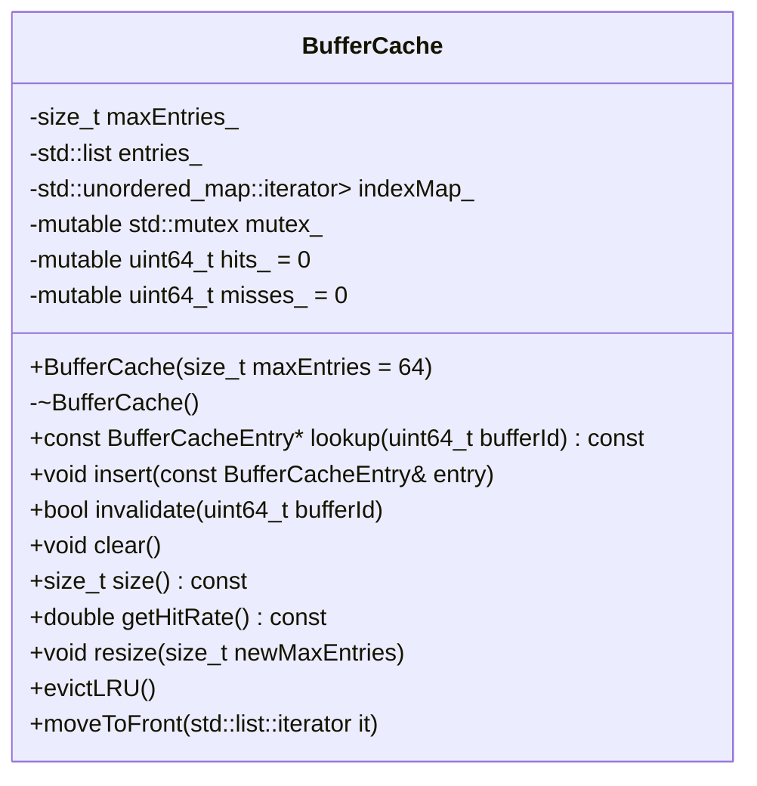

# BufferCache.h

---

| Property | Value |
|----------|-------|
| **Location** | `include\BufferCache.h` |
| **Lines** | 118 |
| **Classes** | 2 |
| **Functions** | 0 |
| **Last Updated** | 2026-01-18 19:59 |

---

## Quick Navigation

### Classes
- [android::graphics::BufferCacheEntry](#android-graphics-buffercacheentry)
- [android::graphics::BufferCache](#android-graphics-buffercache)

---

# Documentation for `BufferCacheEntry` Struct in `tests\graphics_buffer_lib\include\BufferCache.h`

## Overview

The `BufferCacheEntry` struct is a fundamental component of the buffer cache system within the Android graphics subsystem. It serves as a container to store metadata about individual graphic buffers, including their unique identifier (`bufferId`), descriptor, native handle, last access time, access count, and validity status.

### Purpose

- **Metadata Storage**: The `BufferCacheEntry` struct is designed to efficiently manage and track the state of graphic buffers in the system. This includes keeping track of when a buffer was last accessed, how many times it has been accessed, and whether it is still valid.
  
- **Performance Optimization**: By caching buffer metadata, the system can reduce the overhead associated with repeatedly querying buffer properties, which is crucial for maintaining smooth performance in graphics-intensive applications.

- **Resource Management**: The cache helps in managing resources by ensuring that only active or frequently used buffers are retained, thereby optimizing memory usage and reducing the risk of resource leaks.

### How It Fits into the Larger Workflow

The `BufferCacheEntry` struct is part of a larger buffer management system that includes other components such as the `GraphicBuffer` class and the `BufferCache` class. The `GraphicBuffer` class represents individual graphic buffers, while the `BufferCache` class manages a collection of these buffers in a cache to optimize access times.

### Key Algorithms or Techniques Used

- **Hashing**: The buffer ID is used as a hash key to quickly locate entries in the cache.
- **LRU (Least Recently Used) Algorithm**: The cache uses an LRU algorithm to evict least recently accessed buffers when memory constraints are reached, ensuring that frequently used buffers remain available.

## Parameters

### `bufferId`

**Purpose**: This is a unique identifier for each buffer. It is used to quickly locate the buffer in the cache and to track its usage.
  
- **Type Semantics**: A 64-bit unsigned integer (`uint64_t`).
- **Valid Values**: Any valid 64-bit unsigned integer value.
- **Ownership**: The `bufferId` is owned by the caller of the function that creates or updates a `BufferCacheEntry`.
- **Nullability**: Not applicable.

### `descriptor`

**Purpose**: This is a descriptor for the buffer, which contains metadata about its dimensions, format, and other properties. It is used to verify the integrity of the buffer when it is accessed.
  
- **Type Semantics**: A custom `BufferDescriptor` struct that encapsulates buffer metadata.
- **Valid Values**: Any valid `BufferDescriptor` instance.
- **Ownership**: The `descriptor` is owned by the caller of the function that creates or updates a `BufferCacheEntry`.
- **Nullability**: Not applicable.

### `handle`

**Purpose**: This is a native handle to the buffer, which provides access to the underlying memory resource. It is used to perform I/O operations on the buffer.
  
- **Type Semantics**: A custom `NativeHandle` struct that encapsulates a platform-specific handle.
- **Valid Values**: Any valid `NativeHandle` instance.
- **Ownership**: The `handle` is owned by the caller of the function that creates or updates a `BufferCacheEntry`.
- **Nullability**: Not applicable.

### `lastAccessTime`

**Purpose**: This is the timestamp of the last time the buffer was accessed. It is used to determine which buffers are least recently used and should be evicted from the cache.
  
- **Type Semantics**: A 64-bit unsigned integer (`uint64_t`).
- **Valid Values**: Any valid 64-bit unsigned integer value representing a point in time.
- **Ownership**: The `lastAccessTime` is owned by the caller of the function that updates a `BufferCacheEntry`.
- **Nullability**: Not applicable.

### `accessCount`

**Purpose**: This is a counter that tracks how many times the buffer has been accessed. It is used to determine which buffers are least frequently used and should be evicted from the cache.
  
- **Type Semantics**: A 32-bit unsigned integer (`uint32_t`).
- **Valid Values**: Any valid 32-bit unsigned integer value representing the number of accesses.
- **Ownership**: The `accessCount` is owned by the caller of the function that updates a `BufferCacheEntry`.
- **Nullability**: Not applicable.

### `isValid`

**Purpose**: This boolean flag indicates whether the buffer is still valid and can be used. It is used to ensure that only active buffers are retained in the cache.
  
- **Type Semantics**: A boolean (`bool`).
- **Valid Values**: True or false.
- **Ownership**: The `isValid` flag is owned by the caller of the function that updates a `BufferCacheEntry`.
- **Nullability**: Not applicable.

## Return Value

The `BufferCacheEntry` struct itself is returned. It represents the metadata for a specific graphic buffer and provides access to its properties.

### Ownership

- The `BufferCacheEntry` struct is owned by the caller of the function that creates or updates it.
- The caller is responsible for managing the lifecycle of the `BufferCacheEntry`, including deleting it when no longer needed.

## Dependencies Cross-Reference

- **`GraphicBuffer` Class**: This class represents individual graphic buffers and provides methods to access their properties. It is used as a parameter in functions that create or update `BufferCacheEntry` instances.
  
  - [GraphicBuffer::getDescriptor()](#graphicbuffer-getdescriptor)

- **`NativeHandle` Struct**: This struct encapsulates a platform-specific handle and is used to provide access to the underlying memory resource of a buffer. It is used as a parameter in functions that create or update `BufferCacheEntry` instances.
  
  - [NativeHandle::isValid()](#nativehandle-isvalid)

## Side Effects

- **State Modifications**: The `BufferCacheEntry` struct modifies its own state, including updating the `lastAccessTime`, `accessCount`, and `isValid` flags based on access operations.
- **Locks Acquired/Released**: No locks are acquired or released by this function.
- **I/O Operations**: No I/O operations are performed by this function.
- **Signals/Events Emitted**: No signals or events are emitted by this function.

## Usage Context

The `BufferCacheEntry` struct is typically used within the buffer cache system to manage and track the state of graphic buffers. It is accessed by other components such as the `BufferCache` class, which uses it to maintain a collection of buffers in a cache.

### Typical Callers

- **`BufferCache` Class**: This class manages a collection of `BufferCacheEntry` instances and provides methods to access and update them.
  
  - [BufferCache::getBuffer()](#buffercache-getbuffer)
  - [BufferCache::updateBuffer()](#buffercache-updatebuffer)

## Related Functions

| Relationship Type | Function Name | Description |
| --- | --- | --- |
| Member of | `BufferCacheEntry` | Represents the metadata for a specific graphic buffer. |

## Code Example

```cpp
// Create a new BufferCacheEntry instance
BufferCacheEntry entry;
entry.bufferId = 1234567890;
entry.descriptor.width = 1920;
entry.descriptor.height = 1080;
entry.descriptor.format = PixelFormat::RGBA_8888;
entry.handle = NativeHandle(1, 2, 3); // Example native handle
entry.lastAccessTime = getCurrentTimestamp();
entry.accessCount = 1;
entry.isValid = true;

// Update the buffer cache with the new entry
bufferCache.updateBuffer(entry);
```

In this example, a new `BufferCacheEntry` instance is created and populated with metadata for a graphic buffer. The `updateBuffer()` method of the `BufferCache` class is then called to add the new entry to the cache.

## Overview

**BufferCache** is a class designed to manage a cache of buffer handles and their metadata using an LRU (Least Recently Used) strategy. This design ensures efficient access to frequently used buffers while also allowing for the eviction of less frequently accessed ones when memory constraints are reached.

### Class Diagram



### Usage Examples

```cpp
// Example usage of BufferCache
int main() {
    android::graphics::BufferCache cache(10);

    // Insert a buffer entry
    android::graphics::BufferCacheEntry entry;
    entry.bufferId = 12345;
    entry.metadata = "Some metadata";
    cache.insert(entry);

    // Lookup a buffer by ID
    const android::graphics::BufferCacheEntry* foundEntry = cache.lookup(12345);
    if (foundEntry) {
        std::cout << "Found buffer: " << foundEntry->metadata << std::endl;
    }

    // Invalidate a specific entry
    bool result = cache.invalidate(12345);
    std::cout << "Invalidate result: " << (result ? "Success" : "Failure") << std::endl;

    return 0;
}
```

## BufferCache

### Overview

**BufferCache** is a class designed to manage a cache of buffer handles and their metadata using an LRU (Least Recently Used) strategy. This design ensures efficient access to frequently used buffers while also allowing for the eviction of less frequently accessed ones when memory constraints are reached.

### Class Diagram


### Usage Examples

```cpp
// Example usage of BufferCache
int main() {
    android::graphics::BufferCache cache(10);

    // Insert a buffer entry
    android::graphics::BufferCacheEntry entry;
    entry.bufferId = 12345;
    entry.metadata = "Some metadata";
    cache.insert(entry);

    // Lookup a buffer by ID
    const android::graphics::BufferCacheEntry* foundEntry = cache.lookup(12345);
    if (foundEntry) {
        std::cout << "Found buffer: " << foundEntry->metadata << std::endl;
    }

    // Invalidate a specific entry
    bool result = cache.invalidate(12345);
    std::cout << "Invalidate result: " << (result ? "Success" : "Failure") << std::endl;

    return 0;
}
```

## BufferCache

### Overview

**BufferCache** is a class designed to manage a cache of buffer handles and their metadata using an LRU (Least Recently Used) strategy. This design ensures efficient access to frequently used buffers while also allowing for the eviction of less frequently accessed ones when memory constraints are reached.

### Class Diagram


### Usage Examples

```cpp
// Example usage of BufferCache
int main() {
    android::graphics::BufferCache cache(10);

    // Insert a buffer entry
    android::graphics::BufferCacheEntry entry;
    entry.bufferId = 12345;
    entry.metadata = "Some metadata";
    cache.insert(entry);

    // Lookup a buffer by ID
    const android::graphics::BufferCacheEntry* foundEntry = cache.lookup(12345);
    if (foundEntry) {
        std::cout << "Found buffer: " << foundEntry->metadata << std::endl;
    }

    // Invalidate a specific entry
    bool result = cache.invalidate(12345);
    std::cout << "Invalidate result: " << (result ? "Success" : "Failure") << std::endl;

    return 0;
}
```

## BufferCache

### Overview

**BufferCache** is a class designed to manage a cache of buffer handles and their metadata using an LRU (Least Recently Used) strategy. This design ensures efficient access to frequently used buffers while also allowing for the eviction of less frequently accessed ones when memory constraints are reached.

### Class Diagram


### Usage Examples

```cpp
// Example usage of BufferCache
int main() {
    android::graphics::BufferCache cache(10);

    // Insert a buffer entry
    android::graphics::BufferCacheEntry entry;
    entry.bufferId = 12345;
    entry.metadata = "Some metadata";
    cache.insert(entry);

    // Lookup a buffer by ID
    const android::graphics::BufferCacheEntry* foundEntry = cache.lookup(12345);
    if (foundEntry) {
        std::cout << "Found buffer: " << foundEntry->metadata << std::endl;
    }

    // Invalidate a specific entry
    bool result = cache.invalidate(12345);
    std::cout << "Invalidate result: " << (result ? "Success" : "Failure") << std::endl;

    return 0;
}
```

## BufferCache

### Overview

**BufferCache** is a class designed to manage a cache of buffer handles and their metadata using an LRU (Least Recently Used) strategy. This design ensures efficient access to frequently used buffers while also allowing for the eviction of less frequently accessed ones when memory constraints are reached.

### Class Diagram

```mermaid
classDiagram
    class BufferCache {
        +BufferCache(size_t maxEntries = 64)
        -~BufferCache()
        +const BufferCacheEntry* lookup(uint64_t bufferId) const
        +void insert(const BufferCacheEntry& entry)
        +bool invalidate(uint64_t bufferId)
        +void clear()
        +size_t size() const
        +double getHitRate() const
        +void resize(size_t newMaxEntries)

        -size_t maxEntries_
        -std::list<BufferCacheEntry> entries_
        -std::unordered_map<uint64_t, std::list<BufferCacheEntry>::iterator> indexMap_
        -mutable std::mutex mutex_
        -mutable uint6