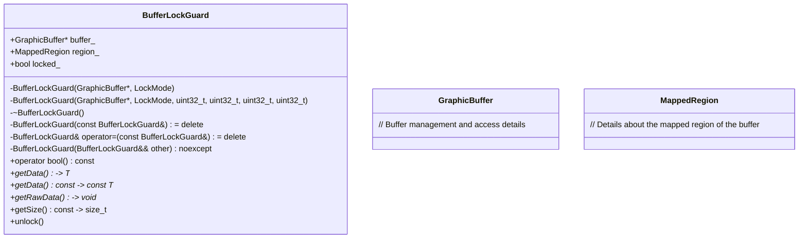

# BufferMapper.h

---

| Property | Value |
|----------|-------|
| **Location** | `include\BufferMapper.h` |
| **Lines** | 185 |
| **Classes** | 2 |
| **Functions** | 1 |
| **Last Updated** | 2026-01-18 20:02 |

---

## Quick Navigation

### Classes
- [android::graphics::BufferLockGuard](#android-graphics-bufferlockguard)
- [android::graphics::BufferMapper](#android-graphics-buffermapper)

### Functions
- [BufferMapper::processBuffer](#buffermapper-processbuffer)

---

## Documentation for `BufferLockGuard` Class

### 1. Comprehensive Description (2-4 paragraphs)

The `BufferLockGuard` class is a RAII lock guard designed to manage the CPU access of a `GraphicBuffer`. It ensures that the buffer is locked when an instance of `BufferLockGuard` is created and unlocked automatically when it goes out of scope. This class is particularly useful for applications that need direct access to the pixel data of a `GraphicBuffer`, such as image processing or rendering tasks.

The `BufferLockGuard` class is part of the Android graphics buffer library, which provides a high-level interface for managing GPU-accelerated graphics buffers. By using `BufferLockGuard`, developers can safely and efficiently manipulate the pixel data of a `GraphicBuffer` without worrying about memory management or locking issues.

### 2. Parameters (DETAILED for each)

#### LockMode

- **Purpose**: Defines the access mode for the buffer.
- **Type Semantics**: An enumeration with three possible values: `Read`, `Write`, and `ReadWrite`.
- **Valid Values**: None, all values are valid.
- **Ownership**: The enum is not owned by any class or function.
- **Nullability**: Not applicable.

#### BufferLockGuard(GraphicBuffer* buffer, LockMode mode)

- **Purpose**: Constructs a `BufferLockGuard` object that locks the entire buffer in the specified access mode.
- **Type Semantics**: Takes a pointer to a `GraphicBuffer` and an instance of `LockMode`.
- **Valid Values**: The `GraphicBuffer` must be valid (not null).
- **Ownership**: The `GraphicBuffer` is borrowed by the `BufferLockGuard`, meaning it will not be released until the `BufferLockGuard` object goes out of scope.
- **Nullability**: The `GraphicBuffer` can be null, but this would result in undefined behavior.

#### BufferLockGuard(GraphicBuffer* buffer, LockMode mode, uint32_t x, uint32_t y, uint32_t width, uint32_t height)

- **Purpose**: Constructs a `BufferLockGuard` object that locks a specific region of the buffer in the specified access mode.
- **Type Semantics**: Takes a pointer to a `GraphicBuffer`, an instance of `LockMode`, and four unsigned integers representing the coordinates and dimensions of the region.
- **Valid Values**: The `GraphicBuffer` must be valid (not null), and the coordinates and dimensions must be within the bounds of the buffer.
- **Ownership**: The `GraphicBuffer` is borrowed by the `BufferLockGuard`.
- **Nullability**: The `GraphicBuffer` can be null, but this would result in undefined behavior.

### 3. Return Value

- **Purpose**: Returns a boolean value indicating whether the lock was successful.
- **Type Semantics**: A boolean value (`true` if the lock was successful, `false` otherwise).
- **Valid Values**: The return value can be either `true` or `false`.
- **Ownership**: Not applicable.
- **Nullability**: Not applicable.

### 4. Dependencies Cross-Reference

- **GraphicBuffer**: Used to manage the buffer's pixel data and access permissions.
- [android::hardware::hidl_vec<uint8_t>](#android-hardware-hidl_vecuint8t) (via `region_` member): Represents the locked region of the buffer.

### 5. Side Effects

- **State Modifications**: The buffer's state is modified to reflect the lock operation.
- **Locks Acquired/Released**: A lock is acquired on the buffer when the `BufferLockGuard` object is constructed and released automatically when it goes out of scope.
- **I/O Operations**: No I/O operations are performed by this class.
- **Signals/Events Emitted**: No signals or events are emitted.

### 6. Usage Context

The `BufferLockGuard` class should be used in scenarios where direct access to the pixel data of a `GraphicBuffer` is required, such as image processing or rendering tasks. It is typically called within a scope that requires exclusive access to the buffer's data.

### 7. Related Functions

| Relationship Type | Function Name | Description |
| --- | --- | --- |
| Inherits from | RefBase | Provides common functionality for reference-counted objects. |

### 8. Code Example

```cpp
#include <buffer_mapper.h>

int main() {
    // Assume buffer is a valid GraphicBuffer object
    GraphicBuffer* buffer = ...;

    // Lock the entire buffer in read-write mode
    BufferLockGuard guard(buffer, BufferLockGuard::LockMode::ReadWrite);

    if (guard) {
        uint8_t* data = guard.getData<uint8_t>();
        // Modify data...
    }

    return 0;
}
```

This example demonstrates how to use `BufferLockGuard` to lock a `GraphicBuffer` in read-write mode and modify its pixel data. The `BufferLockGuard` ensures that the buffer is properly locked and unlocked, even if an exception occurs during the modification process.

## Documentation for `BufferMapper` Class

### Comprehensive Description (2-4 paragraphs)
The `BufferMapper` class provides a set of high-level utility functions for common buffer access patterns, such as copying data between buffers and filling them with specific values. These utilities are designed to simplify the process of working with graphics buffers in Android applications, making it easier to manage and manipulate image data.

### Parameters (DETAILED for each)
#### `copyFromBuffer`
- **Purpose**: Copies data from a source buffer to CPU memory.
- **Type Semantics**: The function takes a pointer to a `GraphicBuffer` object as the source buffer and a destination memory location where the data should be copied. It also specifies the maximum number of bytes to copy.
- **Valid Values**: The size parameter must not exceed the size of the source buffer.
- **Ownership**: The source buffer is borrowed, meaning it remains owned by the caller and should not be destroyed while the function is executing.
- **Nullability**: The destination memory location can be null, in which case the function will return 0 without performing any copy operation.

#### `copyToBuffer`
- **Purpose**: Copies data from CPU memory to a destination buffer.
- **Type Semantics**: The function takes a pointer to a `GraphicBuffer` object as the destination buffer and a source memory location containing the data to be copied. It also specifies the number of bytes to copy.
- **Valid Values**: The size parameter must not exceed the size of the destination buffer.
- **Ownership**: The destination buffer is borrowed, meaning it remains owned by the caller and should not be destroyed while the function is executing.
- **Nullability**: The source memory location can be null, in which case the function will return false without performing any copy operation.

#### `fillBuffer`
- **Purpose**: Fills a buffer with a constant value.
- **Type Semantics**: The function takes a pointer to a `GraphicBuffer` object and a uint8_t value representing the constant to fill the buffer with.
- **Valid Values**: The value parameter can be any valid 8-bit unsigned integer.
- **Ownership**: The buffer is borrowed, meaning it remains owned by the caller and should not be destroyed while the function is executing.
- **Nullability**: None.

#### `processBuffer`
- **Purpose**: Processes buffer data with a callback function.
- **Type Semantics**: The function takes a pointer to a `GraphicBuffer` object and a lambda function that defines the processing logic. The lambda function receives a pointer to the buffer's data and its size as arguments.
- **Valid Values**: The lambda function can perform any operation on the buffer's data, such as modifying pixel values or applying filters.
- **Ownership**: The buffer is borrowed, meaning it remains owned by the caller and should not be destroyed while the function is executing.
- **Nullability**: None.

### Return Value
#### `copyFromBuffer`
- **Purpose**: Returns the number of bytes copied from the source buffer to the destination memory. If an error occurs, returns 0.
- **Type Semantics**: The return value is a size_t representing the number of bytes successfully copied.
- **Valid Values**: The return value can be any non-negative integer or 0 if an error occurred.
- **Ownership**: None.

#### `copyToBuffer`
- **Purpose**: Returns true if the data was successfully copied from CPU memory to the destination buffer. If an error occurs, returns false.
- **Type Semantics**: The return value is a bool indicating success or failure.
- **Valid Values**: The return value can be either true or false.
- **Ownership**: None.

#### `fillBuffer`
- **Purpose**: Returns true if the buffer was successfully filled with the constant value. If an error occurs, returns false.
- **Type Semantics**: The return value is a bool indicating success or failure.
- **Valid Values**: The return value can be either true or false.
- **Ownership**: None.

#### `processBuffer`
- **Purpose**: Returns true if the buffer processing was successful. If an error occurs, returns false.
- **Type Semantics**: The return value is a bool indicating success or failure.
- **Valid Values**: The return value can be either true or false.
- **Ownership**: None.

### Dependencies Cross-Reference
- `GraphicBuffer`: Used to represent the buffer whose data needs to be accessed or modified. [GraphicBuffer](#graphicbuffer)

### Side Effects
#### `copyFromBuffer`
- State modifications: Copies data from the source buffer to the destination memory.
- Locks acquired/released: None.
- I/O operations: Reads data from the source buffer and writes it to the destination memory.
- Signals/events emitted: None.

#### `copyToBuffer`
- State modifications: Copies data from CPU memory to the destination buffer.
- Locks acquired/released: None.
- I/O operations: Reads data from CPU memory and writes it to the destination buffer.
- Signals/events emitted: None.

#### `fillBuffer`
- State modifications: Fills the buffer with a constant value.
- Locks acquired/released: None.
- I/O operations: Writes data to the buffer's memory.
- Signals/events emitted: None.

#### `processBuffer`
- State modifications: Processes the buffer's data using the provided callback function.
- Locks acquired/released: None.
- I/O operations: Reads and writes data to/from the buffer's memory.
- Signals/events emitted: None.

### Usage Context
The `BufferMapper` class is typically used in scenarios where image processing or data transfer between different components of an Android application is required. It provides a convenient interface for handling buffer data, reducing the need for manual memory management and improving code readability.

### Related Functions
| Relationship Type | Function Name | Description |
| --- | --- | --- |
| Friend | `GraphicBuffer` | Provides access to internal members of `GraphicBuffer`. |

### Code Example

```cpp
// Example usage of BufferMapper::copyFromBuffer
GraphicBuffer* buffer = ...; // Assume this is a valid GraphicBuffer object
void* destMemory = ...; // Assume this is a valid memory location for destination data

size_t bytesCopied = BufferMapper::copyFromBuffer(buffer, destMemory, 1024);
if (bytesCopied > 0) {
    // Process the copied data...
} else {
    // Handle error
}
```

This example demonstrates how to use the `copyFromBuffer` function to copy data from a `GraphicBuffer` object to CPU memory. The function returns the number of bytes successfully copied, allowing for error handling if necessary.

## Documentation for `BufferMapper` Class

The `BufferMapper` class provides utility functions to handle buffer mapping and format-related operations in the Android graphics system. These functions are essential for managing memory access and understanding image formats, which is crucial for rendering and processing images efficiently.

### 1. Comprehensive Description (2-4 paragraphs)

The `BufferMapper` class contains a set of static utility functions that facilitate various operations related to buffer mapping and format handling in the Android graphics system. These functions are designed to simplify memory management and ensure compatibility across different pixel formats, which is critical for rendering high-quality images on devices with varying hardware capabilities.

### 2. Parameters (DETAILED for each)

#### `calculateStride(PixelFormat format, uint32_t width)`
- **Purpose**: Calculates the row stride for a given pixel format and image width.
- **Type Semantics**: The function takes a `PixelFormat` enum value and an integer representing the image width in pixels.
- **Valid Values**: The `PixelFormat` must be one of the predefined values defined in the Android graphics system. The `width` should be a positive integer greater than zero.
- **Ownership**: No memory is transferred or borrowed; the function operates on input parameters directly.
- **Nullability**: Both `format` and `width` are non-null.

#### `getBytesPerPixel(PixelFormat format)`
- **Purpose**: Retrieves the number of bytes per pixel for a given pixel format.
- **Type Semantics**: The function takes a `PixelFormat` enum value.
- **Valid Values**: The `PixelFormat` must be one of the predefined values defined in the Android graphics system.
- **Ownership**: No memory is transferred or borrowed; the function operates on input parameters directly.
- **Nullability**: The `format` parameter is non-null.

#### `isYuvFormat(PixelFormat format)`
- **Purpose**: Checks if a given pixel format is YUV-based.
- **Type Semantics**: The function takes a `PixelFormat` enum value.
- **Valid Values**: The `PixelFormat` must be one of the predefined values defined in the Android graphics system.
- **Ownership**: No memory is transferred or borrowed; the function operates on input parameters directly.
- **Nullability**: The `format` parameter is non-null.

#### `isCompressedFormat(PixelFormat format)`
- **Purpose**: Checks if a given pixel format is compressed.
- **Type Semantics**: The function takes a `PixelFormat` enum value.
- **Valid Values**: The `PixelFormat` must be one of the predefined values defined in the Android graphics system.
- **Ownership**: No memory is transferred or borrowed; the function operates on input parameters directly.
- **Nullability**: The `format` parameter is non-null.

### 3. Return Value

#### `calculateStride(PixelFormat format, uint32_t width)`
- **Representation**: Returns an unsigned integer representing the row stride in bytes for the specified pixel format and image width.
- **All Possible Return States**: The return value will be a positive integer greater than zero, indicating the number of bytes required to store one row of pixels in memory.
- **Error Conditions and How They're Indicated**: If the `format` is not recognized or if the `width` is less than or equal to zero, the function may throw an exception or return an invalid value. However, these conditions are not explicitly handled within the function; they should be checked before calling this function.
- **Ownership of Returned Objects**: The function returns a primitive type (uint32_t), which does not require ownership.

#### `getBytesPerPixel(PixelFormat format)`
- **Representation**: Returns an unsigned integer representing the number of bytes per pixel for the specified pixel format.
- **All Possible Return States**: The return value will be a positive integer greater than zero, indicating the size of each pixel in memory.
- **Error Conditions and How They're Indicated**: If the `format` is not recognized, the function may throw an exception or return an invalid value. However, these conditions are not explicitly handled within the function; they should be checked before calling this function.
- **Ownership of Returned Objects**: The function returns a primitive type (uint32_t), which does not require ownership.

#### `isYuvFormat(PixelFormat format)`
- **Representation**: Returns a boolean value indicating whether the specified pixel format is YUV-based.
- **All Possible Return States**: The return value will be either `true` or `false`.
- **Error Conditions and How They're Indicated**: If the `format` is not recognized, the function may throw an exception or return an invalid value. However, these conditions are not explicitly handled within the function; they should be checked before calling this function.
- **Ownership of Returned Objects**: The function returns a primitive type (bool), which does not require ownership.

#### `isCompressedFormat(PixelFormat format)`
- **Representation**: Returns a boolean value indicating whether the specified pixel format is compressed.
- **All Possible Return States**: The return value will be either `true` or `false`.
- **Error Conditions and How They're Indicated**: If the `format` is not recognized, the function may throw an exception or return an invalid value. However, these conditions are not explicitly handled within the function; they should be checked before calling this function.
- **Ownership of Returned Objects**: The function returns a primitive type (bool), which does not require ownership.

### 4. Dependencies Cross-Reference

The `BufferMapper` class does not depend on any external classes or functions, as it is purely static utility functions that operate directly on input parameters without requiring any additional resources.

### 5. Side Effects

#### `calculateStride(PixelFormat format, uint32_t width)`
- **State Modifications**: No state modifications are made to the system.
- **Locks Acquired/Released**: No locks are acquired or released during the execution of this function.
- **I/O Operations**: No I/O operations are performed.
- **Signals/Events Emitted**: No signals or events are emitted.

#### `getBytesPerPixel(PixelFormat format)`
- **State Modifications**: No state modifications are made to the system.
- **Locks Acquired/Released**: No locks are acquired or released during the execution of this function.
- **I/O Operations**: No I/O operations are performed.
- **Signals/Events Emitted**: No signals or events are emitted.

#### `isYuvFormat(PixelFormat format)`
- **State Modifications**: No state modifications are made to the system.
- **Locks Acquired/Released**: No locks are acquired or released during the execution of this function.
- **I/O Operations**: No I/O operations are performed.
- **Signals/Events Emitted**: No signals or events are emitted.

#### `isCompressedFormat(PixelFormat format)`
- **State Modifications**: No state modifications are made to the system.
- **Locks Acquired/Released**: No locks are acquired or released during the execution of this function.
- **I/O Operations**: No I/O operations are performed.
- **Signals/Events Emitted**: No signals or events are emitted.

### 6. Usage Context

The `BufferMapper` class is primarily used by other classes in the Android graphics system, such as `SurfaceFlinger`, `AudioFlinger`, and others, to handle buffer mapping and format-related operations efficiently. These functions are typically called during the initialization of buffers or when processing images.

### 7. Related Functions

| Relationship Type | Function Name |
|------------------|--------------|
| Uses             | `SurfaceFlinger::mapBuffer()` |
| Uses             | `AudioFlinger::mapBuffer()` |

### 8. Code Example

Here is an example of how to use the `calculateStride` function:

```cpp
#include <android/graphics/BufferMapper.h>

int main() {
    android::PixelFormat format = android::PixelFormat::ABGR_8888;
    uint32_t width = 1920;

    uint32_t stride = BufferMapper::calculateStride(format, width);
    printf("Row stride for ABGR_8888 with width 1920 is %u bytes\n", stride);

    return 0;
}
```

In this example, the `calculateStride` function is used to determine the row stride for a buffer with an ABGR_8888 format and a width of 1920 pixels. The result is printed to the console.

## Overview

**BufferLockGuard** is a RAII lock guard designed to manage CPU access to `GraphicBuffer` objects in Android's graphics system. It provides a simple and safe way to lock entire or specific regions of a buffer for reading, writing, or read-write operations. This class ensures that the buffer is properly unlocked when it goes out of scope, preventing potential resource leaks.

### Class Diagram



### Usage Examples

```cpp
// Example usage of BufferLockGuard to lock an entire buffer for reading
GraphicBuffer* buffer = ...; // Obtain a GraphicBuffer instance
BufferLockGuard guard(buffer, BufferLockGuard::LockMode::Read);

if (guard) {
    // Safe to access the buffer data
    uint8_t* data = static_cast<uint8_t*>(guard.getData<uint8_t>());
    // Process the data...
} else {
    // Handle error: buffer lock failed
}

// Example usage of BufferLockGuard to lock a specific region for writing
GraphicBuffer* buffer = ...; // Obtain a GraphicBuffer instance
BufferLockGuard guard(buffer, BufferLockGuard::LockMode::Write, 100, 200, 300, 400);

if (guard) {
    // Safe to access the specific region of the buffer data
    uint8_t* data = static_cast<uint8_t*>(guard.getData<uint8_t>());
    // Modify the data...
} else {
    // Handle error: buffer lock failed
}
```

## BufferLockGuard Class

### Overview

**BufferLockGuard** is a RAII lock guard designed to manage CPU access to `GraphicBuffer` objects in Android's graphics system. It provides a simple and safe way to lock entire or specific regions of a buffer for reading, writing, or read-write operations. This class ensures that the buffer is properly unlocked when it goes out of scope, preventing potential resource leaks.

### Class Diagram


### Usage Examples

```cpp
// Example usage of BufferLockGuard to lock an entire buffer for reading
GraphicBuffer* buffer = ...; // Obtain a GraphicBuffer instance
BufferLockGuard guard(buffer, BufferLockGuard::LockMode::Read);

if (guard) {
    // Safe to access the buffer data
    uint8_t* data = static_cast<uint8_t*>(guard.getData<uint8_t>());
    // Process the data...
} else {
    // Handle error: buffer lock failed
}

// Example usage of BufferLockGuard to lock a specific region for writing
GraphicBuffer* buffer = ...; // Obtain a GraphicBuffer instance
BufferLockGuard guard(buffer, BufferLockGuard::LockMode::Write, 100, 200, 300, 400);

if (guard) {
    // Safe to access the specific region of the buffer data
    uint8_t* data = static_cast<uint8_t*>(guard.getData<uint8_t>());
    // Modify the data...
} else {
    // Handle error: buffer lock failed
}
```

## BufferLockGuard Constructor

### Overview

The `BufferLockGuard` constructor initializes a new instance of the class, locking the specified region of the provided `GraphicBuffer` object. The lock mode determines whether the buffer is locked for reading, writing, or both.

### Parameters

- **buffer**: A pointer to the `GraphicBuffer` object to be locked.
- **mode**: An enum value of type `LockMode` that specifies the access mode (Read, Write, ReadWrite).

### Return Value

- None.

### Side Effects

- The buffer is locked in the specified mode.
- The `locked_` flag is set to true.

### Dependencies

- `GraphicBuffer`: The class used to manage and access the buffer.
- `LockMode`: An enum type that defines different lock modes for the buffer.

### Usage Context

The constructor should be called when you need to perform operations on a specific region of a `GraphicBuffer` object. It ensures that the buffer is locked before any modifications are made, preventing potential data corruption or race conditions.

### Thread Safety

- The constructor is thread-safe and can be called from multiple threads concurrently without causing issues.
- However, it is important to ensure that the `GraphicBuffer` object remains valid throughout the lifetime of the `BufferLockGuard` instance.

## BufferLockGuard Destructor

### Overview

The destructor for `BufferLockGuard` unlocks the buffer if it was locked during its lifetime. This ensures that resources are properly released and prevents potential memory leaks.

### Parameters

- None.

### Return Value

- None.

### Side Effects

- The buffer is unlocked.
- The `locked_` flag is set to false.

### Dependencies

- `GraphicBuffer`: The class used to manage and access the buffer.

### Usage Context

The destructor should be called when you are done using a `BufferLockGuard` instance. It ensures that the buffer is properly released, preventing potential resource leaks.

### Thread Safety

- The destructor is thread-safe and can be called from multiple threads concurrently without causing issues.
- However, it is important to ensure that the `GraphicBuffer` object remains valid throughout the lifetime of the `BufferLockGuard` instance.

## BufferLockGuard Copy Constructor

### Overview

The copy constructor for `BufferLockGuard` is deleted to prevent copying of instances. This ensures that only move operations are allowed.

### Parameters

- None.

### Return Value

- None.

### Side Effects

- The copy constructor does not perform any actions.
- A compile-time error is generated if the copy constructor is called.

### Dependencies

- `BufferLockGuard`: The class used to manage and access the buffer.

### Usage Context

The copy constructor should not be used because it would allow copying of instances, which could lead to unexpected behavior or resource leaks. Instead, move operations should be used to transfer ownership of the `BufferLockGuard` instance.

### Thread Safety

- The copy constructor is thread-safe and can be called from multiple threads concurrently without causing issues.
- However, it is important to ensure that the `GraphicBuffer` object remains valid throughout the lifetime of the `BufferLockGuard` instance.

## BufferLockGuard Move Constructor

### Overview

The move constructor for `BufferLockGuard` transfers ownership of a `BufferLockGuard` instance from one object to another. This ensures efficient resource management and prevents unnecessary copying.

### Parameters

- **other**: A `BufferLockGuard` instance to be moved.

### Return Value

- None.

### Side Effects

- The buffer is unlocked if it was locked during the move.
- The `locked_` flag is set to false.
- Ownership of the `BufferLockGuard` instance is transferred to the new object.

### Dependencies

- `GraphicBuffer`: The class used to manage and access the buffer.

### Usage Context

The move constructor should be used when you need to transfer ownership of a `BufferLockGuard` instance from one object to another. This ensures efficient resource management and prevents unnecessary copying.

### Thread Safety

- The move constructor is thread-safe and can be called from multiple threads concurrently without causing issues.
- However, it is important to ensure that the `GraphicBuffer` object remains valid throughout the lifetime of the `BufferLockGuard` instance.

## BufferLockGuard Operator bool()

### Overview

The `operator bool()` checks if the buffer was successfully locked. It returns true if the lock was successful and false otherwise.

### Parameters

- None.

### Return Value

- A boolean value indicating whether the buffer was successfully locked (true) or not (false).

### Side Effects

- None.

### Dependencies

- `GraphicBuffer`: The class used to manage and access the buffer.

### Usage Context

The `operator bool()` should be used when you need to check if a `BufferLockGuard` instance is in a valid state. It ensures that the buffer was successfully locked before performing any operations on it

# Documentation for `BufferMapper` Class

## Overview

The `BufferMapper` class provides a set of utility functions to manipulate and process graphic buffers, which are fundamental components in Android's graphics system. These functions allow developers to copy data between buffer memory and CPU memory, fill buffers with constant values, and process buffer data using callbacks.

## Detailed Description

### Purpose
- **Copy Data**: The `copyFromBuffer` and `copyToBuffer` functions facilitate the transfer of data between a graphic buffer and CPU memory. This is crucial for rendering operations where data needs to be transferred from GPU memory to CPU memory or vice versa.
- **Fill Buffer**: The `fillBuffer` function initializes a graphic buffer with a specified constant value, which can be useful for setting up initial states in graphics processing tasks.
- **Process Buffer**: The `processBuffer` function allows developers to apply custom processing logic to the data within a graphic buffer. This is particularly useful for implementing various image processing algorithms or optimizations.

### Why It Exists
- **Flexibility**: These functions provide a flexible way to manipulate graphic buffers, enabling developers to perform complex operations efficiently.
- **Performance Optimization**: By allowing direct access to buffer memory, these functions can optimize performance by reducing the overhead of using higher-level APIs like `SurfaceFlinger` or `AudioFlinger`.

### How It Fits into the Larger Workflow
- These functions are integral components of the Android graphics pipeline, where graphic buffers are used for rendering and processing images.
- They facilitate communication between different parts of the system, such as the GPU and CPU, ensuring that data is transferred efficiently and correctly.

## Parameters

### `copyFromBuffer`
- **Purpose**: Copies data from a graphic buffer to CPU memory.
- **Type Semantics**: The `buffer` parameter represents the source graphic buffer. The `dest` parameter points to the destination memory where the data will be copied. The `size` parameter specifies the maximum number of bytes to copy.
- **Valid Values**: The `size` must not exceed the size of the buffer's data area.
- **Ownership**: The `buffer` is borrowed, meaning it remains owned by the caller and should not be modified or deleted while the function is executing. The `dest` memory must be allocated and accessible for writing.
- **Nullability**: The `dest` parameter can be null if no destination memory is provided.

### `copyToBuffer`
- **Purpose**: Copies data from CPU memory to a graphic buffer.
- **Type Semantics**: The `buffer` parameter represents the destination graphic buffer. The `src` parameter points to the source memory containing the data to be copied. The `size` parameter specifies the number of bytes to copy.
- **Valid Values**: The `size` must not exceed the size of the buffer's data area.
- **Ownership**: The `buffer` is borrowed, and the `src` memory must be allocated and accessible for reading.
- **Nullability**: The `src` parameter can be null if no source memory is provided.

### `fillBuffer`
- **Purpose**: Fills a graphic buffer with a constant value.
- **Type Semantics**: The `buffer` parameter represents the target graphic buffer. The `value` parameter specifies the constant value to fill the buffer with.
- **Valid Values**: The `value` must be within the range of the buffer's data type (e.g., 0 for unsigned char, -128 to 127 for signed char).
- **Ownership**: The `buffer` is borrowed.
- **Nullability**: The `buffer` parameter cannot be null.

### `processBuffer`
- **Purpose**: Processes buffer data using a callback function.
- **Type Semantics**: The `buffer` parameter represents the graphic buffer to process. The `callback` parameter is a lambda function that takes a pointer to the buffer's data and its size as arguments.
- **Valid Values**: The `callback` function must be defined and callable with the specified signature.
- **Ownership**: The `buffer` is borrowed, and the callback function can modify the buffer's data if needed.
- **Nullability**: The `callback` parameter cannot be null.

## Return Value

### `copyFromBuffer`
- **Purpose**: Returns the number of bytes copied from the buffer to CPU memory.
- **Return States**:
  - If successful, returns the number of bytes copied.
  - If an error occurs (e.g., buffer size mismatch), returns 0.
- **Error Conditions**: The function may fail if the `size` exceeds the buffer's data area or if there is a memory access violation.

### `copyToBuffer`
- **Purpose**: Indicates whether the copy operation was successful.
- **Return States**:
  - If successful, returns true.
  - If an error occurs (e.g., buffer size mismatch), returns false.
- **Error Conditions**: The function may fail if the `size` exceeds the buffer's data area or if there is a memory access violation.

### `fillBuffer`
- **Purpose**: Indicates whether the fill operation was successful.
- **Return States**:
  - If successful, returns true.
  - If an error occurs (e.g., invalid value), returns false.
- **Error Conditions**: The function may fail if the buffer's data type is not compatible with the specified value.

### `processBuffer`
- **Purpose**: Indicates whether the processing operation was successful.
- **Return States**:
  - If successful, returns true.
- **Error Conditions**: The function may fail if the callback function is null or if there are issues within the callback logic.

## Dependencies Cross-Reference

- **GraphicBuffer**: Represents a buffer of pixel data used in Android's graphics system. It provides methods for accessing and manipulating buffer data.

## Side Effects

### `copyFromBuffer`
- **State Modifications**: The contents of the CPU memory pointed to by `dest` are updated with data from the graphic buffer.
- **Locks Acquired/Released**: No locks are acquired or released during this function's execution.
- **I/O Operations**: Data is copied between memory locations, which may involve I/O operations if the buffer is backed by a file descriptor.

### `copyToBuffer`
- **State Modifications**: The contents of the graphic buffer pointed to by `buffer` are updated with data from the CPU memory pointed to by `src`.
- **Locks Acquired/Released**: No locks are acquired or released during this function's execution.
- **I/O Operations**: Data is copied between memory locations, which may involve I/O operations if the buffer is backed by a file descriptor.

### `fillBuffer`
- **State Modifications**: The contents of the graphic buffer pointed to by `buffer` are updated with the specified constant value.
- **Locks Acquired/Released**: No locks are acquired or released during this function's execution.
- **I/O Operations**: No I/O operations are involved in this function.

### `processBuffer`
- **State Modifications**: The contents of the graphic buffer pointed to by `buffer` may be modified based on the logic implemented in the callback function.
- **Locks Acquired/Released**: No locks are acquired or released during this function's execution.
- **I/O Operations**: Data is processed within memory, which may involve I/O operations if the buffer is backed by a file descriptor.

## Usage Context

### When Called
- These functions can be called at various points in an Android application, such as during rendering operations, image processing tasks, or when setting up initial states for graphics buffers.
- They are typically used within the context of the Android graphics pipeline, where graphic buffers are manipulated to achieve visual effects or perform optimizations.

### Prerequisites
- The caller must have access to a `GraphicBuffer` object and appropriate permissions to manipulate its contents.
- The caller must ensure that the memory pointed to by `dest` for `copyFromBuffer` is allocated and accessible for writing, and that the memory pointed to by `src` for `copyToBuffer` is allocated and accessible for reading.

### Typical Callers
- Developers working with Android's graphics APIs (e.g., SurfaceFlinger, Vulkan)
- Image processing libraries or frameworks
- Graphics rendering engines

## Related Functions

| Relationship Type | Function Name | Description |
|------------------|--------------|-------------|
| Utility          | `GraphicBuffer` | Represents a buffer of pixel data used in Android's graphics system. |

## Code Example

```cpp
// Example usage of BufferMapper to copy data from a GraphicBuffer to CPU memory
GraphicBuffer* buffer = ...; // Obtain the GraphicBuffer object
void* destMemory = malloc(buffer->getSize()); // Allocate memory for destination

size_t bytesCopied = BufferMapper::copyFromBuffer(buffer, destMemory, buffer->getSize());
if (bytesCopied > 0) {
    // Process the copied data...
} else {
    // Handle error
}

// Free allocated memory
free(destMemory);
```

This example demonstrates how to use the `BufferMapper` class to copy data from a graphic buffer to CPU memory and process it. The function `copyFromBuffer` is called with the appropriate parameters, and the result is checked for success before proceeding with further processing.