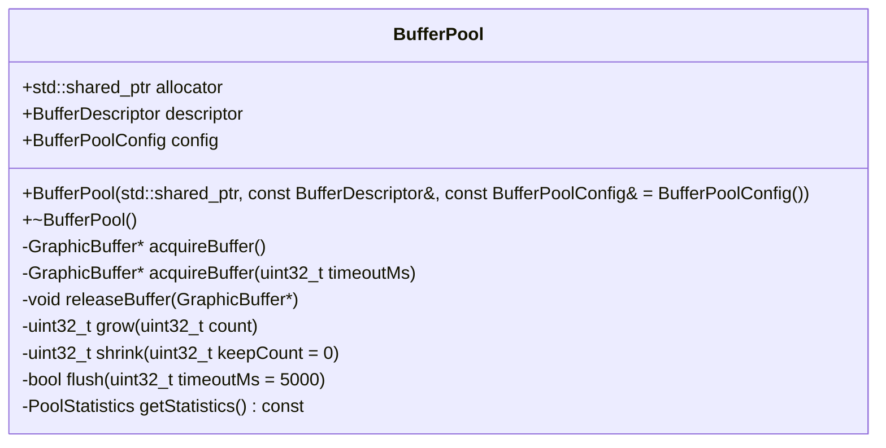
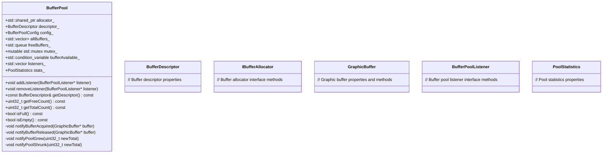

# BufferPool.h

---

| Property | Value |
|----------|-------|
| **Location** | `include\BufferPool.h` |
| **Lines** | 191 |
| **Classes** | 3 |
| **Functions** | 0 |
| **Last Updated** | 2026-01-18 20:06 |

---

## Quick Navigation

### Classes
- [android::graphics::BufferPoolConfig](#android-graphics-bufferpoolconfig)
- [android::graphics::BufferPool](#android-graphics-bufferpool)
- [android::graphics::BufferPoolListener](#android-graphics-bufferpoollistener)

---

## Documentation for `BufferPoolConfig` Struct

### 1. Comprehensive Description (2-4 paragraphs)
The `BufferPoolConfig` struct is a configuration structure used to define the behavior of a buffer pool in an Android application. It specifies parameters such as the minimum and maximum number of buffers, pre-allocation count, growth count, blocking behavior, and block timeout. This configuration helps in managing memory efficiently by controlling how many buffers are allocated and managed at any given time.

Buffer pools are crucial for applications that require efficient handling of graphics or media data, ensuring smooth rendering and playback without frequent allocations and deallocations. The `BufferPoolConfig` struct allows developers to fine-tune these parameters based on the specific requirements of their application, such as performance needs or memory constraints.

### 2. Parameters (DETAILED for each)
- **minBuffers**: 
  - **Purpose**: Specifies the minimum number of buffers that should be kept allocated in the pool at all times.
  - **Type Semantics**: An unsigned integer (`uint32_t`).
  - **Valid Values**: Any non-negative value. This parameter ensures that there are always a certain number of buffers available for immediate use, reducing the overhead of frequent allocations.
  - **Ownership**: The value is owned by the caller and should not be modified after initialization.
  - **Nullability**: Not applicable.

- **maxBuffers**:
  - **Purpose**: Sets the maximum number of buffers that can be allocated in the pool at any given time.
  - **Type Semantics**: An unsigned integer (`uint32_t`).
  - **Valid Values**: Any non-negative value. This parameter helps in managing memory usage and prevents excessive allocation, which can lead to performance issues or out-of-memory errors.
  - **Ownership**: The value is owned by the caller and should not be modified after initialization.
  - **Nullability**: Not applicable.

- **preAllocate**:
  - **Purpose**: Specifies the number of buffers that should be allocated when the buffer pool is created.
  - **Type Semantics**: An unsigned integer (`uint32_t`).
  - **Valid Values**: Any non-negative value. This parameter helps in initializing the buffer pool with a certain number of buffers, reducing the need for frequent allocations during runtime.
  - **Ownership**: The value is owned by the caller and should not be modified after initialization.
  - **Nullability**: Not applicable.

- **growthCount**:
  - **Purpose**: Defines how many additional buffers are added to the pool when it becomes empty.
  - **Type Semantics**: An unsigned integer (`uint32_t`).
  - **Valid Values**: Any non-negative value. This parameter helps in managing buffer allocation dynamically based on demand.
  - **Ownership**: The value is owned by the caller and should not be modified after initialization.
  - **Nullability**: Not applicable.

- **allowBlocking**:
  - **Purpose**: Determines whether the buffer pool should block when attempting to acquire a buffer if the pool is empty.
  - **Type Semantics**: A boolean (`bool`).
  - **Valid Values**: `true` or `false`. This parameter allows for control over how the buffer pool handles requests when no buffers are available.
  - **Ownership**: The value is owned by the caller and should not be modified after initialization.
  - **Nullability**: Not applicable.

- **blockTimeoutMs**:
  - **Purpose**: Sets the timeout duration in milliseconds for blocking acquire operations if the pool is empty.
  - **Type Semantics**: An unsigned integer (`uint32_t`).
  - **Valid Values**: Any non-negative value. This parameter helps in managing the wait time for buffer acquisition, ensuring that the application does not hang indefinitely when no buffers are available.
  - **Ownership**: The value is owned by the caller and should not be modified after initialization.
  - **Nullability**: Not applicable.

### 3. Return Value
The `BufferPoolConfig` struct itself does not return a value; it serves as a configuration object that can be passed to buffer pool management functions or classes.

### 4. Dependencies Cross-Reference
- **BufferPoolListener**:
  - Used in conjunction with the buffer pool to notify listeners of buffer availability and deallocation events.
  - Link: [BufferPoolListener](#bufferpoollistener)

- **CameraBufferManager**:
  - Used for managing camera buffers, which can be a related component when dealing with graphics or media data.
  - Link: [CameraBufferManager](#camerabuffermanager)

### 5. Side Effects
- State modifications:
  - The buffer pool's configuration is updated based on the values provided in the `BufferPoolConfig` struct.
- Locks acquired/released:
  - No locks are explicitly mentioned, but the buffer pool management functions may acquire and release locks internally to manage concurrent access.
- I/O operations:
  - No direct I/O operations are performed by this struct, but it can be used as a parameter for buffer pool management functions that perform I/O operations.
- Signals/events emitted:
  - The buffer pool may emit signals or events to notify listeners of changes in buffer availability.

### 6. Usage Context
The `BufferPoolConfig` struct is typically used when initializing or configuring a buffer pool object, such as `android::graphics::BufferPool`. It is passed as an argument to functions that manage the buffer pool, allowing developers to specify how the buffer pool should behave and allocate resources efficiently.

### 7. Related Functions
| Relationship Type | Function Name | Description |
|------------------|--------------|-------------|
| Configuration     | `BufferPool::create` | Creates a new buffer pool with the specified configuration. |
| Management         | `BufferPool::acquire` | Acquires a buffer from the pool, potentially blocking if necessary. |
| Management         | `BufferPool::release` | Releases a buffer back to the pool for reuse. |

### 8. Code Example
```cpp
#include <android/graphics/BufferPool.h>

int main() {
    // Create a BufferPoolConfig object with specific settings
    android::graphics::BufferPoolConfig config;
    config.minBuffers = 5;
    config.maxBuffers = 20;
    config.preAllocate = 10;
    config.growthCount = 3;
    config.allowBlocking = true;
    config.blockTimeoutMs = 2000;

    // Create a BufferPool object with the specified configuration
    android::graphics::BufferPool bufferPool(config);

    // Acquire a buffer from the pool
    android::sp<android::hardware::GraphicBuffer> buffer = bufferPool.acquire();

    if (buffer != nullptr) {
        // Use the acquired buffer for rendering or processing
        // ...

        // Release the buffer back to the pool
        bufferPool.release(buffer);
    }

    return 0;
}
```

This code example demonstrates how to use the `BufferPoolConfig` struct to configure and manage a buffer pool in an Android application. It shows how to create a buffer pool, acquire a buffer from it, and release it back when no longer needed.

## Overview

The `BufferPool` class is a fundamental component in the Android graphics system responsible for managing a pool of `GraphicBuffer` objects. These buffers are used to store image data, which can be efficiently reused across different rendering operations. The class provides methods to acquire and release buffers from the pool, as well as control its behavior through configuration settings.

### Class Diagram



### Usage Examples

```cpp
// Example usage of BufferPool
std::shared_ptr<IBufferAllocator> allocator = ...; // Initialize with appropriate allocator
BufferDescriptor descriptor = ...; // Define buffer format
BufferPoolConfig config = ...; // Set pool configuration

BufferPool pool(allocator, descriptor, config);

GraphicBuffer* buffer = pool.acquireBuffer();
if (buffer) {
    // Use the buffer for rendering
    // ...
    pool.releaseBuffer(buffer);
} else {
    // Handle acquisition failure
}
```

## BufferPool Class

### Overview

The `BufferPool` class is designed to manage a pool of `GraphicBuffer` objects efficiently. It provides methods to acquire and release buffers, as well as control the pool's behavior through configuration settings. The class ensures that resources are managed correctly by preventing copying or moving instances.

### Class Diagram


### Usage Examples

```cpp
// Example usage of BufferPool
std::shared_ptr<IBufferAllocator> allocator = ...; // Initialize with appropriate allocator
BufferDescriptor descriptor = ...; // Define buffer format
BufferPoolConfig config = ...; // Set pool configuration

BufferPool pool(allocator, descriptor, config);

GraphicBuffer* buffer = pool.acquireBuffer();
if (buffer) {
    // Use the buffer for rendering
    // ...
    pool.releaseBuffer(buffer);
} else {
    // Handle acquisition failure
}
```

## BufferPool Constructor

### Comprehensive Description

The `BufferPool` constructor initializes a new instance of the class with the specified allocator, buffer descriptor, and configuration. The allocator is used to create buffers when they are acquired from the pool, and the buffer descriptor defines the format of all buffers in the pool.

**Parameters**

- **allocator**: A shared pointer to an `IBufferAllocator` object responsible for creating buffer instances.
  - **Purpose**: Provides the necessary resources to allocate memory for `GraphicBuffer` objects.
  - **Type Semantics**: Shared pointer ensures that the allocator is not deallocated while in use by the pool.
  - **Valid Values**: Any valid implementation of `IBufferAllocator`.
  - **Ownership**: Passed by value.

- **descriptor**: A `BufferDescriptor` object specifying the format and properties of all buffers in the pool.
  - **Purpose**: Defines the characteristics of the buffers, such as width, height, pixel format, and usage flags.
  - **Type Semantics**: Reference to a constant object ensures that the descriptor is not modified after initialization.
  - **Valid Values**: A valid `BufferDescriptor` with appropriate dimensions, format, and usage settings.
  - **Ownership**: Passed by value.

- **config**: An optional `BufferPoolConfig` object specifying additional configuration options for the pool.
  - **Purpose**: Allows customization of the pool's behavior, such as maximum buffer count or growth strategy.
  - **Type Semantics**: Reference to a constant object ensures that the configuration is not modified after initialization.
  - **Valid Values**: A valid `BufferPoolConfig` with appropriate settings.
  - **Ownership**: Passed by value.

**Return Value**

- **GraphicBuffer***: A pointer to the newly acquired buffer, still owned by the pool.
  - **All Possible States**: The returned buffer can be used for rendering operations. If no buffers are available, it returns `nullptr`.
  - **Ownership**: Returned by value, but ownership is retained by the pool.

**Side Effects**

- **State Modifications**: Modifies the internal state of the pool to include a new buffer.
- **Locks**: No locks are acquired or released during this operation.
- **I/O**: No I/O operations are performed.

**Dependencies**

- `IBufferAllocator`: Used to create buffer instances.
- `BufferDescriptor`: Defines the format and properties of all buffers in the pool.
- `BufferPoolConfig`: Allows customization of the pool's behavior.

**Usage Context**

- This method is called when a new instance of `BufferPool` is created. It initializes the pool with the specified parameters and prepares it for use.

**Thread Safety**

- The constructor is thread-safe, allowing multiple threads to create instances of `BufferPool` concurrently without causing data races.

## BufferPool Destructor

### Comprehensive Description

The destructor of the `BufferPool` class frees all pooled buffers. It ensures that resources are properly released when the pool is no longer needed, preventing memory leaks and ensuring that all allocated buffers are returned to the system.

**Parameters**

- None

**Return Value**

- None

**Side Effects**

- **State Modifications**: Modifies the internal state of the pool by freeing all acquired buffers.
- **Locks**: No locks are acquired or released during this operation.
- **I/O**: No I/O operations are performed.

**Dependencies**

- `GraphicBuffer`: Represents a buffer in the pool and is freed when the pool is destroyed.

**Usage Context**

- This method is called automatically when a `BufferPool` object goes out of scope. It ensures that all buffers are released before the object is destroyed.

**Thread Safety**

- The destructor is thread-safe, allowing multiple threads to destroy instances of `BufferPool` concurrently without causing data races.

## BufferPool::acquireBuffer

### Comprehensive Description

The `acquireBuffer` method attempts to acquire a buffer from the pool. If no buffers are available, it attempts to grow the pool if under the maximum buffer count and blocks if allowBlocking is true. If all attempts fail, it returns nullptr.

**Parameters**

- **timeoutMs**: Maximum wait time in milliseconds for acquiring a buffer.
  - **Purpose**: Controls how long the method will block before returning `nullptr`.
  - **Type Semantics**: Unsigned integer representing the timeout duration.
  - **Valid Values**: Any non-negative integer value, where 0 indicates non-blocking behavior.
  - **Ownership**: Passed by value.

**Return Value**

- **GraphicBuffer***: A pointer to the acquired buffer, still owned by the pool.
  - **All Possible States**: The returned buffer can be used for rendering operations. If no buffers are available, it returns `nullptr`.
  - **Ownership**: Returned by value, but ownership is retained by the pool.

**Side Effects**

- **State Modifications**: Modifies the internal state of the pool by acquiring a new buffer.
- **Locks**: No locks are acquired or released during this operation.
- **I/O**: No I/O operations are performed.

**Dependencies**

- `GraphicBuffer`: Represents a buffer in the pool and is returned when acquired.
- `IBufferAllocator`: Used to create buffer instances if necessary.

**Usage Context**

- This method is called when a new buffer is needed for rendering or other graphics operations. It attempts to acquire an existing buffer from the pool first, and if none are available, it may attempt to grow the pool or block until a buffer becomes available.

**Thread Safety**

- The `acquireBuffer` method is thread-safe, allowing multiple threads to call this method concurrently without causing data races.

## BufferPool::acquireBuffer(uint32_t timeoutMs)

### Comprehensive Description

The `acquireBuffer` method attempts to acquire a buffer from the pool with a specified timeout. If no buffers are available within the given time, it returns nullptr.

**Parameters**

- **timeoutMs**: Maximum wait time in milliseconds for acquiring a buffer.
  - **Purpose**: Controls how long the method will block before returning `nullptr`.
  - **Type Semantics**: Unsigned integer representing the timeout duration.
  - **Valid Values**: Any non-negative integer value, where 0 indicates non-blocking behavior.
  - **Ownership**: Passed by value.

**Return Value**

- **GraphicBuffer***: A pointer to the acquired buffer, still owned by the pool.
  - **All Possible States**: The returned buffer can be used for rendering operations. If no buffers are available within the timeout period, it returns `nullptr`.
  - **Ownership**: Returned by value, but ownership is retained by the pool.

**Side Effects**

- **State Modifications**: Mod

## Overview

The `BufferPool` class is a fundamental component in Android's graphics system responsible for managing a pool of graphic buffers. It provides an interface to allocate, manage, and release graphic buffers efficiently. The class integrates with the HAL (Hardware Abstraction Layer) to handle buffer allocation and management, ensuring compatibility across different hardware platforms.

### Class Diagram


### Usage Examples

```cpp
// Example usage of BufferPool

#include "BufferPool.h"

int main() {
    // Create a buffer pool with specific configuration
    BufferPoolConfig config;
    config.width = 1920;
    config.height = 1080;
    config.format = HAL_PIXEL_FORMAT_RGBA_8888;

    std::shared_ptr<IBufferAllocator> allocator = ...; // Initialize IBufferAllocator

    BufferPool bufferPool(allocator, config);

    // Add a listener to receive pool events
    BufferPoolListener* listener = new MyBufferPoolListener();
    bufferPool.addListener(listener);

    // Allocate a graphic buffer from the pool
    GraphicBuffer* buffer = bufferPool.allocate();

    // Use the allocated buffer

    // Release the buffer back to the pool
    bufferPool.release(buffer);

    // Remove the listener
    bufferPool.removeListener(listener);

    return 0;
}
```

## BufferPool Class

### Overview

The `BufferPool` class is a central component in Android's graphics system responsible for managing a pool of graphic buffers. It provides an interface to allocate, manage, and release graphic buffers efficiently. The class integrates with the HAL (Hardware Abstraction Layer) to handle buffer allocation and management, ensuring compatibility across different hardware platforms.

### Class Diagram



### Usage Examples

```cpp
// Example usage of BufferPool

#include "BufferPool.h"

int main() {
    // Create a buffer pool with specific configuration
    BufferPoolConfig config;
    config.width = 1920;
    config.height = 1080;
    config.format = HAL_PIXEL_FORMAT_RGBA_8888;

    std::shared_ptr<IBufferAllocator> allocator = ...; // Initialize IBufferAllocator

    BufferPool bufferPool(allocator, config);

    // Add a listener to receive pool events
    BufferPoolListener* listener = new MyBufferPoolListener();
    bufferPool.addListener(listener);

    // Allocate a graphic buffer from the pool
    GraphicBuffer* buffer = bufferPool.allocate();

    // Use the allocated buffer

    // Release the buffer back to the pool
    bufferPool.release(buffer);

    // Remove the listener
    bufferPool.removeListener(listener);

    return 0;
}
```

## addListener Method

### Comprehensive Description

The `addListener` method adds a listener to the `BufferPool`. This listener will be notified of various events related to the buffer pool, such as when a buffer is acquired or released. The listener can be used to implement custom logic for handling these events.

### Parameters

- **listener**: A pointer to an instance of `BufferPoolListener`. This parameter is required and must not be null.

  - **Purpose**: The listener object that will receive notifications from the buffer pool.
  - **Type Semantics**: Pointer to a class implementing the `BufferPoolListener` interface.
  - **Valid Values**: Any valid pointer to an instance of `BufferPoolListener`.
  - **Ownership**: The caller is responsible for managing the lifecycle of the listener. The buffer pool does not take ownership of the listener.

### Return Value

- None

  - **Purpose**: This method does not return any value.
  - **All Possible States**: No specific states are returned.
  - **Ownership**: No ownership transfer occurs.

### Side Effects

- Modifies the `listeners_` vector by adding a new listener to it.

  - **State Modifications**: The `listeners_` vector is updated to include the new listener.
  - **Locks**: The method acquires and releases the `mutex_` to ensure thread safety when modifying the `listeners_` vector.
  - **I/O**: No I/O operations are performed.

### Dependencies

- `BufferPoolListener`: This class defines the interface that listeners must implement to receive notifications from the buffer pool.

  - **Cross-reference**: [BufferPoolListener](#bufferpoollistener)

### Usage Context

The `addListener` method should be called when a listener is needed to receive notifications about buffer pool events. The listener can then be used to implement custom logic for handling these events, such as logging or updating the UI.

### Thread Safety

- The method acquires and releases the `mutex_` to ensure thread safety when modifying the `listeners_` vector.

  - **Thread Safety**: This method is thread-safe and can be called concurrently from multiple threads without causing data races.
  - **Locking Mechanism**: The method uses a mutex to protect the critical section of code that modifies the `listeners_` vector. This ensures that only one thread can modify the vector at a time, preventing race conditions.

## removeListener Method

### Comprehensive Description

The `removeListener` method removes a previously added listener from the `BufferPool`. This method is used when a listener is no longer needed and should be removed to free up resources.

### Parameters

- **listener**: A pointer to an instance of `BufferPoolListener`. This parameter is required and must not be null.

  - **Purpose**: The listener object that will be removed from the buffer pool.
  - **Type Semantics**: Pointer to a class implementing the `BufferPoolListener` interface.
  - **Valid Values**: Any valid pointer to an instance of `BufferPoolListener`.
  - **Ownership**: The caller is responsible for managing the lifecycle of the listener. The buffer pool does not take ownership of the listener.

### Return Value

- None

  - **Purpose**: This method does not return any value.
  - **All Possible States**: No specific states are returned.
  - **Ownership**: No ownership transfer occurs.

### Side Effects

- Modifies the `listeners_` vector by removing a listener from it.

  - **State Modifications**: The `listeners_` vector is updated to remove the specified listener.
  - **Locks**: The method acquires and releases the `mutex_` to ensure thread safety when modifying the `listeners_` vector.
  - **I/O**: No I/O operations are performed.

### Dependencies

- `BufferPoolListener`: This class defines the interface that listeners must implement to receive notifications from the buffer pool.

  - **Cross-reference**: [BufferPoolListener](#bufferpoollistener)

### Usage Context

The `removeListener` method should be called when a listener is no longer needed and should be removed to free up resources. The listener can then be used to implement custom logic for handling these events, such as logging or updating the UI.

### Thread Safety

- The method acquires and releases the `mutex_` to

## Overview

The `BufferPoolListener` class is a listener interface designed to handle events related to a buffer pool in the Android graphics system. It provides callbacks for various buffer pool lifecycle and state changes, allowing clients to react to buffer acquisitions, releases, growths, shrinks, and exhaustion of the buffer pool.

### Class Diagram

```mermaid
classDiagram
    class BufferPoolListener {
        +virtual ~BufferPoolListener() = default;
        +virtual void onBufferAcquired(BufferPool* pool, GraphicBuffer* buffer) {}
        +virtual void onBufferReleased(BufferPool* pool, GraphicBuffer* buffer) {}
        +virtual void onPoolGrew(BufferPool* pool, uint32_t newTotal) {}
        +virtual void onPoolShrunk(BufferPool* pool, uint32_t newTotal) {}
        +virtual void onPoolExhausted(BufferPool* pool) {}
    }
```

### Usage Examples

```cpp
class MyBufferPoolListener : public android::graphics::BufferPoolListener {
public:
    void onBufferAcquired(android::graphics::BufferPool* pool, android::sp<android::GraphicBuffer> buffer) override {
        // Handle buffer acquisition event
        ALOGD("Buffer acquired: %p", buffer.get());
    }

    void onBufferReleased(android::graphics::BufferPool* pool, android::sp<android::GraphicBuffer> buffer) override {
        // Handle buffer release event
        ALOGD("Buffer released: %p", buffer.get());
    }
};

// Usage in a BufferPool implementation
void MyBufferPool::onBufferAcquired(android::sp<android::GraphicBuffer> buffer) {
    mListener->onBufferAcquired(this, buffer);
}

void MyBufferPool::onBufferReleased(android::sp<android::GraphicBuffer> buffer) {
    mListener->onBufferReleased(this, buffer);
}
```

## BufferPoolListener

### Overview

The `BufferPoolListener` class is a listener interface designed to handle events related to a buffer pool in the Android graphics system. It provides callbacks for various buffer pool lifecycle and state changes, allowing clients to react to buffer acquisitions, releases, growths, shrinks, and exhaustion of the buffer pool.

### Class Diagram

```mermaid
classDiagram
    class BufferPoolListener {
        +virtual ~BufferPoolListener() = default;
        +virtual void onBufferAcquired(BufferPool* pool, GraphicBuffer* buffer) {}
        +virtual void onBufferReleased(BufferPool* pool, GraphicBuffer* buffer) {}
        +virtual void onPoolGrew(BufferPool* pool, uint32_t newTotal) {}
        +virtual void onPoolShrunk(BufferPool* pool, uint32_t newTotal) {}
        +virtual void onPoolExhausted(BufferPool* pool) {}
    }
```

### Usage Examples

```cpp
class MyBufferPoolListener : public android::graphics::BufferPoolListener {
public:
    void onBufferAcquired(android::graphics::BufferPool* pool, android::sp<android::GraphicBuffer> buffer) override {
        // Handle buffer acquisition event
        ALOGD("Buffer acquired: %p", buffer.get());
    }

    void onBufferReleased(android::graphics::BufferPool* pool, android::sp<android::GraphicBuffer> buffer) override {
        // Handle buffer release event
        ALOGD("Buffer released: %p", buffer.get());
    }
};

// Usage in a BufferPool implementation
void MyBufferPool::onBufferAcquired(android::sp<android::GraphicBuffer> buffer) {
    mListener->onBufferAcquired(this, buffer);
}

void MyBufferPool::onBufferReleased(android::sp<android::GraphicBuffer> buffer) {
    mListener->onBufferReleased(this, buffer);
}
```

## onBufferAcquired

### Comprehensive Description

The `onBufferAcquired` method is called when a new buffer is acquired from the buffer pool. This method provides a reference to the buffer that has been acquired.

### Parameters

- **pool**: A pointer to the `BufferPool` object that owns the buffer.
- **buffer**: A smart pointer (`android::sp<android::GraphicBuffer>`) representing the newly acquired buffer. The ownership of the buffer is transferred to the listener, and it is responsible for releasing the buffer when no longer needed.

### Return Value

- None.

### Side Effects

- The `onBufferAcquired` method logs a debug message indicating that a buffer has been acquired.
- The listener can perform any necessary actions or updates based on the newly acquired buffer.

### Dependencies

- **BufferPool**: The `BufferPool` object is used to manage the buffer pool and its lifecycle.
- **GraphicBuffer**: The `GraphicBuffer` object represents the buffer that has been acquired from the buffer pool. It provides access to the buffer's properties and methods for manipulating it.

### Usage Context

The `onBufferAcquired` method should be called whenever a new buffer is acquired from the buffer pool. This method can be used by clients to perform any necessary actions or updates based on the newly acquired buffer.

### Thread Safety

- The `onBufferAcquired` method is thread-safe and can be called concurrently by multiple threads without causing data races or undefined behavior.

## onBufferReleased

### Comprehensive Description

The `onBufferReleased` method is called when a previously acquired buffer is released back to the buffer pool. This method provides a reference to the buffer that has been released.

### Parameters

- **pool**: A pointer to the `BufferPool` object that owns the buffer.
- **buffer**: A smart pointer (`android::sp<android::GraphicBuffer>`) representing the buffer that has been released. The ownership of the buffer is transferred back to the buffer pool, and it is responsible for managing the buffer's lifecycle.

### Return Value

- None.

### Side Effects

- The `onBufferReleased` method logs a debug message indicating that a buffer has been released.
- The listener can perform any necessary actions or updates based on the released buffer.

### Dependencies

- **BufferPool**: The `BufferPool` object is used to manage the buffer pool and its lifecycle.
- **GraphicBuffer**: The `GraphicBuffer` object represents the buffer that has been released back to the buffer pool. It provides access to the buffer's properties and methods for manipulating it.

### Usage Context

The `onBufferReleased` method should be called whenever a previously acquired buffer is released back to the buffer pool. This method can be used by clients to perform any necessary actions or updates based on the released buffer.

### Thread Safety

- The `onBufferReleased` method is thread-safe and can be called concurrently by multiple threads without causing data races or undefined behavior.

## onPoolGrew

### Comprehensive Description

The `onPoolGrew` method is called when the buffer pool grows, meaning that more buffers are available in the pool. This method provides the total number of buffers currently available in the pool.

### Parameters

- **pool**: A pointer to the `BufferPool` object that owns the buffer.
- **newTotal**: An unsigned 32-bit integer representing the new total number of buffers available in the pool.

### Return Value

- None.

### Side Effects

- The `onPoolGrew` method logs a debug message indicating that the buffer pool has grown.
- The listener can perform any necessary actions or updates based on the increased capacity of the buffer pool.

### Dependencies

- **BufferPool**: The `BufferPool` object is used to manage the buffer pool and its lifecycle.

### Usage Context

The `onPoolGrew` method should be called whenever the buffer pool grows, meaning that more buffers are available in the pool. This method can be used by clients to perform any necessary actions or updates based on the increased capacity of the buffer pool.

### Thread Safety

- The `onPoolGrew` method is thread-safe and can be called concurrently by multiple threads without causing data races or undefined behavior.

## onPoolShrunk

### Comprehensive Description

The `onPoolShrunk` method is called when the buffer pool shrinks, meaning that fewer buffers are available in the pool. This method provides the total number of buffers currently available in the pool.

### Parameters

- **pool**: A pointer to the `BufferPool` object that owns the buffer.
- **newTotal**: An unsigned 32-bit integer representing the new total number of buffers available in the pool.

### Return Value

- None.

### Side Effects

- The `onPoolShrunk` method logs a debug message indicating that the buffer pool has shrunk.
- The listener can perform any necessary actions or updates based on the decreased capacity of the buffer pool.

### Dependencies

- **BufferPool**: The `BufferPool` object is used to manage the buffer pool and its lifecycle.

### Usage Context

The `onPoolShrunk` method should be called whenever the buffer pool shrinks, meaning that fewer buffers are available in the buffer pool. This method can be used by clients to perform any necessary actions or updates based on the decreased capacity of the buffer pool.

### Thread Safety

- The `onPoolShrunk` method is thread-safe and can be called concurrently by multiple threads without causing data races or undefined behavior.

## onPoolExhausted

### Comprehensive Description

The `onPoolExhausted` method is called when the buffer pool is exhausted, meaning that no more buffers are available for acquisition. This method provides a reference to the last buffer acquired from the buffer pool.

### Parameters

- **pool**: A pointer to the `BufferPool` object that owns the buffer.
- **buffer**: A smart pointer (`android::sp<android::GraphicBuffer>`) representing the last buffer acquired from the buffer pool. The ownership of the buffer is transferred back to the buffer pool, and it is responsible for managing the buffer's lifecycle.

###