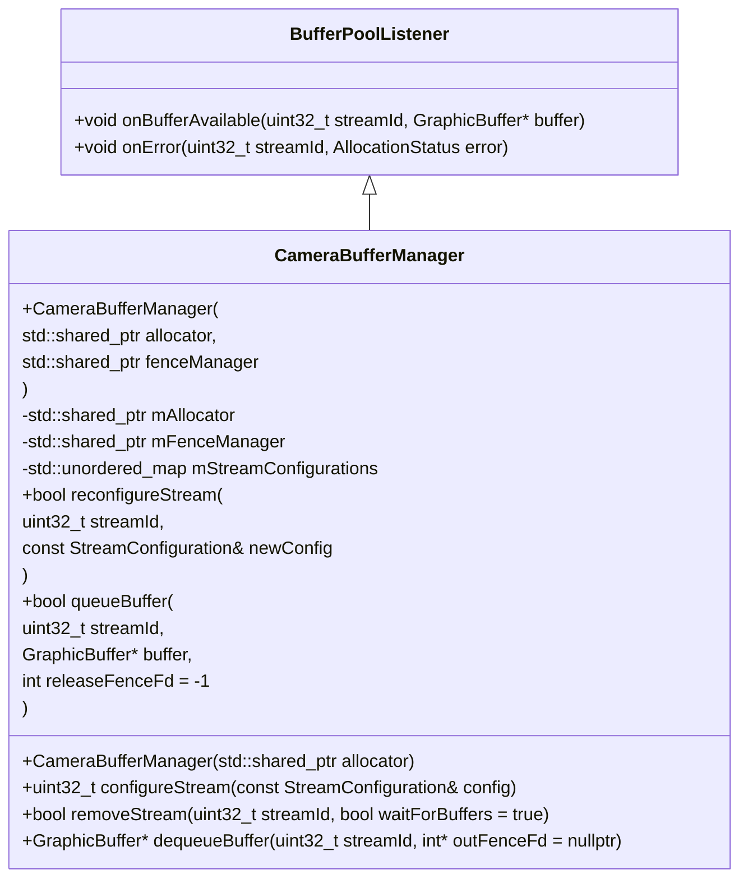
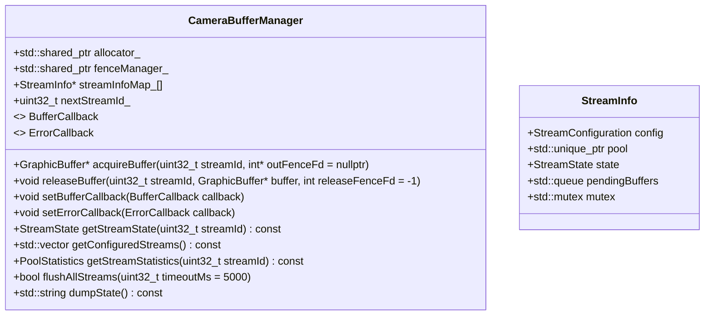

# CameraBufferManager.h

---

| Property | Value |
|----------|-------|
| **Location** | `include\CameraBufferManager.h` |
| **Lines** | 240 |
| **Classes** | 2 |
| **Functions** | 0 |
| **Last Updated** | 2026-01-18 20:10 |

---

## Quick Navigation

### Classes
- [android::graphics::StreamConfiguration](#android-graphics-streamconfiguration)
- [android::graphics::CameraBufferManager](#android-graphics-camerabuffermanager)

---

## Documentation for `StreamConfiguration` Struct in `CameraBufferManager.h`

### 1. Comprehensive Description (2-4 paragraphs)
The `StreamConfiguration` struct is a fundamental component of the camera buffer management system within the Android framework. It encapsulates all necessary configuration details for a single camera stream, including its type, buffer descriptor, pool configuration, rotation angle, and usage case hint. This struct serves as a blueprint for configuring how camera data will be processed and displayed.

### 2. Parameters (DETAILED for each)
#### `streamId`
- **Purpose**: Identifies the unique identifier of the stream.
- **Type Semantics**: An unsigned integer representing the stream's ID.
- **Valid Values**: Any non-negative integer value.
- **Ownership**: The caller owns this value and is responsible for managing its lifecycle.
- **Nullability**: Not applicable.

#### `type`
- **Purpose**: Specifies the type of camera stream, such as preview, video recording, still image capture, raw data output, or reprocessing.
- **Type Semantics**: An enumeration (`StreamType`) that defines different types of camera streams.
- **Valid Values**: Enum values from `StreamType` (e.g., `OUTPUT_PREVIEW`, `OUTPUT_VIDEO`, etc.).
- **Ownership**: The caller owns this value and is responsible for managing its lifecycle.
- **Nullability**: Not applicable.

#### `bufferDesc`
- **Purpose**: Describes the characteristics of the camera buffers used by this stream, including dimensions, format, and other buffer-specific properties.
- **Type Semantics**: A `BufferDescriptor` object that encapsulates all necessary details about the buffer configuration.
- **Valid Values**: A valid `BufferDescriptor` object with appropriate dimensions, format, and other attributes.
- **Ownership**: The caller owns this value and is responsible for managing its lifecycle. The `BufferDescriptor` class provides methods to set and retrieve these properties.
- **Nullability**: Not applicable.

#### `poolConfig`
- **Purpose**: Configures the buffer pool used by this stream, specifying how many buffers should be allocated and their characteristics.
- **Type Semantics**: A `BufferPoolConfig` object that defines the pool's size, buffer count, and other configuration parameters.
- **Valid Values**: A valid `BufferPoolConfig` object with appropriate settings for buffer allocation and management.
- **Ownership**: The caller owns this value and is responsible for managing its lifecycle. The `BufferPoolConfig` class provides methods to set and retrieve these properties.
- **Nullability**: Not applicable.

#### `rotation`
- **Purpose**: Specifies the rotation angle of the camera stream, which affects how images are displayed or processed.
- **Type Semantics**: An integer representing the rotation angle in degrees (e.g., 0, 90, 180, 270).
- **Valid Values**: Any integer value within the range [0, 360].
- **Ownership**: The caller owns this value and is responsible for managing its lifecycle.
- **Nullability**: Not applicable.

#### `useCase`
- **Purpose**: Provides a hint to the system about the intended use case of the camera stream, which can influence how resources are allocated or optimized.
- **Type Semantics**: A boolean flag indicating whether the stream is part of a specific use case (e.g., still image capture).
- **Valid Values**: `true` or `false`.
- **Ownership**: The caller owns this value and is responsible for managing its lifecycle.
- **Nullability**: Not applicable.

### 3. Return Value
The `StreamConfiguration` struct does not return a value; it serves as a configuration object that can be used to set up camera streams within the system.

### 4. Dependencies Cross-Reference
- **BufferDescriptor**: Used to define the characteristics of the camera buffers.
- **BufferPoolConfig**: Used to configure the buffer pool for the stream.
- **StreamType**: Enumerates different types of camera streams.

### 5. Side Effects
- Modifies the state of the camera system by configuring a new stream.
- Acquires locks or resources as needed during configuration.
- May trigger I/O operations if necessary, such as allocating buffers from the pool.

### 6. Usage Context
The `StreamConfiguration` struct is typically used in the context of setting up camera streams within the Android framework. It is passed to methods that configure and manage camera devices, ensuring that all stream configurations are correctly set before data processing begins.

### 7. Related Functions
| Relationship Type | Function Name | Description |
|------------------|--------------|-------------|
| Configuration     | `configureStream` | Configures a new camera stream based on the provided `StreamConfiguration`. |

### 8. Code Example

```cpp
#include "CameraBufferManager.h"

int main() {
    // Create a buffer descriptor for the preview stream
    BufferDescriptor previewDesc;
    previewDesc.width = 1920;
    previewDesc.height = 1080;
    previewDesc.format = HAL_PIXEL_FORMAT_RGBA_8888;

    // Create a buffer pool configuration for the preview stream
    BufferPoolConfig previewPoolConfig;
    previewPoolConfig.bufferCount = 3;
    previewPoolConfig.size = 4 * 1920 * 1080; // Size in bytes

    // Create a stream configuration object
    StreamConfiguration previewStreamConfig;
    previewStreamConfig.streamId = 1;
    previewStreamConfig.type = StreamType::OUTPUT_PREVIEW;
    previewStreamConfig.bufferDesc = previewDesc;
    previewStreamConfig.poolConfig = previewPoolConfig;
    previewStreamConfig.rotation = 0;
    previewStreamConfig.useCase = false;

    // Configure the preview stream
    CameraBufferManager::configureStream(previewStreamConfig);

    return 0;
}
```

This code snippet demonstrates how to create and configure a preview stream using the `StreamConfiguration` struct. The `configureStream` method is called with the configured stream object, setting up the camera system for preview display.

## Overview

**CameraBufferManager** is a class designed to manage camera buffers in an Android system. It provides functionalities for configuring, reconfiguring, and managing streams of graphic buffers used by camera devices. The class integrates with the HAL (Hardware Abstraction Layer) and uses the Binder IPC mechanism for communication between different components of the system.

### Class Diagram



### Usage Examples

```cpp
// Example usage of CameraBufferManager

#include "CameraBufferManager.h"

int main() {
    // Create an IBufferAllocator instance
    auto allocator = std::make_shared<IBufferAllocator>();

    // Create a FenceManager instance (optional)
    auto fenceManager = std::make_shared<FenceManager>();

    // Create a CameraBufferManager instance
    CameraBufferManager bufferManager(allocator, fenceManager);

    // Configure a stream
    StreamConfiguration config;
    config.width = 1920;
    config.height = 1080;
    config.format = HAL_PIXEL_FORMAT_RGBA_8888;
    uint32_t streamId = bufferManager.configureStream(config);

    if (streamId != 0) {
        // Dequeue a buffer for the stream
        GraphicBuffer* buffer = bufferManager.dequeueBuffer(streamId);
        if (buffer != nullptr) {
            // Queue the filled buffer back to the stream
            bool success = bufferManager.queueBuffer(streamId, buffer);
            delete buffer; // Buffer ownership is transferred to CameraBufferManager
        }
    }

    return 0;
}
```

## CameraBufferManager

### Overview

**CameraBufferManager** is a class designed to manage camera buffers in an Android system. It provides functionalities for configuring, reconfiguring, and managing streams of graphic buffers used by camera devices. The class integrates with the HAL (Hardware Abstraction Layer) and uses the Binder IPC mechanism for communication between different components of the system.

### Class Diagram


### Usage Examples

```cpp
// Example usage of CameraBufferManager

#include "CameraBufferManager.h"

int main() {
    // Create an IBufferAllocator instance
    auto allocator = std::make_shared<IBufferAllocator>();

    // Create a FenceManager instance (optional)
    auto fenceManager = std::make_shared<FenceManager>();

    // Create a CameraBufferManager instance
    CameraBufferManager bufferManager(allocator, fenceManager);

    // Configure a stream
    StreamConfiguration config;
    config.width = 1920;
    config.height = 1080;
    config.format = HAL_PIXEL_FORMAT_RGBA_8888;
    uint32_t streamId = bufferManager.configureStream(config);

    if (streamId != 0) {
        // Dequeue a buffer for the stream
        GraphicBuffer* buffer = bufferManager.dequeueBuffer(streamId);
        if (buffer != nullptr) {
            // Queue the filled buffer back to the stream
            bool success = bufferManager.queueBuffer(streamId, buffer);
            delete buffer; // Buffer ownership is transferred to CameraBufferManager
        }
    }

    return 0;
}
```

## CameraBufferManager::CameraBufferManager(std::shared_ptr<IBufferAllocator> allocator)

### Overview

**Constructor for CameraBufferManager**

This constructor initializes a new instance of `CameraBufferManager` with the specified `IBufferAllocator`. The `IBufferAllocator` is used to allocate and manage graphic buffers.

### Parameters

- **allocator**: A shared pointer to an `IBufferAllocator` object. This allocator will be used to create and manage graphic buffers for all streams managed by this manager.

### Return Value

- None

### Side Effects

- Initializes the internal state of the `CameraBufferManager`, setting up the `mAllocator` member variable.
- Creates a new empty map to store stream configurations (`mStreamConfigurations`).

### Dependencies

- **IBufferAllocator**: Used for buffer allocation and management.

### Usage Context

- This constructor is typically called when creating an instance of `CameraBufferManager` to initialize it with the necessary resources for managing camera buffers.

### Thread Safety

- The constructor is thread-safe as it initializes internal state without any shared mutable data that could be accessed by other threads concurrently.

## CameraBufferManager::CameraBufferManager(std::shared_ptr<IBufferAllocator> allocator, std::shared_ptr<FenceManager> fenceManager)

### Overview

**Constructor for CameraBufferManager with FenceManager**

This constructor initializes a new instance of `CameraBufferManager` with the specified `IBufferAllocator` and an optional `FenceManager`. The `IBufferAllocator` is used to allocate and manage graphic buffers, while the `FenceManager` can be used to handle fences associated with buffer operations.

### Parameters

- **allocator**: A shared pointer to an `IBufferAllocator` object. This allocator will be used to create and manage graphic buffers.
- **fenceManager**: An optional shared pointer to a `FenceManager` object. If provided, it can be used to handle fences associated with buffer operations.

### Return Value

- None

### Side Effects

- Initializes the internal state of the `CameraBufferManager`, setting up the `mAllocator` and `mFenceManager` member variables.
- Creates a new empty map to store stream configurations (`mStreamConfigurations`).

### Dependencies

- **IBufferAllocator**: Used for buffer allocation and management.
- **FenceManager** (optional): Used for handling fences associated with buffer operations.

### Usage Context

- This constructor is typically called when creating an instance of `CameraBufferManager` to initialize it with the necessary resources for managing camera buffers, including optional fence management.

### Thread Safety

- The constructor is thread-safe as it initializes internal state without any shared mutable data that could be accessed by other threads concurrently.

## CameraBufferManager::~CameraBufferManager()

### Overview

**Destructor for CameraBufferManager**

This destructor cleans up the resources held by `CameraBufferManager`, ensuring that all allocated buffers are released and any associated fences are properly handled.

### Parameters

- None

### Return Value

- None

### Side Effects

- Releases all allocated graphic buffers.
- Closes any open fences.
- Clears the map of stream configurations (`mStreamConfigurations`).

### Dependencies

- **GraphicBuffer**: Released when a buffer is returned to the manager.
- **FenceManager** (if used): Closed and resources released.

### Usage Context

- This destructor should be called when an instance of `CameraBufferManager` is no longer needed to free up system resources.

### Thread Safety

- The destructor is thread-safe as it ensures that all operations are performed in a safe manner without concurrent access to shared data.

## CameraBufferManager::configureStream(const StreamConfiguration& config)

### Overview

**Configure a new stream**

This method configures a new stream with the specified configuration. It returns the ID of the newly configured stream, which can be used for subsequent buffer operations.

### Parameters

- **config**: A `StreamConfiguration` object containing details about the stream to configure, such as width, height, and format.

### Return Value

- The ID of the newly configured stream (0 on failure)

### Side Effects

- Updates the internal state of the `CameraBufferManager` with the new stream configuration.
-

## Overview

`CameraBufferManager` is a class designed to manage buffers for camera operations in an Android environment. It provides functionalities to acquire and release buffers from different streams, set callbacks for buffer availability and errors, and manage stream states and statistics. The class integrates with the HAL (Hardware Abstraction Layer) to handle buffer allocation and management.

### Class Diagram



### Usage Examples

```cpp
// Example usage of CameraBufferManager
int main() {
    auto bufferManager = std::make_shared<CameraBufferManager>();

    // Set up a callback for buffer availability
    bufferManager->setBufferCallback([](GraphicBuffer* buffer) {
        // Handle buffer acquisition
    });

    // Acquire a buffer from stream 1
    GraphicBuffer* buffer = bufferManager->acquireBuffer(1);
    if (buffer != nullptr) {
        // Use the buffer
        bufferManager->releaseBuffer(1, buffer);
    }

    return 0;
}
```

## Method Documentation

### `acquireBuffer(uint32_t streamId, int* outFenceFd = nullptr)`

**Comprehensive Description**

Acquires a buffer from the specified stream. The method returns a pointer to the acquired `GraphicBuffer` object. If an acquire fence is requested, it will be stored in the provided `outFenceFd` parameter.

**Parameters**
- **streamId**: Source stream identifier.
  - **Purpose**: Identifies the stream from which to acquire the buffer.
  - **Type Semantics**: `uint32_t`.
  - **Valid Values**: Any valid stream ID configured with the manager.
  - **Ownership**: None (input).

- **outFenceFd**: Pointer to an integer where the acquire fence will be stored.
  - **Purpose**: Provides a way to retrieve the fence associated with the acquired buffer.
  - **Type Semantics**: `int*`.
  - **Valid Values**: A valid file descriptor representing the fence.
  - **Ownership**: Output (output).

**Return Value**
- **GraphicBuffer* or nullptr**: Pointer to the acquired buffer if successful, otherwise `nullptr`.

**Side Effects**
- Modifies the state of the stream by marking it as busy.
- Acquires a buffer from the specified stream.

**Dependencies**
- `IBufferAllocator` for buffer allocation.
- `FenceManager` for managing fences.

**Usage Context**
- Called when a consumer needs to access a buffer from a specific stream.
- Prerequisites: The stream must be configured and available.

**Thread Safety**
- Safe to call from multiple threads concurrently, but not thread-safe within the same method invocation due to shared state.

### `releaseBuffer(uint32_t streamId, GraphicBuffer* buffer, int releaseFenceFd = -1)`

**Comprehensive Description**

Releases a previously acquired buffer back to the specified stream. The method also accepts an optional release fence that can be used to signal when the buffer is no longer needed.

**Parameters**
- **streamId**: Source stream identifier.
  - **Purpose**: Identifies the stream to which the buffer will be released.
  - **Type Semantics**: `uint32_t`.
  - **Valid Values**: Any valid stream ID configured with the manager.
  - **Ownership**: None (input).

- **buffer**: Pointer to the `GraphicBuffer` object to release.
  - **Purpose**: The buffer to be returned to the pool.
  - **Type Semantics**: `GraphicBuffer*`.
  - **Valid Values**: A valid pointer to a `GraphicBuffer` object.
  - **Ownership**: Input (input).

- **releaseFenceFd**: File descriptor for signaling when the buffer is released.
  - **Purpose**: Allows the caller to signal when the buffer can be safely freed or reused.
  - **Type Semantics**: `int`.
  - **Valid Values**: A valid file descriptor representing a fence, or `-1` if no fence is needed.
  - **Ownership**: None (input).

**Return Value**
- **None**

**Side Effects**
- Modifies the state of the stream by marking it as idle and releasing the buffer back to its pool.
- Releases the buffer back to the specified stream.

**Dependencies**
- `BufferPool` for managing buffer releases.

**Usage Context**
- Called when a consumer is done with a buffer and wants to return it to the system.
- Prerequisites: The buffer must have been acquired from the same stream.

**Thread Safety**
- Safe to call from multiple threads concurrently, but not thread-safe within the same method invocation due to shared state.

### `setBufferCallback(BufferCallback callback)`

**Comprehensive Description**

Sets a callback function that will be invoked when a buffer is available for consumption. The callback provides a pointer to the acquired buffer.

**Parameters**
- **callback**: A function object of type `BufferCallback`.
  - **Purpose**: Defines the behavior when a buffer becomes available.
  - **Type Semantics**: `BufferCallback`.
  - **Valid Values**: Any valid function that takes a `GraphicBuffer*` as an argument.
  - **Ownership**: Input (input).

**Return Value**
- **None**

**Side Effects**
- Registers the callback function to be invoked when a buffer is available.

**Dependencies**
- None

**Usage Context**
- Called by consumers to specify how they want to handle acquired buffers.
- Prerequisites: The consumer must have set up a valid `BufferCallback` function.

**Thread Safety**
- Safe to call from multiple threads concurrently, but not thread-safe within the same method invocation due to shared state.

### `setErrorCallback(ErrorCallback callback)`

**Comprehensive Description**

Sets a callback function that will be invoked when an error occurs during buffer management. The callback provides details about the error.

**Parameters**
- **callback**: A function object of type `ErrorCallback`.
  - **Purpose**: Defines the behavior when an error occurs.
  - **Type Semantics**: `ErrorCallback`.
  - **Valid Values**: Any valid function that takes a string message as an argument.
  - **Ownership**: Input (input).

**Return Value**
- **None**

**Side Effects**
- Registers the callback function to be invoked when an error occurs.

**Dependencies**
- None

**Usage Context**
- Called by consumers to specify how they want to handle errors during buffer management.
- Prerequisites: The consumer must have set up a valid `ErrorCallback` function.

**Thread Safety**
- Safe to call from multiple threads concurrently, but not thread-safe within the same method invocation due to shared state.

### `getStreamState(uint32_t streamId) const`

**Comprehensive Description**

Retrieves the current state of the specified stream. The state indicates whether the stream is idle, busy, or in an error state.

**Parameters**
- **streamId**: Source stream identifier.
  - **Purpose**: Identifies the stream whose state needs to be retrieved.
  - **Type Semantics**: `uint32_t`.
  - **Valid Values**: Any valid stream ID configured with the manager.
  - **Ownership**: None (input).

**Return Value**
- **StreamState**: The current state of the stream.

**Side Effects**
- None

**Dependencies**
- None

**Usage Context**
- Called by consumers to check the status of a specific stream.
- Prerequisites: The stream must be configured and available.

**Thread Safety**
- Safe to call from multiple threads concurrently, but not thread-safe within the same method invocation due to shared state.

### `getConfiguredStreams() const`

**Comprehensive Description**

Retrieves all configured stream IDs. This method provides a list of streams that are currently managed by the buffer manager.

**Parameters**
- **None**

**Return Value**
- **std::vector<uint32_t>**: A vector containing all configured stream IDs.

**Side Effects**
- None

**Dependencies**
- None

**Usage Context**
- Called by consumers to get a list of streams that are available for management.
- Prerequisites: The buffer manager must have been initialized and configured with streams.

**Thread Safety**
- Safe to call from multiple threads concurrently, but not thread-safe within the same method invocation due to shared state.

### `getStreamStatistics(uint32_t streamId) const`

**Comprehensive Description**

Retrieves statistics for a specific stream. The statistics provide information about buffer usage and performance metrics.

**Parameters**
- **streamId**: Source stream identifier.
  - **Purpose**: Identifies the stream whose statistics need to be retrieved.
  - **Type Semantics**: `uint32_t`.
 

### Overview

**Class Name:** `CameraBufferManager`

**Purpose:** The `CameraBufferManager` class is designed to manage camera buffer streams and their associated callbacks for Android native services. It provides a centralized interface for handling camera buffers, ensuring efficient management of resources and communication between different components within the system.

**Design:** This class uses a map to store stream information, which includes details about each stream such as its ID and associated callback functions. The use of `std::unique_ptr` ensures that streams are properly managed and deleted when no longer needed. The class is designed to be thread-safe using a mutex for accessing the stream map.

**System Integration:** This class integrates with other system services like SurfaceFlinger, AudioFlinger, and HALs by providing methods to retrieve and manage camera buffer streams. It ensures that all operations are performed in a safe and efficient manner, adhering to Android's native service architecture.

### Class Diagram

```mermaid
classDiagram
    class CameraBufferManager{
        +std::map<uint32_t, std::unique_ptr<StreamInfo>> streams_
        +mutable std::mutex streamsMutex_
        +BufferCallback bufferCallback_
        +ErrorCallback errorCallback_
        +std::atomic<uint32_t> nextStreamId_{1}
        
        +getStream(uint32_t streamId)
        +const StreamInfo* getStream(uint32_t streamId) const
    }
```

### Usage Examples

```cpp
// Example usage of CameraBufferManager
int main() {
    android::graphics::CameraBufferManager manager;

    // Create a new stream with a callback function
    auto stream = manager.createStream([](const BufferInfo& info) {
        // Handle buffer data here
    });

    // Retrieve the stream by ID
    const auto* retrievedStream = manager.getStream(stream->id());

    // Set an error callback for the stream
    manager.setErrorCallback([](const ErrorInfo& error) {
        // Handle errors here
    });

    return 0;
}
```

### getStream(uint32_t streamId)

**Comprehensive Description:** The `getStream` method retrieves a pointer to a `StreamInfo` object based on the provided stream ID. This method is used to access detailed information about a specific camera buffer stream.

**Parameters:**
- **streamId (uint32_t):** The unique identifier of the stream for which information is requested.
  - **Purpose:** Identifies the specific stream to retrieve.
  - **Type Semantics:** An unsigned integer representing the stream ID.
  - **Valid Values:** Any valid positive integer.
  - **Ownership:** No ownership transfer.

**Return Value:**
- **StreamInfo*:** A pointer to a `StreamInfo` object containing details about the specified stream.
  - **All Possible States:** The method returns a non-null pointer if the stream exists, or a null pointer if it does not.
  - **Ownership:** The caller is responsible for managing the lifetime of the returned pointer.

**Side Effects:**
- **State Modifications:** No state modifications are made to the `CameraBufferManager` object.
- **Locks:** The method acquires and releases a mutex to ensure thread safety when accessing the stream map.
- **I/O:** No I/O operations are performed.

**Dependencies:**
- **StreamInfo:** This method relies on the `StreamInfo` class to provide detailed information about camera buffer streams.

**Usage Context:**
- **When Called:** The method is typically called after a stream has been created and before any data processing or error handling occurs.
- **Prerequisites:** A valid stream ID must be provided.

**Thread Safety:**
- **Safety Level:** Safe for concurrent access by multiple threads, as it uses a mutex to protect the stream map.

### getStream(uint32_t streamId) const

**Comprehensive Description:** The `getStream` method retrieves a constant pointer to a `StreamInfo` object based on the provided stream ID. This method is used to access detailed information about a specific camera buffer stream in a read-only context.

**Parameters:**
- **streamId (uint32_t):** The unique identifier of the stream for which information is requested.
  - **Purpose:** Identifies the specific stream to retrieve.
  - **Type Semantics:** An unsigned integer representing the stream ID.
  - **Valid Values:** Any valid positive integer.
  - **Ownership:** No ownership transfer.

**Return Value:**
- **const StreamInfo*:** A constant pointer to a `StreamInfo` object containing details about the specified stream.
  - **All Possible States:** The method returns a non-null pointer if the stream exists, or a null pointer if it does not.
  - **Ownership:** The caller is responsible for managing the lifetime of the returned pointer.

**Side Effects:**
- **State Modifications:** No state modifications are made to the `CameraBufferManager` object.
- **Locks:** The method acquires and releases a mutex to ensure thread safety when accessing the stream map.
- **I/O:** No I/O operations are performed.

**Dependencies:**
- **StreamInfo:** This method relies on the `StreamInfo` class to provide detailed information about camera buffer streams.

**Usage Context:**
- **When Called:** The method is typically called after a stream has been created and before any data processing or error handling occurs.
- **Prerequisites:** A valid stream ID must be provided.

**Thread Safety:**
- **Safety Level:** Safe for concurrent access by multiple threads, as it uses a mutex to protect the stream map.