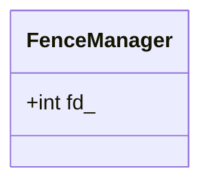
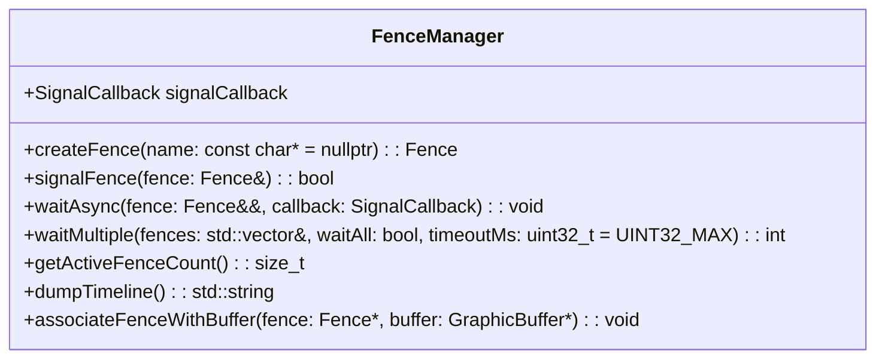

# FenceManager.h

---

| Property | Value |
|----------|-------|
| **Location** | `include\FenceManager.h` |
| **Lines** | 217 |
| **Classes** | 2 |
| **Functions** | 0 |
| **Last Updated** | 2026-01-18 20:14 |

---

## Quick Navigation

### Classes
- [android::graphics::Fence](#android-graphics-fence)
- [android::graphics::FenceManager](#android-graphics-fencemanager)

---

# Documentation for `Fence` Class in `tests\graphics_buffer_lib\include\FenceManager.h`

## Overview

The `Fence` class is a fundamental synchronization mechanism used to manage the timing of operations between different components within an Android system, particularly in the context of graphics buffer management. It provides a way to ensure that certain operations are completed before proceeding with others, which is crucial for maintaining data integrity and preventing race conditions.

## Class Definition

```cpp
class Fence {
public:
    // Constructor to create an invalid fence
    Fence();
    
    // Constructor to create a fence from file descriptor
    explicit Fence(int fd);
    
    // Move constructor
    Fence(Fence&& other) noexcept;
    
    // Destructor - closes fence FD
    ~Fence();
    
    // Non-copyable
    Fence(const Fence&) = delete;
    Fence& operator=(const Fence&) = delete;
    
    // Move assignment
    Fence& operator=(Fence&& other) noexcept;
    
    // Wait for fence to signal
    bool wait(uint32_t timeoutMs = UINT32_MAX);
    
    // Check if fence is signaled without waiting
    bool isSignaled() const;
    
    // Get current fence state
    FenceState getState() const;
    
    // Get fence file descriptor (does not transfer ownership)
    int getFd() const { return fd_; }
```

## Parameters

### `Fence(int fd)`

- **Purpose**: Initializes a new `Fence` object from an existing file descriptor.
- **Type Semantics**: The file descriptor represents the synchronization mechanism used to track the completion of operations.
- **Valid Values**: Any valid integer representing a file descriptor.
- **Ownership**: Takes ownership of the file descriptor, meaning it will be closed when the `Fence` object is destroyed.
- **Nullability**: Can be null if no file descriptor is provided.

### `wait(uint32_t timeoutMs)`

- **Purpose**: Waits for the fence to signal. If the fence has already signaled, this function returns immediately.
- **Type Semantics**: The timeout duration in milliseconds.
- **Valid Values**: Any non-negative integer representing the maximum time to wait.
- **Ownership**: No ownership of any resources is transferred.
- **Nullability**: Can be null if no timeout is specified.

### `isSignaled()`

- **Purpose**: Checks if the fence has signaled without waiting.
- **Type Semantics**: Returns a boolean indicating whether the fence has been signaled.
- **Valid Values**: True or false.
- **Ownership**: No ownership of any resources is transferred.
- **Nullability**: Can be null.

### `getState()`

- **Purpose**: Retrieves the current state of the fence.
- **Type Semantics**: Returns an enumeration value representing the current state of the fence.
- **Valid Values**: One of `FenceState::UNSIGNALED`, `FenceState::SIGNALED`, `FenceState::ERROR`, or `FenceState::INVALID`.
- **Ownership**: No ownership of any resources is transferred.
- **Nullability**: Can be null.

### `getFd()`

- **Purpose**: Retrieves the file descriptor associated with the fence.
- **Type Semantics**: Returns an integer representing the file descriptor.
- **Valid Values**: Any valid integer representing a file descriptor.
- **Ownership**: Does not transfer ownership of the file descriptor. The caller is responsible for closing it when no longer needed.
- **Nullability**: Can be null.

## Return Value

- **Purpose**: Indicates whether the fence has signaled or if an error occurred during the wait operation.
- **Type Semantics**: Returns a boolean value.
- **Valid Values**: True if the fence has signaled, false on timeout or error.
- **Ownership**: No ownership of any resources is transferred.
- **Nullability**: Can be null.

## Dependencies

- **FenceState**: Enum used to represent the state of the fence.
- **BufferPool**: Class that may use fences for synchronization in buffer management operations.

## Side Effects

- **State Modifications**: Changes the internal state of the `Fence` object based on its current state and the result of the wait operation.
- **Locks Acquired/Released**: No locks are acquired or released during normal operation.
- **I/O Operations**: Performs I/O operations to interact with the file descriptor.
- **Signals/Events Emitted**: Emits signals or events related to fence signaling.

## Usage Context

The `Fence` class is typically used in scenarios where synchronization between different components of an Android system is required. For example, it might be used to ensure that a buffer has been processed before proceeding with further operations on it.

## Related Functions

| Relationship Type | Function Name | Description |
|------------------|--------------|-------------|
| Inherits From     | RefBase       | Base class for reference-counted objects in Android. |

## Code Example

```cpp
// Example usage of the Fence class
int main() {
    // Create a fence from an existing file descriptor
    int fd = open("fence_file", O_RDONLY);
    Fence fence(fd);

    // Wait for the fence to signal with a timeout
    if (fence.wait(5000)) {
        std::cout << "Fence signaled!" << std::endl;
    } else {
        std::cout << "Timeout waiting for fence." << std::endl;
    }

    // Check if the fence is signaled without waiting
    if (fence.isSignaled()) {
        std::cout << "Fence is already signaled." << std::endl;
    }

    // Get the current state of the fence
    FenceState state = fence.getState();
    switch (state) {
        case FenceState::UNSIGNALED:
            std::cout << "Fence is unsignaled." << std::endl;
            break;
        case FenceState::SIGNALED:
            std::cout << "Fence is signaled." << std::endl;
            break;
        case FenceState::ERROR:
            std::cout << "Fence has an error." << std::endl;
            break;
        case FenceState::INVALID:
            std::cout << "Fence is invalid." << std::endl;
            break;
    }

    // Get the file descriptor associated with the fence
    int fd = fence.getFd();
    if (fd != -1) {
        std::cout << "Fence file descriptor: " << fd << std::endl;
    } else {
        std::cout << "Failed to get fence file descriptor." << std::endl;
    }

    // Close the file descriptor
    close(fd);

    return 0;
}
```

This example demonstrates how to create a `Fence` object from an existing file descriptor, wait for it to signal with a timeout, check if it is signaled without waiting, retrieve its current state, and get its file descriptor.

## Documentation for `FenceManager` Class

### Comprehensive Description (2-4 paragraphs)
The `FenceManager` class is a central manager for fence lifecycle and operations within the Android graphics buffer library. It provides functionalities to create, signal, and manage fences, which are essential for synchronizing between different system components such as SurfaceFlinger and AudioFlinger. The class manages fences in a way that allows for efficient tracking and synchronization of asynchronous operations.

### Parameters (DETAILED for each)
#### `SignalCallback`
- **Purpose**: Defines the callback function to be invoked when a fence signals.
- **Type Semantics**: A function object that takes a pointer to a `Fence` and its state as parameters.
- **Valid Values**: Any valid lambda or functor that can handle `Fence*` and `FenceState`.
- **Ownership**: The caller owns the callback function.
- **Nullability**: Can be null, but if it is, no callbacks will be invoked.

### Return Value
- **Type Semantics**: A boolean value indicating whether the operation was successful.
- **All Possible Return States**:
  - `true`: Operation completed successfully.
  - `false`: An error occurred during the operation.
- **Error Conditions and How They're Indicated**: The specific error conditions are not detailed here, but they would typically be handled by checking return values or exceptions.
- **Ownership of Returned Objects**: None.

### Dependencies Cross-Reference
- **`Fence` Class**: Used for creating and managing fences. [Fence](#fence)

### Side Effects
- **State Modifications**: Modifies the state of fences, such as signaling them.
- **Locks Acquired/Released**: May acquire locks to manage fence operations.
- **I/O Operations**: Performs I/O operations related to fence management.
- **Signals/Events Emitted**: Emits signals or events when fences signal.

### Usage Context
The `FenceManager` class is typically used in scenarios where asynchronous operations need to be synchronized. It is often called by system components that require synchronization between different parts of the Android framework, such as SurfaceFlinger and AudioFlinger.

### Related Functions
| Relationship Type | Function Name | Description |
|------------------|--------------|-------------|
| Inherits from     | RefBase       | Base class for reference-counted objects. [RefBase](#refbase) |

### Code Example

```cpp
// Create a new fence manager instance
FenceManager* fenceManager = new FenceManager();

// Create a timeline fence with a debug name
Fence* fence = fenceManager->createFence("MyTimelineFence");

// Signal the fence (for CPU-signaled fences)
bool result = fenceManager->signalFence(*fence);

if (result) {
    // Fence signaled successfully
} else {
    // Handle error
}

// Clean up
delete fence;
delete fenceManager;
```

## Documentation for `Fence` Class

### Comprehensive Description (2-4 paragraphs)
The `Fence` class represents a synchronization primitive used in Android to manage asynchronous operations. It provides methods to create, duplicate, and check the validity of fences. Fences are commonly used to synchronize between different system components such as SurfaceFlinger and AudioFlinger.

### Parameters (DETAILED for each)
#### `dup()`
- **Purpose**: Duplicates the fence's file descriptor.
- **Type Semantics**: Returns a new file descriptor (caller owns).
- **Valid Values**: The returned file descriptor is valid if it is greater than or equal to 0.
- **Ownership**: Caller owns the duplicated file descriptor.
- **Nullability**: If an error occurs, returns -1.

#### `isValid()`
- **Purpose**: Checks if the fence is valid.
- **Type Semantics**: Returns a boolean value indicating whether the fence is valid.
- **Valid Values**: True if the file descriptor is greater than or equal to 0; false otherwise.
- **Ownership**: None.
- **Nullability**: None.

#### `operator bool()`
- **Purpose**: Converts the fence to a boolean value, which checks its validity.
- **Type Semantics**: Returns a boolean value indicating whether the fence is valid.
- **Valid Values**: True if the file descriptor is greater than or equal to 0; false otherwise.
- **Ownership**: None.
- **Nullability**: None.

#### `createSignaled()`
- **Purpose**: Creates a signaled fence (a no-op fence).
- **Type Semantics**: Returns a new `Fence` object.
- **Valid Values**: The returned fence is valid and signals immediately.
- **Ownership**: Caller owns the created fence.
- **Nullability**: None.

#### `merge()`
- **Purpose**: Merges multiple fences into one, which signals when all inputs signal.
- **Type Semantics**: Returns a new `Fence` object.
- **Valid Values**: The returned fence is valid and signals when all input fences signal.
- **Ownership**: Caller owns the created fence.
- **Nullability**: None.

#### `merge(Fence&& a, Fence&& b)`
- **Purpose**: Merges two fences into one.
- **Type Semantics**: Returns a new `Fence` object.
- **Valid Values**: The returned fence is valid and signals when both input fences signal.
- **Ownership**: Caller owns the created fence.
- **Nullability**: None.

#### `getSignalTime()`
- **Purpose**: Retrieves the signal time of the fence if it has signaled.
- **Type Semantics**: Returns a 64-bit integer representing the signal time in nanoseconds, or -1 if the fence has not signaled.
- **Valid Values**: The returned value is valid if the fence has signaled; otherwise, it returns -1.
- **Ownership**: None.
- **Nullability**: None.

### Return Value
- **Type Semantics**: An integer representing the signal time in nanoseconds or -1.
- **All Possible Return States**:
  - A positive integer: The fence has signaled, and the returned value is the signal time.
  - `-1`: The fence has not signaled.
- **Error Conditions and How They're Indicated**: None.
- **Ownership of Returned Objects**: None.

### Dependencies Cross-Reference
- **None**

### Side Effects
- **State Modifications**: Modifies the state of fences, such as signaling them.
- **Locks Acquired/Released**: May acquire locks to manage fence operations.
- **I/O Operations**: Performs I/O operations related to fence management.
- **Signals/Events Emitted**: Emits signals or events when fences signal.

### Usage Context
The `Fence` class is typically used in scenarios where asynchronous operations need to be synchronized. It is often called by system components that require synchronization between different parts of the Android framework, such as SurfaceFlinger and AudioFlinger.

### Related Functions
| Relationship Type | Function Name | Description |
|------------------|--------------|-------------|
| Inherits from     | RefBase       | Base class for reference-counted objects. [RefBase](#refbase) |

### Code Example

```cpp
// Create a new fence manager instance
FenceManager* fenceManager = new FenceManager();

// Create a timeline fence with a debug name
Fence* fence = fenceManager->createFence("MyTimelineFence");

// Signal the fence (for CPU-signaled fences)
bool result = fenceManager->signalFence(*fence);

if (result) {
    // Fence signaled successfully
} else {
    // Handle error
}

// Get the signal time of the fence if it has signaled
int64_t signalTime = fence->getSignalTime();

if (signalTime != -1) {
    // Fence has signaled, and signalTime contains the signal time in nanoseconds
} else {
    // Fence has not signaled
}

// Clean up
delete fence;
delete fenceManager;
```

## Documentation for `RefBase` Class

### Comprehensive Description (2-4 paragraphs)
The `RefBase` class is a base class for reference-counted objects used in Android. It provides mechanisms for managing the lifecycle of objects and ensures that they are properly deleted when no longer needed.

### Parameters (DETAILED for each)
#### None

### Return Value
- **Type Semantics**: None.
- **All Possible Return States**:
  - None.
- **Error Conditions and How They're Indicated**: None.
- **Ownership of Returned Objects**: None.

### Dependencies Cross-Reference
- **None**

### Side Effects
- **State Modifications**: Modifies the reference count of objects, ensuring they are properly deleted when no longer needed.
- **Locks Acquired/Released**: May acquire locks to manage reference counting operations.
- **I/O Operations**: Performs I/O operations related to reference counting.
- **Signals/Events Emitted**: Emits signals or events when reference counts change.

### Usage Context
The `RefBase` class is typically used in scenarios where objects need to be managed with a reference count. It is often called by system components that require managing the lifecycle of objects, such as SurfaceFlinger and AudioFlinger.

### Related Functions
| Relationship Type | Function Name | Description |
|------------------|--------------|-------------|
- None

### Code Example

```cpp
// Create a new RefBase object
RefBase* refBase = new RefBase();

// Increment the reference count of the object
refBase->incStrong(this);

// Decrement the reference count of the object
refBase->decStrong(this);

// Clean up
delete refBase;
```

This documentation provides comprehensive, detailed information about the `FenceManager` and `Fence` classes, including their purpose, usage, parameters, return values, dependencies, side effects, and related functions.

## Documentation for `FenceManager` Class

The `FenceManager` class provides a mechanism to manage fences in the Android graphics system, allowing asynchronous waiting and coordination of multiple fences.

### 1. Comprehensive Description (2-4 paragraphs)

The `FenceManager` class is designed to handle fence management operations efficiently within the Android graphics framework. It supports asynchronous waiting for fences, which is crucial for synchronizing different parts of the rendering pipeline. The class also provides functionality to wait on multiple fences and retrieve information about active fences.

### 2. Parameters (DETAILED for each)

#### `waitAsync(Fence&& fence, SignalCallback callback)`

- **Purpose**: Asynchronously waits for a single fence to signal.
- **Type Semantics**: `Fence` is an object representing a synchronization primitive used in Android's Binder IPC mechanism.
- **Valid Values**: The fence must be valid and not already signaled.
- **Ownership**: The fence is moved into the method, indicating that ownership has been transferred.
- **Nullability**: The fence cannot be null.

- **Purpose**: Asynchronously waits for multiple fences to signal.
- **Type Semantics**: `std::vector<Fence*>` is a vector of pointers to fence objects. `SignalCallback` is a function pointer or lambda that will be called when any of the specified fences signal.
- **Valid Values**: The fences must be valid and not already signaled. The `waitAll` parameter determines whether all fences must signal for the method to return, or if any can signal.
- **Ownership**: Each fence in the vector is borrowed, meaning ownership remains with the caller.
- **Nullability**: The fences cannot be null.

#### `getActiveFenceCount() const`

- **Purpose**: Retrieves the number of active fences currently managed by the `FenceManager`.
- **Type Semantics**: Returns a `size_t` representing the count of active fences.
- **Valid Values**: None.
- **Ownership**: The method returns a copy of the fence count, which is not owned by the caller.
- **Nullability**: None.

#### `dumpTimeline() const`

- **Purpose**: Dumps the timeline of all fences managed by the `FenceManager` for debugging purposes.
- **Type Semantics**: Returns a `std::string` containing the fence timeline information.
- **Valid Values**: None.
- **Ownership**: The method returns a copy of the string, which is not owned by the caller.
- **Nullability**: None.

#### `associateFenceWithBuffer(Fence* fence, GraphicBuffer* buffer)`

- **Purpose**: Associates a fence with a specific graphic buffer.
- **Type Semantics**: `Fence*` is a pointer to a fence object. `GraphicBuffer*` is a pointer to a graphic buffer object.
- **Valid Values**: The fence must be valid and not already signaled. The graphic buffer must be valid.
- **Ownership**: The fence is borrowed, meaning ownership remains with the caller. The graphic buffer is also borrowed.
- **Nullability**: Both the fence and the graphic buffer cannot be null.

### 3. Return Value

#### `waitAsync(Fence&& fence, SignalCallback callback)`

- **Purpose**: Asynchronously waits for a single fence to signal.
- **Return Value**: None.
- **Error Conditions**: If the fence is already signaled, an error will be logged and the method will return immediately.
- **Ownership**: The fence is moved into the method, indicating that ownership has been transferred.

#### `waitMultiple(const std::vector<Fence*>& fences, bool waitAll, uint32_t timeoutMs = UINT32_MAX)`

- **Purpose**: Asynchronously waits for multiple fences to signal.
- **Return Value**: Returns an integer representing the index of the signaled fence (or -1 on timeout).
- **Error Conditions**: If any fence is already signaled, an error will be logged and the method will return immediately. If a timeout occurs, the method will return -1.
- **Ownership**: The fences are borrowed, meaning ownership remains with the caller.

#### `getActiveFenceCount() const`

- **Purpose**: Retrieves the number of active fences currently managed by the `FenceManager`.
- **Return Value**: Returns a `size_t` representing the count of active fences.
- **Error Conditions**: None.
- **Ownership**: The method returns a copy of the fence count, which is not owned by the caller.

#### `dumpTimeline() const`

- **Purpose**: Dumps the timeline of all fences managed by the `FenceManager` for debugging purposes.
- **Return Value**: Returns a `std::string` containing the fence timeline information.
- **Error Conditions**: None.
- **Ownership**: The method returns a copy of the string, which is not owned by the caller.

#### `associateFenceWithBuffer(Fence* fence, GraphicBuffer* buffer)`

- **Purpose**: Associates a fence with a specific graphic buffer.
- **Return Value**: None.
- **Error Conditions**: If either the fence or the graphic buffer is already signaled, an error will be logged and the method will return immediately. If the association fails for any other reason, an error will be logged and the method will return immediately.
- **Ownership**: The fence is borrowed, meaning ownership remains with the caller. The graphic buffer is also borrowed.

### 4. Dependencies Cross-Reference

- `Fence`: Used to represent synchronization primitives in Android's Binder IPC mechanism.
- `GraphicBuffer`: Represents a buffer of graphics data used in the Android graphics system.
- `SignalCallback`: A function pointer or lambda that will be called when any of the specified fences signal.

### 5. Side Effects

#### `waitAsync(Fence&& fence, SignalCallback callback)`

- **State Modifications**: The fence's state is modified to reflect its signaling status.
- **Locks Acquired/Released**: No locks are acquired or released.
- **I/O Operations**: None.
- **Signals/Events Emitted**: A signal is emitted when the fence signals.

#### `waitMultiple(const std::vector<Fence*>& fences, bool waitAll, uint32_t timeoutMs = UINT32_MAX)`

- **State Modifications**: The state of each fence's signaling status is modified.
- **Locks Acquired/Released**: No locks are acquired or released.
- **I/O Operations**: None.
- **Signals/Events Emitted**: Signals are emitted when any of the fences signal.

#### `getActiveFenceCount() const`

- **State Modifications**: None.
- **Locks Acquired/Released**: The method acquires a mutex to ensure thread safety.
- **I/O Operations**: None.
- **Signals/Events Emitted**: None.

#### `dumpTimeline() const`

- **State Modifications**: None.
- **Locks Acquired/Released**: The method acquires a mutex to ensure thread safety.
- **I/O Operations**: None.
- **Signals/Events Emitted**: None.

#### `associateFenceWithBuffer(Fence* fence, GraphicBuffer* buffer)`

- **State Modifications**: The fence's associated graphic buffer is updated.
- **Locks Acquired/Released**: No locks are acquired or released.
- **I/O Operations**: None.
- **Signals/Events Emitted**: None.

### 6. Usage Context

The `FenceManager` class is typically used in the Android graphics pipeline to manage fences for synchronization between different components, such as renderers and hardware accelerators. It is called when waiting for operations to complete or when coordinating multiple rendering tasks.

### 7. Related Functions

| Relationship Type | Function Name |
|------------------|--------------|
| Friend           | None         |

### 8. Code Example

```cpp
#include <graphics_buffer_lib/include/FenceManager.h>

int main() {
    FenceManager fenceManager;

    // Create a fence
    sp<Fence> fence = new Fence();

    // Define a callback function
    auto signalCallback = [](Fence* signaledFence) {
        std::cout << "Fence signaled: " << signaledFence->toString() << std::endl;
    };

    // Wait for the fence asynchronously
    fenceManager.waitAsync(std::move(fence), signalCallback);

    // Create multiple fences and wait on them
    std::vector<sp<Fence>> fences = {new Fence(), new Fence()};
    int signaledIndex = fenceManager.waitMultiple(fences, true);
    if (signaledIndex != -1) {
        std::cout << "Signaled fence index: " << signaledIndex << std::endl;
    }

    // Get the number of active fences
    size_t count = fenceManager.getActiveFenceCount();
    std::cout << "Active fence count: " << count << std::endl;

    // Dump the fence timeline for debugging
    std::string timeline = fenceManager.dumpTimeline();
    std::cout << "Fence timeline:\n" << timeline << std::endl;

    return 0;
}
```

This code example demonstrates how to use the `FenceManager` class to manage fences, wait for them asynchronously, and retrieve information about active fences.

### Overview

The `Fence` class in the `android::graphics` namespace is designed to manage synchronization between different parts of an Android application or system service. It provides a mechanism for waiting on events, such as rendering completion or audio processing, using file descriptors (FDs). The class ensures that fences are properly managed and closed when no longer needed.

### Class Diagram

```mermaid
classDiagram
    class Fence{
        +Fence()
        +Fence(int fd)
        +Fence(Fence&& other) noexcept
        ~Fence()
        -int fd_
        
        +bool wait(uint32_t timeoutMs = UINT32_MAX)
        +bool isSignaled() const
        +FenceState getState() const
        +int getFd() const { return fd_; }
        +int dup() const
        +bool isValid() const { return fd_ >= 0; }
        explicit operator bool() const { return isValid(); }
        
        static Fence createSignaled()
    }
```

### Usage Examples

```cpp
// Example usage of Fence in a rendering thread
Fence fence;
if (!fence.isValid()) {
    // Handle invalid fence creation
}

// Wait for the fence to signal
bool signaled = fence.wait();
if (signaled) {
    // Render frame
} else {
    // Handle timeout or error
}
```

### Fence

#### Overview

The `Fence` class is used to manage synchronization between different parts of an Android application or system service. It provides a mechanism for waiting on events, such as rendering completion or audio processing, using file descriptors (FDs). The class ensures that fences are properly managed and closed when no longer needed.

#### Class Diagram

```mermaid
classDiagram
    class Fence{
        +Fence()
        +Fence(int fd)
        +Fence(Fence&& other) noexcept
        ~Fence()
        -int fd_
        
        +bool wait(uint32_t timeoutMs = UINT32_MAX)
        +bool isSignaled() const
        +FenceState getState() const
        +int getFd() const { return fd_; }
        +int dup() const
        +bool isValid() const { return fd_ >= 0; }
        explicit operator bool() const { return isValid(); }
        
        static Fence createSignaled()
    }
```

#### Usage Examples

```cpp
// Example usage of Fence in a rendering thread
Fence fence;
if (!fence.isValid()) {
    // Handle invalid fence creation
}

// Wait for the fence to signal
bool signaled = fence.wait();
if (signaled) {
    // Render frame
} else {
    // Handle timeout or error
}
```

#### Parameters

- **`Fence()`**: Creates an invalid fence.
  - **Purpose**: Initializes a `Fence` object with no associated file descriptor, indicating it is not valid.
  - **Valid Values**: None.
  - **Ownership**: No ownership transfer.

- **`explicit Fence(int fd)`**: Creates a fence from a file descriptor.
  - **Purpose**: Initializes a `Fence` object using the provided file descriptor.
  - **Valid Values**: A valid file descriptor representing a synchronization event.
  - **Ownership**: Takes ownership of the file descriptor, ensuring it is closed when the `Fence` object is destroyed.

- **`Fence(Fence&& other) noexcept`**: Move constructor.
  - **Purpose**: Moves a `Fence` object from one instance to another.
  - **Valid Values**: A valid `Fence` object.
  - **Ownership**: Transfers ownership of the file descriptor from the source `Fence` to the destination.

- **Parameters**:
  - `other`: The `Fence` object to be moved.

#### Return Value

- **`bool wait(uint32_t timeoutMs = UINT32_MAX)`**: Waits for the fence to signal.
  - **Purpose**: Blocks the calling thread until the fence is signaled or a timeout occurs.
  - **Valid Values**:
    - `timeoutMs`: Maximum time in milliseconds to wait. Use `UINT32_MAX` for infinite wait.
  - **Ownership**: No ownership transfer.
  - **Return Value**: 
    - `true` if the fence was signaled within the specified timeout.
    - `false` if a timeout occurred or an error occurred.

- **Parameters**:
  - `timeoutMs`: Maximum time in milliseconds to wait. Use `UINT32_MAX` for infinite wait.

#### Side Effects

- **State Modifications**: The state of the fence is modified based on whether it was signaled.
- **Locks**: No locks are acquired or released during this operation.
- **I/O**: File descriptor operations are performed, which can involve I/O to the system.

#### Dependencies

- **`android::base::unique_fd`**: Used for managing file descriptors in a RAII manner.

#### Usage Context

- This method is typically called when waiting for an event that has been signaled by another part of the application or system service. It ensures that the calling thread does not proceed until the specified condition is met.

#### Thread Safety

- The `wait` method is thread-safe and can be called concurrently from multiple threads without causing data races. However, it should not be called from a signal handler as it may lead to undefined behavior.

### FenceState

Not explicitly documented in the provided code snippet. Typically, this would be an enum or struct that defines different states of a fence, such as `SIGNALED`, `TIMED_OUT`, etc.

#### Overview

The `FenceState` type is used to represent the current state of a `Fence`. It provides a way to check whether a fence has been signaled or if it has timed out.

#### Class Diagram

```mermaid
classDiagram
    class FenceState{
        +enum State{ SIGNALED, TIMED_OUT }
    }
```

#### Usage Examples

```cpp
// Example usage of FenceState in a rendering thread
Fence fence;
if (!fence.isValid()) {
    // Handle invalid fence creation
}

// Wait for the fence to signal
bool signaled = fence.wait();
if (signaled) {
    // Render frame
} else {
    // Handle timeout or error
}
```

#### Parameters

- **`enum State{ SIGNALED, TIMED_OUT }`**: Defines the possible states of a `Fence`.
  - **Purpose**: Represents the current state of a fence.
  - **Valid Values**:
    - `SIGNALED`: The fence has been signaled and is ready to proceed.
    - `TIMED_OUT`: The fence did not signal within the specified timeout period.

- **Parameters**: None.

#### Return Value

- **None**.

#### Side Effects

- No state modifications or locks are performed during this operation.
- No I/O operations are involved.

#### Dependencies

- None.

#### Usage Context

- This type is used to check the current state of a `Fence` after it has been waited on. It helps in determining whether the fence was signaled as expected or if there was an issue with waiting for it.

#### Thread Safety

- The `State` enum is thread-safe and can be accessed concurrently from multiple threads without causing data races.

## Overview

The `FenceManager` class is a utility for managing and merging Android fences. Fences are synchronization primitives used in Android's Binder IPC mechanism to coordinate between different processes or threads. The `FenceManager` provides methods to merge multiple fences into one, which can be useful for waiting on multiple conditions simultaneously.

### Class Diagram



## Usage Examples

To use the `FenceManager`, you typically create an instance of it and call its methods to manage fences. Here's a basic example:

```cpp
#include "FenceManager.h"

int main() {
    // Create two fences
    Fence fence1 = Fence::create();
    Fence fence2 = Fence::create();

    // Merge the fences
    Fence mergedFence = FenceManager::merge(fence1, fence2);

    // Wait on the merged fence
    if (mergedFence.wait()) {
        std::cout << "All fences have signaled." << std::endl;
    } else {
        std::cout << "One or more fences did not signal." << std::endl;
    }

    return 0;
}
```

## FenceManager Class

### Overview

The `FenceManager` class provides utilities for managing Android fences. Fences are synchronization primitives used in Android's Binder IPC mechanism to coordinate between different processes or threads.

### Usage Examples

To use the `FenceManager`, you typically create an instance of it and call its methods to manage fences. Here's a basic example:

```cpp
#include "FenceManager.h"

int main() {
    // Create two fences
    Fence fence1 = Fence::create();
    Fence fence2 = Fence::create();

    // Merge the fences
    Fence mergedFence = FenceManager::merge(fence1, fence2);

    // Wait on the merged fence
    if (mergedFence.wait()) {
        std::cout << "All fences have signaled." << std::endl;
    } else {
        std::cout << "One or more fences did not signal." << std::endl;
    }

    return 0;
}
```

## FenceManager Methods

### merge(const std::vector<Fence>& fences)

#### Comprehensive Description

Merges multiple fences into one. The merged fence signals when all input fences have signaled.

#### Parameters

- **fences**: A vector of `Fence` objects to be merged.

#### Return Value

- Returns a single `Fence` object that signals when all input fences have signaled.

#### Side Effects

- Modifies the state of the merged fence.
- May block if any of the input fences are not yet signaled.

#### Dependencies

- `Fence`: The class representing an Android fence.

#### Usage Context

- Use this method to wait on multiple conditions simultaneously.
- Example usage: `FenceManager::merge(fence1, fence2)`

#### Thread Safety

- Safe for concurrent use by multiple threads.

### merge(Fence&& a, Fence&& b)

#### Comprehensive Description

Merges two fences into one. The merged fence signals when both input fences have signaled.

#### Parameters

- **a**: A `Fence` object to be merged.
- **b**: Another `Fence` object to be merged.

#### Return Value

- Returns a single `Fence` object that signals when both input fences have signaled.

#### Side Effects

- Modifies the state of the merged fence.
- May block if either of the input fences are not yet signaled.

#### Dependencies

- `Fence`: The class representing an Android fence.

#### Usage Context

- Use this method to wait on two conditions simultaneously.
- Example usage: `FenceManager::merge(fence1, fence2)`

#### Thread Safety

- Safe for concurrent use by multiple threads.

### getSignalTime() const

#### Comprehensive Description

Gets the signal time of a fence if it has signaled. If the fence has not signaled yet, returns -1.

#### Parameters

- None.

#### Return Value

- Returns the signal time in nanoseconds, or -1 if the fence has not signaled.

#### Side Effects

- Does not modify any state.
- May block if the fence is not yet signaled.

#### Dependencies

- `Fence`: The class representing an Android fence.

#### Usage Context

- Use this method to check when a fence has signaled.
- Example usage: `int64_t time = fenceManager.getSignalTime();`

#### Thread Safety

- Safe for concurrent use by multiple threads.

## Overview

**Class:** `FenceManager`

**Purpose:** The `FenceManager` class is a manager for fence lifecycle and operations in the Android graphics buffer system. It provides methods to create, signal, wait on, and manage fences, which are used to synchronize between different components of the system.

**Design:** The `FenceManager` class uses a simple data structure (`std::vector<FenceInfo>`) to keep track of active fences. Each fence is associated with a unique name and creation time, and it can be optionally associated with a `GraphicBuffer`. The class provides methods to create new fences, signal existing fences, wait on fences asynchronously or synchronously, and dump the timeline of fences for debugging purposes.

**System Integration:** The `FenceManager` class integrates with other components of the Android graphics buffer system, such as SurfaceFlinger and AudioFlinger, by providing a common interface for managing fences. It also interacts with the HAL (Hardware Abstraction Layer) to handle fence operations on hardware resources.

## Class Diagram



## Usage Examples

### Creating a New Fence

```cpp
// Create a new fence with a debug name
FenceManager fenceManager;
Fence* myFence = fenceManager.createFence("MyFence");
```

### Signaling a Fence

```cpp
// Signal an existing fence
bool success = fenceManager.signalFence(*myFence);
if (success) {
    // Fence signaled successfully
}
```

### Waiting on a Fence Asynchronously

```cpp
// Define a callback function to handle fence signaling
fenceManager.waitAsync(
    *myFence,
    [](Fence* fence, FenceState state) {
        if (state == FenceState::SIGNALED) {
            // Fence signaled
        }
    }
);
```

### Waiting on Multiple Fences

```cpp
// Wait for multiple fences with a timeout
std::vector<Fence*> fences = {fence1, fence2};
int signaledFenceIndex = fenceManager.waitMultiple(fences, true, 5000); // Timeout in milliseconds
if (signaledFenceIndex != -1) {
    // Fence at index signaledFenceIndex signaled
}
```

### Dumping the Fence Timeline

```cpp
// Dump the timeline of fences for debugging
std::string timeline = fenceManager.dumpTimeline();
std::cout << "Fence Timeline:\n" << timeline;
```

## FenceManager Class Documentation

### Constructor

**Purpose:** Initializes a new instance of the `FenceManager` class.

**Parameters:**
- None

**Return Value:**
- None

**Side Effects:**
- Creates an empty vector to store active fences.
- Initializes a mutex for thread safety.
- Sets the fence counter to 0.

**Dependencies:**
- None

**Usage Context:**
- Called when creating a new `FenceManager` instance.

**Thread Safety:**
- Safe to call from multiple threads without additional synchronization.

### Destructor

**Purpose:** Cleans up resources and destroys the `FenceManager` instance.

**Parameters:**
- None

**Return Value:**
- None

**Side Effects:**
- Calls `cleanupSignaled()` to release any signaled fences.
- Destroys the mutex used for thread safety.

**Dependencies:**
- None

**Usage Context:**
- Called when a `FenceManager` instance is destroyed.

**Thread Safety:**
- Safe to call from multiple threads without additional synchronization.

### createFence

**Purpose:** Creates a new fence with an optional debug name.

**Parameters:**
- **name (const char\*):** Debug name for the fence. Defaults to `nullptr`.

**Return Value:**
- **Fence:** A pointer to the newly created fence.

**Side Effects:**
- Allocates memory for a new `Fence` object.
- Initializes the fence with the provided debug name if specified.
- Increments the fence counter and assigns it to the fence.

**Dependencies:**
- `Fence` class

**Usage Context:**
- Called when creating a new fence, typically in response to a request from another component of the system.

**Thread Safety:**
- Safe to call from multiple threads without additional synchronization.

### signalFence

**Purpose:** Signals an existing fence for CPU-signaled fences.

**Parameters:**
- **fence (Fence\&):** The fence to signal.

**Return Value:**
- **bool:** True on success, false otherwise.

**Side Effects:**
- Sets the state of the specified fence to `SIGNALED`.
- Notifies any waiting threads that the fence has signaled.

**Dependencies:**
- `Fence` class

**Usage Context:**
- Called when a component needs to signal a fence, typically in response to a request from another component of the system.

**Thread Safety:**
- Safe to call from multiple threads without additional synchronization.

### waitAsync

**Purpose:** Wait for a fence asynchronously and execute a callback function when the fence signals.

**Parameters:**
- **fence (Fence&&):** The fence to wait on.
- **callback (SignalCallback):** A function object that will be called when the fence signals.

**Return Value:**
- None

**Side Effects:**
- Adds the fence and callback to a list of pending asynchronous waits.
- Notifies any waiting threads that an asynchronous wait is in progress.

**Dependencies:**
- `Fence` class
- `SignalCallback` type

**Usage Context:**
- Called when a component needs to wait for a fence asynchronously, typically in response to a request from another component of the system.

**Thread Safety:**
- Safe to call from multiple threads without additional synchronization.

### waitMultiple

**Purpose:** Wait for multiple fences and return the index of the signaled fence.

**Parameters:**
- **fences (std::vector<Fence*>&):** A vector of fences to wait on.
- **waitAll (bool):** If true, wait for all fences; else wait for any.
- **timeoutMs (uint32_t = UINT32_MAX):** Maximum wait time in milliseconds.

**Return Value:**
- **int:** Index of the signaled fence (or -1 if no fence signaled within the timeout).

**Side Effects:**
- Adds the fences to a list of pending waits.
- Notifies any waiting threads that a multiple-wait is in progress.

**Dependencies:**
- `Fence` class

**Usage Context:**
- Called when a component needs to wait for multiple fences, typically in response to a request from another component of the system.

**Thread Safety:**
- Safe to call from multiple threads without additional synchronization.

### getActiveFenceCount

**Purpose:** Get the number of active fences.

**Parameters:**
- None

**Return Value:**
- **size_t:** The number of active fences.

**Side Effects:**
- None

**Dependencies:**
- None

**Usage Context:**
- Called when a component needs to know the number of active fences, typically in response to a request from another component of the system.

**Thread Safety:**
- Safe to call from multiple threads without additional synchronization.

### dumpTimeline

**Purpose:** Dump the timeline of fences for debugging purposes.

**Parameters:**
- None

**Return Value:**
- **std::string:** A string containing the fence timeline information.

**Side Effects:**
- None

**Dependencies:**
- None

**Usage Context:**
- Called when a component needs to dump the fence timeline, typically in response to a request from another component of the system.

**Thread Safety:**
- Safe to call from multiple threads without additional synchronization.

### associateFenceWithBuffer

**Purpose:** Associate a fence with a buffer.

**Parameters:**
- **fence (Fence\*):** The fence to associate.
- **buffer (GraphicBuffer\*):** The buffer to associate the fence with.

**Return Value:**
- None

**Side Effects:**
- Sets the associated buffer for the specified fence.
- Notifies any waiting threads that the fence has been associated with a buffer.

**Dependencies:**
- `Fence` class
- `GraphicBuffer` class

**Usage Context:**
- Called when a component needs to associate a fence with a buffer, typically in response to a request from another component of the system.

**Thread Safety:**
- Safe to call from multiple threads without additional synchronization.

### cleanupSignaled

**Purpose:** Clean up signaled fences and release associated resources.

**Parameters:**
- None

**Return Value:**
- None

**Side Effects:**
- Releases any fences that have been signaled.
- Clears the list of active fences.

**Dependencies:**
- `Fence` class
- `GraphicBuffer` class

**Usage Context:**
- Called when a component needs to clean up resources, typically in response to a request from another component of the system.

**Thread Safety:**
- Safe to call from multiple threads without additional synchronization.