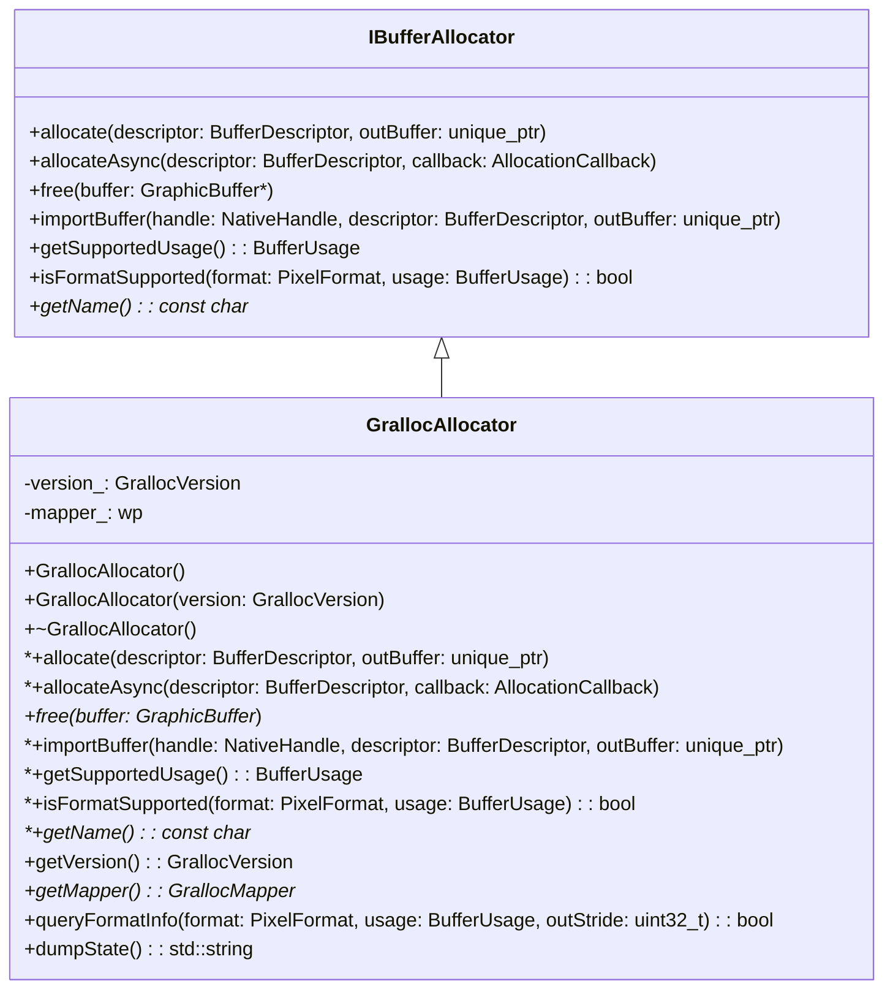
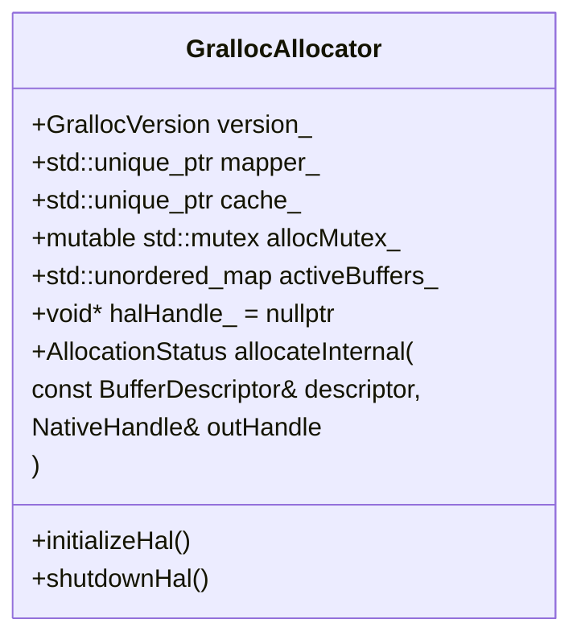
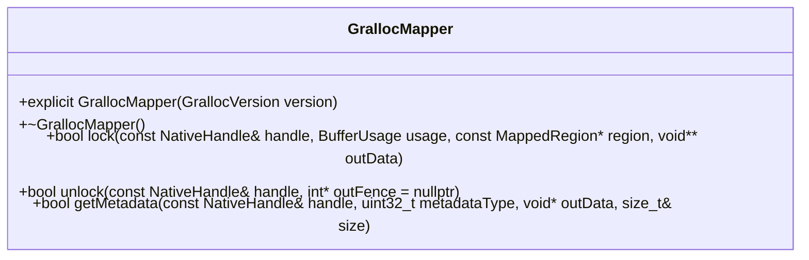

# GrallocAllocator.h

---

| Property | Value |
|----------|-------|
| **Location** | `include\GrallocAllocator.h` |
| **Lines** | 194 |
| **Classes** | 2 |
| **Functions** | 0 |
| **Last Updated** | 2026-01-18 20:19 |

---

## Quick Navigation

### Classes
- [android::graphics::GrallocAllocator](#android-graphics-grallocallocator)
- [android::graphics::GrallocMapper](#android-graphics-grallocmapper)

---

## Documentation for `GrallocAllocator` Class

### 1. Comprehensive Description (2-4 paragraphs)

The `GrallocAllocator` class is a high-level allocator that leverages the Android Hardware Interface Layer (HAL) to manage graphics buffers efficiently. It provides automatic HAL version detection, buffer handle caching for performance, and asynchronous allocation support via a thread pool. The allocator supports format negotiation with gralloc and ensures thread safety across all public methods.

### 2. Parameters (DETAILED for each)

#### `GrallocAllocator()`
- **Purpose**: Initializes the allocator with automatic HAL version detection.
- **Type Semantics**: No specific type, initializes the allocator based on system configuration.
- **Valid Values**: None.
- **Ownership**: None.
- **Nullability**: Not applicable.

#### `explicit GrallocAllocator(GrallocVersion version)`
- **Purpose**: Initializes the allocator targeting a specific HAL version.
- **Type Semantics**: Takes an enum value representing the desired gralloc version.
- **Valid Values**: Must be one of the values defined in `GrallocVersion`.
- **Ownership**: None.
- **Nullability**: Not applicable.

#### Destructor (`~GrallocAllocator()`)
- **Purpose**: Cleans up resources and releases any allocated memory.
- **Type Semantics**: No specific type, performs cleanup operations.
- **Valid Values**: None.
- **Ownership**: None.
- **Nullability**: Not applicable.

### 3. Return Value

#### `AllocationStatus allocate(const BufferDescriptor& descriptor, std::unique_ptr<GraphicBuffer>& outBuffer)`
- **Purpose**: Allocates a buffer based on the provided `BufferDescriptor`.
- **Type Semantics**: Returns an enum value indicating the status of the allocation.
- **Valid Values**:
  - `ALLOCATION_SUCCESS`: The buffer was successfully allocated and returned in `outBuffer`.
  - `ALLOCATION_ERROR`: An error occurred during allocation, such as insufficient memory or unsupported format.
- **Ownership**: If successful, ownership of `outBuffer` is transferred to the caller. If an error occurs, `outBuffer` remains null.
- **Nullability**: `outBuffer` can be null if an error occurs.

#### `void allocateAsync(const BufferDescriptor& descriptor, AllocationCallback callback)`
- **Purpose**: Allocates a buffer asynchronously using a thread pool.
- **Type Semantics**: Takes a `BufferDescriptor` and a callback function to handle the allocation result.
- **Valid Values**: None.
- **Ownership**: No specific ownership requirements for `descriptor` or `callback`.
- **Nullability**: Both parameters can be null.

#### `void free(GraphicBuffer* buffer)`
- **Purpose**: Frees a previously allocated buffer.
- **Type Semantics**: Takes a pointer to the `GraphicBuffer` to be freed.
- **Valid Values**: The buffer must have been allocated by this allocator.
- **Ownership**: Ownership of the buffer is transferred to the caller after freeing.
- **Nullability**: Not applicable.

#### `AllocationStatus importBuffer(const NativeHandle& handle, const BufferDescriptor& descriptor, std::unique_ptr<GraphicBuffer>& outBuffer)`
- **Purpose**: Imports a buffer from a native handle into the allocator.
- **Type Semantics**: Returns an enum value indicating the status of the import operation.
- **Valid Values**:
  - `ALLOCATION_SUCCESS`: The buffer was successfully imported and returned in `outBuffer`.
  - `ALLOCATION_ERROR`: An error occurred during import, such as invalid handle or unsupported format.
- **Ownership**: If successful, ownership of `outBuffer` is transferred to the caller. If an error occurs, `outBuffer` remains null.
- **Nullability**: `outBuffer` can be null if an error occurs.

#### `BufferUsage getSupportedUsage() const`
- **Purpose**: Retrieves the supported buffer usages for this allocator.
- **Type Semantics**: Returns a bitmask of supported buffer usages.
- **Valid Values**: A combination of values from the `BufferUsage` enum.
- **Ownership**: None.
- **Nullability**: Not applicable.

#### `bool isFormatSupported(PixelFormat format, BufferUsage usage) const`
- **Purpose**: Checks if a specific pixel format and usage are supported by this allocator.
- **Type Semantics**: Takes a `PixelFormat` and a `BufferUsage`.
- **Valid Values**:
  - `format`: A valid pixel format from the `PixelFormat` enum.
  - `usage`: A combination of values from the `BufferUsage` enum.
- **Ownership**: None.
- **Nullability**: Not applicable.

#### `const char* getName() const`
- **Purpose**: Returns the name of the allocator.
- **Type Semantics**: Returns a constant character string.
- **Valid Values**: The string "GrallocAllocator".
- **Ownership**: None.
- **Nullability**: Not applicable.

### 4. Dependencies Cross-Reference

- `BufferDescriptor`: Represents the buffer descriptor used for allocation and import operations.
- `GraphicBuffer`: Represents the allocated or imported graphics buffer.
- `NativeHandle`: Represents a native handle to a buffer.
- `AllocationStatus`: Enum representing the status of an allocation operation.
- `BufferUsage`: Enum representing supported buffer usages.
- `PixelFormat`: Enum representing supported pixel formats.
- `GrallocVersion`: Enum representing different gralloc HAL versions.
- `IBufferAllocator`: Interface for buffer allocation operations.

### 5. Side Effects

- **State Modifications**: Modifies the internal state of the allocator, including caching and thread pool management.
- **Locks Acquired/Released**: Uses fine-grained locking to ensure thread safety across public methods.
- **I/O Operations**: Performs I/O operations with the HAL for buffer allocation and import.
- **Signals/Events Emitted**: Emits signals or events related to allocation status.

### 6. Usage Context

The `GrallocAllocator` class is typically used in applications that require efficient management of graphics buffers, such as video rendering engines or game development frameworks. It is commonly instantiated and used by other components within the Android system, such as SurfaceFlinger or AudioFlinger.

### 7. Related Functions

| Relationship Type | Function Name | Description |
|------------------|--------------|-------------|
| Implementation    | `allocate`     | Allocates a buffer synchronously. |
| Implementation    | `allocateAsync`  | Allocates a buffer asynchronously using a thread pool. |
| Implementation    | `free`         | Frees an allocated buffer. |
| Implementation    | `importBuffer`   | Imports a buffer from a native handle. |
| Implementation    | `getSupportedUsage` | Retrieves supported buffer usages. |
| Implementation    | `isFormatSupported` | Checks if a format and usage are supported. |

### 8. Code Example

```cpp
#include <GrallocAllocator.h>

int main() {
    GrallocAllocator allocator;
    
    BufferDescriptor descriptor;
    // Set up the buffer descriptor with desired properties
    
    std::unique_ptr<GraphicBuffer> buffer;
    AllocationStatus status = allocator.allocate(descriptor, buffer);
    
    if (status == ALLOCATION_SUCCESS) {
        // Use the allocated buffer
    } else {
        // Handle allocation error
    }
    
    return 0;
}
```

This example demonstrates how to create an instance of `GrallocAllocator`, set up a `BufferDescriptor`, and allocate a buffer using the allocator. The code checks the allocation status and handles any errors that may occur during the process.

# Documentation for `GrallocAllocator` and `GrallocMapper`

## Class: GrallocAllocator

The `GrallocAllocator` class is a crucial component in the Android graphics system, responsible for managing gralloc buffers, which are used to store image data. It provides functionalities to query format information, dump allocator state, and manage buffer allocations.

### 1. Comprehensive Description

`GrallocAllocator` is designed to handle gralloc buffers efficiently by providing methods to get the detected gralloc version, access the underlying mapper for direct CPU access, query implementation-defined format information, and dump allocator state for debugging purposes. It also manages buffer allocations internally using a mutex and an unordered map.

### 2. Parameters

#### getVersion()
- **Purpose**: Retrieves the detected gralloc version.
- **Type Semantics**: Returns a `GrallocVersion` enum value representing the current version of the gralloc implementation.
- **Valid Values**: None, returns one of predefined versions (e.g., GRALLOC_VERSION_1_0).
- **Ownership**: The returned value is not owned by the caller.
- **Nullability**: Not applicable.

#### getMapper()
- **Purpose**: Provides access to the underlying `GrallocMapper` for direct CPU access.
- **Type Semantics**: Returns a pointer to a `GrallocMapper` object, which can be used to lock and unlock gralloc buffers.
- **Valid Values**: The returned pointer is valid as long as the `GrallocAllocator` instance exists.
- **Ownership**: The caller owns the returned pointer.
- **Nullability**: Not applicable.

#### queryFormatInfo()
- **Purpose**: Queries implementation-defined format information for a specific buffer format and usage.
- **Type Semantics**: Returns a boolean indicating whether the specified format is supported.
- **Valid Values**:
  - `format`: A `PixelFormat` enum value representing the desired pixel format.
  - `usage`: A `BufferUsage` enum value representing the intended usage of the buffer (e.g., GPU rendering, video decoding).
  - `outStride`: An output parameter that will be set to the stride in bytes for the specified format and usage.
- **Ownership**: The caller owns the `outStride` parameter.
- **Nullability**: `outStride` can be null if not needed.

#### dumpState()
- **Purpose**: Dumps the current state of the allocator for debugging purposes.
- **Type Semantics**: Returns a string containing detailed information about the allocator's internal state.
- **Valid Values**: None, returns a formatted string with allocator details.
- **Ownership**: The returned string is not owned by the caller.
- **Nullability**: Not applicable.

### 3. Return Value

#### getVersion()
- **Purpose**: Retrieves the detected gralloc version.
- **Return Value**: A `GrallocVersion` enum value representing the current version of the gralloc implementation.
- **Error Conditions**: None, returns a valid version or an error code if not supported.
- **Ownership**: The returned value is not owned by the caller.

#### getMapper()
- **Purpose**: Provides access to the underlying `GrallocMapper`.
- **Return Value**: A pointer to a `GrallocMapper` object.
- **Error Conditions**: None, returns a valid mapper or an error code if not available.
- **Ownership**: The caller owns the returned pointer.

#### queryFormatInfo()
- **Purpose**: Queries implementation-defined format information.
- **Return Value**: A boolean indicating whether the specified format is supported.
- **Error Conditions**: Returns false if the format is not supported, otherwise true.
- **Ownership**: None, returns a boolean value.

#### dumpState()
- **Purpose**: Dumps allocator state for debugging.
- **Return Value**: A string containing detailed information about the allocator's internal state.
- **Error Conditions**: None, returns a formatted string with allocator details.
- **Ownership**: The returned string is not owned by the caller.

### 4. Dependencies Cross-Reference

#### GrallocMapper
- Used to handle lock/unlock operations for gralloc buffers.
- Accessed through `getMapper()` method.

### 5. Side Effects

#### getVersion()
- Modifies no state.
- No locks are acquired or released.

#### getMapper()
- Acquires a lock on the allocator's internal mutex (`allocMutex_`).
- Releases the lock when the returned pointer is destroyed.

#### queryFormatInfo()
- Modifies no state.
- No locks are acquired or released.

#### dumpState()
- Modifies no state.
- No locks are acquired or released.

### 6. Usage Context

`GrallocAllocator` is typically used by graphics rendering engines, video decoders, and other system services that require efficient buffer management. It is initialized during the startup of the Android system and is available throughout its lifecycle.

### 7. Related Functions

| Relationship Type | Function Name | Description |
|------------------|--------------|-------------|
| Member           | `getVersion()` | Retrieves the detected gralloc version. |
| Member           | `getMapper()` | Provides access to the underlying `GrallocMapper`. |
| Member           | `queryFormatInfo()` | Queries implementation-defined format information for a specific buffer format and usage. |
| Member           | `dumpState()` | Dumps allocator state for debugging purposes. |

### 8. Code Example

```cpp
// Example of using GrallocAllocator to query format information
GrallocAllocator* allocator = new GrallocAllocator();
PixelFormat format = PixelFormat_RGBA_8888;
BufferUsage usage = BufferUsage_GPU_RENDERING;
uint32_t stride;

if (allocator->queryFormatInfo(format, usage, stride)) {
    std::cout << "Format supported with stride: " << stride << std::endl;
} else {
    std::cout << "Format not supported" << std::endl;
}

delete allocator;
```

## Class: GrallocMapper

The `GrallocMapper` class is responsible for handling lock/unlock operations for gralloc buffers, abstracting differences between gralloc versions.

### 1. Comprehensive Description

`GrallocMapper` provides a unified interface for locking and unlocking gralloc buffers across different versions of the gralloc implementation. It handles version-specific differences internally to ensure compatibility and performance.

### 2. Parameters

#### GrallocMapper()
- **Purpose**: Initializes the `GrallocMapper` with the specified gralloc version.
- **Type Semantics**: Takes a `GrallocVersion` enum value as input.
- **Valid Values**: Accepts one of predefined versions (e.g., GRALLOC_VERSION_1_0).
- **Ownership**: The caller owns the `GrallocMapper` instance.
- **Nullability**: Not applicable.

#### lock()
- **Purpose**: Locks a gralloc buffer for CPU access.
- **Type Semantics**:
  - Takes a `const NativeHandle&` representing the native buffer handle.
  - Takes a `BufferUsage` enum value representing the intended CPU access mode.
  - Takes an optional `const MappedRegion*` representing the rectangle to lock (nullptr = entire buffer).
  - Returns a boolean indicating whether the lock was successful.
- **Valid Values**:
  - `handle`: A valid native handle for the gralloc buffer.
  - `usage`: A valid CPU access mode (e.g., GRALLOC_USAGE_CPU_READ, GRALLOC_USAGE_CPU_WRITE).
  - `region`: A rectangle to lock within the buffer (nullptr = entire buffer).
- **Ownership**: The caller owns the returned pointer if successful.
- **Nullability**: `outData` can be null if not needed.

### 3. Return Value

#### GrallocMapper()
- **Purpose**: Initializes the `GrallocMapper`.
- **Return Value**: A new instance of `GrallocMapper`.
- **Error Conditions**: Returns a valid `GrallocMapper` or an error code if initialization fails.
- **Ownership**: The caller owns the returned pointer.

#### lock()
- **Purpose**: Locks a gralloc buffer for CPU access.
- **Return Value**: A boolean indicating whether the lock was successful.
- **Error Conditions**: Returns false if the lock operation fails, otherwise true.
- **Ownership**: None, returns a boolean value.

### 4. Dependencies Cross-Reference

#### NativeHandle
- Used to represent the native buffer handle.
- Passed as an argument to `lock()` method.

#### BufferUsage
- Used to specify the CPU access mode for locking the buffer.
- Passed as an argument to `lock()` method.

#### MappedRegion
- Used to specify a rectangle within the buffer to lock.
- Passed as an optional argument to `lock()` method.

### 5. Side Effects

#### GrallocMapper()
- Acquires no locks.
- No I/O operations are performed.

#### lock()
- Acquires a lock on the gralloc buffer.
- Releases the lock when the returned pointer is destroyed or if the lock operation fails.

### 6. Usage Context

`GrallocMapper` is typically used by graphics rendering engines and other system services that require direct access to gralloc buffers for CPU operations. It is initialized during the startup of the Android system and is available throughout its lifecycle.

### 7. Related Functions

| Relationship Type | Function Name | Description |
|------------------|--------------|-------------|
| Member           | `GrallocMapper()` | Initializes the `GrallocMapper` with a specified gralloc version. |
| Member           | `lock()` | Locks a gralloc buffer for CPU access. |

### 8. Code Example

```cpp
// Example of using GrallocMapper to lock a gralloc buffer
GrallocAllocator* allocator = new GrallocAllocator();
GrallocMapper* mapper = allocator->getMapper();

NativeHandle handle;
BufferUsage usage = BufferUsage_GPU_RENDERING;

if (mapper

# Documentation for `GrallocAllocator` Class

## Overview

The `GrallocAllocator` class provides functionality to allocate and manage graphics buffers using the Android Hardware Abstraction Layer (HAL). It is part of the Android graphics system, responsible for handling buffer allocation and metadata retrieval. This class is crucial for applications that require direct access to hardware resources for rendering or processing images.

## Class Definition

```cpp
namespace android {
namespace graphics {

class GrallocAllocator {
public:
    /**
     * @brief Unlock a previously locked buffer
     * @param handle Buffer to unlock
     * @param[out] outFence Fence FD for async unlock (may be -1)
     * @return True on success
     */
    bool unlock(const NativeHandle& handle, int* outFence = nullptr);

    /**
     * @brief Get buffer metadata
     * @param handle Buffer handle
     * @param metadataType Type of metadata to retrieve
     * @param[out] outData Metadata buffer
     * @param[in,out] size In: buffer size, Out: data size
     * @return True on success
     */
    bool getMetadata(
        const NativeHandle& handle,
        uint32_t metadataType,
        void* outData,
        size_t& size
    );

private:
    GrallocVersion version_;
    void* mapperHandle_ = nullptr;
};

} // namespace graphics
} // namespace android
```

## Detailed Description

The `GrallocAllocator` class is designed to manage graphics buffers efficiently. It provides two main functionalities:

1. **Buffer Unlocking**: The `unlock` method allows applications to release a previously locked buffer, which is necessary for proper resource management and synchronization with the underlying hardware.

2. **Metadata Retrieval**: The `getMetadata` method enables applications to access metadata associated with a specific buffer. This metadata can include information such as dimensions, format, or other properties that are crucial for rendering or processing images.

## Parameters

### unlock Method

- **handle**: A `NativeHandle` object representing the buffer to be unlocked.
  - **Purpose**: Identifies the buffer to be released.
  - **Type Semantics**: Represents a handle to a graphics buffer.
  - **Valid Values**: Any valid buffer handle returned by `GrallocAllocator`.
  - **Ownership**: The caller owns the `NativeHandle` and must ensure it is valid until the buffer is unlocked.
  - **Nullability**: Can be null, but this would result in an error.

- **outFence**: An optional pointer to an integer that will receive the fence FD for asynchronous unlock operations.
  - **Purpose**: Provides a mechanism for tracking when the buffer has been successfully released.
  - **Type Semantics**: A file descriptor representing a fence object.
  - **Valid Values**: Any valid file descriptor or `-1` if no fence is needed.
  - **Ownership**: The caller owns the `outFence` pointer, which will be set by the method if applicable.
  - **Nullability**: Can be null.

### getMetadata Method

- **handle**: A `NativeHandle` object representing the buffer whose metadata is to be retrieved.
  - **Purpose**: Identifies the buffer for which metadata needs to be accessed.
  - **Type Semantics**: Represents a handle to a graphics buffer.
  - **Valid Values**: Any valid buffer handle returned by `GrallocAllocator`.
  - **Ownership**: The caller owns the `NativeHandle` and must ensure it is valid until the metadata retrieval is complete.
  - **Nullability**: Can be null, but this would result in an error.

- **metadataType**: An unsigned integer representing the type of metadata to retrieve. This can include dimensions, format, or other properties.
  - **Purpose**: Specifies which metadata information is required.
  - **Type Semantics**: A numeric identifier for the metadata type.
  - **Valid Values**: Defined by the HAL and typically includes constants like `GRALLOC_BUFFER_METADATA_DIMENSIONS`, `GRALLOC_BUFFER_METADATA_FORMAT`.
  - **Ownership**: The caller owns the `metadataType` value.
  - **Nullability**: Cannot be null.

- **outData**: A pointer to a buffer where the retrieved metadata will be stored.
  - **Purpose**: Provides a location for storing the metadata data.
  - **Type Semantics**: A pointer to a memory location where the metadata will be written.
  - **Valid Values**: Any valid memory address that can hold the metadata data.
  - **Ownership**: The caller owns the `outData` pointer and must ensure it is large enough to store the retrieved metadata.
  - **Nullability**: Cannot be null.

- **size**: A reference to a size_t variable that will receive the size of the metadata data.
  - **Purpose**: Provides a way to determine how much memory was allocated for storing the metadata.
  - **Type Semantics**: A pointer to a size_t value that will be updated with the actual size of the metadata.
  - **Valid Values**: Any valid size_t value representing the size of the metadata data.
  - **Ownership**: The caller owns the `size` variable and must ensure it is initialized before calling the method.
  - **Nullability**: Cannot be null.

## Return Value

- **True on success**: Indicates that the buffer was successfully unlocked or metadata was retrieved without errors.
- **False on failure**: Indicates an error occurred during the operation, such as invalid handle or insufficient memory.

## Dependencies Cross-Reference

- `NativeHandle`: Represents a handle to a graphics buffer and is used for identifying buffers in the system.
  - [NativeHandle](#nativehandle)

## Side Effects

- **State Modifications**: The buffer's state changes from locked to unlocked, allowing other operations to access it.
- **Locks Acquired/Released**: No locks are acquired or released by this method.
- **I/O Operations**: No I/O operations are performed on external devices.
- **Signals/Events Emitted**: No signals or events are emitted as a result of this operation.

## Usage Context

This class is typically used in applications that require direct access to hardware resources for rendering or processing images. It is commonly used in conjunction with other graphics-related classes and services, such as `SurfaceFlinger` and `AudioFlinger`.

## Related Functions

| Relationship Type | Function Name | Description |
|------------------|--------------|-------------|
| Inherits From      | RefBase       | Provides reference counting and lifecycle management for the class. |

## Code Example

```cpp
#include <android/graphics/GrallocAllocator.h>
#include <android/native_handle.h>

int main() {
    // Create a GrallocAllocator instance
    android::graphics::GrallocAllocator allocator;

    // Allocate a buffer
    android::NativeHandle handle;
    if (!allocator.allocate(/* parameters */) {
        // Handle allocation failure
        return -1;
    }

    // Lock the buffer for rendering
    int fenceFd = 0; // Placeholder for fence FD
    if (!allocator.lock(handle, &fenceFd)) {
        // Handle lock failure
        allocator.free(handle);
        return -1;
    }

    // Perform rendering operations on the locked buffer

    // Unlock the buffer
    if (!allocator.unlock(handle)) {
        // Handle unlock failure
        return -1;
    }

    // Free the allocated buffer
    allocator.free(handle);

    return 0;
}
```

This example demonstrates how to allocate, lock, and unlock a buffer using the `GrallocAllocator` class. It also shows how to handle potential errors during these operations.

## Overview

The `GrallocAllocator` class is a part of the Android graphics buffer management system, designed to allocate and manage graphic buffers using the Gralloc HAL (Hardware Abstraction Layer). It provides an interface for creating, allocating, importing, and freeing graphic buffers, as well as querying format information. The allocator supports automatic detection of the appropriate Gralloc version or can be explicitly targeted for a specific version.

### Class Diagram



### Usage Examples

```cpp
// Example of creating a GrallocAllocator and allocating a buffer
GrallocAllocator allocator;
BufferDescriptor descriptor = ...; // Initialize with desired buffer properties
std::unique_ptr<GraphicBuffer> buffer;

AllocationStatus status = allocator.allocate(descriptor, buffer);
if (status == AllocationStatus::OK) {
    // Buffer allocated successfully
} else {
    // Handle allocation failure
}

// Example of freeing a buffer
allocator.free(buffer.get());
```

## GrallocAllocator

### Overview

The `GrallocAllocator` class is designed to manage graphic buffers using the Gralloc HAL. It provides methods for allocating, importing, and freeing graphic buffers, as well as querying format information. The allocator supports automatic detection of the appropriate Gralloc version or can be explicitly targeted for a specific version.

### Class Diagram


### Usage Examples

```cpp
// Example of creating a GrallocAllocator and allocating a buffer
GrallocAllocator allocator;
BufferDescriptor descriptor = ...; // Initialize with desired buffer properties
std::unique_ptr<GraphicBuffer> buffer;

AllocationStatus status = allocator.allocate(descriptor, buffer);
if (status == AllocationStatus::OK) {
    // Buffer allocated successfully
} else {
    // Handle allocation failure
}

// Example of freeing a buffer
allocator.free(buffer.get());
```

## GrallocAllocator

### Overview

The `GrallocAllocator` class is designed to manage graphic buffers using the Gralloc HAL. It provides methods for allocating, importing, and freeing graphic buffers, as well as querying format information. The allocator supports automatic detection of the appropriate Gralloc version or can be explicitly targeted for a specific version.

### Class Diagram


### Usage Examples

```cpp
// Example of creating a GrallocAllocator and allocating a buffer
GrallocAllocator allocator;
BufferDescriptor descriptor = ...; // Initialize with desired buffer properties
std::unique_ptr<GraphicBuffer> buffer;

AllocationStatus status = allocator.allocate(descriptor, buffer);
if (status == AllocationStatus::OK) {
    // Buffer allocated successfully
} else {
    // Handle allocation failure
}

// Example of freeing a buffer
allocator.free(buffer.get());
```

## GrallocAllocator

### Overview

The `GrallocAllocator` class is designed to manage graphic buffers using the Gralloc HAL. It provides methods for allocating, importing, and freeing graphic buffers, as well as querying format information. The allocator supports automatic detection of the appropriate Gralloc version or can be explicitly targeted for a specific version.

### Class Diagram


### Usage Examples

```cpp
// Example of creating a GrallocAllocator and allocating a buffer
GrallocAllocator allocator;
BufferDescriptor descriptor = ...; // Initialize with desired buffer properties
std::unique_ptr<GraphicBuffer> buffer;

AllocationStatus status = allocator.allocate(descriptor, buffer);
if (status == AllocationStatus::OK) {
    // Buffer allocated successfully
} else {
    // Handle allocation failure
}

// Example of freeing a buffer
allocator.free(buffer.get());
```

## GrallocAllocator

### Overview

The `GrallocAllocator` class is designed to manage graphic buffers using the Gralloc HAL. It

## Overview

The `GrallocAllocator` class is a fundamental component in the Android graphics system responsible for managing memory allocation and mapping of buffer descriptors to native handles using the Gralloc HAL. It provides an interface for allocating and deallocating buffers, as well as caching them for efficient reuse.

### Class Diagram



### Usage Examples

```cpp
// Example usage of GrallocAllocator to allocate a buffer
GrallocAllocator allocator;
BufferDescriptor descriptor = ...; // Initialize with desired buffer properties
NativeHandle handle;

AllocationStatus status = allocator.allocateInternal(descriptor, handle);
if (status == AllocationStatus::SUCCESS) {
    // Buffer allocated successfully
} else {
    // Handle allocation failure
}
```

## GrallocAllocator

### Overview

The `GrallocAllocator` class is a central component in the Android graphics system responsible for managing memory allocation and mapping of buffer descriptors to native handles using the Gralloc HAL. It provides an interface for allocating and deallocating buffers, as well as caching them for efficient reuse.

### Class Diagram


### Usage Examples

```cpp
// Example usage of GrallocAllocator to allocate a buffer
GrallocAllocator allocator;
BufferDescriptor descriptor = ...; // Initialize with desired buffer properties
NativeHandle handle;

AllocationStatus status = allocator.allocateInternal(descriptor, handle);
if (status == AllocationStatus::SUCCESS) {
    // Buffer allocated successfully
} else {
    // Handle allocation failure
}
```

## GrallocAllocator

### Overview

The `GrallocAllocator` class is a central component in the Android graphics system responsible for managing memory allocation and mapping of buffer descriptors to native handles using the Gralloc HAL. It provides an interface for allocating and deallocating buffers, as well as caching them for efficient reuse.

### Class Diagram


### Usage Examples

```cpp
// Example usage of GrallocAllocator to allocate a buffer
GrallocAllocator allocator;
BufferDescriptor descriptor = ...; // Initialize with desired buffer properties
NativeHandle handle;

AllocationStatus status = allocator.allocateInternal(descriptor, handle);
if (status == AllocationStatus::SUCCESS) {
    // Buffer allocated successfully
} else {
    // Handle allocation failure
}
```

## GrallocAllocator

### Overview

The `GrallocAllocator` class is a central component in the Android graphics system responsible for managing memory allocation and mapping of buffer descriptors to native handles using the Gralloc HAL. It provides an interface for allocating and deallocating buffers, as well as caching them for efficient reuse.

### Class Diagram


### Usage Examples

```cpp
// Example usage of GrallocAllocator to allocate a buffer
GrallocAllocator allocator;
BufferDescriptor descriptor = ...; // Initialize with desired buffer properties
NativeHandle handle;

AllocationStatus status = allocator.allocateInternal(descriptor, handle);
if (status == AllocationStatus::SUCCESS) {
    // Buffer allocated successfully
} else {
    // Handle allocation failure
}
```

## GrallocAllocator

### Overview

The `GrallocAllocator` class is a central component in the Android graphics system responsible for managing memory allocation and mapping of buffer descriptors to native handles using the Gralloc HAL. It provides an interface for allocating and deallocating buffers, as well as caching them for efficient reuse.

### Class Diagram


### Usage Examples

```cpp
// Example usage of GrallocAllocator to allocate a buffer
GrallocAllocator allocator;
BufferDescriptor descriptor = ...; // Initialize with desired buffer properties
NativeHandle handle;

AllocationStatus status = allocator.allocateInternal(descriptor, handle);
if (status == AllocationStatus::SUCCESS) {
    // Buffer allocated successfully
} else {
    // Handle allocation failure
}
```

## GrallocAllocator

### Overview

The `GrallocAllocator` class is a central component in the Android graphics system responsible for managing memory allocation and mapping of buffer descriptors to native handles using the Gralloc HAL. It provides an interface for allocating and deallocating buffers, as well as caching them for efficient reuse.

### Class Diagram


### Usage Examples

```cpp
// Example usage of GrallocAllocator to allocate a buffer
GrallocAllocator allocator;
BufferDescriptor descriptor = ...; // Initialize with desired buffer properties
NativeHandle handle;

AllocationStatus status = allocator.allocateInternal(descriptor, handle);
if (status == AllocationStatus::SUCCESS) {
    // Buffer allocated successfully
} else {
    // Handle allocation failure
}
```

## GrallocAllocator

### Overview

The `GrallocAllocator` class is a central component in the Android graphics system responsible for managing memory allocation and mapping of buffer descriptors to native handles using the Gralloc HAL. It provides an interface for allocating and deallocating buffers, as well as caching them for efficient reuse.

### Class Diagram


### Usage Examples

```cpp
// Example usage of GrallocAllocator to allocate a buffer
GrallocAllocator allocator;
BufferDescriptor descriptor = ...; // Initialize with desired buffer properties
NativeHandle handle;

AllocationStatus status = allocator.allocateInternal(descriptor, handle);
if (status == AllocationStatus::SUCCESS) {
    // Buffer allocated successfully
} else {
    // Handle allocation failure
}
```

## GrallocAllocator

### Overview

The `GrallocAllocator` class is a central component in the Android graphics system responsible for managing memory allocation and mapping of buffer descriptors to native handles using the Gralloc HAL. It provides an interface for allocating and deallocating buffers, as well as caching them for efficient reuse.

### Class Diagram

```mermaid
classDiagram
    class GrallocAllocator {
        +GrallocVersion version_
        +std::unique_ptr<GrallocMapper> mapper_
        +std::unique_ptr<BufferCache> cache_
        
        +mutable std::mutex allocMutex_
        +std::unordered_map<uint64_t, GraphicBuffer*> activeBuffers_
        
        +void* halHandle_ = nullptr
        
        +initializeHal

## Overview

The `GrallocMapper` class is a component of the Android graphics system responsible for managing memory access to GPU-accelerated buffers using the Gralloc HAL (Hardware Abstraction Layer). It provides methods to lock and unlock buffer handles, as well as retrieve metadata about the buffers. This class is crucial for applications that need direct access to GPU resources for rendering or processing.

### Class Diagram

```mermaid
classDiagram
    class GrallocMapper{
        +explicit GrallocMapper(GrallocVersion version)
        +~GrallocMapper()
        +bool lock(const NativeHandle& handle, BufferUsage usage, const MappedRegion* region, void** outData)
        +bool unlock(const NativeHandle& handle, int* outFence = nullptr)
        +bool getMetadata(const NativeHandle& handle, uint32_t metadataType, void* outData, size_t& size)
    }
```

### Usage Examples

```cpp
// Example usage of GrallocMapper to lock a buffer for CPU access
GrallocVersion version(GRALLOC_VERSION_CURRENT);
GrallocMapper mapper(version);

NativeHandle handle = ...; // Obtain the NativeHandle for the buffer
BufferUsage usage = GRALLOC_USAGE_SW_READ_OFTEN | GRALLOC_USAGE_HW_TEXTURE;
MappedRegion region = {0, 0, width, height}; // Specify the rectangle to lock

void* data;
if (mapper.lock(handle, usage, &region, &data)) {
    // Use the mapped data for CPU operations
    ...
    mapper.unlock(handle);
} else {
    // Handle error
}
```

## GrallocMapper Class

### Overview

The `GrallocMapper` class is a component of the Android graphics system responsible for managing memory access to GPU-accelerated buffers using the Gralloc HAL. It provides methods to lock and unlock buffer handles, as well as retrieve metadata about the buffers. This class is crucial for applications that need direct access to GPU resources for rendering or processing.

### Class Diagram



### Usage Examples

```cpp
// Example usage of GrallocMapper to lock a buffer for CPU access
GrallocVersion version(GRALLOC_VERSION_CURRENT);
GrallocMapper mapper(version);

NativeHandle handle = ...; // Obtain the NativeHandle for the buffer
BufferUsage usage = GRALLOC_USAGE_SW_READ_OFTEN | GRALLOC_USAGE_HW_TEXTURE;
MappedRegion region = {0, 0, width, height}; // Specify the rectangle to lock

void* data;
if (mapper.lock(handle, usage, &region, &data)) {
    // Use the mapped data for CPU operations
    ...
    mapper.unlock(handle);
} else {
    // Handle error
}
```

## GrallocMapper::lock Method

### Comprehensive Description

The `lock` method locks a buffer handle for CPU access. This allows applications to read or write directly to the GPU-accelerated buffer, which is essential for rendering and processing tasks that require direct memory manipulation.

### Parameters

- **handle**: A `NativeHandle` object representing the buffer to be locked.
  - **Purpose**: The buffer handle uniquely identifies the buffer in the system.
  - **Type Semantics**: A pointer to a structure containing information about the buffer, such as its dimensions and format.
  - **Valid Values**: Any valid buffer handle obtained from the Gralloc HAL or other graphics APIs.
  - **Ownership**: The caller retains ownership of the `NativeHandle` until it is unlocked.

- **usage**: A `BufferUsage` enum value specifying the type of access required for the buffer.
  - **Purpose**: Determines how the buffer will be used, such as read-only, write-only, or both.
  - **Type Semantics**: An enumeration that includes flags like `GRALLOC_USAGE_SW_READ_OFTEN`, `GRALLOC_USAGE_HW_TEXTURE`, etc.
  - **Valid Values**: Any valid combination of flags defined in the `BufferUsage` enum.
  - **Ownership**: The caller retains ownership of the `BufferUsage` value.

- **region**: A pointer to a `MappedRegion` object specifying the rectangle within the buffer to be locked. If `nullptr`, the entire buffer is locked.
  - **Purpose**: Allows applications to lock only specific parts of the buffer for access, reducing memory usage and improving performance.
  - **Type Semantics**: A structure that includes coordinates and dimensions for the region to be locked.
  - **Valid Values**: Any valid rectangle within the buffer's bounds.
  - **Ownership**: The caller retains ownership of the `MappedRegion` object.

- **outData**: A pointer to a `void*` where the mapped data will be stored upon successful locking.
  - **Purpose**: Provides access to the memory region that has been locked for CPU operations.
  - **Type Semantics**: A pointer to a block of memory that can be used for reading or writing.
  - **Valid Values**: Any valid address in memory where the data can be accessed.
  - **Ownership**: The caller retains ownership of the `void*` pointer, but the mapped data is owned by the Gralloc HAL until it is unlocked.

### Return Value

- **True on success**: Indicates that the buffer was successfully locked and the mapped data was retrieved.
- **False on failure**: Indicates that the lock operation failed. This could be due to invalid parameters, insufficient memory, or other system errors.

### Side Effects

- **State modifications**: The buffer's state is modified to allow CPU access.
- **Locks**: A lock is placed on the buffer, preventing it from being accessed by other threads or processes until it is unlocked.
- **I/O**: Data may be transferred between the GPU and CPU during the locking process.

### Dependencies

- **GrallocVersion**: Used to specify the version of the Gralloc HAL interface to use.
- **NativeHandle**: Represents the buffer handle used for communication with the Gralloc HAL.
- **BufferUsage**: Specifies the type of access required for the buffer.
- **MappedRegion**: Defines the rectangle within the buffer to be locked.

### Usage Context

The `lock` method should be called when an application needs direct access to a GPU-accelerated buffer for rendering or processing tasks. It is typically used in conjunction with other Gralloc HAL methods like `unlock` and `getMetadata`.

### Thread Safety

- **Not thread-safe**: The `lock` method is not thread-safe and should only be called from one thread at a time to avoid data corruption.
- **Synchronization required**: If the buffer needs to be accessed by multiple threads, synchronization mechanisms such as mutexes or condition variables must be used.

## GrallocMapper::unlock Method

### Comprehensive Description

The `unlock` method unlocks a previously locked buffer handle. This releases the memory resources associated with the buffer and allows other applications to access it if necessary.

### Parameters

- **handle**: A `NativeHandle` object representing the buffer to be unlocked.
  - **Purpose**: The buffer handle uniquely identifies the buffer in the system.
  - **Type Semantics**: A pointer to a structure containing information about the buffer, such as its dimensions and format.
  - **Valid Values**: Any valid buffer handle obtained from the Gralloc HAL or other graphics APIs.
  - **Ownership**: The caller retains ownership of the `NativeHandle` until it is unlocked.

- **outFence**: A pointer to an `int*` where the fence FD for asynchronous unlock will be stored upon successful unlocking. If `nullptr`, no fence will be returned.
  - **Purpose**: Provides a mechanism for tracking when the buffer has been successfully unlocked and can be accessed by other processes or threads.
  - **Type Semantics**: A file descriptor that can be used to wait for the completion of an asynchronous operation.
  - **Valid Values**: Any valid file descriptor or `-1` if no fence is needed.
  - **Ownership**: The caller retains ownership of the `int*` pointer, but the fence FD is owned by the Gralloc HAL until it is released.

### Return Value

- **True on success**: Indicates that the buffer was successfully unlocked and the fence (if any) was retrieved.
- **False on failure**: Indicates that the unlock operation failed. This could be due to invalid parameters or other system errors.

### Side Effects

- **State modifications**: The buffer's state is modified to prevent CPU access.
- **Locks**: A lock is removed from the buffer, allowing it to be accessed by other threads or processes.
- **I/O**: Data may be transferred between the GPU and CPU during the unlocking process.

### Dependencies

- **GrallocVersion**: Used to specify the version of the Gralloc HAL interface to use.
- **NativeHandle**: Represents the buffer handle used for communication with the Gralloc HAL.
- **BufferUsage**: Specifies the type of access required for the buffer.
- **MappedRegion**: Defines the rectangle within the buffer to be locked.

### Usage Context

The `unlock` method should be called when an application is done using a GPU-accelerated buffer and no longer needs direct access. It is typically used in conjunction with other Gralloc HAL methods like `lock` and `getMetadata`.

### Thread Safety

- **Not thread-safe**: The `unlock` method is not thread-safe and should only be called from one thread at a time to avoid data corruption.
- **Synchronization required**: If