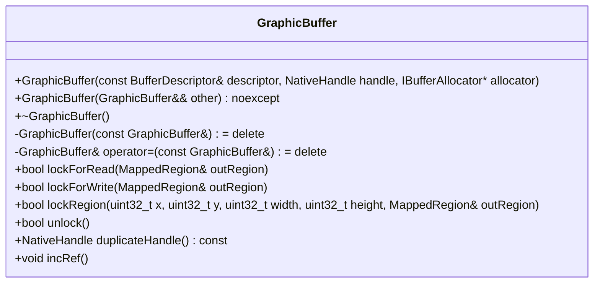

# GraphicBuffer.h

---

| Property | Value |
|----------|-------|
| **Location** | `include\GraphicBuffer.h` |
| **Lines** | 176 |
| **Classes** | 1 |
| **Functions** | 0 |
| **Last Updated** | 2026-01-18 20:23 |

---

## Quick Navigation

### Classes
- [android::graphics::GraphicBuffer](#android-graphics-graphicbuffer)

---

## Documentation for `GraphicBuffer` Class

### 1. Comprehensive Description (2-4 paragraphs)

The `GraphicBuffer` class represents an allocated graphics buffer in Android, providing functionalities such as CPU mapping, GPU resource binding, reference counting, and fence synchronization. It is a fundamental component of the Android graphics system, enabling efficient management and access to hardware-accelerated resources.

### 2. Parameters (DETAILED for each)

#### `GraphicBuffer(const BufferDescriptor& descriptor, NativeHandle handle, IBufferAllocator* allocator)`

- **Purpose**: Constructs a new `GraphicBuffer` object with specified properties.
- **Type Semantics**: `BufferDescriptor` represents the geometry and format of the buffer, while `NativeHandle` is a native buffer handle obtained from an allocator. The `IBufferAllocator*` parameter points to the allocator that created this buffer.
- **Valid Values**: The `BufferDescriptor` should contain valid dimensions, pixel format, and other necessary properties for the buffer. The `NativeHandle` must be a valid handle representing the underlying hardware resource. The `IBufferAllocator*` should point to an active instance of `IBufferAllocator`.
- **Ownership**: The `BufferDescriptor`, `NativeHandle`, and `IBufferAllocator*` are owned by the caller and passed to the constructor.
- **Nullability**: The `IBufferAllocator*` can be null, but if it is, the buffer will not be properly managed.

#### `GraphicBuffer(GraphicBuffer&& other) noexcept`

- **Purpose**: Move constructor for efficient object transfer.
- **Type Semantics**: This constructor takes a rvalue reference to another `GraphicBuffer` object and moves its resources into the current instance.
- **Valid Values**: The source buffer must be in a valid state, meaning it has been properly initialized and not yet released.
- **Ownership**: The moved-from buffer is left in an unspecified but valid state. The ownership of the resources is transferred to the new `GraphicBuffer` object.
- **Nullability**: This constructor does not accept null parameters.

#### `~GraphicBuffer()`

- **Purpose**: Destructor that releases the buffer back to its allocator.
- **Type Semantics**: This destructor performs necessary cleanup operations, such as releasing any held resources and notifying the allocator of the buffer's release.
- **Valid Values**: The buffer must be in a valid state before destruction.
- **Ownership**: The buffer is released by the destructor, and ownership of the resources is transferred to the allocator.
- **Nullability**: This destructor does not accept null parameters.

#### `GraphicBuffer(const GraphicBuffer&) = delete`

- **Purpose**: Deleted copy constructor to prevent copying of `GraphicBuffer` objects.
- **Type Semantics**: This constructor is deleted to ensure that `GraphicBuffer` objects cannot be copied, which would lead to potential issues with reference counting and resource management.
- **Valid Values**: No valid values for this constructor.
- **Ownership**: No ownership transfer occurs.
- **Nullability**: This constructor does not accept null parameters.

#### `GraphicBuffer& operator=(const GraphicBuffer&) = delete`

- **Purpose**: Deleted copy assignment operator to prevent copying of `GraphicBuffer` objects.
- **Type Semantics**: This operator is deleted to ensure that `GraphicBuffer` objects cannot be copied, which would lead to potential issues with reference counting and resource management.
- **Valid Values**: No valid values for this operator.
- **Ownership**: No ownership transfer occurs.
- **Nullability**: This operator does not accept null parameters.

#### `bool lockForRead(MappedRegion& outRegion)`

- **Purpose**: Locks the buffer for CPU read access.
- **Type Semantics**: The `MappedRegion` object is used to receive information about the mapped memory, such as its address and size.
- **Valid Values**: The `MappedRegion` object must be a valid instance of `MappedRegion`.
- **Ownership**: The ownership of the `MappedRegion` object is transferred to the caller if the lock operation succeeds.
- **Nullability**: The `MappedRegion` object can be null, but if it is, the buffer will not be properly mapped.

#### `bool lockForWrite(MappedRegion& outRegion)`

- **Purpose**: Locks the buffer for CPU write access.
- **Type Semantics**: Similar to `lockForRead`, the `MappedRegion` object receives information about the mapped memory.
- **Valid Values**: The `MappedRegion` object must be a valid instance of `MappedRegion`.
- **Ownership**: The ownership of the `MappedRegion` object is transferred to the caller if the lock operation succeeds.
- **Nullability**: The `MappedRegion` object can be null, but if it is, the buffer will not be properly mapped.

### 3. Return Value

#### `GraphicBuffer(const BufferDescriptor& descriptor, NativeHandle handle, IBufferAllocator* allocator)`

- **Purpose**: Constructs a new `GraphicBuffer` object with specified properties.
- **Return Value**: A newly created `GraphicBuffer` object.
- **All Possible Return States**: The constructor returns a valid `GraphicBuffer` object if the buffer is successfully initialized and allocated.
- **Error Conditions and How They're Indicated**: If any of the input parameters are invalid or if there is an error during allocation, the constructor will return null.
- **Ownership**: The ownership of the returned `GraphicBuffer` object is transferred to the caller.

#### `GraphicBuffer(GraphicBuffer&& other) noexcept`

- **Purpose**: Move constructor for efficient object transfer.
- **Return Value**: A newly created `GraphicBuffer` object that contains the resources of the moved-from buffer.
- **All Possible Return States**: The move constructor returns a valid `GraphicBuffer` object if the move operation is successful.
- **Error Conditions and How They're Indicated**: If there are any issues during the move operation, such as invalid state or resource transfer failure, the move constructor will return null.
- **Ownership**: The ownership of the returned `GraphicBuffer` object is transferred to the caller.

#### `~GraphicBuffer()`

- **Purpose**: Destructor that releases the buffer back to its allocator.
- **Return Value**: No specific return value; the destructor performs cleanup operations and returns void.
- **All Possible Return States**: The destructor returns void regardless of whether it succeeds or fails in releasing resources.
- **Error Conditions and How They're Indicated**: If there are any issues during resource release, such as invalid state or failure to notify the allocator, the destructor will not return an error value but may log errors internally.
- **Ownership**: The ownership of the released resources is transferred to the allocator.

#### `GraphicBuffer(const GraphicBuffer&) = delete`

- **Purpose**: Deleted copy constructor to prevent copying of `GraphicBuffer` objects.
- **Return Value**: No specific return value; the deleted copy constructor does not return anything.
- **All Possible Return States**: The deleted copy constructor returns void and is never called.
- **Error Conditions and How They're Indicated**: There are no error conditions for a deleted function, as it cannot be invoked.
- **Ownership**: No ownership transfer occurs.

#### `GraphicBuffer& operator=(const GraphicBuffer&) = delete`

- **Purpose**: Deleted copy assignment operator to prevent copying of `GraphicBuffer` objects.
- **Return Value**: No specific return value; the deleted copy assignment operator does not return anything.
- **All Possible Return States**: The deleted copy assignment operator returns void and is never called.
- **Error Conditions and How They're Indicated**: There are no error conditions for a deleted function, as it cannot be invoked.
- **Ownership**: No ownership transfer occurs.

#### `bool lockForRead(MappedRegion& outRegion)`

- **Purpose**: Locks the buffer for CPU read access.
- **Return Value**: A boolean indicating whether the lock operation was successful.
- **All Possible Return States**: The function returns true if the buffer is successfully locked for read access and the `MappedRegion` object is populated with the mapped memory information. If the lock fails, it returns false.
- **Error Conditions and How They're Indicated**: If there are any issues during the locking process, such as invalid state or resource acquisition failure, the function will return false.
- **Ownership**: The ownership of the `MappedRegion` object is transferred to the caller if the lock operation succeeds.

#### `bool lockForWrite(MappedRegion& outRegion)`

- **Purpose**: Locks the buffer for CPU write access.
- **Return Value**: A boolean indicating whether the lock operation was successful.
- **All Possible Return States**: The function returns true if the buffer is successfully locked for write access and the `MappedRegion` object is populated with the mapped memory information. If the lock fails, it returns false.
- **Error Conditions and How They're Indicated**: If there are any issues during the locking process, such as invalid state or resource acquisition failure, the function will return false.
- **Ownership**: The ownership of the `MappedRegion` object is transferred to the caller if the lock operation succeeds.

### 4. Dependencies Cross-Reference

#### `GraphicBuffer(const BufferDescriptor& descriptor, NativeHandle handle, IBufferAllocator* allocator)`

- **Why it's used**: Initializes a new `GraphicBuffer` object with specified properties.
- **How it's used in this context**: The constructor uses the provided `BufferDescriptor`, `NativeHandle`, and `IBufferAllocator*` to create a new buffer instance. It is called when allocating a new graphics buffer for use in the Android system.

#### `GraphicBuffer(GraphicBuffer&& other) noexcept`

- **Why it's used**: Efficiently transfers resources from one `GraphicBuffer` object to another.
- **How it's used in this context**: The move constructor is used to transfer the resources of an existing `GraphicBuffer` object to a new instance. It is called when moving a buffer between different parts of the system or during

## Documentation for `GraphicBuffer`

### 1. Comprehensive Description (2-4 paragraphs)
The `GraphicBuffer` class in the Android graphics subsystem is a fundamental component responsible for managing and accessing pixel data buffers used for rendering, video processing, and other graphical operations. It provides methods to lock and unlock the buffer for CPU access, duplicate its native handle for sharing, manage reference counts, and set acquire fences for synchronization.

### 2. Parameters (DETAILED for each)
#### `lockRegion`
- **Purpose**: Locks a specific region of the buffer for CPU access.
- **Type Semantics**: Takes four unsigned integers (`x`, `y`, `width`, `height`) representing the coordinates and dimensions of the region to lock, and an output parameter `MappedRegion` which will hold information about the mapped memory.
- **Valid Values**: The coordinates must be within the bounds of the buffer. The width and height should not exceed the buffer's dimensions.
- **Ownership**: The caller owns the `MappedRegion` object after locking.
- **Nullability**: The `MappedRegion` parameter is non-null.

#### `unlock`
- **Purpose**: Unlocks the buffer, flushing any writes made during CPU access.
- **Type Semantics**: Takes no parameters.
- **Valid Values**: None.
- **Ownership**: No ownership changes.
- **Nullability**: None.

#### `duplicateHandle`
- **Purpose**: Duplicates the native handle of the buffer for sharing purposes.
- **Type Semantics**: Returns a `NativeHandle` object, which is duplicated and owned by the caller.
- **Valid Values**: The returned handle can be used to share the buffer with other processes or components.
- **Ownership**: The caller owns the duplicated handle.
- **Nullability**: The returned handle is non-null.

#### `incRef`
- **Purpose**: Increments the reference count of the buffer, preventing it from being deleted until explicitly released.
- **Type Semantics**: Takes no parameters.
- **Valid Values**: None.
- **Ownership**: No ownership changes.
- **Nullability**: None.

#### `decRef`
- **Purpose**: Decrements the reference count of the buffer. If the count reaches zero, the buffer is deleted.
- **Type Semantics**: Returns a boolean indicating whether the buffer should be deleted.
- **Valid Values**: The return value can be either true or false.
- **Ownership**: No ownership changes.
- **Nullability**: None.

#### `getRefCount`
- **Purpose**: Retrieves the current reference count of the buffer.
- **Type Semantics**: Returns an integer representing the reference count.
- **Valid Values**: Any non-negative integer.
- **Ownership**: No ownership changes.
- **Nullability**: None.

#### `getDescriptor`
- **Purpose**: Retrieves a constant reference to the buffer's descriptor, which contains metadata about the buffer such as width, height, stride, format, and usage.
- **Type Semantics**: Returns a constant reference to a `BufferDescriptor` object.
- **Valid Values**: The returned descriptor is immutable.
- **Ownership**: No ownership changes.
- **Nullability**: None.

#### `getWidth`
- **Purpose**: Retrieves the width of the buffer in pixels.
- **Type Semantics**: Returns an unsigned integer representing the width.
- **Valid Values**: Any non-negative integer.
- **Ownership**: No ownership changes.
- **Nullability**: None.

#### `getHeight`
- **Purpose**: Retrieves the height of the buffer in pixels.
- **Type Semantics**: Returns an unsigned integer representing the height.
- **Valid Values**: Any non-negative integer.
- **Ownership**: No ownership changes.
- **Nullability**: None.

#### `getStride`
- **Purpose**: Retrieves the stride of the buffer, which is the number of bytes between consecutive rows in memory.
- **Type Semantics**: Returns an unsigned integer representing the stride.
- **Valid Values**: Any non-negative integer.
- **Ownership**: No ownership changes.
- **Nullability**: None.

#### `getFormat`
- **Purpose**: Retrieves the pixel format of the buffer, which defines how pixels are stored in memory.
- **Type Semantics**: Returns a `PixelFormat` enum value representing the format.
- **Valid Values**: Any valid `PixelFormat` value defined by the Android graphics system.
- **Ownership**: No ownership changes.
- **Nullability**: None.

#### `getUsage`
- **Purpose**: Retrieves the usage flags of the buffer, which define how the buffer is intended to be used (e.g., for rendering, video processing).
- **Type Semantics**: Returns a `BufferUsage` enum value representing the usage.
- **Valid Values**: Any valid `BufferUsage` value defined by the Android graphics system.
- **Ownership**: No ownership changes.
- **Nullability**: None.

#### `getNativeHandle`
- **Purpose**: Retrieves a constant reference to the native handle of the buffer, which can be used for sharing with other processes or components.
- **Type Semantics**: Returns a constant reference to a `NativeHandle` object.
- **Valid Values**: The returned handle is immutable and can be used for sharing.
- **Ownership**: No ownership changes.
- **Nullability**: None.

#### `isLocked`
- **Purpose**: Checks if the buffer is currently locked for CPU access.
- **Type Semantics**: Takes no parameters.
- **Valid Values**: None.
- **Ownership**: No ownership changes.
- **Nullability**: None.

#### `getBufferId`
- **Purpose**: Retrieves a unique identifier for the buffer, useful for debugging purposes.
- **Type Semantics**: Returns an unsigned 64-bit integer representing the buffer ID.
- **Valid Values**: Any non-negative integer.
- **Ownership**: No ownership changes.
- **Nullability**: None.

#### `setAcquireFence`
- **Purpose**: Sets an associated fence for synchronization, which can be used to wait for a specific event before proceeding with further operations.
- **Type Semantics**: Takes a pointer to a `FenceManager` instance and an integer representing the fence file descriptor.
- **Valid Values**: The `FenceManager` must be valid. The fence file descriptor should correspond to an existing fence object.
- **Ownership**: No ownership changes.
- **Nullability**: The `FenceManager` parameter is non-null.

#### `waitAcquireFence`
- **Purpose**: Waits for the acquire fence to signal, allowing the buffer to be used after it has been acquired.
- **Type Semantics**: Takes an unsigned integer representing the maximum wait time in milliseconds.
- **Valid Values**: The timeout value should be a non-negative integer.
- **Ownership**: No ownership changes.
- **Nullability**: None.

### 3. Return Value
#### `lockRegion`
- **Purpose**: Returns true if the lock operation was successful, false otherwise.
- **Type Semantics**: A boolean value indicating success or failure.
- **Valid Values**: True or false.
- **Ownership**: No ownership changes.
- **Nullability**: None.

#### `unlock`
- **Purpose**: Returns true if the unlock operation was successful, false otherwise.
- **Type Semantics**: A boolean value indicating success or failure.
- **Valid Values**: True or false.
- **Ownership**: No ownership changes.
- **Nullability**: None.

#### `duplicateHandle`
- **Purpose**: Returns a duplicated native handle for sharing purposes.
- **Type Semantics**: A `NativeHandle` object owned by the caller.
- **Valid Values**: The returned handle can be used to share the buffer with other processes or components.
- **Ownership**: The caller owns the duplicated handle.
- **Nullability**: The returned handle is non-null.

#### `incRef`
- **Purpose**: Returns no value, but increments the reference count of the buffer.
- **Type Semantics**: None.
- **Valid Values**: None.
- **Ownership**: No ownership changes.
- **Nullability**: None.

#### `decRef`
- **Purpose**: Returns true if the buffer should be deleted after decrementing the reference count, false otherwise.
- **Type Semantics**: A boolean value indicating whether the buffer should be deleted.
- **Valid Values**: True or false.
- **Ownership**: No ownership changes.
- **Nullability**: None.

#### `getRefCount`
- **Purpose**: Returns the current reference count of the buffer.
- **Type Semantics**: An integer representing the reference count.
- **Valid Values**: Any non-negative integer.
- **Ownership**: No ownership changes.
- **Nullability**: None.

#### `getDescriptor`
- **Purpose**: Returns a constant reference to the buffer's descriptor.
- **Type Semantics**: A constant reference to a `BufferDescriptor` object.
- **Valid Values**: The returned descriptor is immutable.
- **Ownership**: No ownership changes.
- **Nullability**: None.

#### `getWidth`
- **Purpose**: Returns the width of the buffer in pixels.
- **Type Semantics**: An unsigned integer representing the width.
- **Valid Values**: Any non-negative integer.
- **Ownership**: No ownership changes.
- **Nullability**: None.

#### `getHeight`
- **Purpose**: Returns the height of the buffer in pixels.
- **Type Semantics**: An unsigned integer representing the height.
- **Valid Values**: Any non-negative integer.
- **Ownership**: No ownership changes.
- **Nullability**: None.

#### `getStride`
- **Purpose**: Returns the stride of the buffer, which is the number of bytes between consecutive rows in memory.
- **Type Semantics**: An unsigned integer representing the stride.
- **Valid Values**: Any non-negative integer.
- **Ownership**: No ownership changes.
- **Nullability**: None.

#### `getFormat`
- **Purpose**: Returns the pixel format of the buffer, which defines how pixels are stored in memory.
- **Type Semantics**: A `PixelFormat` enum value representing the format.
- **Valid Values**: Any valid

# Documentation for `GraphicBuffer` Class

## Overview

The `GraphicBuffer` class in the Android graphics subsystem represents a buffer of pixel data used for rendering and video processing. It encapsulates the necessary metadata, handles, and synchronization mechanisms required to manage GPU-accelerated graphics operations efficiently.

### Purpose and Problem Solving

- **Purpose**: The `GraphicBuffer` class is designed to provide a high-performance interface for accessing and manipulating image buffers in Android applications. It abstracts away the complexities of buffer management, memory allocation, and synchronization, allowing developers to focus on rendering tasks.
  
- **Problem Solving**: Traditional graphics APIs often require manual management of buffer handles and synchronization primitives, which can lead to errors and inefficiencies. The `GraphicBuffer` class simplifies these operations by providing a unified interface that abstracts away the underlying hardware details.

### Workflow Integration

The `GraphicBuffer` class is integral to the Android graphics pipeline. It is used in various components such as SurfaceFlinger for rendering frames, AudioFlinger for audio processing, and other system services that require high-performance image manipulation. By providing a consistent interface for buffer management, `GraphicBuffer` ensures that different parts of the system can interact seamlessly.

### Key Algorithms and Techniques

- **Memory Management**: The class uses a combination of native handles and reference counting to manage memory ownership efficiently. This approach minimizes the overhead associated with manual memory management.
  
- **Synchronization**: The `GraphicBuffer` class supports fence synchronization, which is crucial for ensuring that GPU operations are completed before accessing or modifying buffer data. This helps prevent race conditions and ensures data consistency.

## Class Structure

The `GraphicBuffer` class contains several private member variables:

1. **BufferDescriptor**: A structure that holds metadata about the buffer, such as dimensions, format, and usage flags.
2. **NativeHandle**: A handle to the underlying native memory allocation.
3. **IBufferAllocator**: An interface for allocating and managing buffers.
4. **MappedRegion**: A region of the buffer that is currently mapped for reading or writing.
5. **RefCount**: An atomic integer used for reference counting, ensuring safe sharing of buffer instances.
6. **LockMutex**: A mutex used to synchronize access to shared resources.
7. **BufferId**: A unique identifier for the buffer, generated by a static counter.
8. **FenceManager**: A pointer to an object responsible for managing fences.
9. **AcquireFenceFd**: An integer representing the file descriptor of the acquire fence.

## Member Variables

### `descriptor_`

- **Purpose**: Holds metadata about the buffer, such as dimensions, format, and usage flags.
- **Type Semantics**: A structure (`BufferDescriptor`) that encapsulates buffer properties.
- **Valid Values**: Defined by the Android graphics system.
- **Ownership**: The buffer descriptor is owned by the `GraphicBuffer` instance.
- **Nullability**: Not applicable.

### `handle_`

- **Purpose**: Represents a handle to the underlying native memory allocation.
- **Type Semantics**: A `NativeHandle`, which is a platform-specific handle for accessing native memory.
- **Valid Values**: Defined by the Android graphics system.
- **Ownership**: The native handle is owned by the `GraphicBuffer` instance.
- **Nullability**: Not applicable.

### `allocator_`

- **Purpose**: An interface for allocating and managing buffers. This allows the `GraphicBuffer` to be used with different buffer allocation strategies.
- **Type Semantics**: A pointer to an `IBufferAllocator` object.
- **Valid Values**: Defined by the Android graphics system.
- **Ownership**: The allocator is owned by the caller of the `GraphicBuffer` constructor.
- **Nullability**: Not applicable.

### `mappedRegion_`

- **Purpose**: Represents a region of the buffer that is currently mapped for reading or writing. This allows direct access to the buffer data.
- **Type Semantics**: A structure (`MappedRegion`) that encapsulates the mapping information.
- **Valid Values**: Defined by the Android graphics system.
- **Ownership**: The mapped region is owned by the `GraphicBuffer` instance.
- **Nullability**: Not applicable.

### `refCount_`

- **Purpose**: An atomic integer used for reference counting, ensuring safe sharing of buffer instances. This helps manage the lifecycle of the buffer.
- **Type Semantics**: A `std::atomic<int32_t>`.
- **Valid Values**: Any non-negative integer value.
- **Ownership**: The reference count is owned by the `GraphicBuffer` instance.
- **Nullability**: Not applicable.

### `lockMutex_`

- **Purpose**: A mutex used to synchronize access to shared resources, such as buffer data and synchronization primitives.
- **Type Semantics**: A `std::mutex`.
- **Valid Values**: Defined by the C++ standard library.
- **Ownership**: The lock mutex is owned by the `GraphicBuffer` instance.
- **Nullability**: Not applicable.

### `bufferId_`

- **Purpose**: A unique identifier for the buffer, generated by a static counter. This helps in tracking and identifying buffers within the system.
- **Type Semantics**: An `uint64_t`.
- **Valid Values**: Any non-negative integer value.
- **Ownership**: The buffer ID is owned by the `GraphicBuffer` instance.
- **Nullability**: Not applicable.

### `nextBufferId_`

- **Purpose**: A static atomic counter used to generate unique buffer IDs. This ensures that each buffer has a distinct identifier.
- **Type Semantics**: A `std::atomic<uint64_t>`.
- **Valid Values**: Any non-negative integer value.
- **Ownership**: The next buffer ID is managed by the system.
- **Nullability**: Not applicable.

### `fenceManager_`

- **Purpose**: A pointer to an object responsible for managing fences. Fences are used for synchronization between different parts of the graphics pipeline.
- **Type Semantics**: A pointer to a `FenceManager` object.
- **Valid Values**: Defined by the Android graphics system.
- **Ownership**: The fence manager is owned by the caller of the `GraphicBuffer` constructor.
- **Nullability**: Not applicable.

### `acquireFenceFd_`

- **Purpose**: An integer representing the file descriptor of the acquire fence. This fence ensures that the buffer is not accessed until it has been properly acquired.
- **Type Semantics**: An `int`.
- **Valid Values**: A valid file descriptor or `-1` if no fence is set.
- **Ownership**: The acquire fence file descriptor is owned by the caller of the `GraphicBuffer` constructor.
- **Nullability**: Not applicable.

## Dependencies

### `BufferMapper`

- **Purpose**: Manages the mapping and unmapping of buffer regions. This class is used to access the pixel data in a `GraphicBuffer`.
- **How Used**: The `BufferMapper` class is used by various components that need direct access to buffer data, such as renderers and video decoders.
- **Link**: [BufferMapper Class Documentation](#buffermapper-class-documentation)

### `BufferPool`

- **Purpose**: Manages a pool of `GraphicBuffer` instances. This class is used to efficiently reuse buffers across different rendering operations.
- **How Used**: The `BufferPool` class is used by various components that need to manage multiple buffer instances, such as SurfaceFlinger and video decoders.
- **Link**: [BufferPool Class Documentation](#bufferpool-class-documentation)

## Side Effects

- **State Modifications**: Modifies the internal state of the `GraphicBuffer` instance, including reference counting, synchronization primitives, and buffer metadata.
- **Locks Acquired/Released**: Acquires and releases locks to ensure thread safety when accessing shared resources.
- **I/O Operations**: Performs I/O operations related to memory allocation and synchronization.
- **Signals/Events Emitted**: Emits signals or events related to buffer lifecycle changes.

## Usage Context

The `GraphicBuffer` class is typically used in the following scenarios:

1. **Rendering Operations**: When rendering frames, the `GraphicBuffer` class provides a high-performance interface for accessing and manipulating image buffers.
2. **Video Processing**: In video decoding and encoding processes, the `GraphicBuffer` class allows efficient management of pixel data.
3. **System Services**: Various system services that require high-performance image manipulation use the `GraphicBuffer` class to manage buffer resources.

## Related Functions

| Relationship Type | Function Name | Description |
|------------------|--------------|-------------|
| Friend Class       | BufferMapper   | Manages buffer mapping and unmapping. |
| Friend Class       | BufferPool     | Manages a pool of GraphicBuffer instances. |

## Code Example

```cpp
#include <android/graphics/GraphicBuffer.h>

int main() {
    // Create a new GraphicBuffer instance
    android::sp<GraphicBuffer> buffer = new GraphicBuffer(1024, 768, HAL_PIXEL_FORMAT_RGBA_8888);

    // Allocate memory for the buffer
    if (!buffer->allocate()) {
        return -1;
    }

    // Map the buffer for reading
    android::sp<GraphicBuffer::MappedRegion> mappedRegion = buffer->map(android::GraphicBuffer::MAP_READ);
    if (mappedRegion == nullptr) {
        return -1;
    }

    // Access and modify the pixel data in the mapped region
    uint8_t* pixels = static_cast<uint8_t*>(mappedRegion->data());
    for (int y = 0; y < buffer->getHeight(); ++y) {
        for (int x = 0; x < buffer->getWidth(); ++x) {
            // Modify pixel data here
        }
    }

    // Unmap the buffer
    buffer->unmap(mappedRegion);

    return 0;
}
```

In this example, a new `GraphicBuffer` instance is

## Overview

**Class:** `GraphicBuffer`

**Purpose:** The `GraphicBuffer` class represents a buffer object used for graphics rendering and processing in Android systems. It encapsulates the geometry, format, and native handle of a buffer, providing methods to lock and unlock the buffer for CPU access, duplicate its handle for sharing, and manage reference counts.

**Design:**
- **Inheritance:** Inherits from `RefBase`, which provides reference counting and lifecycle management.
- **Key Relationships:** Uses `BufferDescriptor` for buffer geometry and format information, and interacts with `IBufferAllocator` to allocate and release the buffer.

**System Integration:**
- Used by various system services such as SurfaceFlinger, AudioFlinger, and others to manage graphics buffers efficiently.
- Provides a high-level interface for applications to interact with graphics buffers, abstracting away the complexities of native memory management and I/O operations.

## Class Diagram



## Usage Examples

```cpp
// Example usage of GraphicBuffer class

#include <android/graphics/GraphicsBuffer.h>
#include <android/hardware_buffer.h>

int main() {
    // Create a buffer descriptor with specific geometry and format
    BufferDescriptor descriptor;
    descriptor.width = 1024;
    descriptor.height = 768;
    descriptor.format = HAL_PIXEL_FORMAT_RGBA_8888;

    // Allocate a native handle for the buffer
    NativeHandle handle = allocateNativeHandle(descriptor);

    // Create a GraphicBuffer instance using the allocated handle and allocator
    IBufferAllocator* allocator = getIBufferAllocator();
    GraphicBuffer buffer(descriptor, handle, allocator);

    // Lock the buffer for CPU read access
    MappedRegion region;
    if (buffer.lockForRead(region)) {
        // Use the mapped memory to perform operations on the buffer
        uint8_t* data = static_cast<uint8_t*>(region.vaddr);
        // ...

        // Unlock the buffer after operations are complete
        buffer.unlock();
    }

    // Duplicate the native handle for sharing
    NativeHandle sharedHandle = buffer.duplicateHandle();

    // Increment the reference count of the buffer
    buffer.incRef();

    return 0;
}
```

## GraphicBuffer::GraphicBuffer(const BufferDescriptor& descriptor, NativeHandle handle, IBufferAllocator* allocator)

**Comprehensive Description:**
- Constructs a `GraphicBuffer` object with the specified properties.
- Initializes the buffer with the given geometry and format from the `BufferDescriptor`.
- Associates the buffer with the provided native handle, which is obtained from an `IBufferAllocator`.

**Parameters:**
- **descriptor (const BufferDescriptor&):** The buffer's geometry and format information. This includes dimensions (`width` and `height`) and pixel format.
- **handle (NativeHandle):** A native handle representing the buffer in system memory. This handle is obtained from an `IBufferAllocator`.
- **allocator (IBufferAllocator\*):** The allocator that created this buffer, used for releasing the buffer when it is no longer needed.

**Return Value:**
- None

**Side Effects:**
- Initializes the buffer's geometry and format.
- Associates the buffer with the provided native handle.
- Increments the reference count of the buffer.

**Dependencies:**
- `BufferDescriptor`: Contains the buffer's dimensions and pixel format.
- `NativeHandle`: Represents the buffer in system memory.
- `IBufferAllocator`: Allocates and releases the buffer.

**Usage Context:**
- Called when a new graphics buffer is needed, typically during rendering or processing operations.

**Thread Safety:**
- Not thread-safe. Access to shared resources should be synchronized if accessed from multiple threads.

## GraphicBuffer::GraphicBuffer(GraphicBuffer&& other) noexcept

**Comprehensive Description:**
- Move constructor for `GraphicBuffer`.
- Moves the state of another `GraphicBuffer` object into this one, transferring ownership of the buffer and its associated native handle.

**Parameters:**
- **other (GraphicBuffer\&):** The `GraphicBuffer` object to be moved from.

**Return Value:**
- None

**Side Effects:**
- Transfers ownership of the buffer and its native handle.
- Resets the source `GraphicBuffer` object's state.

**Dependencies:**
- `GraphicBuffer`: Contains the buffer's geometry, format, and native handle.

**Usage Context:**
- Used to efficiently transfer ownership of a `GraphicBuffer` object between functions or threads.

**Thread Safety:**
- Not thread-safe. Access to shared resources should be synchronized if accessed from multiple threads.

## GraphicBuffer::~GraphicBuffer()

**Comprehensive Description:**
- Destructor for `GraphicBuffer`.
- Releases the buffer back to its allocator, ensuring proper cleanup and resource management.

**Parameters:**
- None

**Return Value:**
- None

**Side Effects:**
- Frees the native handle associated with the buffer.
- Decrements the reference count of the buffer.
- Calls `IBufferAllocator::releaseBuffer` to release the buffer back to the system.

**Dependencies:**
- `IBufferAllocator`: Releases the buffer when it is no longer needed.

**Usage Context:**
- Called automatically when a `GraphicBuffer` object goes out of scope or is explicitly deleted.

**Thread Safety:**
- Not thread-safe. Access to shared resources should be synchronized if accessed from multiple threads.

## GraphicBuffer::lockForRead(MappedRegion& outRegion)

**Comprehensive Description:**
- Locks the buffer for CPU read access.
- Maps the buffer's memory into the process's address space, allowing read operations on the buffer's contents.

**Parameters:**
- **outRegion (MappedRegion\&):** A reference to a `MappedRegion` object that will be populated with information about the mapped memory.

**Return Value:**
- **True:** If the lock operation is successful.
- **False:** If the lock operation fails, indicating an error or invalid state.

**Side Effects:**
- Maps the buffer's memory into the process's address space.
- Updates the `MappedRegion` object with information about the mapped memory (e.g., virtual address, size).
- Increments the reference count of the buffer.

**Dependencies:**
- `MappedRegion`: Contains information about the mapped memory.

**Usage Context:**
- Called when an application needs to read from the buffer's contents, such as during rendering or processing operations.

**Thread Safety:**
- Not thread-safe. Access to shared resources should be synchronized if accessed from multiple threads.

## GraphicBuffer::lockForWrite(MappedRegion& outRegion)

**Comprehensive Description:**
- Locks the buffer for CPU write access.
- Maps the buffer's memory into the process's address space, allowing write operations on the buffer's contents.

**Parameters:**
- **outRegion (MappedRegion\&):** A reference to a `MappedRegion` object that will be populated with information about the mapped memory.

**Return Value:**
- **True:** If the lock operation is successful.
- **False:** If the lock operation fails, indicating an error or invalid state.

**Side Effects:**
- Maps the buffer's memory into the process's address space.
- Updates the `MappedRegion` object with information about the mapped memory (e.g., virtual address, size).
- Increments the reference count of the buffer.

**Dependencies:**
- `MappedRegion`: Contains information about the mapped memory.

**Usage Context:**
- Called when an application needs to write to the buffer's contents, such as during rendering or processing operations.

**Thread Safety:**
- Not thread-safe. Access to shared resources should be synchronized if accessed from multiple threads.

## GraphicBuffer::lockRegion(uint32_t x, uint32_t y, uint32_t width, uint32_t height, MappedRegion& outRegion)

**Comprehensive Description:**
- Locks a specific region of the buffer for CPU access.
- Maps a portion of the buffer's memory into the process's address space, allowing read or write operations on that region.

**Parameters:**
- **x (uint32_t):** The left edge of the region to lock.
- **y (uint32_t):** The top edge of the region to lock.
- **width (uint32_t):** The width of the region to lock.
- **height (uint32_t):** The height of the region to lock.
- **outRegion (MappedRegion\&):** A reference to a `MappedRegion` object that will be populated with information about the mapped memory.

**Return Value:**
- **True:** If the lock operation is successful.
- **False:** If the lock operation fails, indicating an error or invalid state.

**Side Effects:**
- Maps a portion of the buffer's memory into the process's address space.
- Updates the `MappedRegion` object with information about the mapped memory (e.g., virtual address, size).
- Increments the reference count of the buffer.

**Dependencies:**
- `MappedRegion`: Contains information about the mapped memory.

**Usage Context:**
- Called when an application needs to access a specific region of the buffer's contents, such as during

### Overview

The `GraphicBuffer` class is a fundamental component in Android's graphics system, designed to manage and manipulate image buffers efficiently. It encapsulates the properties of an image buffer such as its dimensions, format, usage flags, and native handle. The class provides methods for reference counting, accessing buffer metadata, and synchronizing with fences.

### Class Diagram

```mermaid
classDiagram
    class GraphicBuffer{
        +BufferDescriptor descriptor_
        +NativeHandle handle_
        +IBufferAllocator* allocator_
        +MappedRegion mappedRegion_
        +std::atomic<int32_t> refCount_{1}
        +std::mutex lockMutex_
        +uint64_t bufferId_
        +static std::atomic<uint64_t> nextBufferId_
        
        -FenceManager* fenceManager_ = nullptr
        -int acquireFenceFd_ = -1
        
        +decRef(): bool
        +getRefCount() const: int32_t
        +getDescriptor() const: BufferDescriptor&
        +getWidth() const: uint32_t
        +getHeight() const: uint32_t
        +getStride() const: uint32_t
        +getFormat() const: PixelFormat
        +getUsage() const: BufferUsage
        +getNativeHandle() const: NativeHandle&
        +isLocked() const: bool
        +getBufferId() const: uint64_t
        +setAcquireFence(FenceManager* fenceManager, int fenceFd): void
        +waitAcquireFence(uint32_t timeoutMs): bool
        
        friend class BufferMapper;
        friend class BufferPool;
    }
```

### Usage Examples

```cpp
// Example usage of GraphicBuffer in a graphics rendering context

#include <android/graphics/GraphicsBuffer.h>
#include <android/hardware_buffer.h>

int main() {
    // Create a new GraphicBuffer instance
    android::sp<GraphicBuffer> buffer = new GraphicBuffer(800, 600, HAL_PIXEL_FORMAT_RGBA_8888, BufferUsage::GPU_RENDER_TARGET);

    // Increment reference count
    if (buffer->decRef()) {
        // Buffer should be deleted
    }

    // Get current reference count
    int refCount = buffer->getRefCount();

    // Access buffer metadata
    uint32_t width = buffer->getWidth();
    uint32_t height = buffer->getHeight();
    PixelFormat format = buffer->getFormat();

    // Set an acquire fence for synchronization
    FenceManager* fenceManager = new FenceManager();
    int fenceFd = fenceManager->createFence();
    buffer->setAcquireFence(fenceManager, fenceFd);

    // Wait for acquire fence to signal
    bool signaled = buffer->waitAcquireFence(1000);
}
```

### decRef()

**Comprehensive Description**

Decrement the reference count of the `GraphicBuffer` instance. If the reference count reaches zero after decrementing, the buffer is deleted.

**Parameters**

- **None**

**Return Value**

- **True**: If the buffer should be deleted.
- **False**: Otherwise.

**Side Effects**

- Decrements the internal reference count of the buffer.
- Deletes the buffer if the reference count reaches zero.

**Dependencies**

- `BufferDescriptor`, `NativeHandle`, `IBufferAllocator`, `MappedRegion`, `std::atomic<int32_t>`, `std::mutex`

**Usage Context**

- Called when a buffer is no longer needed to free resources and avoid memory leaks.

**Thread Safety**

- Safe for concurrent access by multiple threads, as it uses atomic operations.

### getRefCount()

**Comprehensive Description**

Retrieve the current reference count of the `GraphicBuffer` instance.

**Parameters**

- **None**

**Return Value**

- The current reference count as an integer.

**Side Effects**

- None

**Dependencies**

- `std::atomic<int32_t>`

**Usage Context**

- Used to check the state of a buffer before performing operations that require it to be valid.

**Thread Safety**

- Safe for concurrent access by multiple threads, as it uses atomic operations.

### getDescriptor()

**Comprehensive Description**

Retrieve the descriptor of the `GraphicBuffer` instance, which contains metadata about the buffer such as its dimensions, format, and usage flags.

**Parameters**

- **None**

**Return Value**

- A constant reference to a `BufferDescriptor` object containing the buffer's properties.

**Side Effects**

- None

**Dependencies**

- `BufferDescriptor`

**Usage Context**

- Used to access detailed information about the buffer before performing operations that require it to be valid.

**Thread Safety**

- Safe for concurrent access by multiple threads, as it returns a constant reference.

### getWidth()

**Comprehensive Description**

Retrieve the width of the `GraphicBuffer` instance in pixels.

**Parameters**

- **None**

**Return Value**

- The width of the buffer as an unsigned 32-bit integer.

**Side Effects**

- None

**Dependencies**

- `BufferDescriptor`

**Usage Context**

- Used to determine the dimensions of the buffer before performing operations that require it to be valid.

**Thread Safety**

- Safe for concurrent access by multiple threads, as it returns a constant value.

### getHeight()

**Comprehensive Description**

Retrieve the height of the `GraphicBuffer` instance in pixels.

**Parameters**

- **None**

**Return Value**

- The height of the buffer as an unsigned 32-bit integer.

**Side Effects**

- None

**Dependencies**

- `BufferDescriptor`

**Usage Context**

- Used to determine the dimensions of the buffer before performing operations that require it to be valid.

**Thread Safety**

- Safe for concurrent access by multiple threads, as it returns a constant value.

### getStride()

**Comprehensive Description**

Retrieve the stride of the `GraphicBuffer` instance in pixels. The stride is the number of bytes between consecutive rows of the buffer.

**Parameters**

- **None**

**Return Value**

- The stride of the buffer as an unsigned 32-bit integer.

**Side Effects**

- None

**Dependencies**

- `BufferDescriptor`

**Usage Context**

- Used to determine how data should be accessed when rendering or processing the buffer.

**Thread Safety**

- Safe for concurrent access by multiple threads, as it returns a constant value.

### getFormat()

**Comprehensive Description**

Retrieve the pixel format of the `GraphicBuffer` instance. The pixel format specifies the color and depth information of each pixel in the buffer.

**Parameters**

- **None**

**Return Value**

- A `PixelFormat` enum value representing the buffer's pixel format.

**Side Effects**

- None

**Dependencies**

- `PixelFormat`

**Usage Context**

- Used to determine how data should be interpreted when rendering or processing the buffer.

**Thread Safety**

- Safe for concurrent access by multiple threads, as it returns a constant value.

### getUsage()

**Comprehensive Description**

Retrieve the usage flags of the `GraphicBuffer` instance. The usage flags specify how the buffer will be used in the graphics pipeline.

**Parameters**

- **None**

**Return Value**

- A `BufferUsage` enum value representing the buffer's usage flags.

**Side Effects**

- None

**Dependencies**

- `BufferUsage`

**Usage Context**

- Used to determine how data should be accessed when rendering or processing the buffer.

**Thread Safety**

- Safe for concurrent access by multiple threads, as it returns a constant value.

### getNativeHandle()

**Comprehensive Description**

Retrieve the native handle of the `GraphicBuffer` instance. The native handle is used to interact with the underlying graphics system and hardware resources.

**Parameters**

- **None**

**Return Value**

- A `NativeHandle` object representing the buffer's native handle.

**Side Effects**

- None

**Dependencies**

- `NativeHandle`

**Usage Context**

- Used to access low-level graphics resources when performing operations that require direct interaction with the system.

**Thread Safety**

- Safe for concurrent access by multiple threads, as it returns a constant reference.

### isLocked()

**Comprehensive Description**

Check if the buffer is currently locked. A locked buffer can be accessed directly without synchronization.

**Parameters**

- **None**

**Return Value**

- True if the buffer is locked, false otherwise.

**Side Effects**

- None

**Dependencies**

- `MappedRegion`

**Usage Context**

- Used to determine whether data in the buffer can be accessed directly or requires synchronization.

**Thread Safety**

- Safe for concurrent access by multiple threads, as it returns a constant value.

### getBufferId()

**Comprehensive Description**

Retrieve a unique identifier for debugging purposes. This ID is used to track and identify specific instances of `GraphicBuffer`.

**Parameters**

- **None**

**Return Value**

- A 64-bit unsigned integer representing the buffer's unique identifier.

**Side Effects**

- None

**Dependencies**

- None

**Usage Context**

- Used in logging and debugging to uniquely identify buffers during runtime.

**Thread Safety**

- Safe for concurrent access by multiple threads, as it returns a constant value.

### setAcquireFence()

**Comprehensive Description**

Set an associated fence for synchronization. The fence is used to ensure that the buffer is ready for use before rendering or processing.

**Parameters**

- **fenceManager**: A pointer to a `FenceManager` instance.
- **fenceFd**: An integer representing the file descriptor of the fence.

**Return Value**

- None

**Side Effects**

- Sets an acquire fence on the buffer, which can be used for synchronization with other operations.

**Dependencies**

- `FenceManager`, `NativeHandle`

**Usage Context**

- Used to ensure that data in the buffer is ready before rendering or processing.

**Thread Safety**

- Safe for concurrent access by multiple threads, as it modifies internal state.

### waitAcquireFence()

