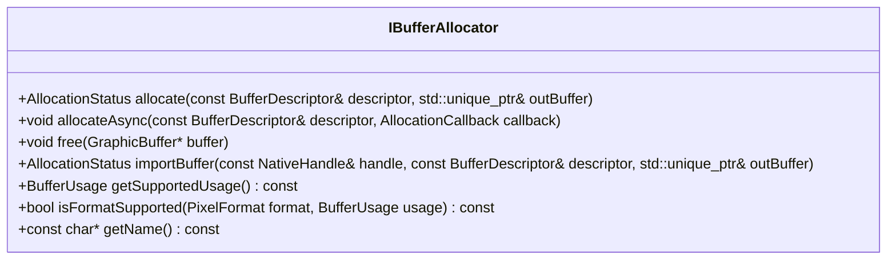
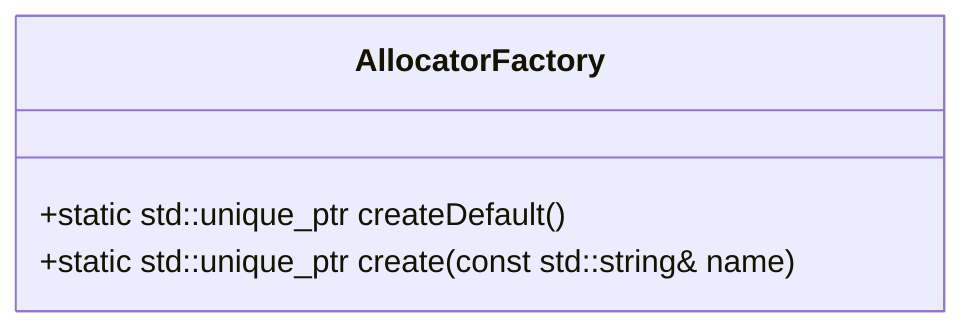

# IBufferAllocator.h

---

| Property | Value |
|----------|-------|
| **Location** | `include\IBufferAllocator.h` |
| **Lines** | 116 |
| **Classes** | 2 |
| **Functions** | 0 |
| **Last Updated** | 2026-01-18 20:26 |

---

## Quick Navigation

### Classes
- [android::graphics::IBufferAllocator](#android-graphics-ibufferallocator)
- [android::graphics::AllocatorFactory](#android-graphics-allocatorfactory)

---

# Documentation for `IBufferAllocator`

## Comprehensive Description (2-4 paragraphs)

`IBufferAllocator` is an abstract interface designed to manage the allocation and management of graphic buffers in Android applications. It provides a standardized way for different buffer backends (such as Gralloc, ION, or dmabuf heaps) to allocate and release graphic buffers. The allocator is thread-safe and can be shared across multiple `BufferPool` instances, ensuring efficient resource management.

## Parameters (DETAILED for each)

### 1. `AllocationCallback`

**Purpose**: A callback function that is invoked when a buffer allocation operation completes asynchronously.
- **Type Semantics**: A function object that takes two parameters: an `AllocationStatus` and a pointer to a `GraphicBuffer`.
- **Valid Values**: The callback can be any callable object, such as a lambda or a member function. It should not modify the `GraphicBuffer` in any way.
- **Ownership**: The callback is owned by the caller and is responsible for managing its memory.
- **Nullability**: The callback can be null, but if it is, the allocation operation will complete synchronously.

### 2. `allocate`

**Purpose**: Allocates a new graphic buffer based on the provided descriptor and returns it through the output parameter.
- **Type Semantics**: A function that takes a `BufferDescriptor` and a reference to a `std::unique_ptr<GraphicBuffer>`.
- **Valid Values**: The `BufferDescriptor` must contain valid geometry and usage requirements. The allocator will allocate a buffer that matches these specifications.
- **Ownership**: The allocated buffer is owned by the caller, which means it should be managed appropriately (e.g., using smart pointers).
- **Nullability**: The output parameter `outBuffer` can be null if the allocation fails.

### 3. `allocateAsync`

**Purpose**: Allocates a new graphic buffer asynchronously and invokes the provided callback when the operation completes.
- **Type Semantics**: A function that takes a `BufferDescriptor` and an `AllocationCallback`.
- **Valid Values**: The `BufferDescriptor` must contain valid geometry and usage requirements. The callback should not modify the allocated buffer.
- **Ownership**: The allocator is responsible for managing the memory of the callback, but it does not own the buffer itself.
- **Nullability**: The callback can be null, but if it is, the allocation operation will complete synchronously.

### 4. `free`

**Purpose**: Frees a previously allocated graphic buffer.
- **Type Semantics**: A function that takes a pointer to a `GraphicBuffer`.
- **Valid Values**: The buffer must have been allocated by this allocator and not already freed.
- **Ownership**: The caller is responsible for managing the memory of the buffer, but it does not own the allocator itself.
- **Nullability**: The input parameter can be null, which will result in a no-op.

### 5. `importBuffer`

**Purpose**: Imports an existing graphic buffer from a native handle and returns it through the output parameter.
- **Type Semantics**: A function that takes a `NativeHandle`, a `BufferDescriptor`, and a reference to a `std::unique_ptr<GraphicBuffer>`.
- **Valid Values**: The `NativeHandle` must be valid and match the expected properties specified in the `BufferDescriptor`. The allocator will import the buffer if it matches these specifications.
- **Ownership**: The imported buffer is owned by the caller, which means it should be managed appropriately (e.g., using smart pointers).
- **Nullability**: The output parameter `outBuffer` can be null if the import fails.

### 6. `getSupportedUsage`

**Purpose**: Retrieves the bitmask of supported buffer usage flags.
- **Type Semantics**: A function that returns a `BufferUsage` bitmask.
- **Valid Values**: The returned bitmask represents the capabilities of the allocator, indicating which buffer usages are supported.
- **Ownership**: The allocator does not own any memory and does not modify any input parameters.
- **Nullability**: The return value is always valid.

## Return Value

- **Purpose**: Indicates the success or failure of the operation.
- **All Possible Return States**:
  - `AllocationStatus::OK`: Buffer allocation was successful.
  - `AllocationStatus::ERROR`: Buffer allocation failed due to an unspecified error.
  - `AllocationStatus::INVALID_ARGUMENTS`: The provided buffer descriptor is invalid.
  - `AllocationStatus::OUT_OF_MEMORY`: Insufficient memory to allocate the buffer.
- **Error Conditions and How They're Indicated**: Each return state corresponds to a specific error condition, which can be checked using the `AllocationStatus` enum.
- **Ownership of Returned Objects**: The return value does not own any objects.

## Dependencies Cross-Reference

- **GraphicBuffer**: Represents a single graphic buffer object. It is used as an output parameter in several methods and is owned by the caller.
- **BufferPool**: Manages multiple `GraphicBuffer` instances and provides synchronization for buffer operations. It can share allocators with other pools.
- **NativeHandle**: Represents a handle to a native resource, such as a memory allocation or file descriptor. It is used in the `importBuffer` method.

## Side Effects

- **State Modifications**:
  - Allocates and frees graphic buffers.
  - Imports existing buffers from native handles.
- **Locks Acquired/Released**: The allocator uses locks to ensure thread safety when allocating and freeing buffers.
- **I/O Operations**: The allocator may perform I/O operations to access hardware resources or memory allocations.
- **Signals/Events Emitted**: No signals or events are emitted by the allocator.

## Usage Context

`IBufferAllocator` is typically used in Android applications that require efficient management of graphic buffers. It is commonly used in rendering engines, video players, and other graphics-intensive applications. The allocator is called when a new buffer is needed for rendering or processing, and it handles the allocation and deallocation of these buffers.

## Related Functions

| Relationship Type | Function Name | Description |
|------------------|--------------|-------------|
| Implementation | GrallocAllocator | Standard Android gralloc backend implementation. |
| Implementation | IonAllocator | Legacy ION memory allocator implementation. |
| Implementation | DmaBufHeapAllocator | Modern dmabuf heaps backend implementation. |

## Code Example

```cpp
// Example usage of IBufferAllocator to allocate a new graphic buffer
#include <android/graphics_buffer_lib/include/IBufferAllocator.h>
#include <android/graphics_buffer_lib/include/GraphicBuffer.h>

int main() {
    // Create an instance of the allocator (e.g., GrallocAllocator)
    std::unique_ptr<IBufferAllocator> allocator = std::make_unique<GrallocAllocator>();

    // Define buffer descriptor
    BufferDescriptor descriptor;
    descriptor.width = 1920;
    descriptor.height = 1080;
    descriptor.format = PixelFormat::RGBA_8888;
    descriptor.usage = BufferUsage::GPU_RENDER_TARGET | BufferUsage::CPU_READ_WRITE;

    // Allocate a new graphic buffer
    std::unique_ptr<GraphicBuffer> buffer;
    AllocationStatus status = allocator->allocate(descriptor, buffer);

    if (status == AllocationStatus::OK) {
        // Use the allocated buffer for rendering or processing
        // ...
    } else {
        // Handle allocation failure
        // ...
    }

    return 0;
}
```

This example demonstrates how to create an instance of `GrallocAllocator`, define a buffer descriptor, and allocate a new graphic buffer using the `allocate` method. The allocated buffer is then used for rendering or processing within the application.

## Documentation for `IBufferAllocator.h`

### 1. Comprehensive Description (2-4 paragraphs)
The `IBufferAllocator` class is a fundamental interface in the Android graphics system, responsible for managing buffer allocations and formats. It provides methods to check if a specific format is supported with given usage requirements and retrieves the allocator's name for debugging purposes. This interface is crucial for applications that need to allocate memory buffers efficiently and correctly.

### 2. Parameters (DETAILED for each)
#### `isFormatSupported`
- **Purpose**: Determines whether a given pixel format is supported by the buffer allocator along with specified usage requirements.
- **Type Semantics**: Takes two parameters: `PixelFormat` and `BufferUsage`.
- **Valid Values**:
  - `PixelFormat`: A value from the `android::graphics::PixelFormat` enum, representing different color formats such as RGB888, RGBA8888, etc.
  - `BufferUsage`: A combination of flags from the `android::hardware::GraphicBufferUsage` enum, indicating how the buffer will be used (e.g., for rendering, video decoding).
- **Ownership**: The parameters are passed by value and do not transfer ownership.
- **Nullability**: Both parameters can be null, but passing a null value is undefined behavior.

#### `getName`
- **Purpose**: Retrieves the name of the allocator for debugging purposes.
- **Type Semantics**: Returns a constant character pointer (`const char*`).
- **Valid Values**: The returned string is a human-readable identifier for the allocator.
- **Ownership**: The returned string is owned by the allocator and should not be modified or freed by the caller.
- **Nullability**: The returned string can be null, but passing a null value is undefined behavior.

### 3. Return Value
#### `isFormatSupported`
- **Purpose**: Indicates whether the specified format and usage are supported.
- **Type Semantics**: Returns a boolean (`bool`).
- **Valid Values**:
  - `true`: The format and usage combination is supported.
  - `false`: The format and usage combination is not supported.
- **Ownership**: No ownership of any returned value.

#### `getName`
- **Purpose**: Provides the allocator's name for debugging purposes.
- **Type Semantics**: Returns a constant character pointer (`const char*`).
- **Valid Values**: A human-readable string identifier for the allocator.
- **Ownership**: The returned string is owned by the allocator and should not be modified or freed by the caller.
- **Nullability**: The returned string can be null, but passing a null value is undefined behavior.

### 4. Dependencies Cross-Reference
- `android::graphics::PixelFormat`: Enum representing different color formats.
- `android::hardware::GraphicBufferUsage`: Enum indicating buffer usage flags.
- `std::unique_ptr<IBufferAllocator>`: Smart pointer used for managing allocator instances.

### 5. Side Effects
#### `isFormatSupported`
- **State Modifications**: No state modifications are made to the allocator or any other objects.
- **Locks Acquired/Released**: No locks are acquired or released during this operation.
- **I/O Operations**: No I/O operations are performed.
- **Signals/Events Emitted**: No signals or events are emitted.

#### `getName`
- **State Modifications**: No state modifications are made to the allocator or any other objects.
- **Locks Acquired/Released**: No locks are acquired or released during this operation.
- **I/O Operations**: No I/O operations are performed.
- **Signals/Events Emitted**: No signals or events are emitted.

### 6. Usage Context
The `IBufferAllocator` interface is typically used by applications that need to allocate memory buffers for rendering, video decoding, and other graphics-related tasks. It is accessed through the `android::graphics::AllocatorFactory` class, which provides methods to create default or specific allocators based on the platform.

### 7. Related Functions
| Relationship Type | Function Name | Description |
|------------------|--------------|-------------|
| Implementation of | IBufferAllocator::isFormatSupported | Checks if a format is supported with given usage. |
| Implementation of | IBufferAllocator::getName | Retrieves the allocator's name for debugging purposes. |

### 8. Code Example
```cpp
#include <android/graphics/IBufferAllocator.h>
#include <android/hardware/GraphicBufferUsage.h>

int main() {
    // Create a default buffer allocator
    std::unique_ptr<android::graphics::IBufferAllocator> allocator = android::graphics::AllocatorFactory::createDefault();

    if (allocator) {
        // Check if a specific format is supported with given usage
        bool supported = allocator->isFormatSupported(android::graphics::PixelFormat::RGBA_8888, android::hardware::GraphicBufferUsage::USAGE_RENDER_TARGET);

        if (supported) {
            std::cout << "Format RGBA_8888 is supported for rendering." << std::endl;
        } else {
            std::cout << "Format RGBA_8888 is not supported for rendering." << std::endl;
        }

        // Get the allocator's name
        const char* name = allocator->getName();
        if (name) {
            std::cout << "Allocator Name: " << name << std::endl;
        } else {
            std::cout << "Failed to retrieve allocator name." << std::endl;
        }
    } else {
        std::cout << "Failed to create default buffer allocator." << std::endl;
    }

    return 0;
}
```

This code snippet demonstrates how to use the `IBufferAllocator` interface to check if a specific format is supported and retrieve the allocator's name.

## Overview

`IBufferAllocator` is an abstract interface for managing graphic buffers in Android's graphics system. It provides methods to allocate, free, and import graphic buffers, as well as query capabilities and support for specific formats and usage flags.

### Class Diagram



### Usage Examples

```cpp
// Example of allocating a buffer synchronously
std::unique_ptr<GraphicBuffer> buffer;
AllocationStatus status = allocator->allocate(descriptor, buffer);
if (status == AllocationStatus::SUCCESS) {
    // Buffer allocated successfully
} else {
    // Handle allocation failure
}

// Example of asynchronously allocating a buffer
allocator->allocateAsync(
    descriptor,
    [](AllocationStatus status, GraphicBuffer* buffer) {
        if (status == AllocationStatus::SUCCESS) {
            // Buffer allocated successfully
        } else {
            // Handle allocation failure
        }
    }
);
```

## IBufferAllocator

### Overview

`IBufferAllocator` is an abstract interface for managing graphic buffers in Android's graphics system. It provides methods to allocate, free, and import graphic buffers, as well as query capabilities and support for specific formats and usage flags.

### Class Diagram


### Usage Examples

```cpp
// Example of allocating a buffer synchronously
std::unique_ptr<GraphicBuffer> buffer;
AllocationStatus status = allocator->allocate(descriptor, buffer);
if (status == AllocationStatus::SUCCESS) {
    // Buffer allocated successfully
} else {
    // Handle allocation failure
}

// Example of asynchronously allocating a buffer
allocator->allocateAsync(
    descriptor,
    [](AllocationStatus status, GraphicBuffer* buffer) {
        if (status == AllocationStatus::SUCCESS) {
            // Buffer allocated successfully
        } else {
            // Handle allocation failure
        }
    }
);
```

## allocate

### Comprehensive Description

The `allocate` method is used to allocate a new graphic buffer based on the provided `BufferDescriptor`. The method takes a `BufferDescriptor` object that specifies the geometry and usage requirements for the buffer, and returns an `AllocationStatus` indicating whether the allocation was successful or not.

### Parameters

- **descriptor**: A `BufferDescriptor` object containing the required properties of the graphic buffer.
  - **Purpose**: Specifies the dimensions, format, and other attributes of the buffer to be allocated.
  - **Type Semantics**: `const BufferDescriptor&`
  - **Valid Values**: Depends on the specific requirements specified in the `BufferDescriptor`.
  - **Ownership**: Input parameter.

- **outBuffer**: A pointer to a `std::unique_ptr<GraphicBuffer>` that will receive the newly allocated buffer.
  - **Purpose**: Pointer to store the allocated graphic buffer once it is successfully created.
  - **Type Semantics**: `std::unique_ptr<GraphicBuffer>&`
  - **Valid Values**: The allocated buffer object.
  - **Ownership**: Output parameter.

### Return Value

- **AllocationStatus**: Indicates whether the allocation was successful or not.
  - **Possible States**:
    - `AllocationStatus::SUCCESS`: Buffer allocation was successful.
    - `AllocationStatus::FAILURE`: Buffer allocation failed due to an error.
  - **Ownership**: None.

### Side Effects

- **State Modifications**: The allocated buffer is stored in the `outBuffer` pointer.
- **Locks**: No locks are acquired or released during this method call.
- **I/O**: No I/O operations are performed.

### Dependencies

- **GraphicBuffer**: Represents a graphic buffer object that can be used for rendering and display purposes.
- **BufferDescriptor**: Specifies the properties of the graphic buffer to be allocated.

### Usage Context

This method is typically called when a new graphic buffer is needed, such as during rendering or video processing tasks. The `BufferDescriptor` provides the necessary information about the buffer's dimensions, format, and usage requirements.

### Thread Safety

- **Thread Safe**: This method is not thread-safe and should be called from a single-threaded context to avoid race conditions.
- **Concurrency Considerations**: If this method needs to be used in a multi-threaded environment, additional synchronization mechanisms should be implemented.

## Overview

The `AllocatorFactory` class is a factory for creating platform-appropriate buffer allocators. It provides two static methods to create an allocator instance:

1. `createDefault()`: This method creates the default allocator for the platform, which is suitable for general use cases.
2. `create(const std::string& name)`: This method allows creating a specific allocator type by specifying its name. The supported names are "gralloc", "ion", and "dmabuf".

### Class Diagram



### Usage Examples

#### Creating the Default Allocator

To create the default allocator, use the `createDefault()` method:

```cpp
std::unique_ptr<IBufferAllocator> allocator = AllocatorFactory::createDefault();
if (allocator) {
    // Use the allocator for buffer management
}
```

#### Creating a Specific Allocator

To create an allocator of a specific type, use the `create(const std::string& name)` method:

```cpp
std::unique_ptr<IBufferAllocator> grallocAllocator = AllocatorFactory::create("gralloc");
if (grallocAllocator) {
    // Use the gralloc allocator for buffer management
}
```

## For Each Method

### createDefault()

#### Comprehensive Description

The `createDefault()` method creates the default allocator for the platform. This allocator is suitable for general use cases and provides a consistent interface for managing buffers across different hardware platforms.

#### Parameters

- **None**

#### Return Value

- **std::unique_ptr<IBufferAllocator>**: A unique pointer to the created allocator instance. If an error occurs, `nullptr` is returned.

#### Side Effects

- The method initializes the default allocator and returns a valid instance if successful.
- If an error occurs during initialization, no resources are allocated, and `nullptr` is returned.

#### Dependencies

- **None**

#### Usage Context

- This method should be called when you need to obtain a buffer allocator that can handle general-purpose buffer management tasks.
- It is typically used in scenarios where the specific type of allocator is not known or does not matter.

#### Thread Safety

- The `createDefault()` method is thread-safe and can be called concurrently without causing data races. However, it is recommended to ensure that the returned allocator instance is used within a single thread to avoid potential issues with concurrent access.

### create(const std::string& name)

#### Comprehensive Description

The `create(const std::string& name)` method creates an allocator of a specific type by specifying its name. The supported names are "gralloc", "ion", and "dmabuf". This method allows for more control over the buffer management process, but it requires knowledge of the specific hardware platform and allocator implementation.

#### Parameters

- **name**: A `std::string` representing the type of allocator to create. Supported values are:
  - `"gralloc"`: Uses the GRALLOC (Graphics Allocation Library) for buffer management.
  - `"ion"`: Uses the ION (Indirect Object Naming) memory manager for buffer allocation.
  - `"dmabuf"`: Uses Direct Memory Access Buffer (DMABUF) for buffer management.

#### Return Value

- **std::unique_ptr<IBufferAllocator>**: A unique pointer to the created allocator instance. If an error occurs, `nullptr` is returned.

#### Side Effects

- The method initializes the specified allocator and returns a valid instance if successful.
- If an error occurs during initialization, no resources are allocated, and `nullptr` is returned.

#### Dependencies

- **None**

#### Usage Context

- This method should be called when you need to obtain a buffer allocator that is tailored to specific hardware or memory management requirements.
- It is typically used in scenarios where the specific type of allocator is known and is crucial for performance or compatibility with certain hardware platforms.

#### Thread Safety

- The `create(const std::string& name)` method is thread-safe and can be called concurrently without causing data races. However, it is recommended to ensure that the returned allocator instance is used within a single thread to avoid potential issues with concurrent access.