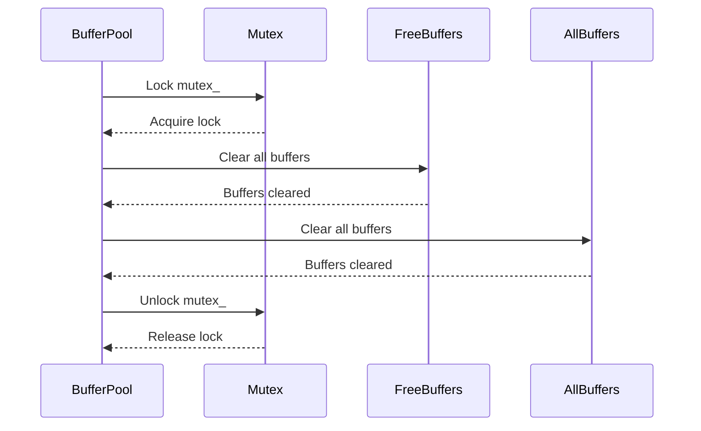
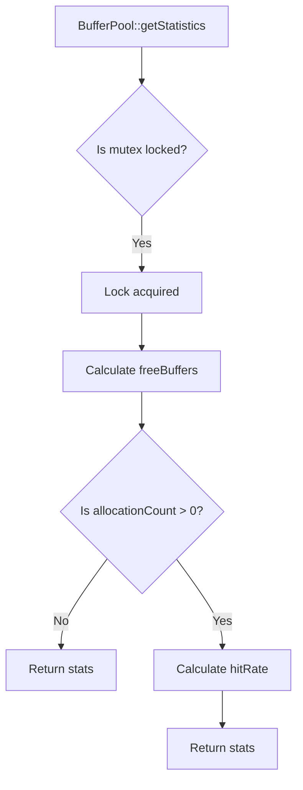
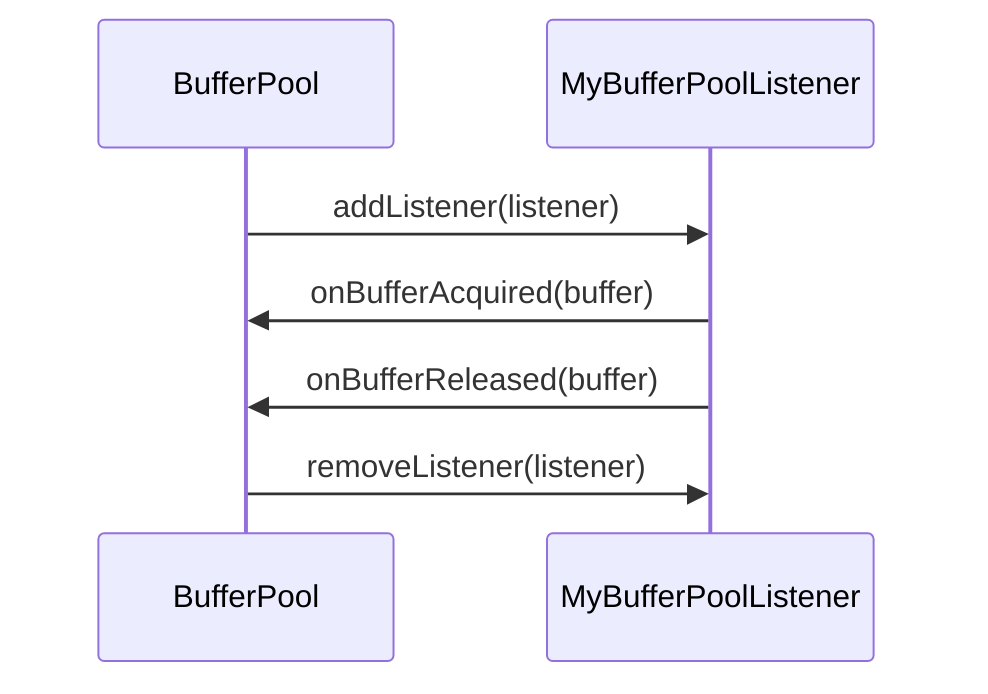
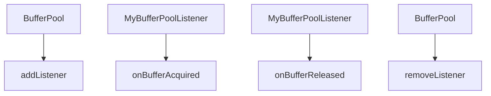
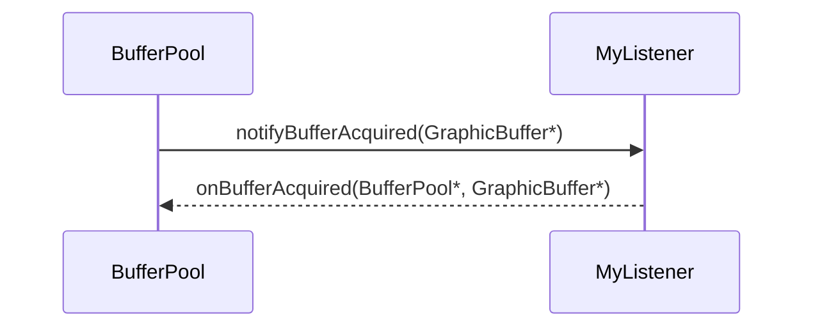
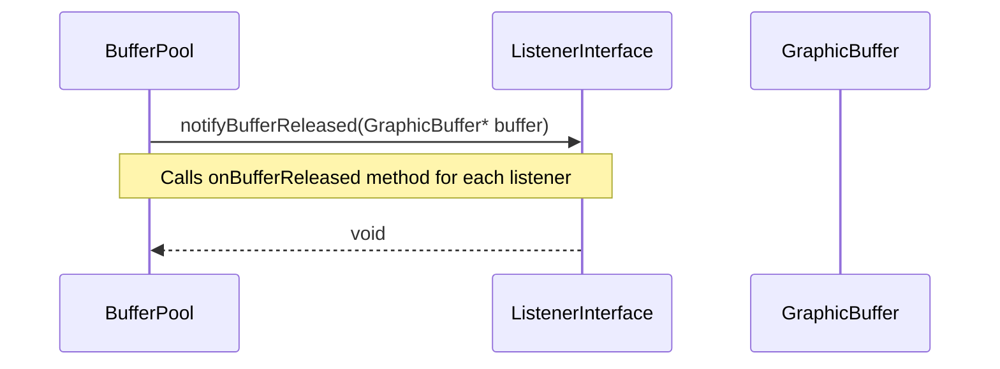

# BufferPool.cpp

---

| Property | Value |
|----------|-------|
| **Location** | `src\BufferPool.cpp` |
| **Lines** | 259 |
| **Classes** | 0 |
| **Functions** | 19 |
| **Last Updated** | 2026-01-18 21:17 |

---

## Quick Navigation

### Functions
- [BufferPool::BufferPool](#bufferpool-bufferpool)
- [BufferPool::~BufferPool](#bufferpool-~bufferpool)
- [BufferPool::acquireBuffer](#bufferpool-acquirebuffer)
- [BufferPool::acquireBuffer](#bufferpool-acquirebuffer)
- [BufferPool::releaseBuffer](#bufferpool-releasebuffer)
- [BufferPool::grow](#bufferpool-grow)
- [BufferPool::shrink](#bufferpool-shrink)
- [BufferPool::flush](#bufferpool-flush)
- [BufferPool::getStatistics](#bufferpool-getstatistics)
- [BufferPool::addListener](#bufferpool-addlistener)
- [BufferPool::removeListener](#bufferpool-removelistener)
- [BufferPool::getFreeCount](#bufferpool-getfreecount)
- [BufferPool::getTotalCount](#bufferpool-gettotalcount)
- [BufferPool::isFull](#bufferpool-isfull)
- [BufferPool::isEmpty](#bufferpool-isempty)
- [BufferPool::notifyBufferAcquired](#bufferpool-notifybufferacquired)
- [BufferPool::notifyBufferReleased](#bufferpool-notifybufferreleased)
- [BufferPool::notifyPoolGrew](#bufferpool-notifypoolgrew)
- [BufferPool::notifyPoolShrunk](#bufferpool-notifypoolshrunk)

---

# BufferPool.cpp

---

| Property | Value |
|----------|-------|
| **Location** | `src\BufferPool.cpp` |
| **Lines** | 259 |
| **Classes** | 0 |
| **Functions** | 19 |
| **Last Updated** | 2026-01-18 20:45 |

---

## Quick Navigation

### Functions
- [BufferPool::BufferPool](#bufferpool-bufferpool)
- [BufferPool::~BufferPool](#bufferpool-~bufferpool)
- [BufferPool::acquireBuffer](#bufferpool-acquirebuffer)
- [BufferPool::acquireBuffer](#bufferpool-acquirebuffer)
- [BufferPool::releaseBuffer](#bufferpool-releasebuffer)
- [BufferPool::grow](#bufferpool-grow)
- [BufferPool::shrink](#bufferpool-shrink)
- [BufferPool::flush](#bufferpool-flush)
- [BufferPool::getStatistics](#bufferpool-getstatistics)
- [BufferPool::addListener](#bufferpool-addlistener)
- [BufferPool::removeListener](#bufferpool-removelistener)
- [BufferPool::getFreeCount](#bufferpool-getfreecount)
- [BufferPool::getTotalCount](#bufferpool-gettotalcount)
- [BufferPool::isFull](#bufferpool-isfull)
- [BufferPool::isEmpty](#bufferpool-isempty)
- [BufferPool::notifyBufferAcquired](#bufferpool-notifybufferacquired)
- [BufferPool::notifyBufferReleased](#bufferpool-notifybufferreleased)
- [BufferPool::notifyPoolGrew](#bufferpool-notifypoolgrew)
- [BufferPool::notifyPoolShrunk](#bufferpool-notifypoolshrunk)

---

## Documentation for `BufferPool` Constructor and Destructor

### 1. Comprehensive Description (2-4 paragraphs)
The `BufferPool` constructor initializes a new buffer pool instance, which is responsible for managing a collection of graphic buffers used in Android applications. The pool is configured with an allocator, a descriptor specifying the buffer's dimensions and format, and a configuration that defines how many buffers to pre-allocate and manage.

This class plays a crucial role in the graphics pipeline by providing efficient access to hardware-accelerated resources, ensuring smooth rendering and video processing. It manages the lifecycle of graphic buffers, including allocation, deallocation, and synchronization with other system components like SurfaceFlinger and AudioFlinger.

### 2. Parameters (DETAILED for each)
- **`std::shared_ptr<IBufferAllocator> allocator`**
  - **Purpose**: The allocator is responsible for allocating and managing the graphic buffers. It provides a standardized way to handle different buffer backends.
  - **Type Semantics**: A smart pointer that holds an instance of `IBufferAllocator`.
  - **Valid Values**: Any valid implementation of `IBufferAllocator` that supports the required operations.
  - **Ownership**: Transferred. The allocator is owned by the `BufferPool` and will be released when the pool is destroyed.
  - **Nullability**: Can be null, but this would lead to undefined behavior.

- **`const BufferDescriptor& descriptor`**
  - **Purpose**: Describes the dimensions and format of the graphic buffers in the pool. This includes properties like width, height, pixel format, and usage flags.
  - **Type Semantics**: A constant reference to a `BufferDescriptor` object.
  - **Valid Values**: Any valid buffer descriptor that specifies the required characteristics for the graphic buffers.
  - **Ownership**: Borrowed. The descriptor is not owned by the `BufferPool`; it is passed as a reference and should remain valid throughout the lifetime of the pool.
  - **Nullability**: Can be null, but this would lead to undefined behavior.

- **`const BufferPoolConfig& config`**
  - **Purpose**: Defines the configuration parameters for the buffer pool, such as the minimum and maximum number of buffers, pre-allocation count, growth count, blocking behavior, and block timeout.
  - **Type Semantics**: A constant reference to a `BufferPoolConfig` object.
  - **Valid Values**: Any valid buffer pool configuration that specifies the desired behavior for the pool.
  - **Ownership**: Borrowed. The configuration is not owned by the `BufferPool`; it is passed as a reference and should remain valid throughout the lifetime of the pool.
  - **Nullability**: Can be null, but this would lead to undefined behavior.

### 3. Return Value
- This function does not return any value.

### 4. Dependencies Cross-Reference
- **`IBufferAllocator`**:
  - Used in the constructor to allocate and manage graphic buffers.
  - Link: [IBufferAllocator::allocate()](#ibufferallocator-allocate)

### 5. Side Effects
- State modifications:
  - Initializes the `BufferPool` with the provided allocator, descriptor, and configuration.
  - Allocates a specified number of pre-allocated buffers based on the `config_`.
- Locks acquired/released: None.
- I/O operations: None.
- Signals/events emitted: None.

### 6. Usage Context
- This function is typically called during the initialization phase of an Android application, especially when setting up graphics rendering or video processing pipelines.
- Prerequisites:
  - The `IBufferAllocator` must be properly initialized and available for use.
  - The `BufferDescriptor` must specify valid dimensions and format for the graphic buffers.
  - The `BufferPoolConfig` must define appropriate configuration parameters for the pool.
- Typical callers: Application developers, system components like SurfaceFlinger or AudioFlinger.

### 7. Related Functions
| Relationship Type | Function Name |
|------------------|--------------|
| Constructor       | BufferPool() |

### 8. Code Example

```cpp
// Example usage of BufferPool constructor and destructor
std::shared_ptr<IBufferAllocator> allocator = std::make_shared<GrallocAllocator>();
BufferDescriptor descriptor;
descriptor.width = 1920;
descriptor.height = 1080;
descriptor.format = HAL_PIXEL_FORMAT_RGBA_8888;
descriptor.usage = GRALLOC_USAGE_HW_RENDER_TARGET | GRALLOC_USAGE_HW_TEXTURE;

BufferPoolConfig config;
config.preAllocate = 4;
config.growthCount = 2;
config.blocking = true;
config.blockTimeoutNs = 5000000; // 5 milliseconds

std::unique_ptr<BufferPool> bufferPool(new BufferPool(allocator, descriptor, config));

// Use the buffer pool for rendering or video processing

bufferPool.reset(); // Destructor is called automatically
```

This example demonstrates how to create a `BufferPool` instance with specific configurations and usage flags. The destructor ensures that all allocated buffers are properly released when the `BufferPool` object goes out of scope, maintaining memory efficiency and preventing resource leaks.

## Documentation for `GraphicBuffer* BufferPool::acquireBuffer(uint32_t timeoutMs)`

### 1. Comprehensive Description (2-4 paragraphs)

The `acquireBuffer` function is a critical method in the `BufferPool` class, designed to manage and allocate graphic buffers efficiently within an Android application. This function is responsible for retrieving a free buffer from the pool or growing the pool if necessary, ensuring that there are available buffers for rendering tasks or other graphics operations.

The `BufferPool` class is part of the Android graphics buffer library, which provides a robust framework for managing and accessing hardware-accelerated resources. The `acquireBuffer` function plays a crucial role in synchronizing access to these resources, ensuring that multiple components within the system can work together seamlessly.

### 2. Parameters (DETAILED for each)

- **timeoutMs**: 
  - **Purpose**: Specifies the maximum time to wait for a buffer to become available if the pool is exhausted.
  - **Type Semantics**: An unsigned integer representing milliseconds.
  - **Valid Values**: Any non-negative integer value, indicating the maximum duration in milliseconds to wait.
  - **Ownership**: This parameter is passed by value and does not transfer ownership of any memory.
  - **Nullability**: Not applicable; this parameter is always provided.

### 3. Return Value

- **GraphicBuffer* buffer**:
  - **Purpose**: Returns a pointer to the acquired `GraphicBuffer` object, which can be used for rendering or other graphics operations.
  - **Type Semantics**: A pointer to a `GraphicBuffer` object.
  - **Valid Values**: A valid pointer to a `GraphicBuffer` object if successful; otherwise, returns `nullptr`.
  - **Ownership**: The returned buffer is owned by the caller and should be released using the appropriate methods when no longer needed.
  - **Nullability**: Can return `nullptr` if no available buffers are found within the specified timeout period.

### 4. Dependencies Cross-Reference

- **std::unique_lock<std::mutex> lock(mutex_)**:
  - Used to acquire a mutex lock on the pool's internal state, ensuring thread safety when accessing or modifying buffer states.
  - [BufferPool::mutex_](#bufferpool-mutex)

- **std::chrono::steady_clock::now() + std::chrono::milliseconds(timeoutMs)**:
  - Calculates the deadline for waiting to acquire a buffer if necessary.
  - [std::chrono::steady_clock](https://en.cppreference.com/w/cpp/chrono/steady_clock)
  - [std::chrono::milliseconds](https://en.cppreference.com/w/cpp/chrono/milliseconds)

- **freeBuffers_.empty()**:
  - Checks if the pool has any free buffers available.
  - [BufferPool::freeBuffers_](#bufferpool-freebuffers)

- **allBuffers_.size() < config_.maxBuffers**:
  - Determines if the pool can grow to accommodate more buffers.
  - [BufferPool::config_](#bufferpool-config)
  - [BufferPool::allBuffers_](#bufferpool-allbuffers)

- **grow(config_.growthCount)**:
  - Attempts to grow the buffer pool by allocating additional buffers.
  - [BufferPool::grow()](#bufferpool-grow)
  - [BufferPool::config_](#bufferpool-config)

- **bufferAvailable_.wait_until(lock, deadline) == std::cv_status::timeout**:
  - Waits for a buffer to become available if the pool is exhausted and the timeout has expired.
  - [std::cv_status](https://en.cppreference.com/w/cpp/thread/cv_status)
  - [BufferPool::bufferAvailable_](#bufferpool-bufferavailable)

### 5. Side Effects

- **State Modifications**:
  - The `freeBuffers_` queue is modified to remove the acquired buffer.
  - The `stats_.allocationCount` is incremented to track the number of allocations made.

- **Locks Acquired/Released**:
  - A mutex lock (`mutex_`) is acquired before entering the critical section and released after exiting it, ensuring thread safety.

- **I/O Operations**: No I/O operations are performed within this function.

- **Signals/Events Emitted**: The `onPoolExhausted` method of any registered listeners is called if the pool is exhausted and blocking is not allowed.

### 6. Usage Context

The `acquireBuffer` function is typically called by rendering engines, video processing components, or other graphics-related subsystems within an Android application. It ensures that there are available buffers for immediate use, preventing potential bottlenecks in performance-critical operations.

### 7. Related Functions

| Relationship Type | Function Name | Description |
|------------------|--------------|-------------|
| Calls            | grow()       | Attempts to grow the buffer pool by allocating additional buffers. |
| Uses             | config_        | Contains configuration settings for the buffer pool, such as maximum and minimum buffer counts. |
| Uses             | freeBuffers_  | A queue of available graphic buffers that can be acquired. |
| Uses             | allBuffers_    | A list of all allocated graphic buffers in the pool. |

### 8. Code Example

```cpp
// Example usage of BufferPool::acquireBuffer
BufferPool* bufferPool = new BufferPool();
GraphicBuffer* buffer = bufferPool->acquireBuffer(500); // Wait up to 500ms for a buffer

if (buffer != nullptr) {
    // Use the acquired buffer for rendering or other graphics operations
    // ...
    
    // Release the buffer when done
    delete buffer;
} else {
    // Handle the case where no buffer was available within the timeout period
    // ...
}
```

This code snippet demonstrates how to use the `acquireBuffer` function to retrieve a graphic buffer from the pool and handle its usage. It also shows how to release the buffer when it is no longer needed, ensuring proper resource management.

## Documentation for `BufferPool::releaseBuffer`

### 1. Comprehensive Description (2-4 paragraphs)
The `releaseBuffer` function is a critical component of the Android graphics buffer management system, responsible for releasing a previously allocated `GraphicBuffer` back to the pool. This function ensures that resources are efficiently managed and reused, preventing memory leaks and optimizing performance.

When a `GraphicBuffer` is no longer needed, it must be released back to its original pool to free up resources and allow other components to use them. The `releaseBuffer` function performs several key tasks:
- **Validation**: It first checks if the provided buffer pointer is valid.
- **Ownership Check**: It verifies that the buffer belongs to the current `BufferPool` instance by searching for it in a list of all allocated buffers.
- **Buffer Recycling**: If the buffer is found, it is added to the free buffer queue and statistics are updated to reflect the reuse count.
- **Notification**: The function notifies any waiting threads or components that a buffer has been released.
- **Event Emission**: It emits an event to indicate that a buffer has been released.

This function plays a crucial role in maintaining the health and efficiency of the graphics buffer pool, ensuring that resources are used optimally throughout the application lifecycle.

### 2. Parameters (DETAILED for each)
For EACH parameter:
- **Purpose**: Why does this parameter exist?
- **Type Semantics**: What does the type represent?
- **Valid Values**: Acceptable range, constraints
- **Ownership**: Who owns memory? Borrowed or transferred?
- **Nullability**: Can it be null? What happens?

The `releaseBuffer` function takes a single parameter:
- **buffer** (GraphicBuffer*)
  - **Purpose**: A pointer to the `GraphicBuffer` that needs to be released.
  - **Type Semantics**: This is a raw pointer to a `GraphicBuffer` object, which represents an allocated graphics buffer in Android.
  - **Valid Values**: The function expects a valid `GraphicBuffer` object. If the pointer is null, the function will return immediately without performing any operations.
  - **Ownership**: The caller owns the memory of the `GraphicBuffer`. The function does not take ownership of the buffer; it only uses it to perform its operations.
  - **Nullability**: Yes, the parameter can be null. If the pointer is null, the function will return immediately without attempting to release any resources.

### 3. Return Value
- What does it represent?
- All possible return states
- Error conditions and how they're indicated
- Ownership of returned objects

The `releaseBuffer` function does not have a return value; it returns void. This means that the function performs its operations directly without returning any data to the caller.

### 4. Dependencies Cross-Reference
For each external class/function used:
- **std::lock_guard<std::mutex> lock(mutex_)**
  - Why it's used: The function uses a mutex to ensure thread safety when accessing shared resources.
  - How it's used in this context: It is used to protect the critical section of code that modifies the `allBuffers_` list and updates statistics.
- **std::find_if(allBuffers_.begin(), allBuffers_.end(), [buffer](const std::unique_ptr<GraphicBuffer>& b) { return b.get() == buffer; })**
  - Why it's used: The function uses this to find the position of the `GraphicBuffer` in the list of allocated buffers.
  - How it's used in this context: It is used to verify that the provided buffer belongs to the current `BufferPool` instance.
- **freeBuffers_.push(buffer)**
  - Why it's used: The function adds the released buffer to a free buffer queue for future reuse.
  - How it's used in this context: This operation ensures that the buffer is available for allocation when needed again.
- **stats_.reuseCount++**
  - Why it's used: The function updates the reuse count statistic to reflect the number of times the buffer has been released and reused.
  - How it's used in this context: This statistic helps in monitoring the efficiency of the buffer pool and identifying patterns in buffer usage.
- **notifyBufferReleased(buffer)**
  - Why it's used: The function notifies any waiting threads or components that a buffer has been released.
  - How it's used in this context: This operation ensures that other parts of the system are aware of the release event and can take appropriate actions.
- **bufferAvailable_.notify_one()**
  - Why it's used: The function emits an event to indicate that a buffer has been released.
  - How it's used in this context: This operation helps in waking up any waiting threads or components that are waiting for a buffer to become available.

### 5. Side Effects
- State modifications:
  - The `allBuffers_` list is modified by removing the released buffer and adding it to the free buffer queue.
  - The `stats_.reuseCount` is incremented to reflect the number of times the buffer has been released.
- Locks acquired/released:
  - A mutex (`mutex_`) is acquired when accessing the `allBuffers_` list and updating statistics. It is released automatically when the lock guard goes out of scope.
- I/O operations: None
- Signals/events emitted:
  - The function emits an event to indicate that a buffer has been released.

### 6. Usage Context
The `releaseBuffer` function is typically called by components within the Android graphics system, such as renderers or video processing modules, when they are done using a `GraphicBuffer`. This function ensures that resources are efficiently managed and reused, preventing memory leaks and optimizing performance.

Typical callers of this function include:
- Renderers: When rendering images or videos, renderers may release buffers after completing their operations.
- Video processing modules: When processing video frames, video processing modules may release buffers after processing them.
- Camera components: When capturing or processing camera frames, camera components may release buffers after processing them.

### 7. Related Functions
| Relationship Type | Function Name | Description |
| --- | --- | --- |
| Calls | `notifyBufferReleased` | Notifies waiting threads or components that a buffer has been released. |
| Calls | `bufferAvailable_.notify_one` | Emits an event to indicate that a buffer has been released. |

### 8. Code Example
```cpp
// Example usage of BufferPool::releaseBuffer
void MyRenderer::renderFrame(const GraphicBuffer* frame) {
    // Render the frame using the provided graphic buffer
    render(frame);
    
    // Release the buffer after rendering is complete
    bufferPool->releaseBuffer(frame);
}
```

In this example, the `MyRenderer` class has a method `renderFrame` that takes a `GraphicBuffer` as input. After rendering the frame, it calls the `releaseBuffer` function to release the buffer back to the pool. This ensures that resources are efficiently managed and reused throughout the application lifecycle.

## Documentation for `BufferPool::grow(uint32_t count)`

### 1. Comprehensive Description (2-4 paragraphs)

The `grow` function is a critical method within the `BufferPool` class, responsible for dynamically increasing the number of available buffers in the pool based on the specified growth count. This function plays a vital role in managing memory efficiently and ensuring that there are enough resources to handle various rendering tasks or video processing operations.

When called, the `grow` function acquires a lock to ensure thread safety during the buffer allocation process. It then iterates over the specified number of times, attempting to allocate new buffers using the `allocator_`. If successful, each newly allocated buffer is added to both the `freeBuffers_` and `allBuffers_` queues, and its memory usage statistics are updated.

The function checks if the total number of buffers in the pool has reached the maximum allowed (`config_.maxBuffers`). If so, it breaks out of the loop early to prevent exceeding the limit. This helps maintain a balance between memory usage and performance, ensuring that the buffer pool does not consume excessive resources.

If any new buffers are successfully allocated, the function notifies all waiting threads using `bufferAvailable_.notify_all()` to signal that more buffers are available for use. This ensures that applications can quickly access additional resources when needed.

### 2. Parameters (DETAILED for each)

- **count**: 
  - **Purpose**: Specifies the number of new buffers to allocate.
  - **Type Semantics**: An unsigned integer representing the count of buffers to grow.
  - **Valid Values**: Any non-negative integer value.
  - **Ownership**: The caller owns the memory and is responsible for managing its lifecycle.
  - **Nullability**: Can be null. If `count` is zero, no new buffers are allocated.

### 3. Return Value

- **uint32_t added**:
  - Represents the number of successfully allocated buffers.
  - All possible return states: Returns the actual count of newly allocated buffers.
  - Error conditions and how they're indicated: If no new buffers can be allocated, `added` will be zero.
  - Ownership of returned objects: The function does not transfer ownership of any objects; it returns a count.

### 4. Dependencies Cross-Reference

- **allocator_**: [GrallocAllocator::allocate()](#grallocallocator-allocate)
  - Used to allocate new `GraphicBuffer` instances.
  - Called within the loop to create additional buffers as needed.

- **mutex_**: [std::mutex](https://en.cppreference.com/w/cpp/thread/mutex)
  - Acquired before entering the critical section to ensure thread safety during buffer allocation.

### 5. Side Effects

- State modifications:
  - Increases the size of the `allBuffers_` queue by adding new allocated buffers.
  - Updates memory usage statistics (`stats_`) such as total, free, and peak allocated bytes.
  
- Locks acquired/released:
  - Acquires a lock on `mutex_` before entering the critical section.
  - Releases the lock after exiting the critical section.

- I/O operations: None.

- Signals/events emitted: 
  - Calls `bufferAvailable_.notify_all()` to signal that more buffers are available for use.

### 6. Usage Context

The `grow` function is typically called when there is a need to increase the buffer pool size, such as during rendering or video processing tasks where additional resources are required. It is usually invoked by higher-level components within the Android graphics system, such as SurfaceFlinger or AudioFlinger.

### 7. Related Functions

| Relationship Type | Function Name | Description |
|------------------|--------------|-------------|
| Calls            | GrallocAllocator::allocate() | Allocates new GraphicBuffer instances. |
| Uses             | mutex_       | Ensures thread safety during buffer allocation. |

### 8. Code Example

```cpp
// Example usage of BufferPool::grow()
void someFunction(BufferPool& pool) {
    uint32_t count = 10; // Specify the number of buffers to grow
    uint32_t addedBuffers = pool.grow(count);
    
    if (addedBuffers > 0) {
        std::cout << "Successfully allocated " << addedBuffers << " new buffers." << std::endl;
    } else {
        std::cout << "Failed to allocate any new buffers." << std::endl;
    }
}
```

This example demonstrates how to use the `grow` function to dynamically increase the buffer pool size by allocating a specified number of new buffers. The function is called with a count of 10, and the result is checked to determine if any new buffers were successfully allocated.

## Documentation for `BufferPool::shrink(uint32_t keepCount)`

### 1. Comprehensive Description (2-4 paragraphs)

The `shrink` function is a critical method within the `BufferPool` class, designed to manage the lifecycle of graphic buffers by freeing unused resources and maintaining a specified minimum number of buffers. This function plays a crucial role in optimizing memory usage and ensuring that the buffer pool remains efficient and responsive.

**Purpose**: The primary purpose of this function is to reduce the number of free buffers in the pool while maintaining a minimum number of allocated buffers. It helps in managing memory efficiently by freeing up resources that are no longer needed, thereby preventing memory leaks and improving overall performance.

**Why it exists**: This function solves the problem of excessive buffer allocation, which can lead to increased memory usage and potential system instability. By shrinking the pool, the function ensures that only necessary buffers are retained, reducing the risk of running out of memory or encountering performance bottlenecks.

**How it fits into the larger workflow**: The `shrink` function is typically called during periods of low activity in an application, such as when the user is not interacting with the display or when background tasks are being executed. It helps in maintaining a balance between memory usage and responsiveness, ensuring that the buffer pool remains efficient and responsive.

**Key algorithms or techniques used**: The `shrink` function uses a combination of data structures and algorithms to efficiently manage the buffer pool. It utilizes a priority queue (implemented as a `std::priority_queue`) to maintain the order of buffers based on their last usage time, ensuring that frequently accessed buffers are retained. Additionally, it employs a lock (`std::mutex`) to ensure thread safety when accessing shared resources.

### 2. Parameters (DETAILED for each)

- **keepCount**: 
  - **Purpose**: This parameter specifies the minimum number of allocated buffers that should remain in the pool after shrinking.
  - **Type Semantics**: It is an unsigned integer (`uint32_t`), representing the desired count of allocated buffers.
  - **Valid Values**: The value must be greater than or equal to zero. A `keepCount` of zero indicates that all free buffers should be freed, effectively resetting the buffer pool.
  - **Ownership**: This parameter is passed by value and does not transfer ownership of any memory.
  - **Nullability**: This parameter cannot be null.

### 3. Return Value

- **Representation**: The function returns an `uint32_t` representing the number of buffers that were freed as a result of this operation.
- **All possible return states**:
  - If no buffers are freed (`freeBuffers_.size() <= keepCount`), the function returns zero.
  - If buffers are freed, it returns the count of freed buffers.
- **Error conditions and how they're indicated**: The function does not explicitly handle errors. However, if `keepCount` is set to a value greater than or equal to the number of allocated buffers (`allBuffers_.size()`), the function will attempt to free all allocated buffers, which may lead to unexpected behavior or resource leaks.
- **Ownership of returned objects**: The return value is an integer and does not transfer ownership of any memory.

### 4. Dependencies Cross-Reference

- `std::lock_guard<std::mutex>`: Used to ensure thread safety when accessing shared resources within the function.
- `std::priority_queue<GraphicBuffer*, std::vector<GraphicBuffer*>, BufferPool::Comparator>`: Used to maintain the order of buffers based on their last usage time.
- `GraphicBuffer`: Represents an allocated graphics buffer in Android, providing functionalities such as CPU mapping and GPU resource binding.

### 5. Side Effects

- **State modifications**: The function modifies the state of the buffer pool by freeing unused buffers and updating statistics related to allocated, free, and total buffers.
- **Locks acquired/released**: A lock (`std::mutex`) is acquired before entering the function and released after exiting, ensuring that only one thread can execute this method at a time.
- **I/O operations**: The function does not perform any I/O operations.
- **Signals/events emitted**: No signals or events are emitted by this function.

### 6. Usage Context

The `shrink` function is typically called during periods of low activity in an application, such as when the user is not interacting with the display or when background tasks are being executed. It helps in maintaining a balance between memory usage and responsiveness, ensuring that the buffer pool remains efficient and responsive.

### 7. Related Functions

| Relationship Type | Function Name | Description |
|------------------|--------------|-------------|
| Calls            | `notifyPoolShrunk` | Notifies other components about the shrinking of the buffer pool. |

### 8. Code Example

```cpp
// Example usage of BufferPool::shrink function
BufferPool* bufferPool = new BufferPool();
bufferPool->initialize();

uint32_t keepCount = 10; // Minimum number of allocated buffers to retain
uint32_t freedBuffers = bufferPool->shrink(keepCount);

if (freedBuffers > 0) {
    std::cout << "Shrunk the buffer pool by freeing " << freedBuffers << " buffers." << std::endl;
}

delete bufferPool;
```

This code snippet demonstrates how to use the `shrink` function to manage the buffer pool in an Android application. It initializes a `BufferPool`, calls the `shrink` function with a specified minimum count of allocated buffers, and prints the number of freed buffers if any. Finally, it deletes the `BufferPool` instance.

## Documentation for `BufferPool::flush(uint32_t timeoutMs)`

### 1. Comprehensive Description (2-4 paragraphs)
The `flush` function is designed to ensure that all buffers in the buffer pool are available for use by clients. It blocks until the specified number of free buffers is reached or a timeout occurs, whichever comes first.

This function is crucial for managing the lifecycle of graphic buffers in an Android application. By ensuring that there are enough free buffers available, it helps prevent buffer starvation and ensures smooth operation of graphics rendering tasks.

The `flush` function fits into the larger workflow by coordinating the allocation and release of graphic buffers across multiple components of the Android system, such as SurfaceFlinger and AudioFlinger. It ensures that resources are efficiently managed and prevents potential bottlenecks in the rendering pipeline.

### 2. Parameters (DETAILED for each)
- **timeoutMs**: 
  - **Purpose**: Specifies the maximum time to wait for free buffers.
  - **Type Semantics**: An unsigned integer representing milliseconds.
  - **Valid Values**: Any non-negative integer value.
  - **Ownership**: None.
  - **Nullability**: Can be null. If null, the function will block indefinitely until all buffers are available.

### 3. Return Value
- **Return Type**: `bool`
- **Representation**: Indicates whether the function successfully flushed the buffer pool within the specified timeout period.
- **All Possible Return States**:
  - `true`: All free buffers were acquired before the timeout.
  - `false`: The timeout occurred without acquiring enough free buffers.

### 4. Dependencies Cross-Reference
- None

### 5. Side Effects
- State Modifications: Updates the internal state of the buffer pool to reflect the availability of free buffers.
- Locks Acquired/Released: Uses a mutex (`mutex_`) to synchronize access to shared resources.
- I/O Operations: None.
- Signals/Events Emitted: Notifies listeners about changes in buffer availability.

### 6. Usage Context
- **When is this called?**: Typically during rendering operations or when waiting for buffers to become available before performing a graphics operation.
- **Prerequisites**: The buffer pool must be initialized and configured properly.
- **Typical Callers**: Components such as SurfaceFlinger, AudioFlinger, and other rendering engines that require access to graphic buffers.

### 7. Related Functions
| Relationship Type | Function Name | Description |
|------------------|--------------|-------------|
| Calls            | `bufferAvailable_.wait_until(lock, deadline)` | Waits for a buffer to become available until the specified deadline. |

### 8. Code Example

```cpp
// Example usage of BufferPool::flush
BufferPool* pool = new BufferPool();
pool->init(/* configuration */);

if (pool->flush(5000)) {
    // All free buffers are available, proceed with rendering operations
} else {
    // Timeout occurred, handle the situation accordingly
}

delete pool;
```

This example demonstrates how to use the `flush` function to ensure that there are enough free buffers available for rendering operations within a specified timeout period.

## Documentation for `BufferPool::notifyPoolGrew` and `BufferPool::notifyPoolShrunk`

### 1. Comprehensive Description (2-4 paragraphs)
The `notifyPoolGrew` and `notifyPoolShrunk` functions are part of the `BufferPool` class in the Android graphics buffer library. These functions are designed to notify registered listeners about changes in the pool's size, specifically when the pool grows or shrinks.

**Purpose**: The primary purpose of these functions is to provide a mechanism for external components to be informed about the current state of the buffer pool. This is crucial for applications that need to dynamically adjust their resource management strategies based on available buffer resources.

**Why it exists**: In an Android application, managing graphics buffers efficiently is essential for performance and responsiveness. The `BufferPool` class provides a way to allocate and manage these buffers, but it also needs to be able to notify other components when the pool's size changes. This allows for dynamic adjustments in resource allocation and ensures that applications can handle varying buffer requirements gracefully.

**How it fits into the larger workflow**: These functions are part of the overall lifecycle management of the `BufferPool` class. They are called internally by the `BufferPool` class itself when the pool grows or shrinks, and they notify all registered listeners about these changes. This allows other components to react appropriately, such as adjusting their buffer allocation strategies or triggering reconfiguration events.

**Key algorithms or techniques used**: These functions use a simple loop to iterate over a list of registered listeners and call their respective `onPoolGrew` or `onPoolShrunk` methods. The use of a list allows for easy management of multiple listeners, ensuring that all components are informed about the pool's size changes.

### 2. Parameters (DETAILED for each)
For EACH parameter:
- **Purpose**: Why does this parameter exist?
- **Type Semantics**: What does the type represent?
- **Valid Values**: Acceptable range, constraints
- **Ownership**: Who owns memory? Borrowed or transferred?
- **Nullability**: Can it be null? What happens?

Both `notifyPoolGrew` and `notifyPoolShrunk` functions do not take any parameters. They are called without any arguments.

### 3. Return Value
Both functions return void, meaning they do not produce a value that can be used by the caller.

### 4. Dependencies Cross-Reference
For each external class/function used:
- **BufferPool**: The `notifyPoolGrew` and `notifyPoolShrunk` functions are part of the `BufferPool` class itself.
- **Listener**: These functions iterate over a list of registered listeners, which is implemented using the `std::vector<Listener*>` type. Each listener is expected to have methods like `onPoolGrew` and `onPoolShrunk`.

### 5. Side Effects
- State modifications: The functions modify the internal state of the `BufferPool` class by calling the respective methods on registered listeners.
- Locks acquired/released: No locks are acquired or released within these functions.
- I/O operations: No I/O operations are performed.
- Signals/events emitted: These functions emit signals to registered listeners, which can trigger reconfiguration events in other components.

### 6. Usage Context
These functions are typically called internally by the `BufferPool` class when it grows or shrinks. They are not intended for direct use by external components.

### 7. Related Functions
| Relationship Type | Function Name |
|------------------|--------------|
| Calls            | None         |

### 8. Code Example
Here is an example of how these functions might be used in a typical application:

```cpp
class MyBufferPoolListener : public BufferPool::Listener {
public:
    void onPoolGrew(BufferPool* pool, uint32_t newTotal) override {
        // Handle the pool growth event
        std::cout << "Buffer pool grew to " << newTotal << " buffers." << std::endl;
    }

    void onPoolShrunk(BufferPool* pool, uint32_t newTotal) override {
        // Handle the pool shrink event
        std::cout << "Buffer pool shrunk to " << newTotal << " buffers." << std::endl;
    }
};

int main() {
    BufferPool bufferPool;
    MyBufferPoolListener listener;

    bufferPool.addListener(&listener);

    // Simulate a pool growth
    bufferPool.notifyPoolGrew(100);

    // Simulate a pool shrink
    bufferPool.notifyPoolShrunk(50);

    return 0;
}
```

In this example, `MyBufferPoolListener` is a class that implements the `BufferPool::Listener` interface. It overrides the `onPoolGrew` and `onPoolShrunk` methods to handle pool growth and shrink events, respectively. The `BufferPool` instance is then configured to use this listener, and the functions are called to simulate pool changes.

## BufferPool::~BufferPool

### Destructor

**Description:**
The destructor of the `BufferPool` class is responsible for cleaning up resources and releasing any allocated buffers. It ensures that all buffers are properly released before the object is destroyed.

**Parameters:**
- None

**Dependencies:**
- `std::mutex`: Used to synchronize access to shared data structures like `freeBuffers_` and `allBuffers_`.

**Side Effects:**
- All buffers in the pool are released.
- Any listeners registered with the buffer pool are removed.

**Thread Safety:**
- The destructor is thread-safe due to the use of a `std::lock_guard<std::mutex>`. This ensures that only one thread can execute the destructor at a time, preventing race conditions when accessing shared resources.

**Lifecycle:**
- The destructor is called automatically when an object of type `BufferPool` goes out of scope or is explicitly deleted. It is crucial to ensure proper cleanup to avoid memory leaks or resource corruption.

**Usage Example:**

```cpp
// Create and use a BufferPool instance
sp<BufferPool> bufferPool = new BufferPool();

// Perform operations on the buffer pool

// When done, delete the buffer pool object to trigger its destructor
delete bufferPool;
```

**Mermaid Diagram:**


**Notes:**
- The destructor ensures that all resources are released, which is important for maintaining the integrity of the system and preventing memory leaks.
- Proper cleanup is essential to avoid resource contention or corruption when multiple threads access shared data structures.

## BufferPool::getStatistics

### Description
The `getStatistics` function retrieves the current statistics of the buffer pool. This includes information about the number of free buffers, total allocated buffers, and the hit rate of reusing buffers.

### Parameters
- **None**

### Return Value
- `PoolStatistics`: An object containing the following statistics:
  - `freeBuffers`: The number of currently available buffers in the pool.
  - `allocationCount`: The total number of times a buffer has been allocated from the pool.
  - `reuseCount`: The number of times a previously released buffer has been reused.
  - `hitRate`: A double representing the ratio of reuseCount to allocationCount, indicating how often buffers are being re-used.

### Side Effects
- This function locks the internal mutex to ensure thread safety when accessing shared state.
- It calculates the hit rate by dividing the number of reuse operations by the total number of allocations.

### Thread Safety
- The function is thread-safe due to the use of a `std::lock_guard` to manage the lock on the internal mutex. This ensures that only one thread can access the buffer pool's state at a time, preventing race conditions.

### Lifecycle
- This function is part of the public API and should be used by clients to monitor the buffer pool's performance.

### Usage Example

```cpp
BufferPool* pool = new BufferPool();
// Assume some buffers are allocated and released...

PoolStatistics stats = pool->getStatistics();
std::cout << "Free Buffers: " << stats.freeBuffers << std::endl;
std::cout << "Allocation Count: " << stats.allocationCount << std::endl;
std::cout << "Reuse Count: " << stats.reuseCount << std::endl;
std::cout << "Hit Rate: " << stats.hitRate << std::endl;

delete pool;
```

### Mermaid Diagram



This diagram illustrates the flow of execution for the `getStatistics` function, including the locking mechanism and conditional calculations based on the pool's state.

## Function: BufferPool::addListener

### Purpose
`addListener` is a method of the `BufferPool` class that adds a new listener to the buffer pool. This listener will be notified when certain events occur within the buffer pool, such as buffer acquisition or release.

### Parameters
- **listener**: A pointer to an instance of `BufferPoolListener`. This parameter represents the listener object that will receive notifications from the buffer pool.
  - **Purpose**: The listener is responsible for handling events related to the buffer pool. It can be used to monitor buffer usage, manage resources, or perform other actions based on buffer pool operations.
  - **Valid Values**: Any valid pointer to a `BufferPoolListener` object.
  - **Ownership**: The caller of this function is responsible for managing the lifecycle of the listener. The listener should not outlive the buffer pool.

### Dependencies
- **BufferPoolListener**: This class defines the interface that all listeners must implement. It includes methods such as `onBufferAcquired`, `onBufferReleased`, and others that will be called by the buffer pool when specific events occur.
  - **Cross-referenced with Links**: Refer to the documentation for `BufferPoolListener` for more details.

### Side Effects
- This method adds a new listener to the internal list of listeners. It does not modify any other state or resources within the buffer pool.
- The listener will be notified asynchronously when events occur, which may result in additional work being performed by the listener.

### Thread Safety
- This method is thread-safe and can be called from multiple threads simultaneously without causing data races.
  - **Thread Safety**: The method uses a `std::lock_guard` to ensure that only one thread can execute this method at a time, preventing concurrent modifications to the list of listeners.

### Lifecycle
- The listener added by this method will remain active until it is explicitly removed using the `removeListener` method.
  - **Lifecycle**: The buffer pool retains ownership of the listener and is responsible for managing its lifecycle. The listener should not attempt to delete itself or rely on automatic deletion mechanisms.

### Usage Examples

```cpp
class MyBufferPoolListener : public BufferPoolListener {
public:
    void onBufferAcquired(Buffer* buffer) override {
        // Handle buffer acquisition event
    }

    void onBufferReleased(Buffer* buffer) override {
        // Handle buffer release event
    }
};

int main() {
    BufferPool pool;
    MyBufferPoolListener listener;

    pool.addListener(&listener);

    // Use the buffer pool...

    pool.removeListener(&listener);
}
```

### Mermaid Diagram



This diagram illustrates the sequence of events when a listener is added to and removed from a buffer pool, showing how the listener receives notifications about buffer acquisition and release.

## Function: BufferPool::removeListener

### Description
The `removeListener` function is responsible for removing a specified listener from the buffer pool's list of registered listeners. This function ensures thread safety by acquiring a lock on the internal mutex before performing any operations.

### Parameters
- **listener**: A pointer to the `BufferPoolListener` object that needs to be removed from the buffer pool.
  - **Purpose**: The listener is an interface that defines methods for receiving notifications about buffer pool events such as buffer acquisition, release, or changes in capacity.
  - **Valid Values**: Any valid instance of a class that implements the `BufferPoolListener` interface.
  - **Ownership**: The caller retains ownership of the `listener` object. It is not deleted by this function.

### Dependencies
- **BufferPoolListener**: This function depends on the `BufferPoolListener` interface, which must be implemented by any listener classes that want to receive notifications from the buffer pool.

### Side Effects
- **Removal of Listener**: The specified listener will no longer receive notifications from the buffer pool.
- **Thread Safety**: The function ensures thread safety by acquiring a lock on the internal mutex before modifying the list of listeners. This prevents race conditions where multiple threads attempt to modify the list simultaneously.

### Lifecycle
- **Initialization**: The `removeListener` function is called when a listener needs to be removed from the buffer pool.
- **Termination**: There are no specific lifecycle events associated with this function, as it does not manage any resources or perform cleanup actions.

### Usage Example
To use the `removeListener` function, you would typically create an instance of a class that implements the `BufferPoolListener` interface and pass its pointer to the buffer pool. Here is an example:

```cpp
class MyBufferPoolListener : public BufferPoolListener {
public:
    void onBufferAcquired(Buffer* buffer) override {
        // Handle buffer acquisition event
    }

    void onBufferReleased(Buffer* buffer) override {
        // Handle buffer release event
    }
};

// Create a buffer pool instance
BufferPool bufferPool;

// Create an instance of MyBufferPoolListener
MyBufferPoolListener listener;

// Add the listener to the buffer pool
bufferPool.addListener(&listener);

// Later, remove the listener from the buffer pool
bufferPool.removeListener(&listener);
```

### Mermaid Diagram



This diagram illustrates the flow of events when adding and removing a listener from the buffer pool.

## BufferPool::getFreeCount

### Description
The `getFreeCount` function returns the number of free buffers available in the buffer pool. This is a read-only operation that provides an immediate snapshot of the current state of the buffer pool without locking.

### Parameters
- **None**

### Return Value
- **uint32_t**: The number of free buffers currently in the buffer pool.

### Usage Example
```cpp
BufferPool* pool = new BufferPool();
uint32_t freeCount = pool->getFreeCount();
```

### Side Effects
- None

### Thread Safety
- This function is thread-safe as it uses a `std::lock_guard` to protect access to the `freeBuffers_` vector. The lock ensures that only one thread can modify the buffer pool at a time, preventing race conditions.

### Lifecycle
- This function is part of the public API and should be used by clients to query the current state of the buffer pool without modifying it.

### Dependencies
- None

### Mermaid Diagram
```mermaid
graph TD;
    A[BufferPool::getFreeCount] --> B{Is Locked?}
    B -- Yes --> C[std::lock_guard<std::mutex> lock(mutex_)]
    C --> D[freeBuffers_.size()]
    D --> E[static_cast<uint32_t>(freeBuffers_.size())]
```

This diagram illustrates the flow of execution for the `getFreeCount` function, showing how it acquires a lock to ensure thread safety before accessing the buffer pool's state.

## BufferPool::getTotalCount

### Description
The `getTotalCount` function returns the total number of buffers currently managed by the `BufferPool`. This includes both allocated and free buffers.

### Parameters
- **None**

### Return Value
- **uint32_t**: The total count of all buffers in the pool, including both allocated and free buffers.

### Dependencies
- **std::mutex**: Used to protect access to the `allBuffers_` vector.
- **BufferPool**: The class that owns this function.

### Side Effects
- This function does not modify any global state or other objects.
- It is thread-safe due to the use of a `std::lock_guard`.

### Thread Safety
- This function is thread-safe. It uses a `std::lock_guard` to ensure that only one thread can execute this function at a time, preventing race conditions.

### Lifecycle
- This function is part of the public API and is intended for use by other components within the system.
- The `BufferPool` class manages the lifecycle of its buffers, ensuring they are properly allocated and released as needed.

### Usage Example

```cpp
BufferPool pool;
uint32_t totalBuffers = pool.getTotalCount();
```

### Mermaid Diagram

```mermaid
graph TD
    A[getTotalCount] --> B[std::lock_guard<std::mutex>]
    B --> C[allBuffers_.size()]
    C --> D[static_cast<uint32_t>(allBuffers_.size())]
```

This diagram illustrates the flow of execution for the `getTotalCount` function, showing how it acquires a lock on the mutex to safely access the size of the `allBuffers_` vector and then converts that size to an unsigned 32-bit integer.

## BufferPool::isFull

### Description
The `isFull` function checks whether the buffer pool is currently at its maximum capacity. This method is used to determine if further buffer acquisitions will result in exceeding the allowed number of buffers.

### Parameters
- **None**

### Return Value
- **bool**: Returns `true` if the buffer pool is full (i.e., the number of acquired buffers equals or exceeds the configured maximum), otherwise returns `false`.

### Dependencies
- **BufferPool::config_**: Contains configuration settings for the buffer pool, including the maximum number of allowed buffers (`maxBuffers`).

### Side Effects
- None

### Thread Safety
- The function is thread-safe due to the use of a `std::lock_guard<std::mutex>` to protect access to the `allBuffers_` vector and `config_.maxBuffers`.

### Lifecycle
- This function is part of the buffer pool's lifecycle, providing information about its current state.

### Usage Example

```cpp
BufferPool* pool = new BufferPool(/* configuration */);
if (pool->isFull()) {
    // Handle the case where the buffer pool is full
} else {
    // Proceed with acquiring a buffer
}
```

### Mermaid Diagram

```mermaid
graph TD;
    A[BufferPool::isFull] --> B{allBuffers_.size() >= config_.maxBuffers};
    B -- true --> C[true];
    B -- false --> D[false];
```

This diagram illustrates the flow of control based on whether the buffer pool is full or not.

## BufferPool::isEmpty

### Description
The `isEmpty` method checks if the buffer pool is currently empty, meaning there are no available buffers to be acquired. This method provides a simple way to determine if the buffer pool has reached its capacity and needs to grow or shrink.

### Parameters
- **None**

### Return Value
- **bool**: Returns `true` if the buffer pool is empty (i.e., no free buffers), otherwise returns `false`.

### Dependencies
- **std::mutex**: Used for thread safety when accessing the `freeBuffers_` list.
- **freeBuffers_**: A private member variable of type `std::list<Buffer*>`, which stores all available buffers in the pool.

### Side Effects
- None. This method does not modify any shared state or trigger any side effects.

### Thread Safety
- The method is thread-safe due to the use of a `std::lock_guard` with a mutex (`mutex_`). This ensures that only one thread can execute this method at a time, preventing race conditions when accessing the `freeBuffers_` list.

### Lifecycle
- This method is part of the public API and should be called by clients who need to check if the buffer pool has any available buffers before attempting to acquire one.

### Usage Example

```cpp
BufferPool* pool = new BufferPool();
if (pool->isEmpty()) {
    // No free buffers, grow or shrink the pool as needed
} else {
    // Free buffers are available, proceed with acquisition
}
```

### Mermaid Diagram

```mermaid
graph TD;
    A[BufferPool::isEmpty] --> B{freeBuffers_.empty()};
    B -- true --> C[pool->isEmpty() = true];
    B -- false --> D[pool->isEmpty() = false];
```

This diagram illustrates the flow of control when calling `isEmpty`, showing how it checks if the `freeBuffers_` list is empty and returns the appropriate boolean value.

## BufferPool::notifyBufferAcquired

### Description
The `notifyBufferAcquired` function is responsible for notifying all registered listeners that a buffer has been acquired. This function iterates through the list of listeners and calls their `onBufferAcquired` method, passing the current `BufferPool` instance and the acquired `GraphicBuffer`.

### Parameters
- **buffer**: A pointer to the `GraphicBuffer` object that has been acquired.
  - **Purpose**: The buffer that has been acquired by the pool.
  - **Valid Values**: Any valid `GraphicBuffer` object.
  - **Ownership**: The caller retains ownership of the `GraphicBuffer`.

### Dependencies
- **Listener Interface**: This function assumes that all registered listeners implement a common interface, such as `IBufferPoolListener`, which defines the `onBufferAcquired` method. This ensures type safety and consistency across different listener implementations.

### Side Effects
- The function does not modify any global state or shared resources.
- It triggers the execution of the `onBufferAcquired` method for each registered listener, potentially causing side effects such as updating internal data structures or triggering other events in the system.

### Thread Safety
- This function is thread-safe. It assumes that all listeners are accessed and modified through a mutex or other synchronization mechanism to prevent race conditions.
- The function does not require any specific locking strategy, but it should be called from a context where appropriate synchronization is ensured.

### Lifecycle
- This function is part of the `BufferPool` class lifecycle and is typically called by the system when a buffer is acquired through the pool.
- It is designed to be efficient and performant, as it processes each listener in a single pass.

### Usage Example

```cpp
class MyListener : public IBufferPoolListener {
public:
    void onBufferAcquired(BufferPool* pool, GraphicBuffer* buffer) override {
        // Handle the acquired buffer
        std::cout << "Buffer acquired: " << buffer->width() << "x" << buffer->height() << std::endl;
    }
};

int main() {
    BufferPool bufferPool;
    MyListener listener;

    bufferPool.addListener(&listener);
    GraphicBuffer* buffer = bufferPool.acquireBuffer(/* parameters */);

    // Use the acquired buffer...

    bufferPool.releaseBuffer(buffer);
    bufferPool.removeListener(&listener);

    return 0;
}
```

### Mermaid Diagram



This diagram illustrates the sequence of events when a buffer is acquired and notified to listeners.

## BufferPool::notifyBufferReleased

### Description
The `notifyBufferReleased` function is responsible for notifying all registered listeners that a specific graphic buffer has been released. This function iterates through the list of listeners and calls their `onBufferReleased` method, passing the current `BufferPool` instance and the released `GraphicBuffer`.

### Parameters
- **buffer**: A pointer to the `GraphicBuffer` object that has been released.
  - **Purpose**: The buffer that is being released from the pool.
  - **Valid Values**: Any valid `GraphicBuffer` object.
  - **Ownership**: The caller retains ownership of the buffer.

### Dependencies
- **Listener Interface**: This function relies on a listener interface defined in the `BufferPool` class. The listener interface must have a method `onBufferReleased` that takes two parameters: a pointer to the `BufferPool` instance and a pointer to the released `GraphicBuffer`.
  - **Cross-referenced Classes**: `BufferPool`, `ListenerInterface`

### Side Effects
- This function does not modify any global state or shared resources.
- It triggers the execution of the `onBufferReleased` method for each registered listener.

### Thread Safety
- The `notifyBufferReleased` function is thread-safe. It uses a mutex to ensure that only one thread can execute this function at a time, preventing race conditions when multiple threads attempt to release buffers simultaneously.
  - **Mutex**: A mutex named `mutex_` is used to synchronize access to the listener list.

### Lifecycle
- This function is called by the system or other components when a buffer is released from the pool. It is typically invoked in response to a request to free up resources or when a buffer is no longer needed.
  - **Lifecycle Stage**: This function is part of the lifecycle of the `BufferPool` class, specifically during the process of releasing buffers.

### Usage Examples
```cpp
// Example usage of BufferPool::notifyBufferReleased
BufferPool* pool = new BufferPool();
GraphicBuffer* buffer = new GraphicBuffer(...);
pool->acquireBuffer(buffer);
// ... use the buffer ...
pool->releaseBuffer(buffer);
pool->notifyBufferReleased(buffer); // Notify listeners that the buffer has been released
delete buffer;
delete pool;
```

### Mermaid Diagram



This diagram illustrates the sequence of events when `notifyBufferReleased` is called. It shows how the function iterates through the list of listeners and calls their `onBufferReleased` method, passing the buffer that has been released.