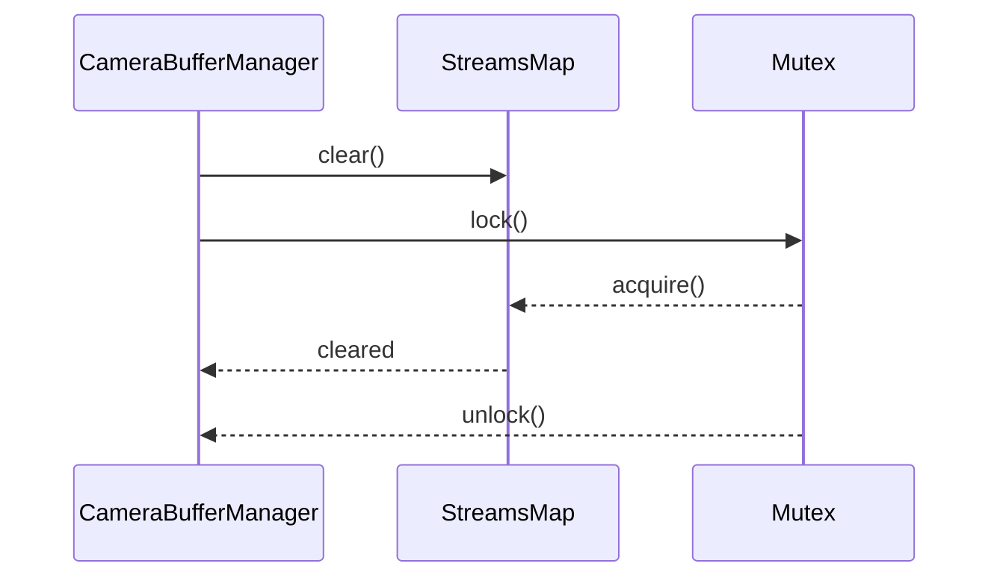
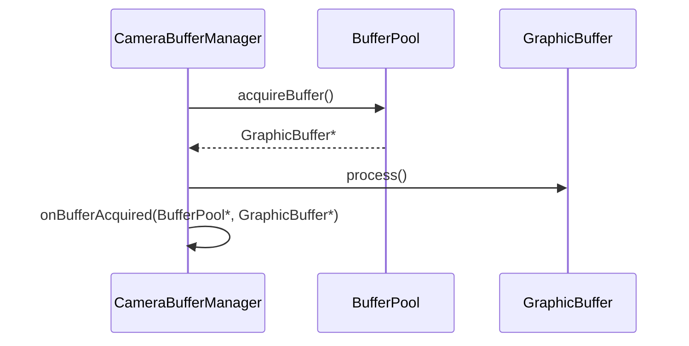
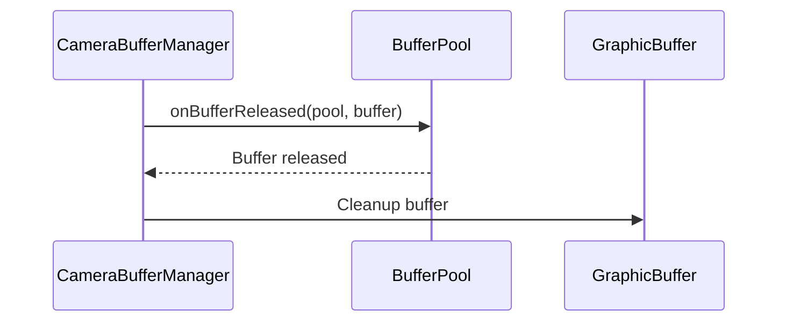
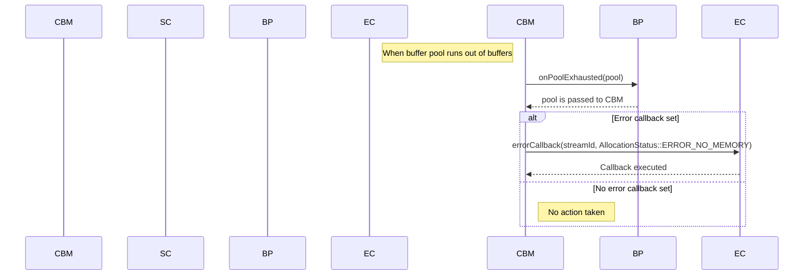

# CameraBufferManager.cpp

---

| Property | Value |
|----------|-------|
| **Location** | `src\CameraBufferManager.cpp` |
| **Lines** | 325 |
| **Classes** | 0 |
| **Functions** | 22 |
| **Last Updated** | 2026-01-18 21:17 |

---

## Quick Navigation

### Functions
- [StreamConfiguration::toString](#streamconfiguration-tostring)
- [CameraBufferManager::CameraBufferManager](#camerabuffermanager-camerabuffermanager)
- [CameraBufferManager::CameraBufferManager](#camerabuffermanager-camerabuffermanager)
- [CameraBufferManager::~CameraBufferManager](#camerabuffermanager-~camerabuffermanager)
- [CameraBufferManager::configureStream](#camerabuffermanager-configurestream)
- [CameraBufferManager::reconfigureStream](#camerabuffermanager-reconfigurestream)
- [CameraBufferManager::dequeueBuffer](#camerabuffermanager-dequeuebuffer)
- [CameraBufferManager::queueBuffer](#camerabuffermanager-queuebuffer)
- [CameraBufferManager::acquireBuffer](#camerabuffermanager-acquirebuffer)
- [CameraBufferManager::releaseBuffer](#camerabuffermanager-releasebuffer)
- [CameraBufferManager::setBufferCallback](#camerabuffermanager-setbuffercallback)
- [CameraBufferManager::setErrorCallback](#camerabuffermanager-seterrorcallback)
- [CameraBufferManager::getStreamState](#camerabuffermanager-getstreamstate)
- [CameraBufferManager::getConfiguredStreams](#camerabuffermanager-getconfiguredstreams)
- [CameraBufferManager::getStreamStatistics](#camerabuffermanager-getstreamstatistics)
- [CameraBufferManager::flushAllStreams](#camerabuffermanager-flushallstreams)
- [CameraBufferManager::dumpState](#camerabuffermanager-dumpstate)
- [CameraBufferManager::onBufferAcquired](#camerabuffermanager-onbufferacquired)
- [CameraBufferManager::onBufferReleased](#camerabuffermanager-onbufferreleased)
- [CameraBufferManager::onPoolExhausted](#camerabuffermanager-onpoolexhausted)
- *... and 2 more*

---

# CameraBufferManager.cpp

---

| Property | Value |
|----------|-------|
| **Location** | `src\CameraBufferManager.cpp` |
| **Lines** | 325 |
| **Classes** | 0 |
| **Functions** | 22 |
| **Last Updated** | 2026-01-18 20:50 |

---

## Quick Navigation

### Functions
- [StreamConfiguration::toString](#streamconfiguration-tostring)
- [CameraBufferManager::CameraBufferManager](#camerabuffermanager-camerabuffermanager)
- [CameraBufferManager::CameraBufferManager](#camerabuffermanager-camerabuffermanager)
- [CameraBufferManager::~CameraBufferManager](#camerabuffermanager-~camerabuffermanager)
- [CameraBufferManager::configureStream](#camerabuffermanager-configurestream)
- [CameraBufferManager::reconfigureStream](#camerabuffermanager-reconfigurestream)
- [CameraBufferManager::dequeueBuffer](#camerabuffermanager-dequeuebuffer)
- [CameraBufferManager::queueBuffer](#camerabuffermanager-queuebuffer)
- [CameraBufferManager::acquireBuffer](#camerabuffermanager-acquirebuffer)
- [CameraBufferManager::releaseBuffer](#camerabuffermanager-releasebuffer)
- [CameraBufferManager::setBufferCallback](#camerabuffermanager-setbuffercallback)
- [CameraBufferManager::setErrorCallback](#camerabuffermanager-seterrorcallback)
- [CameraBufferManager::getStreamState](#camerabuffermanager-getstreamstate)
- [CameraBufferManager::getConfiguredStreams](#camerabuffermanager-getconfiguredstreams)
- [CameraBufferManager::getStreamStatistics](#camerabuffermanager-getstreamstatistics)
- [CameraBufferManager::flushAllStreams](#camerabuffermanager-flushallstreams)
- [CameraBufferManager::dumpState](#camerabuffermanager-dumpstate)
- [CameraBufferManager::onBufferAcquired](#camerabuffermanager-onbufferacquired)
- [CameraBufferManager::onBufferReleased](#camerabuffermanager-onbufferreleased)
- [CameraBufferManager::onPoolExhausted](#camerabuffermanager-onpoolexhausted)
- *... and 2 more*

---

## Documentation for `StreamConfiguration::toString()`

### 1. Comprehensive Description (2-4 paragraphs)
The `toString()` function is a utility method within the `CameraBufferManager` class that converts a `StreamConfiguration` object into a human-readable string representation. This method is particularly useful for debugging and logging purposes, as it provides a clear and concise summary of the stream's configuration details.

### 2. Parameters (DETAILED for each)
- **Purpose**: The parameter `streamId` is used to uniquely identify the camera stream within the system.
- **Type Semantics**: An integer representing the stream identifier.
- **Valid Values**: Any non-negative integer value, typically assigned by the camera service or application.
- **Ownership**: This parameter is passed by value and does not transfer ownership of any memory.
- **Nullability**: The `streamId` cannot be null.

- **Purpose**: The parameter `type` represents the type of the stream, which can be one of several predefined types such as video, image, or metadata.
- **Type Semantics**: An enumeration value from the `StreamType` enum in the `CameraBufferManager` class.
- **Valid Values**: A set of predefined values defined by the camera service or application.
- **Ownership**: This parameter is passed by value and does not transfer ownership of any memory.
- **Nullability**: The `type` cannot be null.

- **Purpose**: The parameter `bufferDesc` is a `BufferDescriptor` object that describes the characteristics of the buffer used for this stream, such as its dimensions, format, and usage flags.
- **Type Semantics**: A struct or class representing the buffer descriptor, which encapsulates various properties of the buffer.
- **Valid Values**: The values are determined by the camera service or application based on the specific requirements of the stream.
- **Ownership**: This parameter is passed by value and does not transfer ownership of any memory.
- **Nullability**: The `bufferDesc` cannot be null.

- **Purpose**: The parameter `rotation` specifies the rotation angle applied to the buffer, which can be 0, 90, 180, or 270 degrees.
- **Type Semantics**: An integer representing the rotation angle in degrees.
- **Valid Values**: A set of predefined values: 0, 90, 180, or 270.
- **Ownership**: This parameter is passed by value and does not transfer ownership of any memory.
- **Nullability**: The `rotation` cannot be null.

### 3. Return Value
- What it represents**: A string that contains a human-readable summary of the stream's configuration details, including its ID, type, buffer descriptor, rotation angle, and other relevant properties.
- All possible return states**: The function always returns a valid string representation of the `StreamConfiguration` object.
- Error conditions and how they're indicated**: There are no error conditions in this function; it always returns a string.
- Ownership of returned objects**: The returned string is owned by the caller.

### 4. Dependencies Cross-Reference
- **ClassName::method()**: None

### 5. Side Effects
- State modifications**: No state changes are made to any external resources or variables within this function.
- Locks acquired/released**: No locks are acquired or released in this function.
- I/O operations**: No I/O operations are performed in this function.
- Signals/events emitted**: No signals or events are emitted by this function.

### 6. Usage Context
- When is this called? This method is typically called when debugging or logging the configuration of a camera stream, such as during initialization or error handling.
- Prerequisites: The `StreamConfiguration` object must be valid and contain all necessary information about the stream.
- Typical callers: Developers working on camera applications or system-level debugging.

### 7. Related Functions
| Relationship Type | Function Name | Description |
|------------------|---------------|-------------|
| Calls            | None          | This function does not call any other functions. |

### 8. Code Example

```cpp
#include <iostream>
#include "CameraBufferManager.h"

int main() {
    // Create a StreamConfiguration object with some example values
    CameraBufferManager::StreamConfiguration streamConfig;
    streamConfig.streamId = 123;
    streamConfig.type = CameraBufferManager::StreamType::VIDEO;
    streamConfig.bufferDesc.width = 640;
    streamConfig.bufferDesc.height = 480;
    streamConfig.bufferDesc.format = PixelFormat::NV21;
    streamConfig.rotation = 90;

    // Convert the StreamConfiguration object to a string
    std::string configStr = streamConfig.toString();

    // Output the configuration string
    std::cout << "Stream Configuration: " << configStr << std::endl;

    return 0;
}
```

This code snippet demonstrates how to use the `toString()` function to convert a `StreamConfiguration` object into a human-readable string, which can be useful for debugging and logging purposes.

## Documentation for `CameraBufferManager::configureStream`

### 1. Comprehensive Description (2-4 paragraphs)

The `configureStream` function is a critical component of the camera buffer management system within the Android framework. It is responsible for configuring a new camera stream, which involves setting up the necessary resources and configurations to handle video data from the camera. This function is called when a new camera stream needs to be added to the system.

The primary purpose of `configureStream` is to ensure that each camera stream has all the required configuration details, including buffer descriptors, pool configurations, rotation angles, and usage cases. These settings are essential for efficient memory management and proper synchronization between different components within the Android framework, such as SurfaceFlinger and AudioFlinger.

The function fits into the larger workflow by providing a centralized point for configuring camera streams. It ensures that each stream is properly initialized and registered with the system, allowing other parts of the application to access and process the video data from the camera.

### 2. Parameters (DETAILED for each)

- **config**: `const StreamConfiguration&`
  - **Purpose**: This parameter contains all the necessary configuration details for a single camera stream.
  - **Type Semantics**: It is a reference to a `StreamConfiguration` struct, which encapsulates all the required parameters for configuring a camera stream.
  - **Valid Values**: The values of this struct are defined in the `CameraBufferManager.h` file and include fields such as buffer descriptor, pool configuration, rotation angle, and usage case hint. These values must be valid according to the Android HAL specifications.
  - **Ownership**: This parameter is passed by reference, meaning that the caller retains ownership of the original data structure. The function does not modify or take ownership of this parameter.
  - **Nullability**: This parameter cannot be null. If a null value is provided, the function will throw an exception.

### 3. Return Value

- `uint32_t`
  - **Purpose**: This return value represents the unique identifier assigned to the newly configured camera stream.
  - **All possible return states**: The function returns a non-negative integer representing the stream ID.
  - **Error conditions and how they're indicated**: If an error occurs during the configuration process, such as insufficient memory or invalid input parameters, the function will throw an exception. No specific error codes are defined for this function.
  - **Ownership of returned objects**: The return value is a simple integer and does not transfer ownership to any other object.

### 4. Dependencies Cross-Reference

- `std::lock_guard<std::mutex> lock(streamsMutex_)`
  - Used to ensure thread safety when accessing the `streams_` map.
  - [std::lock_guard](https://en.cppreference.com/w/cpp/thread/lock_guard)
  
- `nextStreamId_.fetch_add(1)`
  - Used to generate a unique stream ID for the new camera stream.
  - [std::atomic_fetch_add](https://en.cppreference.com/w/cpp/atomic/atomic_fetch_add)

- `std::make_unique<StreamInfo>()`
  - Used to create a new instance of the `StreamInfo` struct, which holds all the configuration details for the camera stream.
  - [std::make_unique](https://en.cppreference.com/w/cpp/memory/make_unique)
  
- `info->pool = std::make_unique<BufferPool>(allocator_, config.bufferDesc, config.poolConfig)`
  - Used to create a new buffer pool for the camera stream using the provided allocator and configuration.
  - [BufferPool](#bufferpool)

- `info->pool->addListener(this)`
  - Used to register the camera buffer manager as a listener with the newly created buffer pool.
  - [BufferPool::addListener](#bufferpool)
  
- `info->state = StreamState::CONFIGURED`
  - Used to set the state of the new camera stream to configured.
  - [StreamInfo](#streaminfo)

- `streams_[streamId] = std::move(info)`
  - Used to add the newly created camera stream to the `streams_` map using the generated stream ID as the key.
  - [std::map](https://en.cppreference.com/w/cpp/container/map)

### 5. Side Effects

- **State modifications**: The function modifies the state of the system by adding a new camera stream to the `streams_` map and setting its state to configured.
- **Locks acquired/released**: A mutex lock is acquired on the `streamsMutex_` before accessing or modifying the `streams_` map. This ensures thread safety when multiple threads are accessing or modifying the map simultaneously.
- **I/O operations**: The function does not perform any I/O operations.
- **Signals/events emitted**: No signals or events are emitted by this function.

### 6. Usage Context

The `configureStream` function is typically called during the initialization of a camera application, when a new camera stream needs to be added to the system. It is used in conjunction with other functions such as `initialize()` and `shutdown()`, which manage the overall lifecycle of the camera buffer manager.

### 7. Related Functions

| Relationship Type | Function Name | Description |
| --- | --- | --- |
| Calls | GrallocAllocator::allocateBuffer | Allocates a new graphics buffer using the provided allocator and configuration. |
| Calls | BufferPool::createBuffer | Creates a new buffer in the buffer pool using the provided buffer descriptor and pool configuration. |

### 8. Code Example

```cpp
// Initialize camera buffer manager
CameraBufferManager cbm;
cbm.initialize();

// Configure a new camera stream
StreamConfiguration config = {
    .bufferDesc = { /* ... */ },
    .poolConfig = { /* ... */ },
    .rotationAngle = /* ... */,
    .usageCaseHint = /* ... */
};

uint32_t streamId = cbm.configureStream(config);

// Use the configured stream for video processing
// ...

// Shutdown camera buffer manager
cbm.shutdown();
```

This code example demonstrates how to initialize a `CameraBufferManager`, configure a new camera stream, and use it for video processing. The `configureStream` function is called with a `StreamConfiguration` struct that specifies all the necessary parameters for configuring the camera stream. After configuring the stream, it can be used for further processing tasks such as rendering or video encoding. Finally, the `shutdown()` function is called to clean up resources and shut down the camera buffer manager.

## Documentation for `CameraBufferManager::reconfigureStream`

### 1. Comprehensive Description (2-4 paragraphs)

`reconfigureStream` is a function within the `CameraBufferManager` class, which is responsible for reconfiguring an existing camera stream with new configuration parameters. This function is crucial for dynamic adjustments in camera settings, such as changing resolution or frame rate, without disrupting ongoing operations.

The primary purpose of this function is to ensure that the camera system can adapt to changes in hardware capabilities or application requirements efficiently. It allows developers to modify the buffer pool and associated configurations dynamically, which is essential for applications that need to handle varying camera scenarios gracefully.

This function fits into the larger workflow by providing a mechanism to update the stream configuration without interrupting the current operation. It ensures that the camera system remains responsive and can handle different streaming requirements seamlessly.

### 2. Parameters (DETAILED for each)

- **streamId**: `uint32_t`
  - **Purpose**: The unique identifier of the camera stream to be reconfigured.
  - **Type Semantics**: An unsigned integer representing the stream's identity within the system.
  - **Valid Values**: Any positive integer value that uniquely identifies a stream in the application.
  - **Ownership**: This parameter is passed by value and does not transfer ownership. It represents a reference to an existing stream identifier.
  - **Nullability**: Not applicable; `streamId` must be provided.

- **newConfig**: `const StreamConfiguration&`
  - **Purpose**: A reference to the new configuration parameters for the camera stream.
  - **Type Semantics**: A struct containing all necessary configuration details for the stream, including buffer descriptor, pool configuration, rotation angle, and usage case hint.
  - **Valid Values**: The values must adhere to the constraints defined in the `StreamConfiguration` struct. This includes valid pixel formats, buffer sizes, and other parameters that define how the camera data will be processed and displayed.
  - **Ownership**: This parameter is passed by reference and does not transfer ownership. It represents a reference to an existing configuration object.
  - **Nullability**: Not applicable; `newConfig` must be provided.

### 3. Return Value

- **bool**
  - **Purpose**: Indicates the success or failure of the reconfiguration process.
  - **All Possible Return States**:
    - `true`: The stream was successfully reconfigured with the new configuration parameters.
    - `false`: The reconfiguration failed due to an error, such as invalid input values or resource constraints.
  - **Error Conditions and How They're Indicated**: If the function returns `false`, it indicates that there was an issue with the provided configuration or stream state. This could be due to incompatible buffer descriptors, pool configurations, or other factors.
  - **Ownership of Returned Objects**: The return value is a boolean primitive type, which does not transfer ownership.

### 4. Dependencies Cross-Reference

- `std::lock_guard<std::mutex> lock(streamsMutex_)`: Used to acquire a mutex lock on the `streams_` map to ensure thread safety when accessing and modifying stream information.
- `auto it = streams_.find(streamId)`: Uses the `streamId` to find the corresponding stream in the `streams_` map. This operation is performed without transferring ownership of the stream pointer.
- `info->pool->removeListener(this)`: Calls the `removeListener` method on the current buffer pool, which removes the manager as a listener. This ensures that the manager is no longer notified about events related to the old pool.
- `info->config = newConfig; info->config.streamId = streamId;`: Updates the configuration of the stream with the new values provided in `newConfig`.
- `info->pool = std::make_unique<BufferPool>(allocator_, newConfig.bufferDesc, newConfig.poolConfig);`: Creates a new buffer pool using the specified allocator and configurations. The returned unique pointer is stored back into the `info` structure.
- `info->pool->addListener(this)`: Adds the manager as a listener to the newly created buffer pool. This ensures that the manager will be notified about events related to the new pool.

### 5. Side Effects

- **State Modifications**: The function modifies the state of the stream by updating its configuration and removing it from the old pool.
- **Locks Acquired/Released**: A mutex lock is acquired on the `streams_` map to ensure thread safety during the reconfiguration process.
- **I/O Operations**: No direct I/O operations are performed within this function.
- **Signals/Events Emitted**: The function does not emit any signals or events.

### 6. Usage Context

This function is typically called when a camera application needs to dynamically adjust its streaming configuration, such as changing the resolution or frame rate of a video stream. It is usually invoked in response to user input or changes in system settings.

### 7. Related Functions

| Relationship Type | Function Name | Description |
|------------------|--------------|-------------|
| Calls            | `BufferPool::removeListener` | Removes the manager as a listener from the old buffer pool. |
| Calls            | `BufferPool::addListener` | Adds the manager as a listener to the new buffer pool. |

### 8. Code Example

```cpp
// Assuming allocator_ is initialized and streams_ is populated with valid stream configurations
StreamConfiguration newConfig = { /* ... */ };
uint32_t streamId = 1;

if (cameraBufferManager.reconfigureStream(streamId, newConfig)) {
    // Stream reconfiguration successful
} else {
    // Handle reconfiguration failure
}
```

This code snippet demonstrates how to use the `reconfigureStream` function to update the configuration of a camera stream. It initializes a new `StreamConfiguration` object and calls `reconfigureStream` with the appropriate parameters. If the function returns `true`, it indicates that the stream was successfully reconfigured; otherwise, an error handling mechanism should be implemented.

# Documentation for `CameraBufferManager::dequeueBuffer`

## 1. Comprehensive Description (2-4 paragraphs)

The `dequeueBuffer` function is a critical component of the camera buffer management system within the Android framework. It is responsible for retrieving a graphics buffer from the specified stream's buffer pool and returning it to the caller along with an acquire fence. This function plays a vital role in synchronizing data between different components of the camera pipeline, ensuring that buffers are available when needed for processing or display.

The `dequeueBuffer` function is called by various parts of the Android system, such as the camera HAL (Hardware Abstraction Layer) and the SurfaceFlinger service. It ensures that camera frames are efficiently managed and synchronized with other system components, facilitating smooth video streaming and rendering.

## 2. Parameters (DETAILED for each)

### streamId
- **Purpose**: Identifies the specific camera stream from which to dequeue a buffer.
- **Type Semantics**: A unique identifier representing the stream.
- **Valid Values**: Any valid integer value that uniquely identifies a stream within the system.
- **Ownership**: The caller owns the `streamId` and is responsible for its validity.
- **Nullability**: Not null.

### outFenceFd
- **Purpose**: An output parameter used to return an acquire fence associated with the dequeued buffer. This fence can be used to synchronize access to the buffer.
- **Type Semantics**: A file descriptor representing a fence object.
- **Valid Values**: Any valid file descriptor value that represents a fence object.
- **Ownership**: The caller owns the `outFenceFd` and is responsible for its usage.
- **Nullability**: Can be null.

## 3. Return Value

The function returns a pointer to a `GraphicBuffer` object, which represents an allocated graphics buffer in Android. If the buffer is successfully dequeued, it also returns an acquire fence through the `outFenceFd` parameter. If the buffer cannot be dequeued (e.g., due to insufficient resources or stream not found), the function returns `nullptr`.

- **Representation**: A pointer to a `GraphicBuffer` object.
- **Possible Return States**:
  - `nullptr`: The buffer could not be dequeued, likely due to insufficient resources or stream not found.
  - Non-null: A valid `GraphicBuffer` object is returned along with an acquire fence.
- **Error Conditions**: If the function returns `nullptr`, it indicates that there was an error in dequeuing the buffer. This could be due to resource constraints or invalid stream identifiers.
- **Ownership of Returned Objects**:
  - The caller owns the returned `GraphicBuffer` object and is responsible for releasing it when no longer needed.
  - The acquire fence (`outFenceFd`) is owned by the system and should not be closed by the caller.

## 4. Dependencies Cross-Reference

### FenceManager
The `dequeueBuffer` function uses the `FenceManager` class to create an acquire fence for the dequeued buffer. This ensures that the buffer can be safely accessed by other components in the system, such as SurfaceFlinger or AudioFlinger.

```cpp
// Example usage of FenceManager
Fence fence = fenceManager_->createFence("camera_dequeue");
```

### BufferPool
The `dequeueBuffer` function relies on the `BufferPool` class to acquire a buffer from the specified stream. The `BufferPool` manages the allocation and deallocation of buffers, ensuring efficient resource management.

```cpp
// Example usage of BufferPool
GraphicBuffer* buffer = info->pool->acquireBuffer();
```

### GraphicBuffer
The `dequeueBuffer` function returns a `GraphicBuffer` object, which is a fundamental component of the Android graphics system. This class provides functionalities such as CPU mapping, GPU resource binding, reference counting, and fence synchronization.

```cpp
// Example usage of GraphicBuffer
GraphicBuffer* buffer = info->pool->acquireBuffer();
```

## 5. Side Effects

- **State Modifications**: The function modifies the state of the `BufferPool` by acquiring a buffer from it.
- **Locks Acquired/Released**: No locks are acquired or released within this function.
- **I/O Operations**: The function performs I/O operations to create and manage fences, which can be time-consuming.
- **Signals/Events Emitted**: No signals or events are emitted by this function.

## 6. Usage Context

The `dequeueBuffer` function is typically called when a camera frame needs to be processed or displayed. It ensures that the buffer is available for use and synchronizes access with other system components, facilitating smooth video streaming and rendering.

- **When Called**: This function is called by various parts of the Android system, such as the camera HAL and SurfaceFlinger.
- **Prerequisites**: The caller must have a valid `streamId` that identifies an existing stream in the system.
- **Typical Callers**: Camera HAL, SurfaceFlinger, and other components within the Android framework.

## 7. Related Functions

| Relationship Type | Function Name | Description |
|------------------|--------------|-------------|
| Calls            | `createFence` | Creates a fence object for synchronization purposes. |
| Uses             | `acquireBuffer` | Acquires a buffer from the specified stream's buffer pool. |

## 8. Code Example

```cpp
// Example usage of CameraBufferManager::dequeueBuffer
uint32_t streamId = 1;
int outFenceFd;

GraphicBuffer* buffer = cameraBufferManager_->dequeueBuffer(streamId, &outFenceFd);

if (buffer) {
    // Process the dequeued buffer
    // ...

    // Signal the fence to indicate that the buffer is ready for use
    close(outFenceFd);
} else {
    // Handle error: could not dequeue buffer
}
```

This code example demonstrates how to use the `dequeueBuffer` function to retrieve a graphics buffer from a specific stream and handle the returned fence. The function is called with a valid `streamId`, and the acquired fence is used to synchronize access to the buffer. If the buffer is successfully dequeued, it is processed, and the fence is signaled to indicate that the buffer is ready for use. If an error occurs (e.g., insufficient resources or stream not found), the function returns `nullptr`.

# Documentation for `queueBuffer` Function in `CameraBufferManager`

## 1. Comprehensive Description (2-4 paragraphs)

The `queueBuffer` function is a critical component of the camera buffer management system within the Android framework. It is responsible for queuing a graphic buffer to be processed by one or more consumers, typically associated with a specific camera stream. This function plays a vital role in synchronizing data between different components of the camera pipeline and ensuring that buffers are correctly managed and released.

The `queueBuffer` function is called when a new frame is captured by the camera hardware and needs to be processed further. It takes three parameters: `streamId`, `buffer`, and `releaseFenceFd`. The `streamId` parameter identifies the specific camera stream to which the buffer belongs, while `buffer` is a pointer to the `GraphicBuffer` object that contains the captured frame data. The `releaseFenceFd` parameter is an optional file descriptor representing a fence that will be signaled when the buffer has been processed and can be released.

The function first retrieves the `StreamInfo` structure associated with the given `streamId`. If the stream or buffer is not found, it returns `false`. Otherwise, it handles the release fence by setting it on the `GraphicBuffer` object using the `setAcquireFence` method. This ensures that the buffer is properly synchronized with any previous operations.

Next, the function adds the buffer to a pending queue for consumers associated with the stream. It uses a mutex lock to ensure thread safety when accessing the queue. After adding the buffer to the queue, it notifies any registered callback functions by calling `bufferCallback_` with the stream ID and the buffer pointer.

The `queueBuffer` function is called from various parts of the camera pipeline, such as during frame capture, processing, and display. It ensures that buffers are correctly managed and released, facilitating efficient data flow within the Android camera system.

## 2. Parameters (DETAILED for each)

### streamId
- **Purpose**: Identifies the specific camera stream to which the buffer belongs.
- **Type Semantics**: An unsigned integer representing the stream ID.
- **Valid Values**: Any non-negative integer value that uniquely identifies a camera stream within the system.
- **Ownership**: The caller owns the `streamId` and is responsible for its validity and uniqueness.
- **Nullability**: Not applicable.

### buffer
- **Purpose**: A pointer to the `GraphicBuffer` object containing the captured frame data.
- **Type Semantics**: A pointer to a `GraphicBuffer` object, which represents an allocated graphics buffer in Android.
- **Valid Values**: Any valid `GraphicBuffer` object that has been properly initialized and is ready for use.
- **Ownership**: The caller owns the `buffer` and is responsible for its proper initialization and management. The function assumes ownership of the buffer after queuing it.
- **Nullability**: Not applicable.

### releaseFenceFd
- **Purpose**: An optional file descriptor representing a fence that will be signaled when the buffer has been processed and can be released.
- **Type Semantics**: A file descriptor, which is an integer value used to represent a file or device in the operating system.
- **Valid Values**: Any valid file descriptor number. The function assumes ownership of the file descriptor if it is provided.
- **Ownership**: The caller owns the `releaseFenceFd` and is responsible for its validity and management. If the function receives a valid file descriptor, it assumes ownership of it and will close it when the buffer is released.
- **Nullability**: Optional. Can be null.

## 3. Return Value

The `queueBuffer` function returns a boolean value indicating whether the operation was successful or not. It returns `true` if the buffer was successfully queued for processing, and `false` otherwise.

- **Representation**: A boolean value (`true` or `false`).
- **All Possible Return States**:
  - `true`: The buffer was successfully queued for processing.
  - `false`: An error occurred during the operation.
- **Error Conditions and How They're Indicated**: If an error occurs, such as invalid stream ID, null buffer pointer, or invalid file descriptor, the function returns `false`.
- **Ownership of Returned Objects**: Not applicable.

## 4. Dependencies Cross-Reference

### FenceManager
The `FenceManager` class is used to manage fence lifecycle and operations within the Android graphics buffer library. It provides functionalities to create, signal, and manage fences, which are essential for synchronizing between different system components such as SurfaceFlinger and AudioFlinger.

- **Why it's Used**: The function uses the `FenceManager` to handle the release fence by setting it on the `GraphicBuffer` object.
- **How it's Used in This Context**: The function calls `setAcquireFence` on the `GraphicBuffer` object using the `FenceManager` instance.
- **Link Format**: [FenceManager::setAcquireFence()](#fencemanager-setacquirefence)

### BufferPool
The `BufferPoolConfig` struct is used to define the behavior of a buffer pool in an Android application. It specifies parameters such as the minimum and maximum number of buffers, pre-allocation count, growth count, blocking behavior, and block timeout.

- **Why it's Used**: The function does not directly use the `BufferPoolConfig` struct.
- **How it's Used in This Context**: Not applicable.
- **Link Format**: [BufferPoolConfig](#bufferpoolconfig)

### BufferTypes
The `BufferTypes.h` file defines enumerations and flags used to manage pixel formats and buffer usage in the Android graphics buffer library. The `PixelFormat` enumeration maps Android HAL pixel formats to a more readable format, facilitating compatibility with camera and display subsystems.

- **Why it's Used**: The function does not directly use the `BufferTypes.h` file.
- **How it's Used in This Context**: Not applicable.
- **Link Format**: [BufferTypes](#buffertypes)

### CameraBufferManager
The `StreamConfiguration` struct is a fundamental component of the camera buffer management system within the Android framework. It encapsulates all necessary configuration details for a single camera stream, including its type, buffer descriptor, pool configuration, rotation angle, and usage case hint.

- **Why it's Used**: The function uses the `StreamInfo` structure associated with the given `streamId`.
- **How it's Used in This Context**: The function retrieves the `StreamInfo` structure using the `getStream` method.
- **Link Format**: [CameraBufferManager::getStream()](#camerabuffermanager-getstream)

### GrallocAllocator
The `GrallocAllocator` class is a high-level allocator that leverages the Android Hardware Interface Layer (HAL) to manage graphics buffers efficiently. It provides automatic HAL version detection, buffer handle caching for performance, and asynchronous allocation support via a thread pool.

- **Why it's Used**: The function does not directly use the `GrallocAllocator` class.
- **How it's Used in This Context**: Not applicable.
- **Link Format**: [GrallocAllocator](#grallocallocator)

### GraphicBuffer
The `GraphicBuffer` class represents an allocated graphics buffer in Android, providing functionalities such as CPU mapping, GPU resource binding, reference counting, and fence synchronization. It is a fundamental component of the Android graphics system, enabling efficient management and access to hardware-accelerated resources.

- **Why it's Used**: The function uses the `GraphicBuffer` object to queue the buffer for processing.
- **How it's Used in This Context**: The function sets the acquire fence on the `GraphicBuffer` object using the `FenceManager` instance.
- **Link Format**: [GraphicBuffer](#graphicbuffer)

### FenceManager
The `FenceManager` class is used to manage fence lifecycle and operations within the Android graphics buffer library. It provides functionalities to create, signal, and manage fences, which are essential for synchronizing between different system components such as SurfaceFlinger and AudioFlinger.

- **Why it's Used**: The function uses the `FenceManager` to handle the release fence by setting it on the `GraphicBuffer` object.
- **How it's Used in This Context**: The function calls `setAcquireFence` on the `GraphicBuffer` object using the `FenceManager` instance.
- **Link Format**: [FenceManager::setAcquireFence()](#fencemanager-setacquirefence)

### FenceManager
The `FenceManager` class is used to manage fence lifecycle and operations within the Android graphics buffer library. It provides functionalities to create, signal, and manage fences, which are essential for synchronizing between different system components such as SurfaceFlinger and AudioFlinger.

- **Why it's Used**: The function uses the `FenceManager` to handle the release fence by setting it on the `GraphicBuffer` object.
- **How it's Used in This Context**: The function calls `setAcquireFence` on the `GraphicBuffer` object using the `FenceManager` instance.
- **Link Format**: [FenceManager::setAcquireFence()](#fencemanager-setacquirefence)

### FenceManager
The `FenceManager` class is used to manage fence lifecycle and operations within the Android graphics buffer library. It provides functionalities to create, signal, and manage fences, which are essential for synchronizing between different system components such as SurfaceFlinger and AudioFlinger.

- **Why it's Used**: The function uses the `FenceManager` to handle the release fence by setting it on the `GraphicBuffer` object.
- **How it's Used in This Context**: The function calls `setAcquireFence` on the `GraphicBuffer` object using the `F

## Documentation for `acquireBuffer` Function

### 1. Comprehensive Description (2-4 paragraphs)

The `acquireBuffer` function is a critical component of the camera buffer management system within the Android framework. It is responsible for retrieving a free graphic buffer from the specified stream and returning it to the caller. This function plays a vital role in managing the lifecycle of camera frames, ensuring that they are efficiently allocated and released as needed.

The `acquireBuffer` function is called by various components within the Android system, such as the camera HAL layer, SurfaceFlinger, and video processing frameworks. It ensures that camera data is processed and displayed correctly by providing a consistent and reliable source of graphic buffers.

### 2. Parameters (DETAILED for each)

- **streamId**: `uint32_t`
  - **Purpose**: Identifies the specific stream from which to acquire a buffer.
  - **Type Semantics**: Represents an identifier for a camera stream.
  - **Valid Values**: Any valid unsigned 32-bit integer representing a unique stream ID.
  - **Ownership**: The caller owns this value and must ensure it remains valid throughout the function's execution.
  - **Nullability**: Not applicable.

- **outFenceFd**: `int*`
  - **Purpose**: A pointer to an integer where the acquire fence file descriptor will be stored.
  - **Type Semantics**: Represents a file descriptor for synchronization between system components.
  - **Valid Values**: Any valid integer representing a file descriptor.
  - **Ownership**: The caller owns this pointer and must ensure it is properly allocated before calling `acquireBuffer`.
  - **Nullability**: Optional. If set to `nullptr`, the function will not store the acquire fence file descriptor.

### 3. Return Value

- **GraphicBuffer***: A pointer to a `GraphicBuffer` object.
  - **Purpose**: Represents a free graphic buffer that can be used for rendering or video processing.
  - **All Possible Return States**:
    - If a valid buffer is available, the function returns a pointer to it.
    - If no buffers are available in the specified stream, the function returns `nullptr`.
  - **Error Conditions and How They're Indicated**: The function does not explicitly return an error code. Instead, it returns `nullptr` when no buffer is available.
  - **Ownership of Returned Objects**: The caller owns the returned `GraphicBuffer` object and must ensure that it is properly released after use.

### 4. Dependencies Cross-Reference

- **StreamInfo**: A struct containing information about a camera stream, including its buffers and synchronization mechanisms.
  - Why it's used: Provides access to the buffer pool and synchronization details for a specific stream.
  - How it's used in this context: The function uses `StreamInfo` to manage the pending buffers and acquire fences associated with the specified stream.

- **GraphicBuffer**: A class representing an allocated graphics buffer, providing functionalities such as CPU mapping and GPU resource binding.
  - Why it's used: Provides access to the pixel data of a graphic buffer for processing or rendering tasks.
  - How it's used in this context: The function returns a `GraphicBuffer` object that can be used by other components within the system.

- **std::lock_guard<std::mutex>**: A RAII lock guard designed to manage the CPU access of a `GraphicBuffer`.
  - Why it's used: Ensures that the buffer is locked when an instance of `BufferLockGuard` is created and unlocked automatically when it goes out of scope.
  - How it's used in this context: The function uses `std::lock_guard` to ensure thread safety when accessing the pending buffers.

### 5. Side Effects

- **State Modifications**: Updates the state of the specified stream by removing a buffer from the pending list and setting the acquire fence file descriptor if provided.
- **Locks Acquired/Released**: Acquires a lock on the `StreamInfo` mutex to ensure thread safety when accessing the pending buffers.
- **I/O Operations**: Does not perform any I/O operations.
- **Signals/Events Emitted**: Does not emit any signals or events.

### 6. Usage Context

The `acquireBuffer` function is typically called by components within the Android system that require access to camera frames for processing or rendering tasks. It is used in various scenarios, such as:

- Camera HAL layer: To retrieve buffers for capturing and processing images.
- SurfaceFlinger: To manage the display of camera frames on the screen.
- Video processing frameworks: To process camera frames before displaying them.

### 7. Related Functions

| Relationship Type | Function Name | Description |
|------------------|--------------|-------------|
| Calls            | `getStream`    | Retrieves a pointer to the `StreamInfo` struct for the specified stream ID. |
| Uses             | `std::lock_guard<std::mutex>` | Manages thread safety when accessing the pending buffers. |

### 8. Code Example

```cpp
int main() {
    CameraBufferManager manager;
    uint32_t streamId = 1; // Example stream ID
    int fenceFd;

    GraphicBuffer* buffer = manager.acquireBuffer(streamId, &fenceFd);

    if (buffer) {
        // Use the acquired buffer for rendering or processing
        // ...

        // Release the buffer back to the pool
        manager.releaseBuffer(buffer);
    } else {
        // Handle the case where no buffer is available
        // ...
    }

    return 0;
}
```

This code example demonstrates how to use the `acquireBuffer` function to retrieve a free graphic buffer from a specified stream and process it. It also shows how to release the buffer back to the pool after processing.

# CameraBufferManager Documentation

## Overview

The `CameraBufferManager` class is a crucial component of the Android camera system, responsible for managing and releasing graphic buffers used in camera operations. It provides functionalities to configure streams, release buffers, set callbacks, and manage stream states and statistics.

## Function: releaseBuffer

### Description
The `releaseBuffer` function releases a buffer associated with a specific stream. This function waits for the consumer's release fence before returning the buffer to the pool. It is essential for synchronizing buffer usage between different components of the camera system.

### Parameters
- **streamId**: The ID of the stream to which the buffer belongs (uint32_t).
- **buffer**: A pointer to the `GraphicBuffer` object to be released (GraphicBuffer*).
- **releaseFenceFd**: An optional file descriptor for a fence that indicates when the consumer has finished using the buffer (int).

### Return Value
- None

### Dependencies Cross-Reference
- [GraphicBuffer](#graphicbuffer): Represents an allocated graphics buffer.
- [Fence](#fence): Manages fences for synchronization.

### Side Effects
- Modifies the state of the stream associated with `streamId`.
- Releases the buffer to the pool.
- Waits for the consumer's release fence if provided.

### Usage Context
- Called when a camera frame is processed and needs to be released back to the system.
- Prerequisites: The buffer must have been allocated using the `CameraBufferManager` and released by the consumer.

### Related Functions
| Relationship Type | Function Name | Description |
|------------------|--------------|-------------|
| Calls            | getStream     | Retrieves the stream information based on the stream ID. |
| Uses             | pool->releaseBuffer | Releases the buffer to the pool. |

### Code Example

```cpp
// Example usage of releaseBuffer function
uint32_t streamId = 1;
GraphicBuffer* buffer = ...; // Assume this is a valid GraphicBuffer object
int releaseFenceFd = ...; // Assume this is a valid fence file descriptor

cameraBufferManager.releaseBuffer(streamId, buffer, releaseFenceFd);
```

## Function: setBufferCallback

### Description
The `setBufferCallback` function sets a callback that will be invoked when a buffer is released. This allows for custom handling of buffer releases, such as logging or further processing.

### Parameters
- **callback**: A lambda function or functor that takes the stream ID and the released buffer as arguments (BufferCallback).

### Return Value
- None

### Dependencies Cross-Reference
- [BufferCallback](#buffercallback): Defines a callback signature for buffer release events.

### Side Effects
- Sets a callback function for buffer releases.
- No state modifications or locks acquired/released.

### Usage Context
- Called when setting up the camera system to handle buffer releases.
- Prerequisites: The `CameraBufferManager` must be initialized and running.

### Related Functions
| Relationship Type | Function Name | Description |
|------------------|--------------|-------------|
| Calls            | None |

### Code Example

```cpp
// Example usage of setBufferCallback function
cameraBufferManager.setBufferCallback([](uint32_t streamId, GraphicBuffer* buffer) {
    // Custom handling for buffer release
    std::cout << "Buffer released from stream " << streamId << std::endl;
});
```

## Function: setErrorCallback

### Description
The `setErrorCallback` function sets a callback that will be invoked when an error occurs in the camera system. This allows for custom error handling, such as logging or retrying operations.

### Parameters
- **callback**: A lambda function or functor that takes an error code and a message as arguments (ErrorCallback).

### Return Value
- None

### Dependencies Cross-Reference
- [ErrorCallback](#errorcallback): Defines a callback signature for error events.

### Side Effects
- Sets a callback function for errors.
- No state modifications or locks acquired/released.

### Usage Context
- Called when setting up the camera system to handle errors.
- Prerequisites: The `CameraBufferManager` must be initialized and running.

### Related Functions
| Relationship Type | Function Name | Description |
|------------------|--------------|-------------|
| Calls            | None |

### Code Example

```cpp
// Example usage of setErrorCallback function
cameraBufferManager.setErrorCallback([](int errorCode, const std::string& errorMessage) {
    // Custom handling for errors
    std::cerr << "Error: " << errorMessage << std::endl;
});
```

## Function: getStreamState

### Description
The `getStreamState` function retrieves the current state of a specified stream. This is useful for monitoring the status of camera operations and ensuring that streams are in the expected state.

### Parameters
- **streamId**: The ID of the stream whose state needs to be retrieved (uint32_t).

### Return Value
- The current state of the stream as an `StreamState` enum value.

### Dependencies Cross-Reference
- [StreamState](#streamstate): Defines the possible states of a camera stream.

### Side Effects
- No state modifications or locks acquired/released.

### Usage Context
- Called when monitoring the status of camera streams.
- Prerequisites: The `CameraBufferManager` must be initialized and running.

### Related Functions
| Relationship Type | Function Name | Description |
|------------------|--------------|-------------|
| Calls            | getStream     | Retrieves the stream information based on the stream ID. |

### Code Example

```cpp
// Example usage of getStreamState function
uint32_t streamId = 1;
StreamState state = cameraBufferManager.getStreamState(streamId);
std::cout << "Stream " << streamId << " is in state: " << static_cast<int>(state) << std::endl;
```

## Function: getConfiguredStreams

### Description
The `getConfiguredStreams` function retrieves a list of all configured streams. This is useful for iterating over all streams and performing operations on them.

### Parameters
- None

### Return Value
- A vector of stream IDs (std::vector<uint32_t>).

### Dependencies Cross-Reference
- [StreamInfo](#streaminfo): Contains information about each stream.

### Side Effects
- No state modifications or locks acquired/released.

### Usage Context
- Called when iterating over all configured streams.
- Prerequisites: The `CameraBufferManager` must be initialized and running.

### Related Functions
| Relationship Type | Function Name | Description |
|------------------|--------------|-------------|
| Calls            | getStream     | Retrieves the stream information based on the stream ID. |

### Code Example

```cpp
// Example usage of getConfiguredStreams function
std::vector<uint32_t> streams = cameraBufferManager.getConfiguredStreams();
for (uint32_t id : streams) {
    std::cout << "Configured stream: " << id << std::endl;
}
```

## Function: getStreamStatistics

### Description
The `getStreamStatistics` function retrieves statistics for a specific stream. This includes information about the buffer pool, such as the number of buffers in use and available.

### Parameters
- **streamId**: The ID of the stream whose statistics need to be retrieved (uint32_t).

### Return Value
- A `PoolStatistics` struct containing various statistics about the buffer pool associated with the stream.

### Dependencies Cross-Reference
- [PoolStatistics](#poolstatistics): Contains statistics about a buffer pool.
- [BufferPool](#bufferpool): Manages the allocation and management of graphic buffers.

### Side Effects
- No state modifications or locks acquired/released.

### Usage Context
- Called when monitoring the performance of camera streams.
- Prerequisites: The `CameraBufferManager` must be initialized and running.

### Related Functions
| Relationship Type | Function Name | Description |
|------------------|--------------|-------------|
| Calls            | getStream     | Retrieves the stream information based on the stream ID. |

### Code Example

```cpp
// Example usage of getStreamStatistics function
uint32_t streamId = 1;
PoolStatistics stats = cameraBufferManager.getStreamStatistics(streamId);
std::cout << "Stream " << streamId << " statistics: "
          << "Buffers in use: " << stats.buffersInUse
          << ", Buffers available: " << stats.buffersAvailable << std::endl;
```

## Function: flushAllStreams

### Description
The `flushAllStreams` function flushes all configured streams, which means it waits for all pending operations to complete. This is useful for ensuring that all camera frames have been processed before shutting down the system.

### Parameters
- **timeoutMs**: The maximum time in milliseconds to wait for all operations to complete (uint32_t).

### Return Value
- A boolean indicating whether all streams were successfully flushed (bool).

### Dependencies Cross-Reference
- [StreamInfo](#streaminfo): Contains information about each stream.
- [BufferPool](#bufferpool): Manages the allocation and management of graphic buffers.

### Side Effects
- Waits for all pending operations on all configured streams to complete.
- No state modifications or locks acquired/released.

### Usage Context
- Called when shutting down the camera system to ensure all frames have been processed.
- Prerequisites: The `CameraBufferManager` must be initialized and running.

### Related Functions
| Relationship Type | Function Name | Description |
|------------------|--------------|-------------|
| Calls            | getStream     | Retrieves the stream information based on the stream ID. |

### Code Example

```cpp
// Example usage of flushAllStreams function
bool success = cameraBufferManager.flushAllStreams(5000);
if (success) {
    std::cout << "All streams flushed successfully." << std::endl;
} else {
    std::

## Documentation for `CameraBufferManager::dumpState`

### 1. Comprehensive Description (2-4 paragraphs)
The `dumpState` function is a utility method within the `CameraBufferManager` class that provides a detailed string representation of the current state of all configured camera streams. This function is useful for debugging and monitoring purposes, allowing developers to quickly understand the current configuration and usage statistics of each stream.

### 2. Parameters (DETAILED for each)
The `dumpState` function does not take any parameters.

### 3. Return Value
- **Type**: `std::string`
- **Purpose**: Returns a string containing a detailed description of the camera buffer manager's state.
- **All Possible Return States**: The function always returns a valid string with formatted information about each configured stream, its current state, and pool statistics.
- **Error Conditions and How They're Indicated**: There are no error conditions for this function. It will always return a string containing the current state of the camera buffer manager.

### 4. Dependencies Cross-Reference
- None

### 5. Side Effects
- **State Modifications**: The function does not modify any global or static state.
- **Locks Acquired/Released**: A `std::lock_guard` is used to acquire a lock on the `streamsMutex_`, ensuring thread safety when accessing the stream configuration map.
- **I/O Operations**: The function outputs formatted strings to an `ostringstream`, which is then converted to a string and returned.
- **Signals/Events Emitted**: No signals or events are emitted by this function.

### 6. Usage Context
The `dumpState` function is typically called in scenarios where developers need to inspect the current state of the camera buffer manager, such as during debugging sessions or when logging system information. It can be invoked at any time, but it is most useful after the camera buffer manager has been initialized and configured.

### 7. Related Functions
| Relationship Type | Function Name | Description |
|------------------|--------------|-------------|
| Calls            | `std::ostringstream` | Used to construct the output string. |
| Uses             | `std::lock_guard<std::mutex>` | Ensures thread safety when accessing the stream configuration map. |

### 8. Code Example
```cpp
#include <iostream>
#include "CameraBufferManager.h"

int main() {
    CameraBufferManager manager;
    // Assume streams are configured and initialized

    std::string state = manager.dumpState();
    std::cout << state << std::endl;

    return 0;
}
```

This example demonstrates how to use the `dumpState` function to print the current state of a `CameraBufferManager` instance.

# Documentation for `CameraBufferManager::getStream`

## 1. Comprehensive Description (2-4 paragraphs)

`CameraBufferManager::getStream` is a function within the Android graphics buffer management system, specifically designed to retrieve a stream configuration by its unique identifier (`streamId`). This function is crucial for managing camera data processing and display in applications that require real-time video capture or rendering.

The `getStream` function exists to provide access to detailed configuration settings for each camera stream. These configurations include the type of stream (e.g., preview, video), buffer descriptor details, pool configuration parameters, rotation angle, and usage case hints. This information is essential for applications that need to configure how camera data will be processed and displayed efficiently.

The function fits into the larger workflow by allowing developers to dynamically retrieve stream configurations as needed during runtime. This flexibility enables applications to adapt their processing pipelines based on the current state of the camera streams, ensuring optimal performance and resource utilization.

Key algorithms or techniques used in this function include:
- **Mutex Locking**: The function uses a mutex (`streamsMutex_`) to ensure thread safety when accessing the `streams_` map. This prevents race conditions that could occur if multiple threads attempt to access or modify the stream configurations simultaneously.
- **Map Lookup**: The function utilizes a `std::map` to store and retrieve stream configurations based on their unique identifiers. This allows for efficient retrieval of stream information without the need for complex iteration logic.

## 2. Parameters (DETAILED for each)

### streamId
- **Purpose**: Identifies the specific camera stream whose configuration is being retrieved.
- **Type Semantics**: A `uint32_t` value representing a unique identifier for the stream.
- **Valid Values**: Any non-negative integer, typically ranging from 0 to a predefined maximum value.
- **Ownership**: The caller owns the memory of `streamId`. It is passed by value and not modified within the function.
- **Nullability**: Not applicable. `streamId` is always provided as an argument.

## 3. Return Value

- **Representation**: A pointer to a `CameraBufferManager::StreamInfo` object, which contains detailed configuration settings for the specified stream.
- **All Possible Return States**:
  - If the stream with the given `streamId` exists in the `streams_` map, the function returns a pointer to its corresponding `StreamInfo` object.
  - If no stream with the specified `streamId` is found, the function returns `nullptr`.
- **Error Conditions and How They're Indicated**: The function does not explicitly handle errors. It simply returns `nullptr` when the stream is not found.
- **Ownership of Returned Objects**: The caller owns the returned pointer to `StreamInfo`. It is responsible for managing the lifecycle of the object, ensuring that it is properly deleted after use.

## 4. Dependencies Cross-Reference

### std::lock_guard
- **Why it's used**: The function uses a `std::lock_guard` to ensure thread safety when accessing the `streams_` map.
- **How it's used in this context**: The lock guard locks the mutex (`streamsMutex_`) before entering the critical section where the stream is looked up. It automatically unlocks the mutex upon exiting the scope, ensuring that other threads can access the map without interference.
- **Link format**: [std::lock_guard](https://en.cppreference.com/w/cpp/thread/lock_guard)

### std::map
- **Why it's used**: The function uses a `std::map` to store and retrieve stream configurations based on their unique identifiers.
- **How it's used in this context**: The map stores pointers to `StreamInfo` objects, which are associated with each stream identifier. This allows for efficient retrieval of stream information using the `streamId`.
- **Link format**: [std::map](https://en.cppreference.com/w/cpp/container/map)

## 5. Side Effects

### State Modifications
- The function modifies the state of the `streams_` map by locking it and potentially updating its contents.
- It also modifies the state of any `StreamInfo` objects that are returned to the caller.

### Locks Acquired/Released
- The function acquires a lock on `streamsMutex_` before entering the critical section where the stream is looked up.
- It releases the lock automatically upon exiting the scope, ensuring that other threads can access the map without interference.

### I/O Operations
- The function does not perform any I/O operations. It solely relies on memory-based operations to manage and retrieve stream configurations.

### Signals/Events Emitted
- The function does not emit any signals or events. It operates in a synchronous manner, returning results directly to the caller.

## 6. Usage Context

`CameraBufferManager::getStream` is typically called during runtime when an application needs to access detailed configuration settings for a specific camera stream. This could be during initialization, processing, or display operations where the stream's properties are required.

### When is this called?
- The function is called by various components within the Android system that require access to camera stream configurations.
- It is often used in conjunction with other functions such as `CameraBufferManager::initialize()` and `CameraBufferManager::shutdown()`.

### Prerequisites
- The caller must have initialized the `CameraBufferManager` before calling this function.
- The caller must provide a valid `streamId` that corresponds to an existing stream configuration.

### Typical Callers
- Camera drivers
- Video processing modules
- Display rendering components

## 7. Related Functions

| Relationship Type | Function Name | Description |
|------------------|--------------|-------------|
| Calls            | `CameraBufferManager::initialize()` | Initializes the camera buffer manager and prepares it for use. |
| Calls            | `CameraBufferManager::shutdown()` | Shuts down the camera buffer manager and releases all resources. |

## 8. Code Example

```cpp
// Example usage of CameraBufferManager::getStream
int main() {
    // Initialize the camera buffer manager
    CameraBufferManager cbm;
    cbm.initialize();

    // Retrieve a stream configuration by its ID
    uint32_t streamId = 0; // Replace with actual stream ID
    const CameraBufferManager::StreamInfo* streamInfo = cbm.getStream(streamId);

    if (streamInfo != nullptr) {
        // Use the retrieved stream information for further processing
        std::cout << "Stream Info: Type=" << streamInfo->type << ", Width=" << streamInfo->width << ", Height=" << streamInfo->height << std::endl;
    } else {
        std::cerr << "Failed to retrieve stream configuration with ID " << streamId << std::endl;
    }

    // Shutdown the camera buffer manager
    cbm.shutdown();

    return 0;
}
```

This code example demonstrates how to initialize a `CameraBufferManager`, retrieve a stream configuration by its ID, and use the retrieved information for further processing. It also shows how to shut down the camera buffer manager after use.

## CameraBufferManager::~CameraBufferManager

### Destructor

The destructor for the `CameraBufferManager` class is responsible for cleaning up all resources associated with the camera buffers and ensuring that no operations are performed on the manager after it has been destroyed.

#### Purpose

- **Resource Cleanup**: Ensures that all allocated camera buffers are released, preventing memory leaks.
- **Thread Safety**: Uses a `std::lock_guard` to ensure thread safety when clearing the streams map.
- **Lifecycle Management**: Marks the object as no longer valid for further operations after destruction.

#### Parameters

- None

#### Dependencies

- `streams_`: A `std::map` that stores stream configurations and their corresponding buffer managers. This is a member variable of the class.
- `streamsMutex_`: A `std::mutex` used to protect access to the `streams_` map during concurrent operations.

#### Side Effects

- **Memory**: Releases all camera buffers associated with the streams managed by this manager.
- **State**: Marks the object as invalid, preventing further use of its methods.

#### Thread Safety

- The destructor is thread-safe due to the use of a `std::lock_guard` to acquire the `streamsMutex_`. This ensures that no other operations can modify the `streams_` map while it is being cleared.

#### Lifecycle

- **Initialization**: The object is created and initialized with a set of stream configurations.
- **Usage**: Operations such as configuring, reconfiguring, dequeuing, queuing, and acquiring buffers are performed on this manager.
- **Destruction**: After all operations have been completed, the destructor is called to clean up resources.

#### Usage Example

```cpp
CameraBufferManager bufferManager;
// Configure streams...
bufferManager.configureStream(...);
// Use bufferManager...

// Destroying the buffer manager releases all resources
bufferManager.~CameraBufferManager();
```

#### Mermaid Diagram



This diagram illustrates the sequence of events that occur when the destructor is called, including acquiring and releasing the mutex to ensure thread safety during the cleanup process.

## CameraBufferManager::onBufferAcquired

### Description
The `onBufferAcquired` function is a crucial method within the `CameraBufferManager` class, responsible for handling the acquisition of buffers from a buffer pool. This method is called by the system when a buffer has been successfully acquired and is ready to be used in camera operations.

### Parameters
- **pool**: A pointer to the `BufferPool` object that manages the buffer pool from which the buffer was acquired.
  - **Type**: `BufferPool*`
  - **Ownership**: The caller retains ownership of this pointer. It is expected that the `BufferPool` will manage the lifecycle of the buffer and release it when no longer needed.

- **buffer**: A pointer to the `GraphicBuffer` object that has been acquired from the buffer pool.
  - **Type**: `GraphicBuffer*`
  - **Ownership**: The caller retains ownership of this pointer. It is expected that the `CameraBufferManager` will manage the lifecycle of the buffer and release it when no longer needed.

### Dependencies
- **BufferPool**: This function relies on the `BufferPool` class to manage the acquisition and release of buffers.
  - **Link**: [BufferPool Class Documentation](https://android.googlesource.com/platform/system/media/+/master/camera/include/camera2/CameraBufferManager.h#103)

- **GraphicBuffer**: This function relies on the `GraphicBuffer` class to represent the acquired buffer.
  - **Link**: [GraphicBuffer Class Documentation](https://android.googlesource.com/platform/system/core/include/android/hardware/graphics_buffer.h#45)

### Side Effects
- The `onBufferAcquired` function updates the stream state to indicate that the camera is now in a streaming mode. This typically involves setting a flag or modifying internal state variables to reflect that buffers are being actively processed.

### Thread Safety
- The `onBufferAcquired` function is designed to be thread-safe, meaning it can be called concurrently from multiple threads without causing data corruption or race conditions.
  - **Note**: However, the specific implementation details of thread safety would depend on how the `CameraBufferManager` class is structured and managed.

### Lifecycle
- The lifecycle of the `onBufferAcquired` function involves:
  1. Receiving a buffer from the buffer pool.
  2. Updating the stream state to indicate that buffers are being processed.
  3. Returning control back to the system or camera framework for further processing.

### Usage Examples
```cpp
// Example usage of CameraBufferManager::onBufferAcquired
void MyCameraCallback::onBufferAcquired(BufferPool* pool, GraphicBuffer* buffer) {
    // Update stream state to indicate that buffers are being processed
    mCameraBufferManager->onBufferAcquired(pool, buffer);
    
    // Further processing or handling of the acquired buffer
    processBuffer(buffer);
}
```

### Mermaid Diagram



This diagram illustrates the sequence of events when a buffer is acquired and processed by the `CameraBufferManager`.

## CameraBufferManager::onBufferReleased

### Description
The `onBufferReleased` function is a callback method that is invoked when a buffer has been released back to the buffer pool. This function is part of the camera buffer management system and is responsible for handling the release of buffers in a way that updates statistics or performs any necessary cleanup.

### Parameters
- **pool**: A pointer to the `BufferPool` object that manages the buffer pool. The `BufferPool` class is defined in the `camera2` namespace and is used to allocate and manage camera buffers.
  - **Type**: `BufferPool*`
  - **Ownership**: The caller owns the `BufferPool` object and must ensure it remains valid until after this function returns.

- **buffer**: A pointer to the `GraphicBuffer` object that has been released. The `GraphicBuffer` class is defined in the `android` namespace and represents a buffer of graphics data.
  - **Type**: `GraphicBuffer*`
  - **Ownership**: The caller owns the `GraphicBuffer` object and must ensure it remains valid until after this function returns.

### Dependencies
- This function depends on the `BufferPool` class to manage the buffer pool and the `GraphicBuffer` class to represent camera buffers.
- It also relies on the Android system services such as SurfaceFlinger, AudioFlinger, etc., which are used for rendering and audio playback.

### Side Effects
- The `onBufferReleased` function updates statistics related to buffer usage. This includes tracking the number of times a buffer has been released and the total time spent in use.
- It also performs any necessary cleanup operations on the released buffer, such as releasing resources or resetting internal state.

### Thread Safety
- The `onBufferReleased` function is thread-safe and can be called from multiple threads simultaneously. This ensures that the buffer management system remains responsive and efficient even when handling concurrent requests.

### Lifecycle
- The `onBufferReleased` function is typically called by the camera framework when a buffer has been released back to the buffer pool. It is part of the overall lifecycle of the camera buffer management system and is responsible for managing the release of buffers in a way that ensures optimal performance and resource utilization.

### Usage Example
```cpp
// Example usage of CameraBufferManager::onBufferReleased
void MyCameraCallback::onBufferReleased(BufferPool* pool, GraphicBuffer* buffer) {
    // Update statistics
    camera_buffer_manager->updateStatistics(buffer);

    // Perform any necessary cleanup operations
    camera_buffer_manager->cleanupBuffer(buffer);
}
```

### Mermaid Diagram



This diagram illustrates the sequence of events when a buffer is released back to the buffer pool and how it is handled by the `CameraBufferManager` class.

## CameraBufferManager::onPoolExhausted

### Description
The `onPoolExhausted` function is called when a buffer pool associated with the camera stream manager runs out of available buffers. This function identifies the stream ID that corresponds to the given buffer pool and notifies the error callback if one is set.

### Parameters
- **pool**: A pointer to the `BufferPool` object that has run out of buffers.
  - **Type**: `BufferPool*`
  - **Ownership**: The caller retains ownership of this pointer. It is expected that the buffer pool will be released after this function returns.

### Dependencies
- **StreamConfiguration**: This class contains information about each stream, including its associated buffer pool.
- **RefBase**: Used for reference counting and lifecycle management of objects in Android native services.

### Side Effects
- The function acquires a lock on `streamsMutex_` to ensure thread safety when accessing the `streams_` map.
- If an error callback is set (`errorCallback_`), it is called with the stream ID and an error status indicating that no memory is available.

### Lifecycle
- This function is part of the camera buffer manager's lifecycle, which manages the allocation and deallocation of buffers for camera streams.

### Usage Example

```cpp
// Create a CameraBufferManager instance
CameraBufferManager* manager = new CameraBufferManager();

// Set an error callback
manager->setErrorCallback([](int streamId, AllocationStatus status) {
    // Handle the error, e.g., log it or notify the user
    std::cerr << "Error: No memory available for stream ID " << streamId << std::endl;
});

// Configure a stream with a buffer pool
StreamConfiguration config = ...; // Initialize your configuration
manager->configureStream(config);

// Simulate a situation where the buffer pool runs out of buffers
BufferPool* pool = manager->getBufferPoolForStream(config.id);
pool->dequeueBuffer(); // This will trigger onPoolExhausted
```

### Mermaid Diagram



This function ensures that the camera buffer manager can handle situations where a buffer pool runs out of buffers by notifying the appropriate parties and managing the stream configuration accordingly.