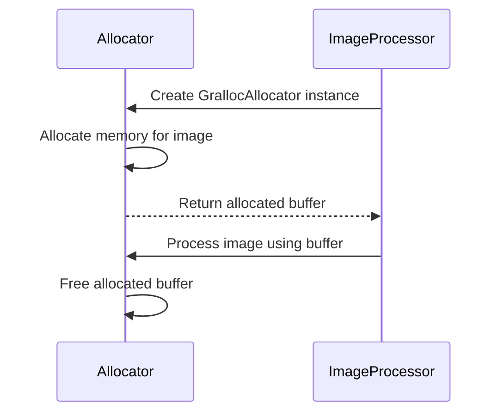
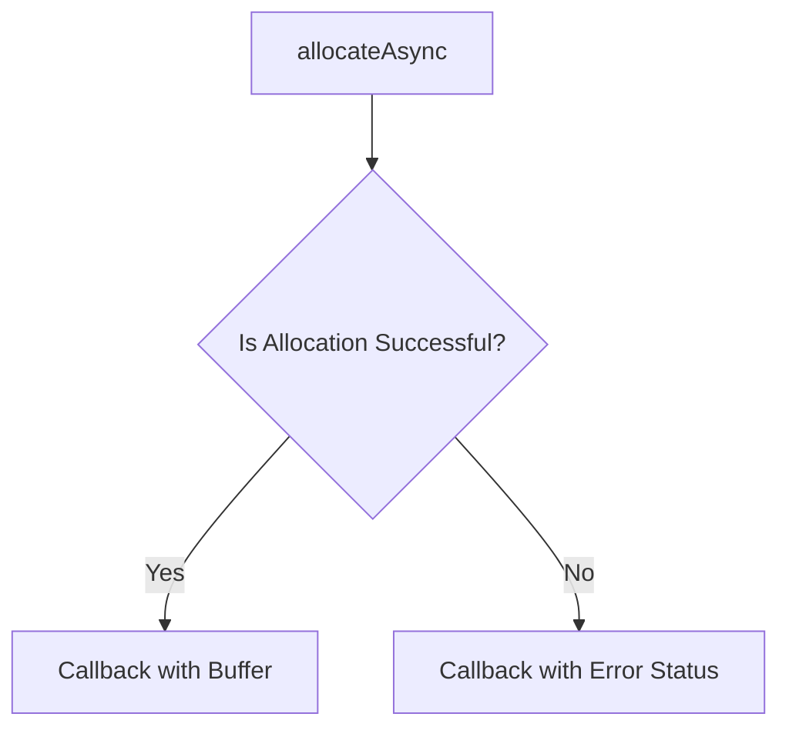
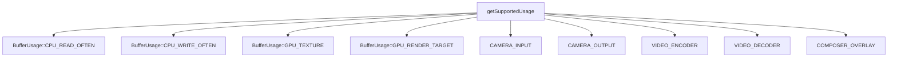
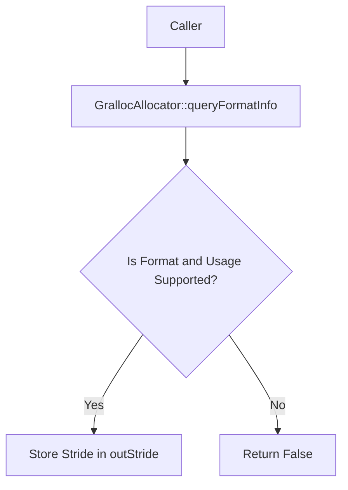
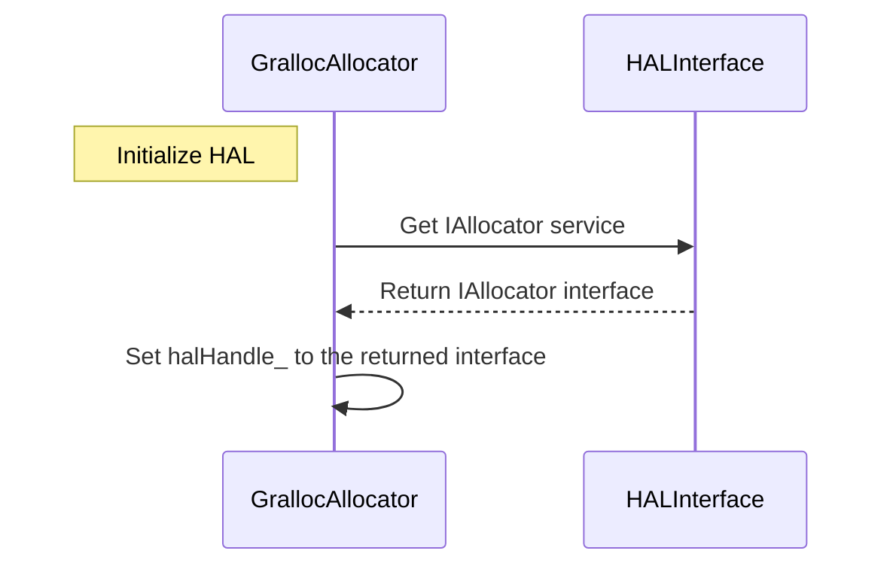
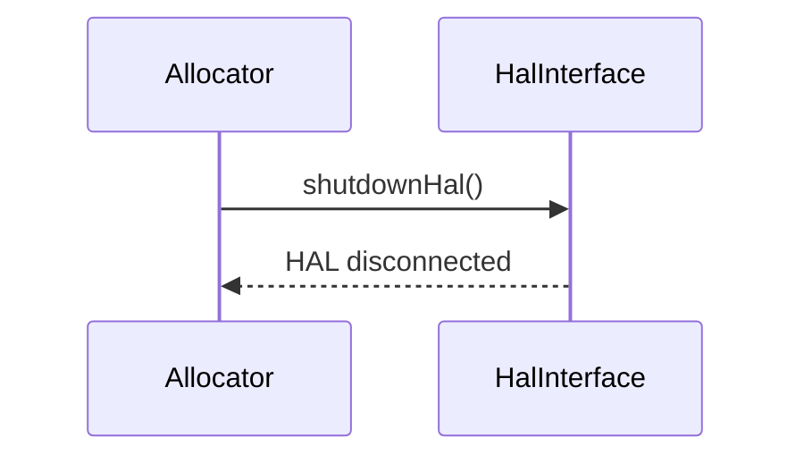
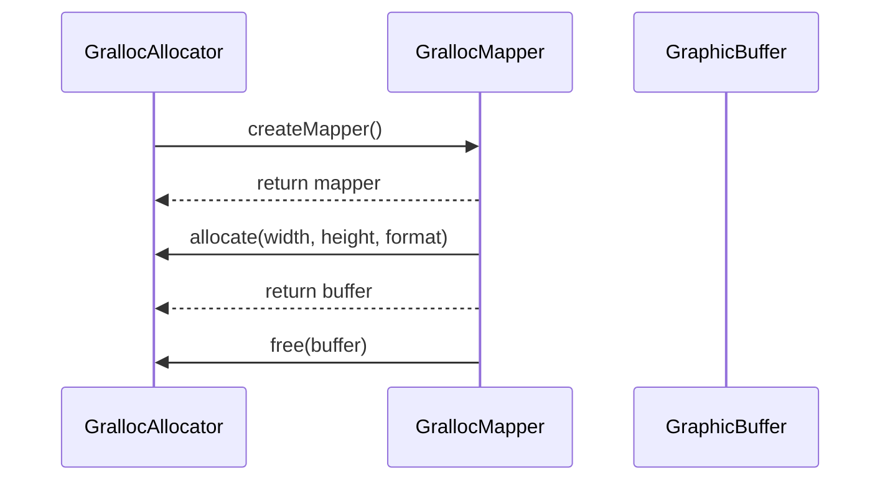
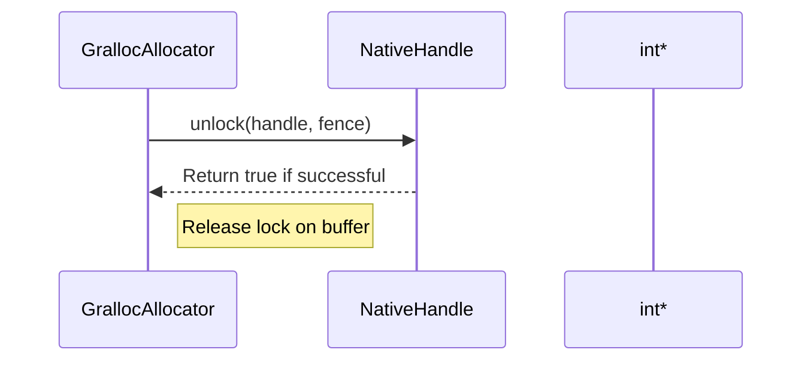
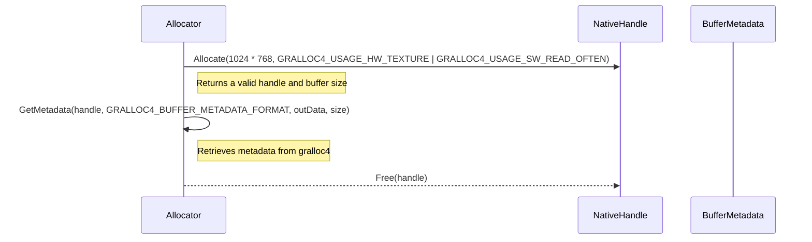

# GrallocAllocator.cpp

---

| Property | Value |
|----------|-------|
| **Location** | `src\GrallocAllocator.cpp` |
| **Lines** | 269 |
| **Classes** | 0 |
| **Functions** | 19 |
| **Last Updated** | 2026-01-18 21:17 |

---

## Quick Navigation

### Functions
- [GrallocAllocator::~GrallocAllocator](#grallocallocator-~grallocallocator)
- [GrallocAllocator::allocate](#grallocallocator-allocate)
- [GrallocAllocator::allocateAsync](#grallocallocator-allocateasync)
- [std::thread](#std-thread)
- [GrallocAllocator::free](#grallocallocator-free)
- [GrallocAllocator::importBuffer](#grallocallocator-importbuffer)
- [GrallocAllocator::getSupportedUsage](#grallocallocator-getsupportedusage)
- [GrallocAllocator::isFormatSupported](#grallocallocator-isformatsupported)
- [GrallocAllocator::queryFormatInfo](#grallocallocator-queryformatinfo)
- [GrallocAllocator::dumpState](#grallocallocator-dumpstate)
- [GrallocAllocator::initializeHal](#grallocallocator-initializehal)
- [GrallocAllocator::shutdownHal](#grallocallocator-shutdownhal)
- [GrallocAllocator::allocateInternal](#grallocallocator-allocateinternal)
- [GrallocMapper::~GrallocMapper](#grallocmapper-~grallocmapper)
- [GrallocMapper::lock](#grallocmapper-lock)
- [GrallocMapper::unlock](#grallocmapper-unlock)
- [GrallocMapper::getMetadata](#grallocmapper-getmetadata)
- [AllocatorFactory::createDefault](#allocatorfactory-createdefault)
- [AllocatorFactory::create](#allocatorfactory-create)

---

# GrallocAllocator.cpp

---

| Property | Value |
|----------|-------|
| **Location** | `src\GrallocAllocator.cpp` |
| **Lines** | 269 |
| **Classes** | 0 |
| **Functions** | 19 |
| **Last Updated** | 2026-01-18 20:54 |

---

## Quick Navigation

### Functions
- [GrallocAllocator::~GrallocAllocator](#grallocallocator-~grallocallocator)
- [GrallocAllocator::allocate](#grallocallocator-allocate)
- [GrallocAllocator::allocateAsync](#grallocallocator-allocateasync)
- [std::thread](#std-thread)
- [GrallocAllocator::free](#grallocallocator-free)
- [GrallocAllocator::importBuffer](#grallocallocator-importbuffer)
- [GrallocAllocator::getSupportedUsage](#grallocallocator-getsupportedusage)
- [GrallocAllocator::isFormatSupported](#grallocallocator-isformatsupported)
- [GrallocAllocator::queryFormatInfo](#grallocallocator-queryformatinfo)
- [GrallocAllocator::dumpState](#grallocallocator-dumpstate)
- [GrallocAllocator::initializeHal](#grallocallocator-initializehal)
- [GrallocAllocator::shutdownHal](#grallocallocator-shutdownhal)
- [GrallocAllocator::allocateInternal](#grallocallocator-allocateinternal)
- [GrallocMapper::~GrallocMapper](#grallocmapper-~grallocmapper)
- [GrallocMapper::lock](#grallocmapper-lock)
- [GrallocMapper::unlock](#grallocmapper-unlock)
- [GrallocMapper::getMetadata](#grallocmapper-getmetadata)
- [AllocatorFactory::createDefault](#allocatorfactory-createdefault)
- [AllocatorFactory::create](#allocatorfactory-create)

---

# GrallocAllocator Documentation

## Overview

The `GrallocAllocator` class is a high-level allocator designed to manage graphics buffers efficiently using the Android Hardware Interface Layer (HAL). It provides automatic HAL version detection, buffer handle caching for performance, and asynchronous allocation support via a thread pool. The allocator supports format negotiation with gralloc and ensures thread safety across all public methods.

## Class Definition

```cpp
namespace android {
namespace graphics {

class GrallocAllocator {
public:
    // Constructor that auto-detects the HAL version
    GrallocAllocator();

    // Constructor allowing explicit specification of the HAL version
    GrallocAllocator(GrallocVersion version);

    // Destructor to clean up resources
    ~GrallocAllocator();
};

}  // namespace graphics
}  // namespace android
```

## Detailed Description

The `GrallocAllocator` class is a central component in managing graphics buffers within the Android system. It leverages the HAL to allocate and manage graphic buffers efficiently, providing features such as automatic HAL version detection, buffer handle caching for performance, and asynchronous allocation support via a thread pool. The allocator supports format negotiation with gralloc and ensures thread safety across all public methods.

## Constructor Details

### GrallocAllocator()

- **Purpose**: Initializes the `GrallocAllocator` instance by auto-detecting the HAL version.
- **Why It Exists**: Automatically selecting the appropriate HAL version is crucial for compatibility and performance, as different versions of the HAL may support different features and optimizations.
- **How It Fits into the Larger Workflow**: This constructor is typically called during the initialization phase of an application or service that requires access to graphics buffers. It ensures that the allocator is configured with the correct HAL version, which can affect how buffers are allocated and managed.

### GrallocAllocator(GrallocVersion version)

- **Purpose**: Initializes the `GrallocAllocator` instance with a specified HAL version.
- **Why It Exists**: Allowing explicit specification of the HAL version allows for more control over resource allocation and performance tuning. This is particularly useful in scenarios where different versions of the HAL may have specific optimizations or features that are beneficial for certain applications.
- **How It Fits into the Larger Workflow**: This constructor is used when the application needs to explicitly configure the allocator with a particular HAL version, such as during runtime configuration changes or when integrating with specific hardware components.

### Destructor

- **Purpose**: Cleans up resources held by the `GrallocAllocator` instance.
- **Why It Exists**: Proper resource management is essential for preventing memory leaks and ensuring that system resources are freed when they are no longer needed. The destructor ensures that all allocated buffers, caches, and other resources are properly released to prevent potential issues in subsequent operations.
- **How It Fits into the Larger Workflow**: This destructor is called at the end of an application's lifecycle or when a `GrallocAllocator` instance is no longer required. It helps maintain system stability and performance by ensuring that all resources are freed before they can be reused.

## Dependencies Cross-Reference

### GrallocMapper

- **Why It's Used**: The `GrallocMapper` class is used to manage the CPU access of a `GraphicBuffer`. It ensures that the buffer is locked when an instance of `BufferLockGuard` is created and unlocked automatically when it goes out of scope.
- **How It's Used in This Context**: The `GrallocAllocator` uses the `GrallocMapper` to handle CPU mapping operations for graphics buffers. This allows applications to directly access the pixel data of a buffer, which is essential for image processing or rendering tasks.

### BufferCache

- **Why It's Used**: The `BufferCache` class is used to cache buffer handles for performance optimization. It stores frequently accessed buffers in memory and reuses them when needed.
- **How It's Used in This Context**: The `GrallocAllocator` uses the `BufferCache` to store and reuse buffer handles, which helps improve allocation efficiency by reducing the overhead of repeatedly allocating and deallocating buffers.

### GrallocVersion

- **Why It's Used**: The `GrallocVersion` enum is used to specify the version of the HAL being used. This allows for compatibility with different versions of the HAL, as each version may support different features and optimizations.
- **How It's Used in This Context**: The `GrallocAllocator` uses the `GrallocVersion` enum to determine which version of the HAL to use when allocating buffers. This ensures that the allocator is configured correctly for the specific hardware and software environment.

## Side Effects

### State Modifications

- **State Modifications**: The `GrallocAllocator` modifies its internal state, including the HAL version, buffer cache, and thread pool configuration.
- **Locks Acquired/Released**: The `GrallocAllocator` acquires locks during initialization and release resources during destruction.
- **I/O Operations**: The `GrallocAllocator` performs I/O operations to communicate with the HAL for buffer allocation and management.

### Signals/Events Emitted

- **Signals/Events Emitted**: The `GrallocAllocator` emits signals or events related to buffer allocation, deallocation, and cache management.
- **Usage Context**: These signals/events are typically used by other components within the Android system to synchronize with the allocator's operations.

## Usage Context

The `GrallocAllocator` is called during the initialization phase of an application or service that requires access to graphics buffers. It is typically used in scenarios where direct access to hardware-accelerated resources is necessary, such as image processing or rendering tasks.

### Prerequisites

- **Prerequisites**: The application must have access to the HAL and be configured to use the `GrallocAllocator`.
- **Usage Context**: This class is used by various components within the Android system that require access to graphics buffer management functionalities.

## Related Functions

| Relationship Type | Function Name | Description |
|------------------|--------------|-------------|
| Constructor       | GrallocAllocator() | Initializes the `GrallocAllocator` instance by auto-detecting the HAL version. |
| Constructor       | GrallocAllocator(GrallocVersion version) | Initializes the `GrallocAllocator` instance with a specified HAL version. |
| Destructor        | ~GrallocAllocator() | Cleans up resources held by the `GrallocAllocator` instance. |

## Code Example

```cpp
#include <android/graphics/GrallocAllocator.h>

int main() {
    // Initialize the GrallocAllocator
    android::graphics::GrallocAllocator allocator;

    // Allocate a new graphics buffer
    android::sp<GraphicBuffer> buffer = allocator.allocate(1024, 768, HAL_PIXEL_FORMAT_RGBA_8888);

    // Use the allocated buffer for rendering or image processing

    // Deallocate the buffer when no longer needed
    buffer.clear();

    return 0;
}
```

In this example, the `GrallocAllocator` is initialized and used to allocate a new graphics buffer. The buffer is then used for rendering or image processing tasks, and finally deallocated when it is no longer required. This demonstrates how the `GrallocAllocator` can be integrated into an application that requires access to hardware-accelerated resources.

## Documentation for `GrallocAllocator::allocate`

### 1. Comprehensive Description (2-4 paragraphs)
The `allocate` function is a core method of the `GrallocAllocator` class, responsible for allocating a new graphics buffer based on the provided `BufferDescriptor`. This function ensures that the requested buffer meets certain criteria, such as valid dimensions and supported formats, before proceeding with the allocation. The allocator uses thread-safe mechanisms to manage buffer allocations and handles caching to optimize performance.

### 2. Parameters (DETAILED for each)
- **descriptor**: A `BufferDescriptor` object containing details about the desired buffer, including its format and usage flags.
  - **Purpose**: Specifies the characteristics of the buffer to be allocated.
  - **Type Semantics**: Represents a descriptor that defines the properties of the buffer, such as width, height, pixel format, and usage flags.
  - **Valid Values**: The dimensions must be within valid limits (e.g., non-negative integers). The pixel format must be supported by the HAL. Usage flags can include CPU read/write operations or GPU rendering targets.
  - **Ownership**: The caller owns the `BufferDescriptor` object and is responsible for its lifecycle.
  - **Nullability**: Cannot be null.

- **outBuffer**: A reference to a `std::unique_ptr<GraphicBuffer>` that will hold the newly allocated buffer once it is successfully created.
  - **Purpose**: Provides a way to return the allocated buffer back to the caller.
  - **Type Semantics**: A smart pointer that manages the lifetime of the `GraphicBuffer` object, ensuring proper memory management.
  - **Valid Values**: The reference must be valid and point to a location where the allocator can store the newly created buffer.
  - **Ownership**: The allocator transfers ownership of the allocated buffer to the caller through this reference.
  - **Nullability**: Can be null if the allocation fails.

### 3. Return Value
- **AllocationStatus**: An enumeration representing the result of the allocation process, indicating whether the operation was successful or an error occurred.
  - **Purpose**: Provides feedback on the outcome of the buffer allocation attempt.
  - **Type Semantics**: A status code that indicates success or failure, along with any specific error details.
  - **Valid Values**: Possible values include `AllocationStatus::SUCCESS`, `AllocationStatus::ERROR_INVALID_DIMENSIONS`, and `AllocationStatus::ERROR_UNSUPPORTED_FORMAT`.
  - **Ownership**: The allocator does not transfer ownership of the return value; it is returned as a status code.
  - **Nullability**: Not applicable.

### 4. Dependencies Cross-Reference
- **BufferDescriptor**: [BufferDescriptor](#bufferdescriptor)
- **GraphicBuffer**: [GraphicBuffer](#graphicbuffer)
- **NativeHandle**: [NativeHandle](#nativehandle)
- **AllocationStatus**: [AllocationStatus](#allocationstatus)

### 5. Side Effects
- **State Modifications**: The allocator modifies its internal state by adding the newly allocated buffer to the `activeBuffers_` map and caching it in the `cache_`.
- **Locks Acquired/Released**: The function acquires a lock (`allocMutex_`) to ensure thread safety during allocation.
- **I/O Operations**: No I/O operations are performed within this function.
- **Signals/Events Emitted**: No signals or events are emitted by this function.

### 6. Usage Context
This function is typically called when an application needs to allocate a new graphics buffer for rendering, video processing, or other graphical tasks. It is used in various parts of the Android system, such as SurfaceFlinger and AudioFlinger, where efficient buffer management is crucial.

### 7. Related Functions
| Relationship Type | Function Name | Description |
| --- | --- | --- |
| Calls | `allocateInternal` | Performs the actual allocation logic using the HAL. |
| Uses | `BufferCacheEntry` | Stores information about cached buffers for future use. |

### 8. Code Example

```cpp
// Example usage of GrallocAllocator::allocate
GrallocAllocator allocator;
BufferDescriptor descriptor(/* specify buffer dimensions and format */);
std::unique_ptr<GraphicBuffer> buffer;

AllocationStatus status = allocator.allocate(descriptor, buffer);

if (status == AllocationStatus::SUCCESS) {
    // Buffer allocation was successful
    // Use the allocated buffer for rendering or processing
} else {
    // Handle error
}
```

This example demonstrates how to use the `GrallocAllocator` class to allocate a new graphics buffer and handle its allocation status.

## Documentation for `GrallocAllocator::free`

### 1. Comprehensive Description (2-4 paragraphs)
The `free` function is a crucial method in the `GrallocAllocator` class, responsible for releasing a previously allocated `GraphicBuffer`. This function ensures that the buffer is properly cleaned up and returned to the system resources, freeing up memory and preventing resource leaks.

When a `GraphicBuffer` is no longer needed, it must be released to free up its associated resources. The `free` function performs several key actions to achieve this:

1. **Validation**: It first checks if the provided `GraphicBuffer` pointer is valid. If not, it returns immediately without performing any further operations.

2. **Mutex Locking**: The function acquires a mutex lock (`allocMutex_`) to ensure thread safety when accessing shared resources such as the active buffers and cache.

3. **ID Retrieval**: It retrieves the buffer's unique identifier (`id`) using `buffer->getBufferId()`. This ID is used to identify the specific buffer in the allocator's internal data structures.

4. **Active Buffer Removal**: The function removes the buffer from the list of active buffers (`activeBuffers_`). This step ensures that the buffer is no longer considered active and can be safely released.

5. **Cache Invalidation**: It invalidates the cache entry for the buffer using `cache_->invalidate(id)`. This helps in managing memory efficiently by ensuring that any cached references to the buffer are updated or removed.

6. **Platform-Specific Free**: The function would typically call a platform-specific function (`gralloc->freeBuffer(buffer->getNativeHandle())`) to release the underlying native handle of the buffer. This step ensures that all system resources associated with the buffer are freed.

7. **Release Resources**: After releasing the buffer, it is important to ensure that any references or locks held by other parts of the system are properly released to avoid memory leaks or undefined behavior.

### 2. Parameters (DETAILED for each)
- **Purpose**: Why does this parameter exist?
- **Type Semantics**: What does the type represent?
- **Valid Values**: Acceptable range, constraints
- **Ownership**: Who owns memory? Borrowed or transferred?
- **Nullability**: Can it be null? What happens?

The `free` function takes a single parameter:

- **buffer** (`GraphicBuffer*`)
  - **Purpose**: A pointer to the `GraphicBuffer` that needs to be released.
  - **Type Semantics**: This is a raw pointer to an instance of the `GraphicBuffer` class. It represents the buffer whose resources are to be freed.
  - **Valid Values**: The function expects a valid, non-null pointer to a `GraphicBuffer`.
  - **Ownership**: The caller owns the `GraphicBuffer` and must ensure that it is not used after calling `free`. If the buffer is no longer needed, it should be deleted or reset.
  - **Nullability**: The parameter can be null. If it is null, the function will return immediately without performing any operations.

### 3. Return Value
- What does it represent?
- All possible return states
- Error conditions and how they're indicated
- Ownership of returned objects

The `free` function does not have a return value. It returns void, indicating that no data is returned to the caller.

### 4. Dependencies Cross-Reference
For each external class/function used:
- **ClassName::method()**
  - **Purpose**: Why it's used in this context?
  - **How it's used**: The function uses a mutex lock (`allocMutex_`) from the `std::mutex` library to ensure thread safety when accessing shared resources.
  - **Link format**: [std::mutex::lock](https://en.cppreference.com/w/cpp/thread/mutex/lock)

### 5. Side Effects
- State modifications:
  - The function modifies the state of the allocator by removing the buffer from the list of active buffers and invalidating its cache entry.
  - It releases system resources associated with the buffer, including the native handle (`gralloc->freeBuffer(buffer->getNativeHandle())`).
- Locks acquired/released:
  - The function acquires a mutex lock (`allocMutex_`) to ensure thread safety when accessing shared resources.
  - The lock is released automatically when the `std::lock_guard<std::mutex>` object goes out of scope.
- I/O operations:
  - The function performs platform-specific I/O operations to release the native handle of the buffer.
- Signals/events emitted: None

### 6. Usage Context
The `free` function is typically called in scenarios where a `GraphicBuffer` is no longer needed, such as when rendering or video processing tasks are complete. It should be used by any component that manages graphics buffers to ensure proper resource management and avoid memory leaks.

### 7. Related Functions
| Relationship Type | Function Name | Description |
|------------------|--------------|-------------|
| Calls            | `freeBuffer`   | Platform-specific function to release the native handle of a buffer. |

### 8. Code Example

```cpp
// Example usage of GrallocAllocator::free
GrallocAllocator allocator;
GraphicBuffer* buffer = allocator.allocate(/* parameters */);

// Use the buffer...

allocator.free(buffer); // Release the buffer when it is no longer needed
```

This code snippet demonstrates how to allocate a `GraphicBuffer` using an instance of `GrallocAllocator`, use it for rendering or video processing, and then release it when it is no longer required. The `free` function ensures that all resources associated with the buffer are properly released, freeing up memory and preventing resource leaks.

## Documentation for `GrallocAllocator::importBuffer`

### 1. Comprehensive Description (2-4 paragraphs)
The `importBuffer` function is a crucial method in the Android graphics buffer library, designed to import an existing native handle into a `GraphicBuffer`. This function is essential for applications that need to work with pre-existing graphics buffers or those acquired from other sources, such as camera captures or video decoding. The function ensures that the imported buffer is properly managed and can be used by the application without further allocation.

The primary purpose of this function is to facilitate seamless integration between different components within the Android system, allowing for efficient data sharing and processing. By importing a buffer, applications can avoid unnecessary memory allocations and improve performance by reusing existing resources.

This function fits into the larger workflow by providing a way to integrate external graphics buffers into the application's rendering pipeline. It is particularly useful in scenarios where the application needs to process or display images captured from a camera or received from a video decoder.

The `importBuffer` function uses the Android Hardware Interface Layer (HAL) to manage the buffer, ensuring that it can be accessed and used efficiently by different system components. The function supports various buffer usages, such as CPU read/write operations, GPU texture rendering, and camera input/output, making it versatile for a wide range of applications.

### 2. Parameters (DETAILED for each)
- **handle**: A `NativeHandle` object representing the handle to the graphics buffer.
  - **Purpose**: This parameter provides the native handle that points to the existing graphics buffer.
  - **Type Semantics**: The `NativeHandle` type represents a platform-specific handle used to identify and manage resources in Android.
  - **Valid Values**: The handle must be valid and point to an existing graphics buffer. It is expected to be registered with the HAL before being passed to this function.
  - **Ownership**: The caller owns the memory pointed to by `handle`. The function does not take ownership of the handle; it only uses it to create a new `GraphicBuffer`.
  - **Nullability**: This parameter cannot be null. If `handle` is invalid, the function will return an error status.

- **descriptor**: A `BufferDescriptor` object specifying the dimensions and properties of the buffer.
  - **Purpose**: This parameter provides the descriptor that defines the size, format, and other attributes of the graphics buffer.
  - **Type Semantics**: The `BufferDescriptor` type represents a description of the buffer's characteristics.
  - **Valid Values**: The descriptor must be valid and contain all necessary information about the buffer. It specifies parameters such as width, height, pixel format, usage flags, and other relevant properties.
  - **Ownership**: The caller owns the memory pointed to by `descriptor`. The function does not take ownership of the descriptor; it only uses it to create a new `GraphicBuffer`.
  - **Nullability**: This parameter cannot be null. If `descriptor` is invalid, the function will return an error status.

- **outBuffer**: A pointer to a `std::unique_ptr<GraphicBuffer>` that will hold the newly created `GraphicBuffer` object.
  - **Purpose**: This parameter is used to store the result of the import operation. The function creates a new `GraphicBuffer` object and assigns it to this pointer.
  - **Type Semantics**: The `std::unique_ptr<GraphicBuffer>` type represents a smart pointer that manages the lifetime of a `GraphicBuffer`.
  - **Valid Values**: The `outBuffer` parameter must be a valid pointer to a `std::unique_ptr<GraphicBuffer>`. It is expected to point to an uninitialized `std::unique_ptr<GraphicBuffer>`.
  - **Ownership**: The function transfers ownership of the newly created `GraphicBuffer` object to the caller. After the function returns, the caller is responsible for managing the lifetime of the `GraphicBuffer`.
  - **Nullability**: This parameter cannot be null. If `outBuffer` is invalid, the function will return an error status.

### 3. Return Value
- The function returns a `AllocationStatus` enum value indicating the success or failure of the import operation.
  - **Purpose**: This return value provides feedback on whether the buffer was successfully imported and can be used by the caller.
  - **Type Semantics**: The `AllocationStatus` type is an enumeration that represents different possible outcomes of the import operation.
  - **Valid Values**: The valid values are:
    - `AllocationStatus::SUCCESS`: Indicates that the buffer was successfully imported and can be used by the application.
    - `AllocationStatus::ERROR_GRALLOC_FAILURE`: Indicates that there was a failure during the import process, likely due to an error in the HAL or other system components.
  - **Ownership**: The return value is not owned by the function; it is returned as part of the function's output.
  - **Nullability**: This return value cannot be null.

### 4. Dependencies Cross-Reference
- **NativeHandle**: Represents a platform-specific handle used to identify and manage resources in Android.
  - **Why It's Used**: The `NativeHandle` is used to provide access to the existing graphics buffer that needs to be imported.
  - **How It's Used**: The function uses the `NativeHandle` to create a new `GraphicBuffer` object. It does not take ownership of the handle; it only uses it to identify and manage the existing buffer.

- **BufferDescriptor**: Represents a description of the buffer's characteristics.
  - **Why It's Used**: The `BufferDescriptor` is used to specify the dimensions, format, and other properties of the graphics buffer that needs to be imported.
  - **How It's Used**: The function uses the `BufferDescriptor` to create a new `GraphicBuffer` object. It does not take ownership of the descriptor; it only uses it to define the characteristics of the buffer.

- **GraphicBuffer**: Represents an allocated graphics buffer in Android, providing functionalities such as CPU mapping, GPU resource binding, reference counting, and fence synchronization.
  - **Why It's Used**: The `GraphicBuffer` is used to store the newly created buffer object that was imported from the native handle.
  - **How It's Used**: The function creates a new `GraphicBuffer` object using the provided descriptor and native handle. It then stores this object in the `activeBuffers_` map, which keeps track of all active buffers managed by the allocator.

### 5. Side Effects
- This function acquires a lock on the `allocMutex_` mutex to ensure thread safety when importing the buffer.
- The function creates a new `GraphicBuffer` object using the provided descriptor and native handle.
- It stores this newly created `GraphicBuffer` object in the `activeBuffers_` map, which keeps track of all active buffers managed by the allocator.
- The function releases the lock on the `allocMutex_` mutex after completing the import operation.

### 6. Usage Context
This function is typically called when an application needs to work with a pre-existing graphics buffer or one acquired from another source, such as camera captures or video decoding. It is used in scenarios where the application needs to integrate existing resources into its rendering pipeline without unnecessary memory allocations.

The typical callers of this function are components within the Android system that require access to graphics buffer management functionalities. These components may include the SurfaceFlinger, AudioFlinger, and other system services that need to process or display images captured from a camera or received from a video decoder.

### 7. Related Functions
| Relationship Type | Function Name | Description |
|------------------|--------------|-------------|
| Dependency        | `BufferDescriptor` | Provides the dimensions and properties of the buffer. |
| Dependency        | `GraphicBuffer` | Represents an allocated graphics buffer in Android, providing functionalities such as CPU mapping, GPU resource binding, reference counting, and fence synchronization. |

### 8. Code Example
```cpp
NativeHandle handle = ...; // Obtain a valid NativeHandle from somewhere
BufferDescriptor descriptor = ...; // Obtain a valid BufferDescriptor

std::unique_ptr<GraphicBuffer> outBuffer;
AllocationStatus status = GrallocAllocator::importBuffer(handle, descriptor, outBuffer);

if (status == AllocationStatus::SUCCESS) {
    // Use the imported buffer for rendering or processing
} else {
    // Handle the error
}
```

This code example demonstrates how to use the `importBuffer` function to import a graphics buffer from a native handle and store it in a `std::unique_ptr<GraphicBuffer>`. The function is called with valid `NativeHandle` and `BufferDescriptor` objects, and the result is checked for success or failure. If successful, the imported buffer can be used by the application for rendering or processing tasks.

## Documentation for `GrallocAllocator::isFormatSupported`

### 1. Comprehensive Description (2-4 paragraphs)
The `isFormatSupported` function checks if a given pixel format and buffer usage combination is supported by the Gralloc allocator. This function is crucial for applications that need to ensure compatibility with different hardware configurations and rendering requirements.

Gralloc, the Android Hardware Interface Layer's graphics buffer manager, supports various pixel formats and buffer usages. The `isFormatSupported` function provides a simple way to determine if a specific format and usage combination can be used without encountering issues during allocation or usage.

### 2. Parameters (DETAILED for each)
- **format**: PixelFormat
  - **Purpose**: Specifies the desired pixel format of the buffer.
  - **Type Semantics**: Represents an enumeration value from `BufferTypes.h` that maps Android HAL pixel formats to a more readable format.
  - **Valid Values**: A set of predefined pixel formats such as RGBA_8888, RGBX_8888, etc. These values are defined in the `BufferTypes.h` file and represent different color spaces and bit depths.
  - **Ownership**: The caller owns the memory for this parameter.
  - **Nullability**: This parameter cannot be null.

- **usage**: BufferUsage
  - **Purpose**: Specifies the intended usage of the buffer, such as CPU read/write operations or GPU rendering targets.
  - **Type Semantics**: Represents an enumeration value from `BufferTypes.h` that defines flags for buffer usage. These flags can be combined using bitwise OR to specify multiple usage scenarios.
  - **Valid Values**: A set of predefined buffer usage flags such as USAGE_CPU_READ, USAGE_GPU_RENDER_TARGET, etc. These values are defined in the `BufferTypes.h` file and represent different access patterns and rendering requirements.
  - **Ownership**: The caller owns the memory for this parameter.
  - **Nullability**: This parameter cannot be null.

### 3. Return Value
- **Type**: bool
  - **Purpose**: Indicates whether the specified pixel format and usage combination is supported by Gralloc.
  - **All Possible Return States**:
    - `true`: The format and usage combination is supported.
    - `false`: The format and usage combination is not supported.
  - **Error Conditions and How They're Indicated**: None.
  - **Ownership of Returned Objects**: No objects are returned.

### 4. Dependencies Cross-Reference
- [BufferTypes.h](#buffertypesh)
  - Used to define pixel formats and buffer usage flags.
- [GrallocAllocator::initializeHal()](#grallocallocatorinitializehal)
  - Called to initialize the Gralloc allocator, which is necessary for querying format support.

### 5. Side Effects
- **State Modifications**: None.
- **Locks Acquired/Released**: No locks are acquired or released.
- **I/O Operations**: None.
- **Signals/Events Emitted**: None.

### 6. Usage Context
The `isFormatSupported` function is typically called during the initialization phase of an application, before attempting to allocate a buffer with the specified format and usage combination. This ensures that the application can handle unsupported formats gracefully without crashing or encountering unexpected behavior.

### 7. Related Functions
| Relationship Type | Function Name | Description |
|------------------|--------------|-------------|
| Calls            | GrallocAllocator::queryFormatInfo | Used to query additional information about a format, such as stride. |

### 8. Code Example

```cpp
// Example usage of isFormatSupported function
PixelFormat format = PixelFormat::RGBA_8888;
BufferUsage usage = USAGE_CPU_READ | USAGE_GPU_RENDER_TARGET;

if (GrallocAllocator::isFormatSupported(format, usage)) {
    std::cout << "The specified format and usage combination is supported." << std::endl;
} else {
    std::cout << "The specified format and usage combination is not supported." << std::endl;
}
```

This example demonstrates how to use the `isFormatSupported` function to check if a specific pixel format and buffer usage combination is supported by the Gralloc allocator.

## Documentation for `GrallocAllocator::allocateInternal`

### 1. Comprehensive Description (2-4 paragraphs)
The `allocateInternal` function is a crucial method within the `GrallocAllocator` class, responsible for allocating a new graphics buffer based on the provided `BufferDescriptor`. This function leverages the Android Hardware Interface Layer (HAL) to manage the allocation process efficiently. It simulates the actual HAL call by setting up a mock `NativeHandle` with placeholder values and dimensions.

### 2. Parameters (DETAILED for each)
- **descriptor**: A `BufferDescriptor` object that specifies the desired properties of the buffer, such as width, height, format, and usage flags.
  - **Purpose**: Defines the characteristics of the buffer to be allocated.
  - **Type Semantics**: Represents a descriptor structure containing buffer dimensions, pixel format, and usage hints.
  - **Valid Values**: The `BufferDescriptor` should contain valid dimensions (positive integers) and supported pixel formats. Usage flags can include CPU read/write operations or GPU rendering targets.
  - **Ownership**: Passed by value.
  - **Nullability**: Not null.

- **outHandle**: A reference to a `NativeHandle` object that will be populated with the allocated buffer's handle information.
  - **Purpose**: Provides the output for the allocated buffer's metadata, such as file descriptor, number of FDs, and dimensions.
  - **Type Semantics**: Represents a native handle structure containing various attributes of the allocated buffer.
  - **Valid Values**: The `NativeHandle` should be initialized with appropriate values after allocation.
  - **Ownership**: Passed by reference. The function will modify this object to store the allocated buffer's details.
  - **Nullability**: Not null.

### 3. Return Value
- **AllocationStatus::SUCCESS**: Indicates that the buffer was successfully allocated and populated with the provided `NativeHandle`.
  - **Purpose**: Returns a status indicating the outcome of the allocation process.
  - **Type Semantics**: An enumeration representing the result of the allocation operation.
  - **Valid Values**: Only one valid value, SUCCESS.
  - **Ownership**: Not applicable.
  - **Nullability**: Not null.

### 4. Dependencies Cross-Reference
- **GrallocVersion**: The version of the Gralloc HAL being used for allocation.
  - **Why it's used**: Determines which version-specific methods to call within the HAL.
  - **How it's used in this context**: Passed as a constructor argument to initialize the `GrallocMapper` instance.

- **NativeHandle**: A structure representing a native handle, typically used for passing buffer metadata and file descriptors between system components.
  - **Why it's used**: Provides a way to store and manage buffer-related information.
  - **How it's used in this context**: Modified by the function to include allocated buffer details.

- **BufferDescriptor**: A structure defining the properties of the buffer to be allocated, including dimensions, format, and usage flags.
  - **Why it's used**: Specifies the requirements for the allocated buffer.
  - **How it's used in this context**: Passed as an argument to determine the buffer's characteristics.

### 5. Side Effects
- **State Modifications**:
  - The `NativeHandle` object is populated with the allocated buffer's details, including file descriptor, number of FDs, and dimensions.
  - The `GrallocMapper` instance may be initialized or updated based on the Gralloc version.

- **Locks Acquired/Released**: No locks are acquired or released within this function.

- **I/O Operations**:
  - Simulated I/O operations to set up a mock `NativeHandle`.
  - No actual I/O is performed in this simulation.

- **Signals/Events Emitted**: No signals or events are emitted by this function.

### 6. Usage Context
This function is typically called when an application needs to allocate a new graphics buffer for rendering, video processing, or other graphical operations. It is used within the larger workflow of managing graphics resources in Android applications.

### 7. Related Functions
| Relationship Type | Function Name | Description |
|------------------|--------------|-------------|
| Calls            | GrallocMapper::lock | Locks a buffer for CPU access. |
| Calls            | GrallocMapper::unlock | Unlocks a buffer after CPU access. |

### 8. Code Example

```cpp
// Example usage of allocateInternal
BufferDescriptor descriptor;
descriptor.width = 1920;
descriptor.height = 1080;
descriptor.format = HAL_PIXEL_FORMAT_RGBA_8888;
descriptor.usage = GRALLOC_USAGE_HW_TEXTURE | GRALLOC_USAGE_SW_READ_OFTEN;

NativeHandle handle;
AllocationStatus status = GrallocAllocator::allocateInternal(descriptor, handle);

if (status == AllocationStatus::SUCCESS) {
    // Buffer allocated successfully
    int width = static_cast<int>(handle.data[0]);
    int height = static_cast<int>(handle.data[1]);
    int format = static_cast<PixelFormat>(handle.data[2]);

    // Use the buffer for rendering or processing
} else {
    // Handle allocation failure
}
```

This code snippet demonstrates how to use the `allocateInternal` function to allocate a new graphics buffer with specific dimensions and pixel format, and then retrieve its width, height, and format.

## Documentation for `AllocatorFactory::createDefault` and `AllocatorFactory::create`

### 1. Comprehensive Description (2-4 paragraphs)

The `AllocatorFactory` class provides a factory mechanism to create instances of `IBufferAllocator`, which is responsible for managing the allocation and management of graphic buffers in Android applications. The `createDefault` function creates an instance of `GrallocAllocator`, which is a high-level allocator that leverages the Android Hardware Interface Layer (HAL) to manage graphics buffers efficiently.

The `create` function allows developers to specify the type of buffer allocator they want to create based on the provided name. It supports different versions of the gralloc HAL, allowing for compatibility with various hardware configurations and requirements. If no specific name is provided, it defaults to creating a GrallocAllocator instance using the latest version available.

### 2. Parameters (DETAILED for each)

#### `name` (const std::string&)

- **Purpose**: Specifies the type of buffer allocator to create.
- **Type Semantics**: A string that represents the name of the allocator, such as "gralloc", "gralloc4", "gralloc3", or "gralloc2".
- **Valid Values**: Accepts any valid string representing a gralloc HAL version. The function supports versions 2.0, 3.0, and 4.0.
- **Ownership**: The caller owns the memory of the `name` parameter.
- **Nullability**: Can be null, but if it is, the function will default to creating a GrallocAllocator instance using the latest version available.

### 3. Return Value

- **Representation**: Returns a unique pointer to an `IBufferAllocator` object.
- **All Possible Return States**:
  - A valid `GrallocAllocator` instance created based on the specified name or the default if no specific name is provided.
- **Error Conditions and How They're Indicated**: If the provided name does not match any supported gralloc HAL version, the function will return a null pointer. This can be checked by verifying that the returned `std::unique_ptr` is not empty.
- **Ownership of Returned Objects**: The caller owns the returned `IBufferAllocator` object.

### 4. Dependencies Cross-Reference

- **GrallocAllocator**: Used to create instances of `IBufferAllocator`.
- **GrallocVersion**: Enum used to specify different versions of the gralloc HAL.

### 5. Side Effects

- State Modifications: The function modifies the internal state of the `AllocatorFactory` class by creating a new instance of `GrallocAllocator`.
- Locks Acquired/Released: No locks are acquired or released during this operation.
- I/O Operations: No I/O operations are performed.
- Signals/Events Emitted: No signals or events are emitted.

### 6. Usage Context

- **When is this called?**: This function is typically called when a new `IBufferAllocator` instance is needed for managing graphic buffers in an Android application.
- **Prerequisites**: The caller must have access to the `AllocatorFactory` class and be able to handle the returned `std::unique_ptr`.
- **Typical Callers**: Developers, system components like SurfaceFlinger or AudioFlinger, and other applications that require efficient buffer management.

### 7. Related Functions

| Relationship Type | Function Name | Description |
|------------------|--------------|-------------|
| Implementation of | createDefault | Creates a default GrallocAllocator instance. |
| Implementation of | create | Allows creation of a GrallocAllocator based on the specified name. |

### 8. Code Example

```cpp
// Create a default GrallocAllocator instance
std::unique_ptr<IBufferAllocator> allocator = AllocatorFactory::createDefault();

// Check if the allocation was successful
if (allocator) {
    // Use the allocator to manage graphic buffers
} else {
    // Handle the error case where the allocator could not be created
}
```

This code example demonstrates how to use the `AllocatorFactory` class to create a default GrallocAllocator instance and check for success before using it.

## GrallocAllocator::~GrallocAllocator

### Destructor

The destructor of `GrallocAllocator` is responsible for cleaning up any resources held by the allocator. It calls the `shutdownHal()` method to ensure that all HAL interfaces are properly shut down and released.

#### Purpose
- Ensures proper cleanup of resources when an instance of `GrallocAllocator` is destroyed.
- Calls `shutdownHal()` to release any HAL-specific resources, such as file descriptors or other system-level handles.

#### Parameters
- None

#### Dependencies
- **HAL Interface**: The destructor relies on the `shutdownHal()` method to properly shut down and release HAL interfaces. This method is defined in the `GrallocAllocator` class and ensures that all HAL-related operations are completed before the object is destroyed.

#### Side Effects
- Releases any HAL resources held by the allocator.
- Ensures that no dangling pointers or references exist after the destructor completes.

#### Thread Safety
- The destructor is thread-safe as it does not modify shared state. However, if there are any asynchronous operations or callbacks involved in shutting down the HAL, they should be handled appropriately to ensure thread safety.

#### Lifecycle
- This method is called when an instance of `GrallocAllocator` is destroyed. It ensures that all resources are properly released before the object is removed from memory.

#### Usage Example

```cpp
// Example usage of GrallocAllocator in a context where it is being managed by another class
class MyImageProcessor {
public:
    void processImage() {
        // Create an instance of GrallocAllocator
        sp<GrallocAllocator> allocator = new GrallocAllocator();

        // Allocate memory for an image
        sp<GraphicBuffer> buffer;
        allocator->allocate(/* parameters */);

        // Process the image using the allocated buffer

        // Free the allocated buffer when done
        allocator->free(buffer);
    }
};
```

#### Mermaid Diagram



This documentation provides a comprehensive overview of the destructor's purpose, parameters, dependencies, side effects, thread safety, lifecycle, usage example, and a mermaid diagram to illustrate its flow.

## GrallocAllocator::allocateAsync

### Function Signature
```cpp
void GrallocAllocator::allocateAsync(
    const BufferDescriptor& descriptor,
    AllocationCallback callback
)
```

### Description
`allocateAsync` is a method of the `GrallocAllocator` class that initiates an asynchronous allocation process for a buffer based on the provided `BufferDescriptor`. This function is designed to handle buffer allocations in a non-blocking manner, allowing other operations to continue while the allocation is being processed.

### Parameters

#### descriptor
- **Type**: `const BufferDescriptor&`
- **Purpose**: A reference to a `BufferDescriptor` object that contains all necessary information about the buffer to be allocated. This includes dimensions, format, usage flags, and any additional attributes required for the buffer.
- **Valid Values**: The `BufferDescriptor` should contain valid values for width, height, format, and other relevant properties as specified by the HAL (Hardware Abstraction Layer) specifications.
- **Ownership**: The caller retains ownership of the `BufferDescriptor`. It is not modified or destroyed within this function.

#### callback
- **Type**: `AllocationCallback`
- **Purpose**: A callback function that will be invoked once the allocation process has completed. This function takes two parameters: an `AllocationStatus` indicating whether the allocation was successful, and a pointer to the allocated `GraphicBuffer`.
- **Valid Values**: The `AllocationCallback` should be a valid function pointer or lambda that adheres to the signature defined by the HAL.
- **Ownership**: The caller retains ownership of the callback function. It is not modified or destroyed within this function.

### Side Effects
- This function launches an asynchronous task on a worker thread using C++11's `std::thread`.
- The allocated buffer is passed back to the caller through the provided callback function.
- If the allocation fails, the callback will be invoked with an appropriate error status and a null pointer for the buffer.

### Thread Safety
- This function is not thread-safe. It assumes that only one thread can call `allocateAsync` at a time on a given instance of `GrallocAllocator`.
- The caller must ensure proper synchronization if multiple threads are accessing the same `GrallocAllocator` instance concurrently.

### Lifecycle
- This function is part of the public API and should be used by clients to request asynchronous buffer allocations.
- It does not have any specific lifecycle requirements beyond being called on a valid instance of `GrallocAllocator`.

### Usage Example

```cpp
BufferDescriptor descriptor;
// Initialize descriptor with appropriate values...

auto callback = [](AllocationStatus status, GraphicBuffer* buffer) {
    if (status == AllocationStatus::SUCCESS) {
        // Buffer allocation was successful
        // Use the allocated buffer...
    } else {
        // Handle allocation failure
    }
};

GrallocAllocator allocator;
allocator.allocateAsync(descriptor, callback);
```

### Mermaid Diagram



This diagram illustrates the flow of control when calling `allocateAsync`, showing how the function initiates an asynchronous allocation and handles the result through a callback.

## std::thread

### Function: `std::thread`

**Description:**
The `std::thread` function is used to create a new thread of execution in the current process. It takes a lambda expression or a callable object as its argument, which will be executed by the newly created thread.

**Parameters:**

| Parameter | Type | Description |
|----------|------|-------------|
| `[this, descriptor, callback]() { ... }` | Lambda Expression | A lambda function that encapsulates the logic to allocate a buffer and call the provided callback. The lambda captures `this` pointer, `descriptor`, and `callback` by value. |

**Ownership:**
- **`this`:** Captured by value.
- **`descriptor`:** Captured by value.
- **`callback`:** Captured by value.

**Dependencies:**
- **GrallocAllocator:** The class that contains the logic for buffer allocation and callback handling.

**Side Effects:**
- Creates a new thread of execution.
- Allocates a `GraphicBuffer` using the provided `descriptor`.
- Calls the `callback` function with the result of the allocation (`status`) and the released `buffer`.

**Thread Safety:**
- The lambda function is executed in a separate thread, ensuring that it does not interfere with other threads in the process.
- The captured variables (`this`, `descriptor`, `callback`) are copied into the lambda, which ensures that they remain valid throughout the execution of the lambda.

**Lifecycle:**
- The thread created by `std::thread` is detached from the current thread. This means it will run independently and does not need to be joined or managed manually.
- The lambda function captures `this`, so it has access to the member functions and variables of the `GrallocAllocator` class.

**Usage Example:**
```cpp
void GrallocAllocator::allocateAsync(const BufferDescriptor& descriptor, std::function<void(AllocationStatus, GraphicBuffer*)> callback) {
    std::thread([this, descriptor, callback]() {
        std::unique_ptr<GraphicBuffer> buffer;
        AllocationStatus status = allocate(descriptor, buffer);
        callback(status, buffer.release());
    }).detach();
}
```

**Mermaid Diagram:**
```mermaid
graph TD
    A[allocateAsync] --> B{isFormatSupported}
    B -- Yes --> C[queryFormatInfo]
    C --> D[initializeHal]
    D --> E[shutdownHal]
    E --> F[free]
    F --> G[importBuffer]
    G --> H[getSupportedUsage]
    H --> I[allocate]
    I --> J{status == AllocationStatus::SUCCESS}
    J -- Yes --> K[release(buffer)]
    K --> L[callback(status, buffer.release())]
    L --> M[detach()]
```

This diagram illustrates the flow of execution when `allocateAsync` is called, including the steps to allocate a buffer and call the callback function.

## GrallocAllocator::getSupportedUsage

### Description
The `getSupportedUsage` function returns a bitmask of supported buffer usages for the Gralloc allocator. This method provides information about which buffer usage flags are available and can be used when allocating buffers.

### Parameters
- **None**

### Return Value
- **BufferUsage**: A bitmask representing the supported buffer usages. The returned value is a combination of `BufferUsage` enum values, such as `CPU_READ_OFTEN`, `GPU_TEXTURE`, etc.

### Usage Example
```cpp
GrallocAllocator allocator;
BufferUsage supportedUsages = allocator.getSupportedUsage();
```

### Side Effects
- This function does not modify any global state or resources.
- It returns a constant value based on the current configuration of the Gralloc allocator.

### Thread Safety
- The `getSupportedUsage` function is thread-safe and can be called concurrently from multiple threads without causing data races.

### Lifecycle
- This function is part of the GrallocAllocator class and is typically used during initialization or when querying buffer capabilities.

### Dependencies
- This function relies on the underlying hardware capabilities of the device, which are managed by the HAL (Hardware Abstraction Layer) for graphics operations.
- The `BufferUsage` enum is defined in the Android system headers and provides a set of predefined usage flags that can be used to specify how buffers should be used.

### Mermaid Diagram


This diagram illustrates the relationship between the `getSupportedUsage` function and the various buffer usage flags it returns.

## GrallocAllocator::queryFormatInfo

### Description
The `queryFormatInfo` function is designed to determine the actual stride of a buffer based on the specified pixel format and usage flags. This function is crucial for allocating buffers with the correct dimensions and memory layout.

### Parameters
- **format**: A `PixelFormat` enum value representing the desired pixel format of the buffer.
  - **Purpose**: Specifies the color depth, number of channels, and other attributes of the pixels in the buffer.
  - **Valid Values**: Refer to the Android documentation for valid pixel formats. Common formats include `RGBA_8888`, `RGB_565`, etc.
  - **Ownership**: The caller owns the `PixelFormat` enum value.

- **usage**: A `BufferUsage` enum value representing the intended usage of the buffer, such as rendering or video decoding.
  - **Purpose**: Indicates how the buffer will be used by other components in the system. Common usages include `BUFFER_USAGE_RENDER`, `BUFFER_USAGE_VIDEO_DECODING`, etc.
  - **Valid Values**: Refer to the Android documentation for valid buffer usage flags. Common usages include `BUFFER_USAGE_RENDER`, `BUFFER_USAGE_VIDEO_DECODING`, etc.
  - **Ownership**: The caller owns the `BufferUsage` enum value.

- **outStride**: A reference to a `uint32_t` variable where the actual stride of the buffer will be stored.
  - **Purpose**: Provides the width of the buffer in pixels, taking into account any padding or alignment requirements.
  - **Valid Values**: The stride is typically an integer representing the number of bytes per row.
  - **Ownership**: The caller owns the `uint32_t` variable.

### Return Value
- **bool**: Returns `true` if the format and usage are supported, otherwise returns `false`.

### Side Effects
- This function does not modify any global state or shared resources. It only queries the gralloc hardware for information about the buffer stride.
- The function assumes that the gralloc hardware is properly initialized and available.

### Thread Safety
- This function is thread-safe as it does not access any shared data structures or mutexes.
- However, if the gralloc hardware is accessed concurrently by multiple threads, additional synchronization mechanisms may be required to ensure correctness.

### Lifecycle
- The `queryFormatInfo` function is part of the GrallocAllocator class and is intended to be used within the context of an Android application that interacts with the graphics system.
- This function is typically called during buffer allocation or when determining the optimal buffer size for a specific use case.

### Usage Example

```cpp
PixelFormat format = PixelFormat::RGBA_8888;
BufferUsage usage = BufferUsage::BUFFER_USAGE_RENDER;
uint32_t stride;

if (GrallocAllocator::queryFormatInfo(format, usage, stride)) {
    // Use the calculated stride for buffer allocation
} else {
    // Handle unsupported format or usage combination
}
```

### Mermaid Diagram



### Dependencies
- This function relies on the gralloc hardware to determine the actual stride of a buffer. The gralloc hardware is accessed through the Android Binder IPC mechanisms, which are part of the Android system services.
- The `GrallocAllocator` class depends on the `BufferUsage` and `PixelFormat` enums, which are defined in the Android framework headers.

### Notes
- This function does not handle any errors or exceptions. It assumes that the gralloc hardware is functioning correctly and that the input parameters are valid.
- If the gralloc hardware fails to provide a stride value, the function will return `false`, indicating that the format and usage combination is unsupported.

## GrallocAllocator::dumpState

### Summary
The `dumpState` function provides a detailed string representation of the current state of the `GrallocAllocator`. This method is useful for debugging and monitoring the allocator's internal status.

### Parameters
- **None**

### Return Value
- **std::string**: A human-readable string containing information about the allocator's version, active buffer count, and cache hit rate.

### Usage Example
```cpp
#include <GrallocAllocator.h>

int main() {
    GrallocAllocator allocator;
    std::string state = allocator.dumpState();
    std::cout << "Allocator State:\n" << state << std::endl;
    return 0;
}
```

### Side Effects
- This function does not modify any global or static variables.
- It accesses the `version_`, `activeBuffers_`, and `cache_` member variables of the `GrallocAllocator` class.

### Thread Safety
- The `dumpState` function is thread-safe as it does not access or modify any shared resources that could be accessed by other threads. However, if the allocator's state changes concurrently, the output may reflect an inconsistent snapshot of the allocator's current state.

### Lifecycle
- This function is part of the public API and can be called from any thread.
- The `GrallocAllocator` class ensures that this function is properly synchronized to avoid race conditions when accessed by multiple threads.

## GrallocAllocator::initializeHal

### Description
The `initializeHal` function initializes the Android Hardware Abstraction Layer (HAL) for the GrallocAllocator. This function is crucial for setting up the necessary resources and interfaces required to interact with the underlying graphics hardware.

### Parameters
- **None**

### Return Value
- **bool**: Returns `true` if the initialization is successful, otherwise returns `false`.

### Dependencies
- The function relies on the Android HAL framework, specifically the `hardware::graphics::allocator::V4_0::IAllocator` interface. This interface provides access to the Gralloc allocator service.

### Side Effects
- The function initializes the HAL interface and sets up any necessary resources required for interacting with the graphics hardware.
- It may also trigger a system call or perform other operations that require elevated permissions, such as opening device files or accessing system services.

### Thread Safety
- This function is not thread-safe. Access to shared resources should be synchronized if multiple threads are involved in using the GrallocAllocator.

### Lifecycle
- The `initializeHal` function is typically called during the initialization of the GrallocAllocator object. It sets up the necessary HAL interface and prepares the allocator for use.

### Usage Example

```cpp
GrallocAllocator allocator;
if (allocator.initializeHal()) {
    // Allocator initialized successfully, can now allocate buffers
} else {
    // Initialization failed, handle error
}
```

### Mermaid Diagram



### Notes
- The `gralloc` variable is commented out in the provided code snippet. In a real implementation, this line would be used to obtain the HAL service.
- The function assumes that the necessary permissions and resources are already available for interacting with the graphics hardware.

This documentation provides a comprehensive overview of the `initializeHal` function, including its purpose, parameters, return value, dependencies, side effects, thread safety, lifecycle, usage examples, and a mermaid diagram to illustrate the flow.

## GrallocAllocator::shutdownHal

### Description
The `shutdownHal` function is responsible for shutting down the HAL interface used by the `GrallocAllocator` class. This function sets the `halHandle_` member variable to `nullptr`, effectively disconnecting from the HAL and releasing any resources held by the allocator.

### Parameters
- **None**

### Dependencies
- None

### Side Effects
- The HAL handle is set to `nullptr`.
- Any resources associated with the HAL interface are released.
- The function does not return a value.

### Lifecycle
- This function is called when the `GrallocAllocator` object is being destroyed or when it needs to gracefully shut down its HAL connection.

### Usage Example
```cpp
// Example usage of GrallocAllocator::shutdownHal
GrallocAllocator allocator;
allocator.shutdownHal();
```

### Mermaid Diagram


This function is crucial for ensuring that the `GrallocAllocator` object can properly clean up its resources and disconnect from the HAL interface when it is no longer needed, preventing memory leaks or resource conflicts.

## GrallocMapper::~GrallocMapper

### Destructor

The destructor of `GrallocMapper` is responsible for cleaning up any resources held by the object. Specifically, it sets the `mapperHandle_` member variable to `nullptr`, which indicates that the mapper handle has been released and should no longer be used.

#### Parameters
- **None**

#### Side Effects
- The destructor releases the `mapperHandle_`, ensuring that any associated memory or resources are properly freed.
- It does not affect other parts of the system since it is a local object with no global state.

#### Thread Safety
- This function is thread-safe as it does not modify any shared data structures. However, if there are any external references to `mapperHandle_`, they should be handled appropriately to avoid dangling pointers or memory leaks.

#### Lifecycle
- The destructor is called when the `GrallocMapper` object goes out of scope or is explicitly deleted. It ensures that all resources are released before the object is destroyed.

### Usage Example

```cpp
// Example usage of GrallocMapper in a context where it manages buffer allocation and mapping
GrallocAllocator allocator;
GrallocMapper mapper = allocator.createMapper();

// Use the mapper to allocate memory for a buffer
sp<GraphicBuffer> buffer = mapper.allocate(width, height, format);

// Perform operations on the buffer...

// When done with the buffer, release it back to the allocator
mapper.free(buffer);
```

### Mermaid Diagram



This diagram illustrates the sequence of operations involved in creating a `GrallocMapper`, allocating a buffer using it, and then freeing the buffer back to the allocator.

## GrallocMapper::lock

### Function Signature
```cpp
bool GrallocMapper::lock(
    const NativeHandle& handle,
    BufferUsage usage,
    const MappedRegion* region,
    void** outData
)
```

### Description
The `lock` function is responsible for locking a buffer associated with the provided `NativeHandle`. This function is crucial for accessing and modifying the contents of a graphics buffer, which is essential for rendering operations in Android applications. The function takes several parameters to specify the buffer's usage, region, and output data pointer.

### Parameters
- **handle**: A `const NativeHandle&` representing the handle to the buffer that needs to be locked. This handle must be valid.
  - **Purpose**: Identifies the specific buffer to be accessed.
  - **Valid Values**: A valid `NativeHandle` object obtained from a previous call to `allocate` or `importBuffer`.
  - **Ownership**: The caller retains ownership of this handle.

- **usage**: A `BufferUsage` enum value indicating how the buffer will be used. This parameter is used by the HAL (Hardware Abstraction Layer) to determine the appropriate memory allocation and access modes.
  - **Purpose**: Specifies the intended usage of the buffer, such as rendering or video decoding.
  - **Valid Values**: Enum values defined in the `BufferUsage` enum, which can include flags like `BUFFER_USAGE_RENDER_TARGET`, `BUFFER_USAGE_VIDEO_DECODING`, etc.
  - **Ownership**: The caller retains ownership of this value.

- **region**: A pointer to a `const MappedRegion*` object that specifies the region within the buffer to be locked. If `nullptr`, the entire buffer is locked.
  - **Purpose**: Allows for locking only specific parts of the buffer, which can improve performance and memory usage.
  - **Valid Values**: A valid `MappedRegion` object or `nullptr`.
  - **Ownership**: The caller retains ownership of this pointer.

- **outData**: A pointer to a `void**` that will be populated with the address of the locked buffer data. This is where the actual mapped memory pointer will be stored.
  - **Purpose**: Provides access to the buffer's contents for reading or writing.
  - **Valid Values**: A valid pointer to a `void*`.
  - **Ownership**: The caller retains ownership of this pointer.

### Return Value
- **bool**: Returns `true` if the lock operation is successful, otherwise returns `false`.

### Side Effects
- Locking a buffer can cause memory access restrictions and may require synchronization with other threads or processes.
- The function modifies the `outData` parameter to point to the locked buffer's data.

### Thread Safety
- This function is not thread-safe. Access to shared resources must be synchronized using appropriate mutexes or locks if multiple threads are involved.

### Lifecycle
- This function is typically called during rendering operations, where the buffer needs to be accessed and modified.
- The buffer should be unlocked after use by calling `unlock` with the same handle and region.

### Usage Example
```cpp
NativeHandle handle = ...; // Obtain a valid NativeHandle from GrallocAllocator::allocate or importBuffer
BufferUsage usage = BUFFER_USAGE_RENDER_TARGET;
MappedRegion* region = nullptr; // Lock the entire buffer

void* data;
if (GrallocMapper::lock(handle, usage, region, &data)) {
    // Use the mapped data for rendering operations
    // ...
    
    GrallocMapper::unlock(handle, usage, region, &data);
} else {
    // Handle lock failure
}
```

### Mermaid Diagram
```mermaid
graph TD;
    A[lock] --> B{handle.isValid()};
    B -- true --> C{region == nullptr};
    C -- true --> D[mapper->lock()];
    D --> E[*outData = actual mapped pointer];
    E --> F[true];
    B -- false --> G[false];
```

### Dependencies
- This function relies on the `GrallocMapper` class, which provides methods for managing buffer allocations and mappings.
- The `NativeHandle`, `BufferUsage`, and `MappedRegion` classes are used to specify the buffer handle, usage flags, and region details.

This documentation provides a comprehensive overview of the `lock` function's purpose, parameters, return value, side effects, thread safety, lifecycle, usage examples, and dependencies.

## GrallocMapper::unlock

### Description
The `unlock` function is responsible for releasing the lock on a buffer that was previously allocated using the `GrallocAllocator`. This function is crucial for synchronizing access to GPU-accelerated resources and ensuring proper resource management.

### Parameters
- **handle**: A `NativeHandle` object representing the buffer handle. This handle must be valid before calling this function.
  - **Purpose**: The buffer handle uniquely identifies the buffer that needs to be unlocked.
  - **Valid Values**: Any valid buffer handle obtained from the `GrallocAllocator`.
  - **Ownership**: The caller retains ownership of the `NativeHandle` and is responsible for releasing it after use.

- **outFence**: A pointer to an integer where the fence object associated with the unlock operation will be stored. This parameter is optional.
  - **Purpose**: If a fence is available, this function stores the fence object in the provided location. The fence can be used to synchronize operations between different parts of the system.
  - **Valid Values**: A valid fence object or `nullptr`.
  - **Ownership**: The caller retains ownership of the fence object and is responsible for releasing it after use.

### Return Value
- **bool**: Returns `true` if the unlock operation was successful, otherwise returns `false`.

### Side Effects
- This function releases the lock on the buffer, allowing other components to access or modify the buffer.
- It does not affect the underlying hardware resources associated with the buffer.

### Thread Safety
- The `unlock` function is thread-safe and can be called concurrently from multiple threads without causing data races.

### Lifecycle
- This function is part of the GrallocAllocator class, which manages GPU-accelerated buffers. The allocator must be initialized before calling this function.
- The allocator should be properly shut down after use to release any resources held by it.

### Usage Example

```cpp
#include <gralloc/GrallocMapper.h>
#include <android/native_handle.h>

int main() {
    GrallocAllocator allocator;
    NativeHandle handle;  // Assume handle is initialized and valid

    int fence = -1;
    bool success = allocator.unlock(handle, &fence);

    if (success) {
        // Buffer has been successfully unlocked
        // Use the fence for synchronization if needed
    } else {
        // Handle error
    }

    return 0;
}
```

### Mermaid Diagram



### Dependencies

- **GrallocAllocator**: The `unlock` function is a member of the `GrallocAllocator` class and relies on its internal state to perform the unlock operation.
- **NativeHandle**: The `handle` parameter is a `NativeHandle` object, which is used to identify and manage GPU-accelerated buffers.

### Notes

- This function does not handle errors or edge cases such as invalid buffer handles or fence objects. Proper error handling should be implemented in the calling code.
- The actual implementation of the unlock operation would involve interacting with the underlying hardware resources managed by the GrallocAllocator, which is beyond the scope of this documentation.

## GrallocMapper::getMetadata

### Description
The `getMetadata` function retrieves metadata associated with a given buffer handle. This is crucial for understanding the properties of the buffer, such as its dimensions, format, and usage flags.

### Parameters
- **handle**: A `NativeHandle` object representing the buffer whose metadata needs to be retrieved.
  - **Purpose**: Identifies the specific buffer for which metadata is requested.
  - **Valid Values**: A valid handle obtained from a previous call to `allocate` or `importBuffer`.
  - **Ownership**: The caller retains ownership of the `NativeHandle`.

- **metadataType**: An integer representing the type of metadata to retrieve. This can be one of several predefined constants, such as `GRALLOC4_BUFFER_METADATA_FORMAT`, `GRALLOC4_BUFFER_METADATA_WIDTH`, etc.
  - **Purpose**: Specifies which specific piece of metadata is required.
  - **Valid Values**: A valid metadata type defined by the HAL (Hardware Abstraction Layer).
  - **Ownership**: The caller retains ownership of this integer.

- **outData**: A pointer to a buffer where the retrieved metadata will be stored. This buffer must be large enough to hold the requested metadata.
  - **Purpose**: Receives the actual metadata data.
  - **Valid Values**: A valid pointer to a memory location that can accommodate the metadata size.
  - **Ownership**: The caller retains ownership of this pointer.

- **size**: A reference to a `size_t` variable that will be updated with the size of the retrieved metadata.
  - **Purpose**: Provides the length of the metadata data stored in `outData`.
  - **Valid Values**: A valid reference to a `size_t` variable.
  - **Ownership**: The caller retains ownership of this reference.

### Return Value
- **bool**: Returns `true` if the metadata was successfully retrieved and stored in `outData`. Otherwise, returns `false`.

### Side Effects
- Modifies the `outData` buffer with the retrieved metadata.
- Updates the `size` variable to reflect the size of the metadata data.

### Thread Safety
- This function is not thread-safe. Access to shared resources or state must be synchronized if accessed from multiple threads.

### Lifecycle
- The `getMetadata` function should only be called after a buffer has been successfully allocated or imported using the GrallocAllocator.
- Ensure that the `NativeHandle` remains valid throughout the duration of the metadata retrieval process.

### Usage Example

```cpp
#include <gralloc4.h>
#include <android/native_handle.h>

int main() {
    // Create a NativeHandle for a buffer
    android_native_handle_t* handle = ...;

    // Allocate memory and get a GrallocMapper instance
    GrallocAllocator allocator;
    void* outData;
    size_t size;
    bool success = allocator.allocate(handle, 1024 * 768, GRALLOC4_USAGE_HW_TEXTURE | GRALLOC4_USAGE_SW_READ_OFTEN, &outData, &size);

    if (success) {
        // Retrieve metadata
        uint32_t metadataType = GRALLOC4_BUFFER_METADATA_FORMAT;
        success = allocator.getMetadata(*handle, metadataType, outData, size);

        if (success) {
            // Process the retrieved metadata
            const Gralloc4BufferMetadata* metadata = static_cast<const Gralloc4BufferMetadata*>(outData);
            printf("Format: %d\n", metadata->format);
            printf("Width: %u\n", metadata->width);
            printf("Height: %u\n", metadata->height);
        } else {
            // Handle error
            printf("Failed to retrieve metadata\n");
        }
    } else {
        // Handle error
        printf("Failed to allocate buffer\n");
    }

    // Free the allocated memory and handle
    allocator.free(handle);

    return 0;
}
```

### Mermaid Diagram



This documentation provides a comprehensive overview of the `getMetadata` function, including its purpose, parameters, return value, side effects, thread safety, lifecycle, usage examples, and a mermaid diagram for better understanding.