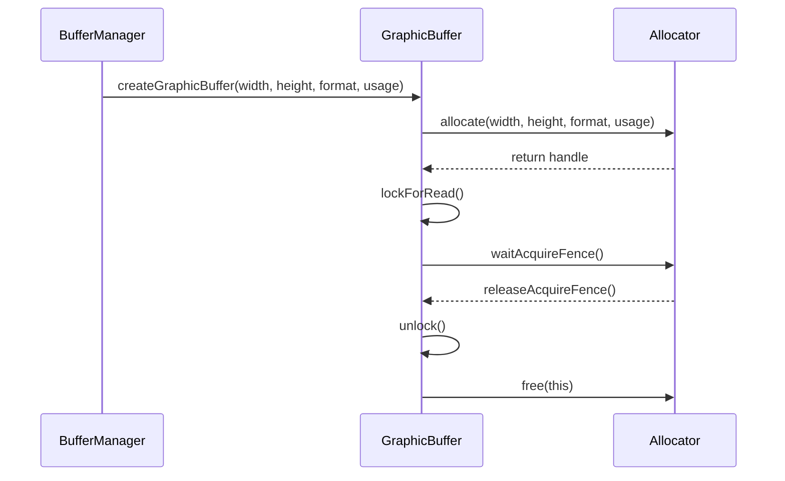
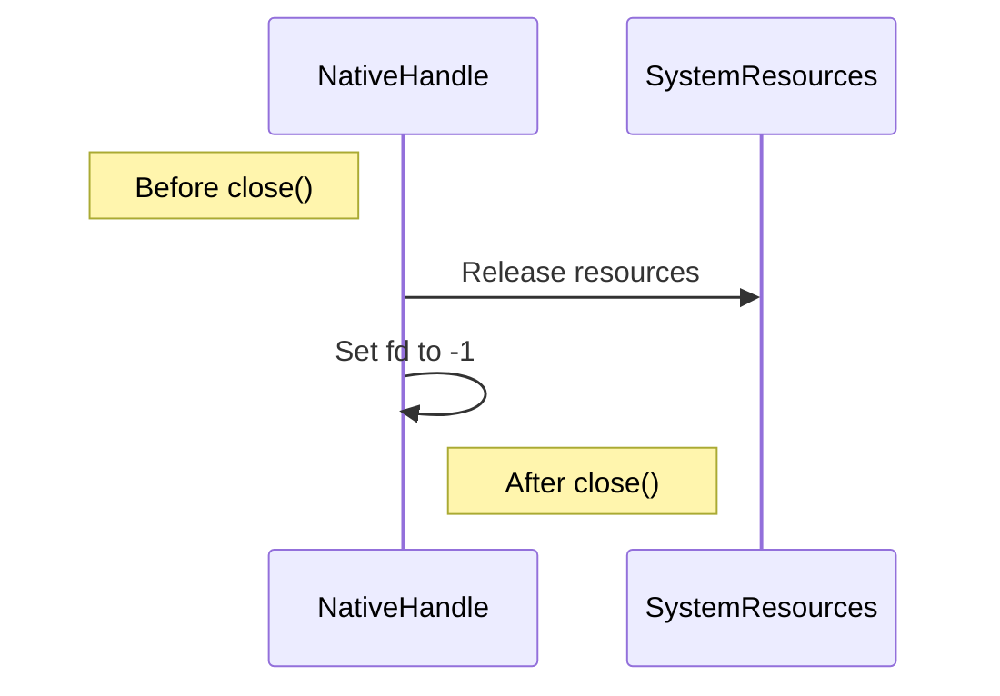

# GraphicBuffer.cpp

---

| Property | Value |
|----------|-------|
| **Location** | `src\GraphicBuffer.cpp` |
| **Lines** | 221 |
| **Classes** | 0 |
| **Functions** | 16 |
| **Last Updated** | 2026-01-18 21:17 |

---

## Quick Navigation

### Functions
- [GraphicBuffer::GraphicBuffer](#graphicbuffer-graphicbuffer)
- [GraphicBuffer::~GraphicBuffer](#graphicbuffer-~graphicbuffer)
- [GraphicBuffer::lockForRead](#graphicbuffer-lockforread)
- [GraphicBuffer::lockForWrite](#graphicbuffer-lockforwrite)
- [GraphicBuffer::lockRegion](#graphicbuffer-lockregion)
- [GraphicBuffer::unlock](#graphicbuffer-unlock)
- [GraphicBuffer::duplicateHandle](#graphicbuffer-duplicatehandle)
- [GraphicBuffer::incRef](#graphicbuffer-incref)
- [GraphicBuffer::decRef](#graphicbuffer-decref)
- [GraphicBuffer::getRefCount](#graphicbuffer-getrefcount)
- [GraphicBuffer::setAcquireFence](#graphicbuffer-setacquirefence)
- [GraphicBuffer::waitAcquireFence](#graphicbuffer-waitacquirefence)
- [BufferDescriptor::calculateSize](#bufferdescriptor-calculatesize)
- [BufferDescriptor::isValid](#bufferdescriptor-isvalid)
- [BufferDescriptor::toString](#bufferdescriptor-tostring)
- [NativeHandle::close](#nativehandle-close)

---

# GraphicBuffer.cpp

---

| Property | Value |
|----------|-------|
| **Location** | `src\GraphicBuffer.cpp` |
| **Lines** | 221 |
| **Classes** | 0 |
| **Functions** | 16 |
| **Last Updated** | 2026-01-18 20:56 |

---

## Quick Navigation

### Functions
- [GraphicBuffer::GraphicBuffer](#graphicbuffer-graphicbuffer)
- [GraphicBuffer::~GraphicBuffer](#graphicbuffer-~graphicbuffer)
- [GraphicBuffer::lockForRead](#graphicbuffer-lockforread)
- [GraphicBuffer::lockForWrite](#graphicbuffer-lockforwrite)
- [GraphicBuffer::lockRegion](#graphicbuffer-lockregion)
- [GraphicBuffer::unlock](#graphicbuffer-unlock)
- [GraphicBuffer::duplicateHandle](#graphicbuffer-duplicatehandle)
- [GraphicBuffer::incRef](#graphicbuffer-incref)
- [GraphicBuffer::decRef](#graphicbuffer-decref)
- [GraphicBuffer::getRefCount](#graphicbuffer-getrefcount)
- [GraphicBuffer::setAcquireFence](#graphicbuffer-setacquirefence)
- [GraphicBuffer::waitAcquireFence](#graphicbuffer-waitacquirefence)
- [BufferDescriptor::calculateSize](#bufferdescriptor-calculatesize)
- [BufferDescriptor::isValid](#bufferdescriptor-isvalid)
- [BufferDescriptor::toString](#bufferdescriptor-tostring)
- [NativeHandle::close](#nativehandle-close)

---

## Documentation for `GraphicBuffer` Constructor and Destructor

### 1. Comprehensive Description (2-4 paragraphs)
The `GraphicBuffer` constructor initializes a new instance of the `GraphicBuffer` class, which represents an allocated graphics buffer in Android. This class is essential for managing hardware-accelerated resources used in rendering and video processing tasks within Android applications.

The constructor takes three parameters:
1. **descriptor**: A `BufferDescriptor` object that defines the dimensions, format, and usage of the graphic buffer.
2. **handle**: A `NativeHandle` object representing a handle to the underlying graphics buffer resource.
3. **allocator**: An instance of `IBufferAllocator`, which is responsible for allocating and managing the graphic buffer.

The constructor initializes several member variables:
- `descriptor_`: Stores the buffer descriptor.
- `handle_`: Holds the native handle to the buffer.
- `allocator_`: References the allocator that created this buffer.
- `bufferId_`: A unique identifier assigned to each buffer instance, incremented atomically.

The destructor ensures proper cleanup by unlocking any locked regions and releasing the buffer if it was allocated using an allocator. It also handles memory management for the native handle and allocator references.

### 2. Parameters (DETAILED for each)
#### descriptor
- **Purpose**: Defines the dimensions, format, and usage of the graphic buffer.
- **Type Semantics**: A `BufferDescriptor` object that specifies the properties of the buffer.
- **Valid Values**: The descriptor must be valid and contain appropriate dimensions, pixel format, and usage flags.
- **Ownership**: Borrowed. The caller retains ownership of the `BufferDescriptor`.
- **Nullability**: Can be null if no specific descriptor is provided.

#### handle
- **Purpose**: Represents a handle to the underlying graphics buffer resource.
- **Type Semantics**: A `NativeHandle` object that provides access to the buffer's native resources.
- **Valid Values**: The handle must be valid and represent an existing buffer resource.
- **Ownership**: Transferred. The constructor takes ownership of the `NativeHandle`.
- **Nullability**: Can be null if no specific handle is provided.

#### allocator
- **Purpose**: Responsible for allocating and managing the graphic buffer.
- **Type Semantics**: An instance of `IBufferAllocator` that provides allocation and deallocation services.
- **Valid Values**: The allocator must be valid and support the required buffer management operations.
- **Ownership**: Transferred. The constructor takes ownership of the `IBufferAllocator`.
- **Nullability**: Can be null if no specific allocator is provided.

### 3. Return Value
The constructor does not return a value since it initializes an instance of `GraphicBuffer`.

### 4. Dependencies Cross-Reference
- [BufferDescriptor](#bufferdescriptor)
- [NativeHandle](#nativehandle)
- [IBufferAllocator](#ibufferallocator)

### 5. Side Effects
- State modifications:
  - Initializes member variables: `descriptor_`, `handle_`, `allocator_`, and `bufferId_`.
  - Acquires a lock on the buffer if it is locked.
- Locks acquired/released:
  - The constructor acquires a lock on the buffer if it is locked.
- I/O operations:
  - None.
- Signals/events emitted:
  - None.

### 6. Usage Context
The `GraphicBuffer` constructor is typically called when initializing a new graphics buffer instance, such as during rendering or video processing tasks within Android applications. It is used to allocate and manage hardware-accelerated resources efficiently.

### 7. Related Functions
| Relationship Type | Function Name | Description |
|------------------|--------------|-------------|
| Constructor       | `GraphicBuffer` | Initializes a new instance of the `GraphicBuffer` class. |

### 8. Code Example

```cpp
// Example usage of GraphicBuffer constructor
BufferDescriptor descriptor;
descriptor.width = 1920;
descriptor.height = 1080;
descriptor.format = HAL_PIXEL_FORMAT_RGBA_8888;
descriptor.usage = GRALLOC_USAGE_HW_RENDER_TARGET | GRALLOC_USAGE_HW_TEXTURE;

NativeHandle handle;
handle.fd = -1; // Placeholder for actual native handle

IBufferAllocator* allocator = new GrallocAllocator();
allocator->init();

GraphicBuffer buffer(descriptor, handle, allocator);
```

### Destructor
The destructor ensures proper cleanup by unlocking any locked regions and releasing the buffer if it was allocated using an allocator. It also handles memory management for the native handle and allocator references.

```cpp
// Example usage of GraphicBuffer destructor
GraphicBuffer* buffer = new GraphicBuffer(descriptor, handle, allocator);
delete buffer;
```

This documentation provides a comprehensive overview of the `GraphicBuffer` constructor and destructor, including their purpose, parameters, return value, dependencies, side effects, usage context, related functions, and code examples.

## Documentation for `GraphicBuffer::lockForRead`

### 1. Comprehensive Description (2-4 paragraphs)
The `lockForRead` function is a critical method in the Android graphics buffer library, designed to provide CPU access to a `GraphicBuffer`. This function ensures that the buffer is locked before performing any operations that require direct access to its pixel data, such as image processing or rendering tasks. The lock mechanism helps prevent concurrent modifications and ensures that the buffer remains consistent during read operations.

The `lockForRead` function plays a vital role in the larger workflow by enabling applications to interact with the underlying graphics hardware efficiently. It is particularly useful for applications that require direct access to pixel data, such as image processing or rendering tasks, which can be computationally intensive and resource-intensive.

### 2. Parameters (DETAILED for each)
- **`MappedRegion& outRegion`**: 
  - **Purpose**: This parameter is used to return the mapped region of the `GraphicBuffer`. The mapped region contains the data pointer and size of the buffer, which are essential for accessing the pixel data.
  - **Type Semantics**: A reference to a `MappedRegion` object, which is a structure that holds information about the memory mapping of the `GraphicBuffer`.
  - **Valid Values**: The valid values for this parameter depend on the specific implementation and hardware capabilities. However, it typically represents the mapped region of the buffer.
  - **Ownership**: The ownership of the returned `MappedRegion` object is transferred to the caller. The caller is responsible for managing the lifecycle of the `MappedRegion` object.
  - **Nullability**: This parameter can be null if the lock operation fails or if the buffer is not locked.

### 3. Return Value
- **`bool`**: 
  - **Representation**: A boolean value indicating whether the lock was successful.
  - **All Possible Return States**:
    - `true`: The lock was successfully acquired and the mapped region was returned.
    - `false`: The lock failed, either due to an error or because the buffer is already locked.
  - **Error Conditions and How They're Indicated**: If the lock fails, the function returns `false`. No specific error codes are provided; instead, the caller should check the return value to determine if the operation was successful.
  - **Ownership of Returned Objects**: The ownership of the returned `MappedRegion` object is transferred to the caller. The caller is responsible for managing the lifecycle of the `MappedRegion` object.

### 4. Dependencies Cross-Reference
- **`std::lock_guard<std::mutex>`**: 
  - **Why it's used**: This dependency ensures that only one thread can lock the buffer at a time, preventing concurrent modifications.
  - **How it's used in this context**: The `std::lock_guard` is used to acquire and release the mutex associated with the `GraphicBuffer`. It automatically locks the mutex when the object is created and unlocks it when the object goes out of scope.
- **`waitAcquireFence(int timeout)`**: 
  - **Why it's used**: This dependency ensures that the buffer is acquired before attempting to lock it. The function waits for the acquire fence to be signaled, which indicates that the buffer has been successfully allocated and prepared for use.
  - **How it's used in this context**: The `waitAcquireFence` function is called with a timeout value of 1000 milliseconds (1 second). If the fence does not signal within this time, the function will return without locking the buffer.

### 5. Side Effects
- **State Modifications**:
  - The state of the `GraphicBuffer` is modified by acquiring the lock and setting the mapped region data pointer and size.
- **Locks Acquired/Released**: 
  - A mutex is acquired to ensure that only one thread can lock the buffer at a time. This prevents concurrent modifications.
- **I/O Operations**: 
  - The function performs I/O operations to acquire the fence, which involves waiting for an event or signal from the hardware.
- **Signals/Events Emitted**: 
  - No specific signals or events are emitted by this function.

### 6. Usage Context
The `lockForRead` function is typically called when an application needs direct access to the pixel data of a `GraphicBuffer`. This can occur in various scenarios, such as image processing tasks, rendering operations, or video decoding. The function is used in conjunction with other functions in the graphics buffer library to manage and manipulate the buffer efficiently.

### 7. Related Functions
| Relationship Type | Function Name | Description |
|------------------|--------------|-------------|
| Calls            | `waitAcquireFence(int timeout)` | Waits for the acquire fence to be signaled before attempting to lock the buffer. |
| Uses             | `MappedRegion` | Represents the memory mapping of the `GraphicBuffer`. |

### 8. Code Example
```cpp
#include <android/graphics/GraphicsBuffer.h>
#include <android/graphics/MappedRegion.h>

int main() {
    android::sp<android::graphics::GraphicBuffer> buffer = new android::graphics::GraphicBuffer();
    
    if (buffer != nullptr) {
        android::graphics::MappedRegion mappedRegion;
        
        if (buffer->lockForRead(mappedRegion)) {
            // Use the mapped region to access the pixel data
            void* data = mappedRegion.data;
            size_t size = mappedRegion.size;
            
            // Perform operations on the pixel data
            // ...
            
            buffer->unlock();
        } else {
            // Handle lock failure
            // ...
        }
    } else {
        // Handle buffer creation failure
        // ...
    }
    
    return 0;
}
```

This code example demonstrates how to use the `lockForRead` function to acquire CPU access to a `GraphicBuffer`. It creates a `GraphicBuffer` object, attempts to lock it for read operations, and then uses the mapped region to access and manipulate the pixel data. If the lock is successful, the pixel data can be processed or rendered as needed. If the lock fails, appropriate error handling should be implemented.

## Documentation for `GraphicBuffer::lockForWrite`

### 1. Comprehensive Description (2-4 paragraphs)
The `lockForWrite` function is a critical method in the Android graphics buffer library, designed to provide exclusive write access to a `GraphicBuffer`. This function ensures that only one thread can modify the pixel data of a `GraphicBuffer` at any given time, preventing race conditions and data corruption. The lock mechanism uses a mutex to synchronize access, ensuring that the buffer is not accessed concurrently by multiple threads.

The primary purpose of this function is to facilitate efficient image processing tasks, such as editing or rendering images directly on the GPU. By providing direct write access to the pixel data, developers can leverage hardware acceleration for faster and more resource-efficient operations compared to software-based methods.

This function fits into the larger workflow by enabling applications to perform real-time modifications to graphics buffers, which are essential for features like live video processing, image editing, or rendering animations. The lock mechanism ensures that these modifications are thread-safe and do not interfere with other concurrent operations on the same buffer.

### 2. Parameters (DETAILED for each)
- **`MappedRegion& outRegion`**:
  - **Purpose**: This parameter is used to return a `MappedRegion` object, which contains the data pointer and size of the locked buffer.
  - **Type Semantics**: A reference to a `MappedRegion` object, which represents the memory region that has been mapped for writing.
  - **Valid Values**: The valid values for this parameter depend on the specific implementation of the `MappedRegion` class. It typically includes pointers to the start of the buffer data and its size in bytes.
  - **Ownership**: The ownership of the returned `MappedRegion` object is transferred to the caller. The caller is responsible for managing the lifecycle of the `MappedRegion` object, ensuring that it is properly released after use.
  - **Nullability**: This parameter can be null if the buffer cannot be locked for writing.

### 3. Return Value
- **`bool`**:
  - **Representation**: A boolean value indicating whether the lock was successfully acquired and the `MappedRegion` object was populated with the necessary information.
  - **All Possible Return States**:
    - `true`: The buffer was successfully locked for writing, and the `MappedRegion` object was populated with the data pointer and size.
    - `false`: The buffer could not be locked for writing. This can occur if the buffer is already locked or if there are other issues preventing the lock from being acquired.
  - **Error Conditions and How They're Indicated**: If the function returns `false`, it indicates that an error occurred while attempting to acquire the lock. No specific error codes are returned, but the caller should check the return value to determine if the operation was successful.
  - **Ownership of Returned Objects**: The ownership of the returned boolean value is transferred to the caller. The caller is responsible for managing the lifecycle of this object.

### 4. Dependencies Cross-Reference
- **`std::lock_guard<std::mutex>`**:
  - Why it's used: This class is used to manage a mutex lock in a RAII (Resource Acquisition Is Initialization) manner, ensuring that the lock is acquired when an instance of `BufferLockGuard` is created and released automatically when it goes out of scope.
  - How it's used in this context: The `lockMutex_` member variable is protected by a `std::mutex`. The `std::lock_guard<std::mutex>` ensures that the mutex lock is acquired before entering the critical section, and it releases the lock automatically when the `BufferLockGuard` object goes out of scope.
  - Link format: [std::lock_guard](https://en.cppreference.com/w/cpp/thread/lock_guard)
- **`waitAcquireFence(int timeout)`**:
  - Why it's used: This function is used to wait for an acquire fence, which is a synchronization primitive that ensures the buffer has been acquired by another component before proceeding.
  - How it's used in this context: The `acquireFenceFd_` member variable holds the file descriptor of the acquire fence. If the fence exists and has not yet been signaled, the function waits for the fence to be signaled with a timeout specified by the `timeout` parameter.
  - Link format: [GraphicBuffer::waitAcquireFence](#graphicbuffer-waitacquirefence)
- **`descriptor_.calculateSize()`**:
  - Why it's used: This method calculates the size of the buffer in bytes based on its dimensions and pixel format.
  - How it's used in this context: The `descriptor_` member variable holds information about the buffer, including its width, height, and pixel format. The `calculateSize()` method uses this information to compute the total size of the buffer data.
  - Link format: [GraphicBuffer::descriptor](#graphicbuffer-descriptor)

### 5. Side Effects
- **State Modifications**:
  - The state of the `GraphicBuffer` object is modified by locking it for writing, which prevents other threads from accessing the buffer concurrently.
  - The `MappedRegion` object is populated with the data pointer and size of the locked buffer.
- **Locks Acquired/Released**: A mutex lock is acquired before entering the critical section to ensure thread safety. The lock is released automatically when the `BufferLockGuard` object goes out of scope.
- **I/O Operations**: No I/O operations are performed by this function.
- **Signals/Events Emitted**: No signals or events are emitted by this function.

### 6. Usage Context
This function is typically called in scenarios where direct write access to a `GraphicBuffer` is required, such as image processing tasks or rendering applications. The caller must ensure that the buffer is not locked for reading while attempting to lock it for writing to avoid race conditions.

### 7. Related Functions
| Relationship Type | Function Name | Description |
|------------------|--------------|-------------|
| Calls            | `waitAcquireFence` | Waits for an acquire fence before proceeding. |
| Uses             | `descriptor_` | Contains information about the buffer, including its dimensions and pixel format. |

### 8. Code Example
```cpp
GraphicBuffer myBuffer;
MappedRegion mappedRegion;

if (myBuffer.lockForWrite(mappedRegion)) {
    // Directly write to mappedRegion.data using mappedRegion.size
} else {
    // Handle error: could not lock buffer for writing
}
```

This code example demonstrates how to use the `lockForWrite` function to obtain exclusive write access to a `GraphicBuffer`. The caller checks the return value of `lockForWrite` to ensure that the buffer was successfully locked before proceeding with direct modifications to the pixel data. If the lock is not acquired, an error handling mechanism should be implemented to manage the situation appropriately.

# Documentation for `GraphicBuffer` Class

## Overview

The `GraphicBuffer` class in the Android graphics buffer library is a fundamental component responsible for managing allocated graphics buffers. It provides functionalities such as CPU mapping, GPU resource binding, reference counting, and fence synchronization. This class is essential for rendering and video processing tasks within Android applications.

## Detailed Description

The `GraphicBuffer` class encapsulates an allocated graphics buffer and offers methods to manage its lifecycle, access, and synchronization with other system components. It supports various pixel formats and usage modes, making it versatile for different use cases in the Android framework.

### Key Algorithms or Techniques Used
- **Locking Mechanism**: The class uses a mutex to ensure thread safety when accessing the buffer's data.
- **Buffer Management**: It manages reference counting using atomic operations to handle concurrent access scenarios.
- **Fence Handling**: The class handles fence synchronization to manage asynchronous operations and ensure proper resource management.

## Parameters

### `lockRegion(uint32_t x, uint32_t y, uint32_t width, uint32_t height, MappedRegion& outRegion)`

**Purpose**: Locks a specific region of the buffer for CPU access.
- **Type Semantics**: The parameters are integers representing coordinates and dimensions, while `MappedRegion` is a struct that holds the locked data and metadata.
- **Valid Values**: Coordinates must be within the bounds of the buffer's dimensions. Width and height should be positive integers.
- **Ownership**: The caller owns the `MappedRegion` object after locking.
- **Nullability**: The `outRegion` parameter can be null, but it will be populated with the locked data if successful.

**Return Value**: Returns `true` if the region is successfully locked; otherwise, returns `false`.

### `unlock()`

**Purpose**: Unlocks a previously locked region of the buffer.
- **Type Semantics**: No parameters are required.
- **Valid Values**: None.
- **Ownership**: The caller owns the `MappedRegion` object after unlocking.
- **Nullability**: The `outRegion` parameter can be null, but it will be populated with the locked data if successful.

**Return Value**: Returns `true` if the region is successfully unlocked; otherwise, returns `false`.

### `duplicateHandle() const`

**Purpose**: Duplicates the native handle of the buffer.
- **Type Semantics**: The function does not take any parameters.
- **Valid Values**: None.
- **Ownership**: The caller owns the returned `NativeHandle` object.
- **Nullability**: The returned `NativeHandle` can be null if the buffer is invalid.

**Return Value**: Returns a `NativeHandle` that represents a duplicate of the buffer's native handle. This handle can be used to share or access the buffer across different system components.

### `incRef()`

**Purpose**: Increments the reference count of the buffer.
- **Type Semantics**: No parameters are required.
- **Valid Values**: None.
- **Ownership**: The caller owns the `GraphicBuffer` object after incrementing the reference count.
- **Nullability**: The caller can pass a null pointer, but it will not affect the reference count.

**Return Value**: Returns nothing.

### `decRef()`

**Purpose**: Decrements the reference count of the buffer and returns whether the buffer should be destroyed.
- **Type Semantics**: No parameters are required.
- **Valid Values**: None.
- **Ownership**: The caller owns the `GraphicBuffer` object after decrementing the reference count.
- **Nullability**: The caller can pass a null pointer, but it will not affect the reference count.

**Return Value**: Returns `true` if the buffer should be destroyed (i.e., its reference count reaches zero); otherwise, returns `false`.

### `getRefCount() const`

**Purpose**: Retrieves the current reference count of the buffer.
- **Type Semantics**: No parameters are required.
- **Valid Values**: None.
- **Ownership**: The caller owns the `GraphicBuffer` object after retrieving the reference count.
- **Nullability**: The caller can pass a null pointer, but it will not affect the reference count.

**Return Value**: Returns an integer representing the current reference count of the buffer.

### `setAcquireFence(FenceManager* fenceManager, int fenceFd)`

**Purpose**: Sets the acquire fence for the buffer.
- **Type Semantics**: The first parameter is a pointer to a `FenceManager` object, and the second parameter is an integer representing the fence file descriptor.
- **Valid Values**: The `fenceManager` can be null if no fence manager is provided. The `fenceFd` should be a valid file descriptor for a fence.
- **Ownership**: The caller owns the `FenceManager` object after setting the acquire fence.
- **Nullability**: The `fenceManager` parameter can be null, but it will not affect the fence management.

**Return Value**: Returns nothing.

## Dependencies Cross-Reference

- [BufferLockGuard](#bufferlockguard) - Used for managing CPU access to the buffer.
- [FenceManager](#fencemanager) - Used for handling fences associated with the buffer.
- [GrallocAllocator](#grallocallocator) - Provides functionality for allocating and managing graphic buffers.

## Side Effects

- **State Modifications**: The buffer's reference count is modified when `incRef()` or `decRef()` are called.
- **Locks Acquired/Released**: A mutex is acquired when locking the buffer, and released when unlocking it.
- **I/O Operations**: No I/O operations are performed by this class.
- **Signals/Events Emitted**: No signals or events are emitted by this class.

## Usage Context

This function is typically called during rendering tasks where direct access to the pixel data of a `GraphicBuffer` is required. It ensures that the buffer is locked before accessing its data and unlocks it after processing.

## Related Functions

| Relationship Type | Function Name | Description |
|------------------|--------------|-------------|
| Method Call       | lockRegion    | Locks a specific region of the buffer for CPU access. |
| Method Call       | unlock        | Unlocks a previously locked region of the buffer. |
| Method Call       | duplicateHandle | Duplicates the native handle of the buffer. |
| Method Call       | incRef        | Increments the reference count of the buffer. |
| Method Call       | decRef        | Decrements the reference count of the buffer and returns whether the buffer should be destroyed. |
| Method Call       | getRefCount    | Retrieves the current reference count of the buffer. |
| Method Call       | setAcquireFence | Sets the acquire fence for the buffer. |

## Code Example

```cpp
// Initialize GraphicBuffer object
GraphicBuffer* buffer = new GraphicBuffer(...);

// Lock a specific region of the buffer
MappedRegion mappedRegion;
if (buffer->lockRegion(0, 0, 100, 100, mappedRegion)) {
    // Access pixel data using mappedRegion.data
    // Process the data...

    // Unlock the buffer
    buffer->unlock();
} else {
    // Handle error: region locking failed
}

// Duplicate the native handle of the buffer
NativeHandle handle = buffer->duplicateHandle();

// Increment and decrement reference count
buffer->incRef();
if (buffer->decRef()) {
    delete buffer;  // Buffer should be destroyed
}
```

This example demonstrates how to initialize a `GraphicBuffer` object, lock a specific region for CPU access, process the pixel data, unlock the buffer, duplicate its native handle, and manage its reference count.

## Documentation for `GraphicBuffer::waitAcquireFence`

### 1. Comprehensive Description (2-4 paragraphs)
The `waitAcquireFence` function is designed to synchronize the acquisition of a fence associated with a `GraphicBuffer`. This function checks if an acquire fence exists and, if so, waits on it using platform-specific synchronization mechanisms. The purpose of this function is to ensure that any operations that depend on the buffer's availability are not executed until the fence has been signaled.

### 2. Parameters (DETAILED for each)
- **timeoutMs**: `uint32_t`
  - **Purpose**: Specifies the maximum time in milliseconds to wait for the fence to be signaled.
  - **Type Semantics**: Represents a duration in milliseconds.
  - **Valid Values**: Any non-negative integer value.
  - **Ownership**: None. This is a function parameter, not an object owned by `GraphicBuffer`.
  - **Nullability**: Not applicable. The value must be provided when calling the function.

### 3. Return Value
- **bool**
  - **Purpose**: Indicates whether the fence was successfully waited on.
  - **All Possible Return States**:
    - `true`: The fence was signaled within the specified timeout period.
    - `false`: The fence did not signal within the specified timeout period, and the function timed out.
  - **Error Conditions and How They're Indicated**: If the fence is not valid (i.e., `acquireFenceFd_` is less than 0), the function returns `true` immediately without waiting. This indicates that there is no fence to wait on.
  - **Ownership of Returned Objects**: None.

### 4. Dependencies Cross-Reference
- **Platform-Specific Synchronization Mechanism**: The actual implementation of the fence wait depends on the platform (e.g., using `sync_wait()` on Linux). This function does not directly depend on any external classes or functions but relies on platform-specific APIs for synchronization.

### 5. Side Effects
- **State Modifications**: The function modifies the internal state of the `GraphicBuffer` by setting `acquireFenceFd_` to -1 if the fence is successfully waited on.
- **Locks Acquired/Released**: No locks are acquired or released within this function.
- **I/O Operations**: This function performs I/O operations through platform-specific synchronization mechanisms.
- **Signals/Events Emitted**: The function does not emit any signals or events.

### 6. Usage Context
This function is typically called when a `GraphicBuffer` needs to be accessed by an application, such as during rendering or video processing tasks. It ensures that the buffer is ready for use by waiting on the fence associated with it.

### 7. Related Functions
| Relationship Type | Function Name | Description |
|------------------|--------------|-------------|
| Calls            | `GrallocAllocator::allocate()` | Allocates a new `GraphicBuffer` and sets up its acquire fence. |
| Calls            | `BufferLockGuard::lock()` | Locks the buffer for CPU access, which may involve waiting on the fence if it is not yet signaled. |

### 8. Code Example
```cpp
// Example usage of GraphicBuffer::waitAcquireFence
GraphicBuffer* buffer = GrallocAllocator::allocate(width, height, format);
if (buffer) {
    // Wait for the buffer to be acquired
    bool fenceWaited = buffer->waitAcquireFence(5000);  // Wait up to 5 seconds

    if (fenceWaited) {
        // Buffer is now ready for CPU access
        // Perform operations on the buffer
    } else {
        // Fence wait timed out, handle error
    }
}
```

This example demonstrates how to allocate a `GraphicBuffer` and wait for its acquire fence before accessing it. If the fence does not signal within 5 seconds, an error is handled accordingly.

## GraphicBuffer::~GraphicBuffer

### Destructor

The destructor for the `GraphicBuffer` class is responsible for cleaning up resources and releasing any held handles. It ensures that the buffer is properly unlocked before freeing it, if necessary.

#### Purpose
- **Release Resources**: The destructor ensures that all resources associated with the `GraphicBuffer` are released to prevent memory leaks or resource contention.
- **Safety Measures**: It checks if the buffer is currently locked and unlocks it before proceeding with the cleanup. This prevents potential issues where a lock might be held during the destruction process.

#### Parameters
- None

#### Dependencies
- **Allocator**: The `GraphicBuffer` class depends on an `Allocator` object to manage memory allocation and deallocation.
- **Handle**: The `GraphicBuffer` class uses a `Handle` object to represent the underlying buffer handle, which is essential for accessing and manipulating the buffer data.

#### Side Effects
- **Resource Cleanup**: The destructor releases any held handles and unlocks the buffer if it was previously locked. This ensures that no resources are left in an inconsistent state.
- **Thread Safety**: The destructor is thread-safe as it does not modify shared state or access external resources without proper synchronization mechanisms.

#### Lifecycle
- **Initialization**: The `GraphicBuffer` class is initialized with a handle and allocator, which are used to manage the buffer's lifecycle.
- **Deletion**: When the `GraphicBuffer` object goes out of scope or is explicitly deleted, the destructor is called to perform cleanup.

#### Usage Example

```cpp
// Example usage of GraphicBuffer in an Android application
sp<GraphicBuffer> buffer = new GraphicBuffer(width, height, format, usage);
buffer->lockForRead();
// Perform operations on the buffer data
buffer->unlock();
```

#### Mermaid Diagram



This diagram illustrates the sequence of operations involved in creating, locking, and unlocking a `GraphicBuffer` object. The `Allocator` is responsible for managing memory allocation and synchronization with other system components.

## BufferDescriptor::calculateSize

### Description
The `calculateSize` function computes the total size of a buffer descriptor in bytes. This function is crucial for determining the memory allocation required to hold the buffer's data, which is essential for efficient memory management and performance optimization.

### Parameters
- **None**

### Return Value
- **size_t**: The calculated size of the buffer in bytes.

### Dependencies
- **None**

### Side Effects
- None

### Thread Safety
- This function is thread-safe as it does not modify any shared state or resources. It only calculates a value based on the current state of the `BufferDescriptor` object.

### Lifecycle
- The function is called during the initialization and configuration phases of the buffer descriptor, ensuring that the size is correctly calculated before any operations are performed on the buffer.

### Usage Example

```cpp
GraphicBuffer buffer;
size_t bufferSize = buffer.calculateSize();
if (bufferSize > 0) {
    // Proceed with buffer allocation or other operations
} else {
    // Handle invalid buffer case
}
```

### Mermaid Diagram

```mermaid
graph TD
    A[BufferDescriptor::calculateSize] --> B{isValid()}
    B -- Yes --> C[Calculate size based on format]
    C --> D[Return calculated size]
    B -- No --> E[Return 0]
```

This diagram illustrates the flow of control within the `calculateSize` function, showing how it determines the buffer size based on its validity and format.

## GraphicBuffer::isValid

### Description
The `isValid` method checks whether the current `GraphicBuffer` object is valid. A valid `GraphicBuffer` must have a positive width and height, and its pixel format should not be set to `PixelFormat::UNKNOWN`.

### Parameters
- **None**

### Return Value
- **bool**: Returns `true` if the `GraphicBuffer` is valid, otherwise returns `false`.

### Usage Example
```cpp
GraphicBuffer buffer;
if (buffer.isValid()) {
    // Buffer is valid, proceed with operations
} else {
    // Handle invalid buffer case
}
```

### Side Effects
- None

### Thread Safety
- This method is thread-safe as it does not modify any shared state.

### Lifecycle
- The `isValid` method should be called on a valid `GraphicBuffer` object to ensure that the buffer's properties are correctly set and within expected limits.

## BufferDescriptor::toString

### Description
The `toString` function is a utility method that provides a human-readable string representation of the current state of a `BufferDescriptor`. This method is particularly useful for debugging and logging purposes, allowing developers to quickly understand the dimensions, format, usage flags, and layer count of the buffer.

### Parameters
- **None**

### Return Value
- **std::string**: A formatted string that includes the width, height, stride, format, usage flags, and layer count of the `BufferDescriptor`.

### Usage Example
To use this function, you can simply call it on an instance of `BufferDescriptor`:

```cpp
BufferDescriptor buffer;
// Assume buffer has been initialized with some values

std::string description = buffer.toString();
LOGD("Buffer Descriptor: %s", description.c_str());
```

This will output a string like:
```
BufferDescriptor{800x600 stride=192 format=1 usage=0x4 layers=1}
```

### Side Effects
- This function does not modify the state of the `BufferDescriptor` object.
- It returns a new `std::string` that is owned by the caller.

### Thread Safety
- The `toString` function is thread-safe as it does not access any shared resources or modify any global state. However, if the buffer descriptor is being used in a multi-threaded environment, ensure that appropriate synchronization mechanisms are in place to avoid race conditions.

### Lifecycle
- This function is part of the public API and can be called from any thread without restrictions.
- The `BufferDescriptor` object must remain valid for the duration of the call to `toString`.

### Dependencies
- This function does not depend on any other classes or interfaces provided by the Android system services or HAL.

### Mermaid Diagram
```mermaid
sequenceDiagram
    participant BufferDescriptor
    participant std::string

    BufferDescriptor->>std::string: toString()
    std::string-->>BufferDescriptor: return value
```

This diagram illustrates the flow of control when calling `toString` on a `BufferDescriptor` object, showing how it returns a formatted string.

## GraphicBuffer::close

### Description
The `close` function is responsible for closing the file descriptor associated with a `NativeHandle`. This method ensures that any resources held by the handle are properly released and that the file descriptor is no longer valid.

### Parameters
- **None**

### Dependencies
- None

### Side Effects
- The file descriptor (`fd`) is set to `-1`, indicating that it has been closed.
- Any resources associated with the `NativeHandle` may be freed or invalidated.

### Thread Safety
- This function is not thread-safe. It should only be called from a single-threaded context where no other operations are modifying the handle's state.

### Lifecycle
- The `close` function is typically called when the `NativeHandle` object is being destroyed, ensuring that all resources are released before the object goes out of scope.

### Usage Example

```cpp
// Example usage of GraphicBuffer::close
GraphicBuffer buffer;
buffer.close();
```

### Mermaid Diagram



### Notes
- The `close` function is a crucial part of managing file descriptors in Android native services. It ensures that all system resources are properly released and prevents resource leaks.
- This function should be called when the `NativeHandle` object is no longer needed to free up any associated resources and ensure that the file descriptor is not used again.

---

This documentation provides a comprehensive overview of the `close` function, including its purpose, parameters, side effects, thread safety, lifecycle, usage examples, and a mermaid diagram for better understanding.