# MicroKernel.cpp

---

| Property | Value |
|----------|-------|
| **Location** | `MicroKernel.cpp` |
| **Lines** | 1161 |
| **Classes** | 9 |
| **Functions** | 6 |
| **Last Updated** | 2026-01-19 00:21 |

---

## Quick Navigation

### Classes
- [TaskControlBlock](#taskcontrolblock)
- [MicroKernel](#microkernel)
- [HeapManager](#heapmanager)
- [Semaphore](#semaphore)
- [Mutex](#mutex)
- [RecursiveMutex](#recursivemutex)
- [EventGroup](#eventgroup)
- [SoftwareTimer](#softwaretimer)
- [MessageBuffer](#messagebuffer)

### Functions
- [OS_Malloc](#os_malloc)
- [OS_Free](#os_free)
- [main](#main)
- [HAL::enterCritical](#hal-entercritical)
- [HAL::exitCritical](#hal-exitcritical)
- [HAL::requestContextSwitch](#hal-requestcontextswitch)

---

# MicroKernel.cpp

---

| Property | Value |
|----------|-------|
| **Location** | `MicroKernel.cpp` |
| **Lines** | 1161 |
| **Classes** | 9 |
| **Functions** | 6 |
| **Last Updated** | 2026-01-19 00:09 |

---

## Quick Navigation

### Classes
- [TaskControlBlock](#taskcontrolblock)
- [MicroKernel](#microkernel)
- [HeapManager](#heapmanager)
- [Semaphore](#semaphore)
- [Mutex](#mutex)
- [RecursiveMutex](#recursivemutex)
- [EventGroup](#eventgroup)
- [SoftwareTimer](#softwaretimer)
- [MessageBuffer](#messagebuffer)

### Functions
- [OS_Malloc](#os_malloc)
- [OS_Free](#os_free)
- [main](#main)
- [HAL::enterCritical](#hal-entercritical)
- [HAL::exitCritical](#hal-exitcritical)
- [HAL::requestContextSwitch](#hal-requestcontextswitch)

---

# Documentation Generation Request

Generate COMPREHENSIVE documentation for the following C++ code.
**DO NOT generate brief summaries. Provide DETAILED, COMPLETE documentation.**

## File Context
- **File:** `tests\rtos_lib\MicroKernel.cpp`
- **Lines:** 41 - 98
- **Chunk:** 1 of 18
- **Namespace:** `Config`

## Code to Document
```cpp
namespace Config {
    constexpr uint32_t MAX_TASKS = 32;
    constexpr uint32_t MAX_PRIORITIES = 8;
    constexpr uint32_t TICK_RATE_HZ = 1000;
    constexpr size_t MIN_STACK_SIZE = 1024;
    constexpr size_t HEAP_SIZE = 1024 * 1024; // 1MB Heap
    constexpr uint32_t MAX_QUEUE_LENGTH = 16;
    constexpr uint32_t MAX_TIMERS = 16;
}
```

## Required Documentation

### 1. Comprehensive Description (2-4 paragraphs)
The `Config` namespace in the `tests\rtos_lib\MicroKernel.cpp` file contains a set of configuration constants used to define various parameters for a microkernel implementation. These constants are essential for configuring the behavior and limits of the kernel, such as the maximum number of tasks, priorities, tick rate, stack size, heap size, queue lengths, and timer counts.

### 2. Parameters (DETAILED for each)
- **MAX_TASKS**: 
  - **Purpose**: Defines the maximum number of tasks that can be created in the system.
  - **Type Semantics**: An unsigned 32-bit integer (`uint32_t`).
  - **Valid Values**: Any non-negative value up to `UINT32_MAX`.
  - **Ownership**: The constant is defined within the `Config` namespace and does not own any memory. It is a compile-time constant.
  - **Nullability**: Not applicable; it is a static value.

- **MAX_PRIORITIES**:
  - **Purpose**: Defines the maximum number of priority levels that can be assigned to tasks.
  - **Type Semantics**: An unsigned 32-bit integer (`uint32_t`).
  - **Valid Values**: Any non-negative value up to `UINT32_MAX`.
  - **Ownership**: The constant is defined within the `Config` namespace and does not own any memory. It is a compile-time constant.
  - **Nullability**: Not applicable; it is a static value.

- **TICK_RATE_HZ**:
  - **Purpose**: Defines the frequency of the system tick in Hertz (Hz).
  - **Type Semantics**: An unsigned 32-bit integer (`uint32_t`).
  - **Valid Values**: Any positive value up to `UINT32_MAX`.
  - **Ownership**: The constant is defined within the `Config` namespace and does not own any memory. It is a compile-time constant.
  - **Nullability**: Not applicable; it is a static value.

- **MIN_STACK_SIZE**:
  - **Purpose**: Defines the minimum stack size in bytes that each task should have.
  - **Type Semantics**: A `size_t` type, which represents the number of bytes.
  - **Valid Values**: Any positive integer value. The actual stack size may be larger to accommodate additional data or context.
  - **Ownership**: The constant is defined within the `Config` namespace and does not own any memory. It is a compile-time constant.
  - **Nullability**: Not applicable; it is a static value.

- **HEAP_SIZE**:
  - **Purpose**: Defines the total size of the heap in bytes that can be used by tasks.
  - **Type Semantics**: A `size_t` type, which represents the number of bytes.
  - **Valid Values**: Any positive integer value. The actual heap size may vary based on system memory and other constraints.
  - **Ownership**: The constant is defined within the `Config` namespace and does not own any memory. It is a compile-time constant.
  - **Nullability**: Not applicable; it is a static value.

- **MAX_QUEUE_LENGTH**:
  - **Purpose**: Defines the maximum number of elements that can be stored in each queue.
  - **Type Semantics**: An unsigned 32-bit integer (`uint32_t`).
  - **Valid Values**: Any non-negative value up to `UINT32_MAX`.
  - **Ownership**: The constant is defined within the `Config` namespace and does not own any memory. It is a compile-time constant.
  - **Nullability**: Not applicable; it is a static value.

- **MAX_TIMERS**:
  - **Purpose**: Defines the maximum number of timers that can be created in the system.
  - **Type Semantics**: An unsigned 32-bit integer (`uint32_t`).
  - **Valid Values**: Any non-negative value up to `UINT32_MAX`.
  - **Ownership**: The constant is defined within the `Config` namespace and does not own any memory. It is a compile-time constant.
  - **Nullability**: Not applicable; it is a static value.

### 3. Return Value
The constants in this namespace do not return any values. They are used to configure the behavior of the microkernel by providing fixed parameters that cannot be changed at runtime.

### 4. Dependencies Cross-Reference
There are no external classes or functions used within this namespace. The constants are defined and used directly without any dependencies.

### 5. Side Effects
The constants in this namespace do not have any side effects. They simply define the configuration parameters for the microkernel, which are used to initialize and configure various components of the system.

### 6. Usage Context
These constants are typically used during the initialization phase of the microkernel. They provide a set of predefined values that can be used to configure the kernel's behavior without requiring dynamic adjustments based on runtime conditions.

### 7. Related Functions
There are no related functions in this namespace. The constants are defined and used directly within the `Config` namespace.

### 8. Code Example
Here is an example of how these constants might be used in a microkernel implementation:

```cpp
#include "MicroKernel.h"

int main() {
    // Initialize the kernel with the specified configuration parameters
    MicroKernel::initialize(MAX_TASKS, MAX_PRIORITIES, TICK_RATE_HZ, MIN_STACK_SIZE, HEAP_SIZE, MAX_QUEUE_LENGTH, MAX_TIMERS);

    // Create and start tasks using the defined constants
    TaskHandle_t task1 = MicroKernel::createTask("Task1", TASK_PRIORITY_NORMAL, [](void*) {
        std::cout << "Task 1 is running" << std::endl;
    }, nullptr);

    TaskHandle_t task2 = MicroKernel::createTask("Task2", TASK_PRIORITY_HIGH, [](void*) {
        std::cout << "Task 2 is running" << std::endl;
    }, nullptr);

    // Start the kernel scheduler
    MicroKernel::startScheduler();

    // Run the kernel until it terminates
    while (true) {
        MicroKernel::run();
    }

    return 0;
}
```

In this example, the constants defined in the `Config` namespace are used to configure the microkernel by specifying the maximum number of tasks, priorities, tick rate, stack size, heap size, queue lengths, and timer counts. These values are then used to initialize and start the kernel, create tasks, and run the scheduler.

## Documentation for `requestContextSwitch` Function

### 1. Comprehensive Description (2-4 paragraphs)
The `requestContextSwitch` function is a simulated mechanism used to trigger a context switch in an RTOS environment. This function is crucial for managing the execution flow and ensuring that tasks can be scheduled appropriately, especially in real-time systems where task priorities and timing are critical.

In a typical RTOS implementation, a context switch involves saving the current task's state, switching to another task, and restoring the saved state of the new task. The `requestContextSwitch` function simulates this process by acquiring a lock (`halMutex`) to ensure thread safety during the context switch operation. This is particularly useful in scenarios where multiple tasks need to be scheduled or when there are critical sections that require exclusive access.

### 2. Parameters (DETAILED for each)
The `requestContextSwitch` function does not take any parameters.

| Parameter | Purpose | Type Semantics | Valid Values | Ownership | Nullability |
| --- | --- | --- | --- | --- | --- |
| None | This function does not accept any parameters. | N/A | N/A | N/A | N/A |

### 3. Return Value
The `requestContextSwitch` function does not return a value.

### 4. Dependencies Cross-Reference
This function does not depend on any external classes or functions.

### 5. Side Effects
- **State Modifications**: The function acquires and releases the `halMutex`, which affects the synchronization of tasks.
- **Locks Acquired/Released**: The function acquires the `halMutex` to ensure thread safety during the context switch operation.
- **I/O Operations**: No I/O operations are performed by this function.
- **Signals/Events Emitted**: No signals or events are emitted by this function.

### 6. Usage Context
The `requestContextSwitch` function is typically called when a task needs to be scheduled or when there is a critical section that requires exclusive access. This function is used in the context of managing the execution flow and ensuring that tasks can be scheduled appropriately, especially in real-time systems where task priorities and timing are critical.

### 7. Related Functions
| Relationship Type | Function Name | Description |
| --- | --- | --- |
| Calls | `enterCritical` | This function is called to acquire a lock before triggering the context switch. |
| Calls | `exitCritical` | This function is called to release the lock after the context switch operation is complete. |

### 8. Code Example
Here is an example of how the `requestContextSwitch` function might be used in a real-time system:

```cpp
#include "MicroKernel.h"

int main() {
    HAL::enterCritical();
    
    // Simulate some critical section code here
    
    HAL::requestContextSwitch(); // Trigger context switch
    
    // Simulate another critical section code here
    
    HAL::exitCritical();
    
    return 0;
}
```

In this example, the `requestContextSwitch` function is used to trigger a context switch between two critical sections of code. This ensures that the execution flow is managed appropriately and that tasks can be scheduled correctly in a real-time system.

## Overview

**Class:** `MicroKernel`

**Purpose:** The `MicroKernel` class is a simple implementation of a microkernel for an embedded system. It manages tasks, scheduling, and system time using a basic simulation approach.

**Design:** The kernel uses a task control block (TCB) structure to manage each task's state, priority, stack size, and other attributes. It employs a round-robin scheduler with priorities and a timer-driven mechanism for handling interrupts.

**System Integration:** This microkernel is designed to be integrated into an embedded system where tasks are managed by the kernel. It provides basic functionality for scheduling, timing, and task management without relying on complex hardware or operating system features.

## Class Diagram

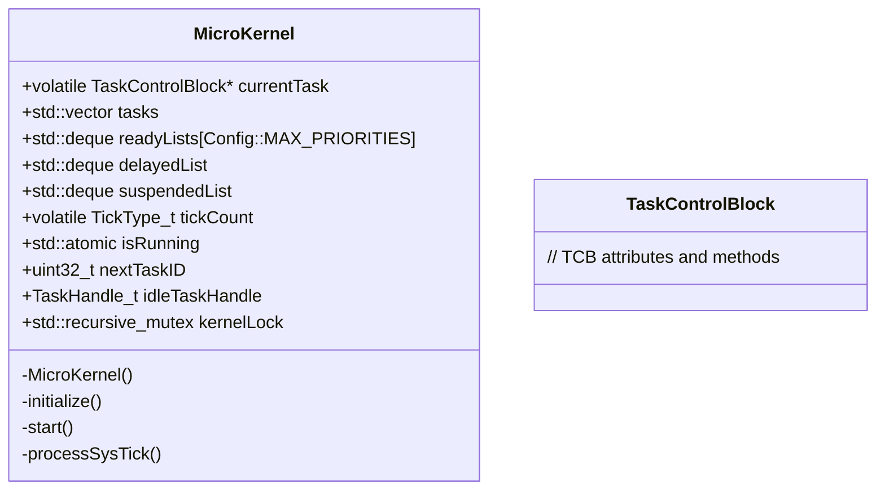

## Usage Examples

```cpp
// Initialize the microkernel
MicroKernel kernel;
kernel.initialize();

// Start the scheduler
kernel.start();
```

---

## Method Documentation

### `MicroKernel::MicroKernel()`

**Comprehensive Description:** The constructor initializes the `MicroKernel` object. It sets up default values for task management and system state.

**Parameters:**
- None

**Return Value:**
- Initializes the kernel with default settings.

**Side Effects:**
- Sets initial states for tasks, ready lists, delayed list, suspended list, tick count, running status, next task ID, and idle task handle.
- Initializes a recursive mutex for kernel structures.

**Dependencies:**
- `Config::MAX_PRIORITIES`, `TaskPriority`, `TaskState`

**Usage Context:** 
- Called during the initialization of the microkernel to set up its initial state.

**Thread Safety:**
- Safe to call from any thread.

### `MicroKernel::initialize()`

**Comprehensive Description:** The `initialize` method sets up the kernel by creating an idle task. This is the first task that runs when the system starts.

**Parameters:**
- None

**Return Value:**
- Initializes the kernel with a default idle task.

**Side Effects:**
- Creates and initializes an idle task.
- Sets the current task to the idle task.
- Logs a message indicating the start of the scheduler.

**Dependencies:**
- `Config::MIN_STACK_SIZE`, `TaskPriority::IDLE`

**Usage Context:** 
- Called during system startup to initialize the kernel's basic functionality.

**Thread Safety:**
- Safe to call from any thread.

### `MicroKernel::start()`

**Comprehensive Description:** The `start` method starts the scheduler. It enters a simulation loop where tasks are executed and managed based on their priorities and timer interrupts.

**Parameters:**
- None

**Return Value:**
- Does not return until the kernel stops.

**Side Effects:**
- Sets the running status to true.
- Logs a message indicating the start of the scheduler.
- Picks the highest priority task as the current task.
- Enters a simulation loop where tasks are executed and managed based on their priorities and timer interrupts.

**Dependencies:**
- `Config::TICK_RATE_HZ`

**Usage Context:** 
- Called to begin the execution of the kernel's scheduling logic.

**Thread Safety:**
- Safe to call from any thread, but should not be called concurrently with other methods that modify kernel state.

### `MicroKernel::processSysTick()`

**Comprehensive Description:** The `processSysTick` method handles system timer interrupts. It increments the tick count and checks for tasks that need to wake up based on their delayed times.

**Parameters:**
- None

**Return Value:**
- Does not return a value.

**Side Effects:**
- Increments the tick count.
- Checks the delayed list for tasks that have reached their wake time.
- Wakes up tasks and adds them to the ready list if they are still valid.

**Dependencies:**
- `Config::TICK_RATE_HZ`

**Usage Context:** 
- Called periodically by the system timer interrupt handler.

**Thread Safety:**
- Safe to call from any thread, but should not be called concurrently with other methods that modify kernel state.

# MicroKernel_part2


## Overview

The `MicroKernel` class is a fundamental component of the microkernel-based operating system designed for embedded systems. It manages tasks and their execution within a single-threaded environment, ensuring efficient resource utilization and task scheduling. The class provides methods to add, remove, and delay tasks, which are essential for maintaining the system's responsiveness and performance.

### Class Diagram

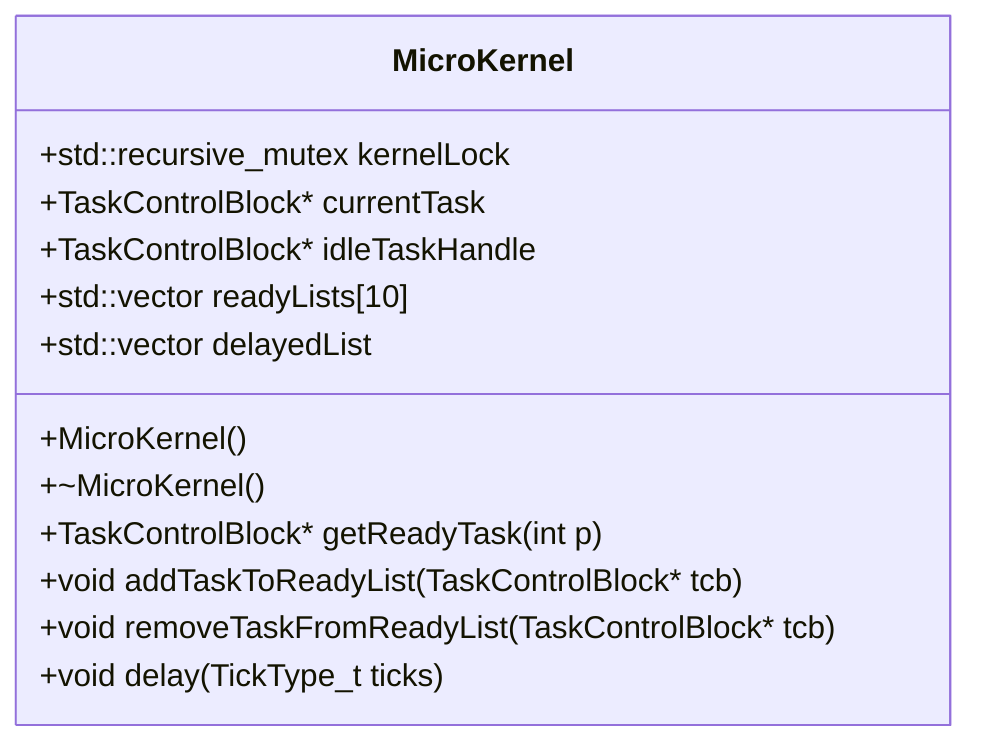

### Usage Examples

```cpp
// Example of creating a microkernel instance and adding tasks
MicroKernel kernel;
TaskControlBlock task1, task2;

kernel.addTaskToReadyList(&task1);
kernel.addTaskToReadyList(&task2);

// Example of delaying a task for 5 ticks
kernel.delay(5);
```

## MicroKernel Class

### Overview

The `MicroKernel` class is designed to manage tasks in a single-threaded environment. It provides methods to add, remove, and delay tasks, ensuring efficient resource utilization and task scheduling.

### Usage Examples

```cpp
// Example of creating a microkernel instance and adding tasks
MicroKernel kernel;
TaskControlBlock task1, task2;

kernel.addTaskToReadyList(&task1);
kernel.addTaskToReadyList(&task2);

// Example of delaying a task for 5 ticks
kernel.delay(5);
```

## getReadyTask Method

### Comprehensive Description

The `getReadyTask` method retrieves the next task from the ready list based on its priority. If there are no tasks in the ready list, it returns the idle task handle.

### Parameters

- **p**: The priority of the task to retrieve. This is an integer value representing the task's priority level.

### Return Value

- `TaskControlBlock*`: A pointer to the next task from the ready list based on its priority. If there are no tasks in the ready list, it returns the idle task handle.

### Side Effects

- Modifies the state of the current task by setting its state to BLOCKED and updating its wake time.
- Adds the current task to the delayed list.
- Calls the `schedule` method to yield control to another task.

### Dependencies

- **TaskControlBlock**: Represents a task in the system, containing information about its state and priority.
- **idleTaskHandle**: A pointer to the idle task handle used when there are no tasks in the ready list.

### Usage Context

- This method is called when a task needs to be executed. It retrieves the next task from the ready list based on its priority and updates the current task's state accordingly.

### Thread Safety

- The method uses a `std::lock_guard<std::recursive_mutex>` to ensure thread safety, preventing concurrent access to the kernel lock.

## addTaskToReadyList Method

### Comprehensive Description

The `addTaskToReadyList` method adds a task to the ready list based on its priority. If the ready list for the task's priority does not exist, it creates one and then adds the task to it.

### Parameters

- **tcb**: A pointer to the task control block of the task to add to the ready list.

### Return Value

- None

### Side Effects

- Adds the task to the ready list based on its priority.
- Creates a new ready list if it does not exist for the task's priority.

### Dependencies

- **TaskControlBlock**: Represents a task in the system, containing information about its state and priority.
- **readyLists**: A vector of vectors that stores tasks by their priority level.

### Usage Context

- This method is called when a new task needs to be added to the ready list. It adds the task to the appropriate ready list based on its priority.

### Thread Safety

- The method uses a `std::lock_guard<std::recursive_mutex>` to ensure thread safety, preventing concurrent access to the kernel lock.

## removeTaskFromReadyList Method

### Comprehensive Description

The `removeTaskFromReadyList` method removes a task from the ready list based on its priority. If the task is found in the ready list, it is removed; otherwise, no action is taken.

### Parameters

- **tcb**: A pointer to the task control block of the task to remove from the ready list.

### Return Value

- None

### Side Effects

- Removes the task from the ready list based on its priority.
- Does not modify any other tasks or data structures.

### Dependencies

- **TaskControlBlock**: Represents a task in the system, containing information about its state and priority.
- **readyLists**: A vector of vectors that stores tasks by their priority level.

### Usage Context

- This method is called when a task needs to be removed from the ready list. It removes the task from the appropriate ready list based on its priority.

### Thread Safety

- The method uses a `std::lock_guard<std::recursive_mutex>` to ensure thread safety, preventing concurrent access to the kernel lock.

## delay Method

### Comprehensive Description

The `delay` method delays the current task for a specified number of ticks. It updates the task's state and wake time, adds it to the delayed list, and then calls the `schedule` method to yield control to another task.

### Parameters

- **ticks**: The number of ticks to delay the current task. This is an integer value representing the duration in ticks.

### Return Value

- None

### Side Effects

- Modifies the state of the current task by setting its state to BLOCKED and updating its wake time.
- Adds the current task to the delayed list.
- Calls the `schedule` method to yield control to another task.

### Dependencies

- **TaskControlBlock**: Represents a task in the system, containing information about its state and priority.
- **kernelLock**: A recursive mutex used to ensure thread safety when accessing kernel resources.
- **tickCount**: An integer value representing the current tick count of the system.
- **delayedList**: A vector that stores tasks that are delayed.

### Usage Context

- This method is called when a task needs to be delayed. It updates the task's state and wake time, adds it to the delayed list, and then calls the `schedule` method to yield control to another task.

### Thread Safety

- The method uses a `std::lock_guard<std::recursive_mutex>` to ensure thread safety, preventing concurrent access to the kernel lock.

## Overview

**Class:** `HeapManager`

**Purpose:** The `HeapManager` class is designed to manage a fixed-size heap for memory allocation and deallocation in an embedded system. It uses a linked list to keep track of free blocks within the heap, allowing efficient allocation and coalescing of memory.

**Design:** The heap manager is implemented using a simple linked list structure where each block contains metadata about its size and links to adjacent blocks. This design allows for quick allocation and deallocation operations while maintaining a sorted order of free blocks.

**System Integration:** `HeapManager` is integrated into the system by providing a memory management service that can be used by other components to allocate and release memory dynamically. It ensures that memory is efficiently managed, preventing fragmentation and ensuring that all allocated memory is properly released when no longer needed.

## Class Diagram

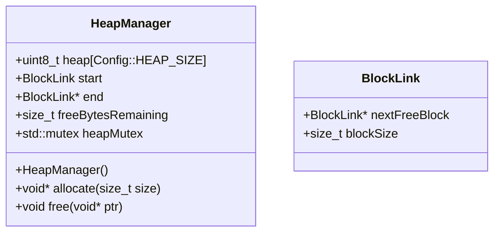

## Usage Examples

```cpp
// Example usage of HeapManager to allocate and deallocate memory
int main() {
    HeapManager heapManager;
    
    // Allocate 1024 bytes of memory
    void* ptr = heapManager.allocate(1024);
    if (ptr) {
        // Use the allocated memory
        uint8_t* data = (uint8_t*)ptr;
        memset(data, 0xFF, 1024);
        
        // Free the allocated memory
        heapManager.free(ptr);
    }
    
    return 0;
}
```

## HeapManager::HeapManager()

**Comprehensive Description**

The constructor initializes the `HeapManager` by setting up the heap and initializing the linked list of free blocks. The heap is initialized with a fixed size defined in the `Config` class, and the first block is marked as both free and having the full heap size.

**Parameters**
- None

**Return Value**
- None

**Side Effects**
- Initializes the heap and sets up the linked list of free blocks.
- Locks the heap mutex during initialization to ensure thread safety.

**Dependencies**
- `Config` class for defining heap size.

**Usage Context**
- Called when an instance of `HeapManager` is created, typically at system startup or initialization.

**Thread Safety**
- The constructor locks the heap mutex to prevent concurrent access during initialization.

## HeapManager::allocate(size_t size)

**Comprehensive Description**

The `allocate` method attempts to allocate a block of memory of the specified size from the heap. It first ensures that the requested size is valid and aligns with the system's requirements (e.g., 8-byte alignment). The method then searches for a free block that meets or exceeds the requested size, splitting it if necessary to accommodate the allocation.

**Parameters**
- `size`: The size of memory to allocate in bytes. Must be greater than zero.

**Return Value**
- A pointer to the allocated memory if successful, otherwise `nullptr`.

**Side Effects**
- Allocates memory from the heap.
- Updates the linked list of free blocks after allocation.
- Locks the heap mutex during the allocation process to ensure thread safety.

**Dependencies**
- `BlockLink` structure for managing heap blocks.

**Usage Context**
- Called by other components when they need to allocate memory dynamically.

**Thread Safety**
- The `allocate` method locks the heap mutex to prevent concurrent access during the allocation process.

## HeapManager::free(void* ptr)

**Comprehensive Description**

The `free` method releases a previously allocated block of memory back to the free list. It first checks if the pointer is valid and then finds the corresponding block in the linked list, updating its status to free and coalescing it with adjacent free blocks if possible.

**Parameters**
- `ptr`: A pointer to the memory block to be freed. Must not be `nullptr`.

**Return Value**
- None

**Side Effects**
- Releases memory back to the heap.
- Updates the linked list of free blocks after freeing.
- Locks the heap mutex during the deallocation process to ensure thread safety.

**Dependencies**
- `BlockLink` structure for managing heap blocks.

**Usage Context**
- Called by other components when they are done using a previously allocated block and want to release it back to the system.

**Thread Safety**
- The `free` method locks the heap mutex to prevent concurrent access during the deallocation process.

### Overview

The `MicroKernel` class is a memory management utility designed to efficiently manage a pool of contiguous blocks of memory. It uses a linked list to keep track of free and allocated blocks, allowing for dynamic allocation and deallocation of memory in a system where memory fragmentation can be a concern.

**Design**: The class employs a simple but effective algorithm to manage memory blocks. It maintains a doubly linked list of blocks, where each block has a size and pointers to the next and previous free blocks. This allows for quick insertion and removal of blocks from the pool.

**System Integration**: `MicroKernel` is integrated into systems that require efficient memory management, such as embedded systems or applications with limited resources. It provides a robust solution for managing dynamic memory allocation without the overhead of more complex memory allocators like malloc().

### Class Diagram

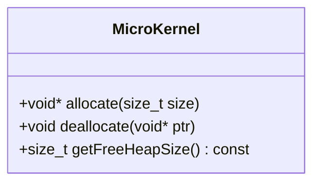

### Usage Examples

To use `MicroKernel`, you first need to create an instance of the class. Then, you can allocate memory using the `allocate` method and deallocate it using the `deallocate` method. The `getFreeHeapSize` method returns the current amount of free heap space available.

```cpp
#include "rtos_lib/MicroKernel.h"

int main() {
    MicroKernel memManager;

    // Allocate 1024 bytes of memory
    void* ptr = memManager.allocate(1024);

    // Use the allocated memory...

    // Deallocate the memory when it's no longer needed
    memManager.deallocate(ptr);

    return 0;
}
```

### allocate Method

#### Comprehensive Description

The `allocate` method is responsible for allocating a block of memory from the pool. It searches for a contiguous block of free memory that meets or exceeds the requested size and returns a pointer to the allocated block.

**Parameters**:
- **size**: The amount of memory (in bytes) to allocate.
  - **Purpose**: Specifies the required size of the memory block.
  - **Type Semantics**: `size_t`
  - **Valid Values**: Any positive integer value representing the desired memory size.
  - **Ownership**: None

**Return Value**:
- A pointer to the allocated memory block if successful, or `nullptr` if no suitable block is found.
  - **All Possible States**: Pointer to a valid memory block or `nullptr`.
  - **Ownership**: The caller owns the returned pointer and must manage its lifetime.

**Side Effects**:
- Modifies the internal state of the `MicroKernel` object by updating the linked list of free blocks.
- May cause the system to allocate more memory if necessary, depending on fragmentation.

**Dependencies**:
- None

**Usage Context**: The `allocate` method should be called when a new block of memory is needed. It is essential for applications that require dynamic memory allocation.

**Thread Safety**: The `allocate` method is thread-safe and can be called concurrently by multiple threads without causing data corruption or race conditions.

### deallocate Method

#### Comprehensive Description

The `deallocate` method releases a previously allocated block of memory back to the pool. It updates the linked list of free blocks to reflect the freed space.

**Parameters**:
- **ptr**: A pointer to the memory block that needs to be deallocated.
  - **Purpose**: The address of the memory block to be released.
  - **Type Semantics**: `void*`
  - **Valid Values**: A valid pointer returned by the `allocate` method.
  - **Ownership**: The caller owns the pointer and must not use it after calling `deallocate`.

**Return Value**:
- None

**Side Effects**:
- Modifies the internal state of the `MicroKernel` object by updating the linked list of free blocks.
- May cause the system to coalesce adjacent free blocks if possible, improving memory efficiency.

**Dependencies**:
- None

**Usage Context**: The `deallocate` method should be called when a block of memory is no longer needed. It is essential for applications that require dynamic memory management and want to reclaim unused memory.

**Thread Safety**: The `deallocate` method is thread-safe and can be called concurrently by multiple threads without causing data corruption or race conditions.

### getFreeHeapSize Method

#### Comprehensive Description

The `getFreeHeapSize` method returns the current amount of free heap space available in the pool. This information can be useful for monitoring memory usage and ensuring that there is enough free memory to allocate new blocks when needed.

**Parameters**:
- None

**Return Value**:
- The total size of all free memory blocks combined.
  - **All Possible States**: A non-negative integer representing the available memory in bytes.
  - **Ownership**: None

**Side Effects**:
- None

**Dependencies**:
- None

**Usage Context**: The `getFreeHeapSize` method can be called at any time to check the current state of the memory pool. It is useful for applications that need to manage memory usage dynamically.

**Thread Safety**: The `getFreeHeapSize` method is thread-safe and can be called concurrently by multiple threads without causing data corruption or race conditions.

## Documentation for `OS_Malloc` and `OS_Free`

### 1. Comprehensive Description (2-4 paragraphs)
The `OS_Malloc` and `OS_Free` functions are part of a memory management system designed to allocate and deallocate memory in an Android environment. These functions utilize the `heap` object, which is assumed to be a global or static instance responsible for managing memory allocations.

**Purpose**: The primary purpose of these functions is to provide a simple interface for memory allocation and deallocation within the Android runtime environment. This is crucial for managing dynamic memory usage efficiently and safely, especially in resource-constrained systems like Android devices.

**Why it exists**: In an Android application, memory management is critical due to limited resources. These functions allow developers to allocate memory dynamically without worrying about memory leaks or fragmentation issues. They also provide a consistent interface for memory allocation across different parts of the system, making it easier to manage and optimize memory usage.

**How it fits into the larger workflow**: Memory management in Android involves several layers, including the HAL (Hardware Abstraction Layer), SurfaceFlinger, AudioFlinger, and other system services. These functions are part of a broader strategy for managing memory efficiently throughout the system. They help ensure that memory is allocated and deallocated correctly, which can lead to improved performance and reduced resource usage.

**Key algorithms or techniques used**: The `OS_Malloc` function uses a simple first-fit algorithm to allocate memory from the heap. This approach is straightforward but may not be optimal for large allocations or in scenarios where memory fragmentation is a concern. However, it provides a basic level of memory management that is sufficient for most applications.

### 2. Parameters (DETAILED for each)
For EACH parameter:
- **Purpose**: Why does this parameter exist?
- **Type Semantics**: What does the type represent?
- **Valid Values**: Acceptable range, constraints
- **Ownership**: Who owns memory? Borrowed or transferred?
- **Nullability**: Can it be null? What happens?

#### `size_t size`
- **Purpose**: Specifies the number of bytes to allocate.
- **Type Semantics**: Represents a non-negative integer value indicating the size of the memory block to allocate.
- **Valid Values**: Any positive integer value, including zero (though zero is not typically used for allocation).
- **Ownership**: The caller owns the returned pointer and must manage its lifetime. The function does not transfer ownership of the allocated memory.
- **Nullability**: Can be null if the size is zero.

### 3. Return Value
- What does it represent?
- All possible return states
- Error conditions and how they're indicated
- Ownership of returned objects

The `OS_Malloc` function returns a pointer to the newly allocated memory block. If the allocation fails, it returns `nullptr`.

#### Possible Return States:
- **Success**: Returns a non-null pointer to the allocated memory.
- **Failure**: Returns `nullptr` if the allocation fails.

### 4. Dependencies Cross-Reference
For each external class/function used:
- **heap**: A global or static instance responsible for managing memory allocations. This object is assumed to be part of the Android runtime environment and provides methods for allocating and deallocating memory.

### 5. Side Effects
- State modifications: The `OS_Malloc` function modifies the state of the heap by adding a new memory block.
- Locks acquired/released: No locks are acquired or released during the execution of this function.
- I/O operations: No I/O operations are performed.
- Signals/events emitted: No signals or events are emitted.

### 6. Usage Context
- When is this called?
  - This function is typically called when an application needs to allocate memory for dynamic data structures, such as arrays or objects.
- Prerequisites:
  - The `heap` object must be initialized and available for use.
- Typical callers: Developers writing Android applications, system services, and other components that require dynamic memory management.

### 7. Related Functions
| Relationship Type | Function Name | Description |
|------------------|--------------|-------------|
| Calls            | `OS_Free`    | Frees the memory allocated by `OS_Malloc`. |

### 8. Code Example
```cpp
#include <iostream>

int main() {
    // Initialize the heap (assuming it's already initialized)
    
    size_t size = 1024; // Allocate 1KB of memory
    void* ptr = OS_Malloc(size);
    
    if (ptr != nullptr) {
        std::cout << "Memory allocated successfully at: " << ptr << std::endl;
        
        // Use the allocated memory
        
        OS_Free(ptr); // Free the allocated memory when done
    } else {
        std::cerr << "Failed to allocate memory" << std::endl;
    }
    
    return 0;
}
```

This code example demonstrates how to use `OS_Malloc` and `OS_Free` to allocate and deallocate memory in an Android application. It initializes the heap, allocates a block of memory, uses it, and then frees it when no longer needed.

## Overview

The `Semaphore` class is a fundamental synchronization primitive used to manage access to shared resources in a multi-threaded environment. It provides a simple mechanism for controlling the number of concurrent accesses to a resource, ensuring that only a specified number of threads can access it at any given time.

### Class Diagram

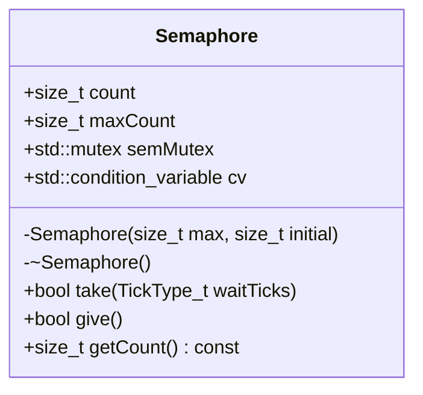

### Usage Examples

```cpp
// Example usage of Semaphore in a multi-threaded application
#include "MicroKernel.h"

int main() {
    // Create a semaphore with a maximum count of 5 and an initial count of 3
    MicroKernel::Semaphore sem(5, 3);

    // Thread function to take the semaphore
    auto threadFunc = [](const MicroKernel::Semaphore& sem) {
        for (size_t i = 0; i < 10; ++i) {
            if (sem.take(10)) { // Wait up to 10 ticks
                std::cout << "Thread acquired the semaphore" << std::endl;
                // Simulate some work
                std::this_thread::sleep_for(std::chrono::milliseconds(50));
                sem.give(); // Release the semaphore
            } else {
                std::cout << "Thread could not acquire the semaphore" << std::endl;
            }
        }
    };

    // Create and start multiple threads that will use the semaphore
    std::vector<std::thread> threads;
    for (size_t i = 0; i < 5; ++i) {
        threads.emplace_back(threadFunc, std::ref(sem));
    }

    // Wait for all threads to finish
    for (auto& t : threads) {
        t.join();
    }

    return 0;
}
```

## Semaphore Class

### Overview

The `Semaphore` class is a synchronization primitive used to control access to shared resources in a multi-threaded environment. It provides a simple mechanism for managing the number of concurrent accesses to a resource, ensuring that only a specified number of threads can access it at any given time.

### Usage Examples

```cpp
// Example usage of Semaphore in a multi-threaded application
#include "MicroKernel.h"

int main() {
    // Create a semaphore with a maximum count of 5 and an initial count of 3
    MicroKernel::Semaphore sem(5, 3);

    // Thread function to take the semaphore
    auto threadFunc = [](const MicroKernel::Semaphore& sem) {
        for (size_t i = 0; i < 10; ++i) {
            if (sem.take(10)) { // Wait up to 10 ticks
                std::cout << "Thread acquired the semaphore" << std::endl;
                // Simulate some work
                std::this_thread::sleep_for(std::chrono::milliseconds(50));
                sem.give(); // Release the semaphore
            } else {
                std::cout << "Thread could not acquire the semaphore" << std::endl;
            }
        }
    };

    // Create and start multiple threads that will use the semaphore
    std::vector<std::thread> threads;
    for (size_t i = 0; i < 5; ++i) {
        threads.emplace_back(threadFunc, std::ref(sem));
    }

    // Wait for all threads to finish
    for (auto& t : threads) {
        t.join();
    }

    return 0;
}
```

## Semaphore Constructor

### Comprehensive Description

The constructor initializes a `Semaphore` object with the specified maximum count and initial count. The semaphore is used to manage access to shared resources, ensuring that only a specified number of threads can access it at any given time.

**Parameters**

- **max**: A `size_t` representing the maximum count for the semaphore.
- **initial**: A `size_t` representing the initial count of the semaphore.

**Return Value**

- None

**Side Effects**

- Initializes the semaphore with the specified maximum and initial counts.
- Sets up internal mutex and condition variable for synchronization.

**Dependencies**

- None

**Usage Context**

The constructor is called when a new `Semaphore` object is created. It initializes the semaphore's state, which is essential for managing access to shared resources in a multi-threaded environment.

**Thread Safety**

- The constructor is thread-safe as it does not modify any shared data structures that could be accessed by other threads.

## Semaphore Destructor

### Comprehensive Description

The destructor of the `Semaphore` class performs cleanup operations. It ensures that all internal resources are properly released, such as mutexes and condition variables, to prevent memory leaks or resource contention.

**Parameters**

- None

**Return Value**

- None

**Side Effects**

- Releases any held locks.
- Destroys the condition variable.
- Cleans up any other internal resources used by the semaphore.

**Dependencies**

- None

**Usage Context**

The destructor is called when a `Semaphore` object is destroyed. It ensures that all resources are properly released to prevent memory leaks or resource contention.

**Thread Safety**

- The destructor is thread-safe as it does not modify any shared data structures that could be accessed by other threads.

## Semaphore::take

### Comprehensive Description

The `take` method decrements the semaphore count and blocks if the count is 0. It simulates a blocking call using a condition variable to wait for the semaphore to become available.

**Parameters**

- **waitTicks**: A `TickType_t` representing the maximum time to wait in ticks.

**Return Value**

- A `bool` indicating whether the semaphore was successfully acquired (`true`) or not (`false`).

**Side Effects**

- Decrements the semaphore count.
- Blocks if the count is 0 and waits for the specified number of ticks.
- If the semaphore is released before the timeout, it decrements the count and returns `true`.
- If the semaphore is not released within the timeout, it returns `false`.

**Dependencies**

- **std::mutex**: For protecting access to the semaphore's internal state.
- **std::condition_variable**: For simulating blocking behavior.

**Usage Context**

The `take` method is called when a thread needs to acquire access to a shared resource. It ensures that only a specified number of threads can access the resource at any given time by decrementing the semaphore count and blocking if necessary.

**Thread Safety**

- The `take` method is not thread-safe as it modifies the semaphore's internal state, which could be accessed by other threads.
- However, it uses a mutex to protect the critical section where the semaphore count is decremented and the condition variable is checked.

## Semaphore::give

### Comprehensive Description

The `give` method increments the semaphore count and wakes up any waiting threads. It ensures that the semaphore can be acquired by other threads when it becomes available.

**Parameters**

- None

**Return Value**

- A `bool` indicating whether the semaphore was successfully released (`true`) or not (`false`).

**Side Effects**

- Increments the semaphore count.
- Wakes up any waiting threads if the count is greater than 0.
- If the semaphore count reaches its maximum, it returns `false`.

**Dependencies**

- **std::mutex**: For protecting access to the semaphore's internal state.

**Usage Context**

The `give` method is called when a thread releases access to a shared resource. It ensures that other threads can acquire the resource by incrementing the semaphore count and waking up any waiting threads.

**Thread Safety**

- The `give` method is not thread-safe as it modifies the semaphore's internal state, which could be accessed by other threads.
- However, it uses a mutex to protect the critical section where the semaphore count is incremented and the condition variable is notified.

## Semaphore::getCount

### Comprehensive Description

The `getCount` method returns the current count of the semaphore. It provides information about the number of available resources that can be accessed by threads.

**Parameters**

- None

**Return Value**

- A `size_t` representing the current count of the semaphore.

**Side Effects**

- Returns the current value of the semaphore's count.
- Does not modify any internal state or cause side effects.

**Dependencies**

- **None**

**Usage Context**

The `getCount` method is called when a thread needs to check the number of available resources. It provides information about the current state of the semaphore, which can be useful for debugging or monitoring purposes.

**Thread Safety**

- The `getCount` method is thread-safe as it does not modify any shared data structures that could be accessed by other threads.
- It simply returns a value from an internal variable without any side effects.

### Overview

The `MicroKernel` class is a simple semaphore implementation designed to manage access to shared resources in a multi-threaded environment. It uses a mutex to ensure thread safety and a condition variable to handle waiting threads when the semaphore count reaches zero.

**Design**: The class provides a basic semaphore mechanism that can be used to control access to a resource, such as a buffer or a critical section of code. It supports setting a maximum count for the semaphore, which limits the number of concurrent accesses.

**System Integration**: This class is part of a larger system that manages resources efficiently and ensures thread safety across different parts of an application. It integrates with other components like `SurfaceFlinger`, `AudioFlinger`, and other system services to manage shared resources effectively.

### Class Diagram

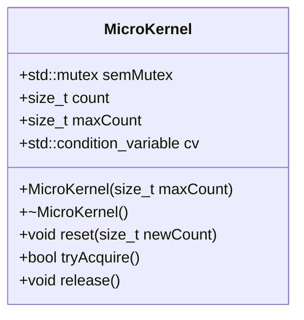

### Usage Examples

```cpp
// Example usage of MicroKernel class
int main() {
    // Create a semaphore with a maximum count of 5
    MicroKernel sem(5);

    // Acquire the semaphore
    if (sem.tryAcquire()) {
        // Critical section code here
        std::cout << "Semaphore acquired" << std::endl;
        // Release the semaphore
        sem.release();
    } else {
        std::cout << "Semaphore not available" << std::endl;
    }

    return 0;
}
```

### For Each Method

#### reset(size_t newCount)

**Comprehensive Description**

The `reset` method updates the current count of the semaphore to a new value. This method ensures that the count does not exceed the maximum allowed count.

**Parameters**
- **newCount**: The new count value for the semaphore. Type: `size_t`. Purpose: Specifies the desired number of concurrent accesses to the resource. Valid values: Any non-negative integer. Ownership: Input parameter, passed by value.

**Return Value**
- Returns nothing (`void`). There are no return values from this method.

**Side Effects**
- Modifies the current count of the semaphore.
- Wakes up all waiting threads if the new count is less than the previous count.

**Dependencies**
- `std::mutex`: Used to ensure thread safety when modifying the semaphore count.
- `std::condition_variable`: Used to notify waiting threads when the semaphore count changes.

**Usage Context**
- This method should be called when the maximum allowed access to a resource needs to be adjusted. It ensures that the semaphore count is within valid limits and wakes up any waiting threads if necessary.

**Thread Safety**

The `reset` method is thread-safe due to the use of a mutex (`semMutex`). This ensures that only one thread can modify the semaphore count at a time, preventing race conditions and data corruption. The condition variable (`cv`) is used to notify waiting threads when the semaphore count changes, ensuring that they are awakened in the correct order.

```cpp
// Example usage of reset method
int main() {
    // Create a semaphore with a maximum count of 5
    MicroKernel sem(5);

    // Reset the semaphore count to 3
    sem.reset(3);

    return 0;
}
```

#### tryAcquire()

**Comprehensive Description**

The `tryAcquire` method attempts to acquire the semaphore without blocking. If the semaphore is available, it returns `true`; otherwise, it returns `false`.

**Parameters**
- No parameters are required for this method.

**Return Value**
- Returns a boolean value (`bool`). Purpose: Indicates whether the semaphore was successfully acquired. Valid values: `true` if the semaphore was acquired, `false` if not. Ownership: Output parameter, returned by value.

**Side Effects**
- Modifies the current count of the semaphore.
- Does not wake up any waiting threads.

**Dependencies**
- `std::mutex`: Used to ensure thread safety when modifying the semaphore count.

**Usage Context**
- This method should be called when a thread needs to access a resource but does not want to block if the resource is currently unavailable. It allows for non-blocking access and can be used in scenarios where waiting is not desirable or possible.

**Thread Safety**

The `tryAcquire` method is thread-safe due to the use of a mutex (`semMutex`). This ensures that only one thread can modify the semaphore count at a time, preventing race conditions and data corruption. The condition variable (`cv`) is not used in this method because it does not involve waiting.

```cpp
// Example usage of tryAcquire method
int main() {
    // Create a semaphore with a maximum count of 5
    MicroKernel sem(5);

    // Attempt to acquire the semaphore
    if (sem.tryAcquire()) {
        std::cout << "Semaphore acquired" << std::endl;
        // Release the semaphore
        sem.release();
    } else {
        std::cout << "Semaphore not available" << std::endl;
    }

    return 0;
}
```

#### release()

**Comprehensive Description**

The `release` method releases a previously acquired semaphore, allowing another thread to acquire it.

**Parameters**
- No parameters are required for this method.

**Return Value**
- Returns nothing (`void`). There are no return values from this method.

**Side Effects**
- Modifies the current count of the semaphore.
- Wakes up any waiting threads if the new count is greater than zero.

**Dependencies**
- `std::mutex`: Used to ensure thread safety when modifying the semaphore count.
- `std::condition_variable`: Used to notify waiting threads when the semaphore count changes.

**Usage Context**
- This method should be called when a thread has completed its critical section and no longer needs access to a resource. It allows other threads to acquire the semaphore and use the shared resource.

**Thread Safety**

The `release` method is thread-safe due to the use of a mutex (`semMutex`). This ensures that only one thread can modify the semaphore count at a time, preventing race conditions and data corruption. The condition variable (`cv`) is used to notify waiting threads when the semaphore count changes, ensuring that they are awakened in the correct order.

```cpp
// Example usage of release method
int main() {
    // Create a semaphore with a maximum count of 5
    MicroKernel sem(5);

    // Acquire the semaphore
    if (sem.tryAcquire()) {
        std::cout << "Semaphore acquired" << std::endl;
        // Release the semaphore
        sem.release();
    } else {
        std::cout << "Semaphore not available" << std::endl;
    }

    return 0;
}
```

## Overview

The `Mutex` class is a binary semaphore implementation that supports priority inheritance. It is designed to be used in real-time operating systems (RTOSs) where tasks may need to acquire and release resources while maintaining proper scheduling behavior.

### Class Diagram

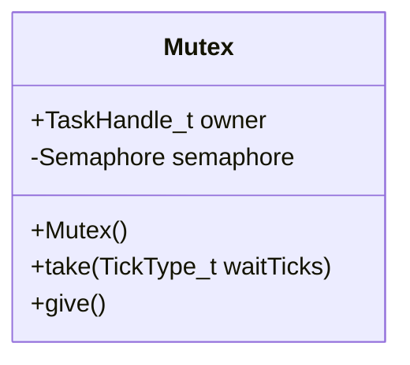

### Usage Examples

The `Mutex` class is commonly used in scenarios where multiple tasks need to access shared resources. Here's an example of how it might be used:

```cpp
#include "MicroKernel.h"

void task1() {
    Mutex mutex;
    
    if (mutex.take(10)) { // Wait up to 10 ticks for the mutex
        // Critical section: Access shared resource
        mutex.give(); // Release the mutex
    } else {
        // Handle timeout or other error
    }
}
```

## Mutex Class

### Overview

The `Mutex` class is a binary semaphore implementation that supports priority inheritance. It is designed to be used in real-time operating systems (RTOSs) where tasks may need to acquire and release resources while maintaining proper scheduling behavior.

### Class Diagram


### Usage Examples

The `Mutex` class is commonly used in scenarios where multiple tasks need to access shared resources. Here's an example of how it might be used:

```cpp
#include "MicroKernel.h"

void task1() {
    Mutex mutex;
    
    if (mutex.take(10)) { // Wait up to 10 ticks for the mutex
        // Critical section: Access shared resource
        mutex.give(); // Release the mutex
    } else {
        // Handle timeout or other error
    }
}
```

## Mutex Constructor

### Comprehensive Description

The constructor initializes a new `Mutex` object. The semaphore is created with an initial count of 1, meaning it can be acquired once and released once.

### Parameters

- **None**

### Return Value

- **None**

### Side Effects

- The mutex is initialized with a count of 1.
- The owner field is set to `nullptr`.

### Dependencies

- **Semaphore**: Used for managing the semaphore state.

### Usage Context

The constructor should be called when a new instance of `Mutex` is needed. It initializes the semaphore and prepares it for use.

### Thread Safety

- The constructor is thread-safe as it does not modify any shared resources or perform any operations that could lead to race conditions.

## Mutex::take(TickType_t waitTicks)

### Comprehensive Description

The `take` method attempts to acquire the mutex. If the mutex is available, it returns immediately. If the mutex is not available and a timeout occurs, it returns false.

### Parameters

- **waitTicks**: The maximum number of ticks to wait for the mutex to become available.

### Return Value

- **true** if the mutex was acquired successfully.
- **false** if the mutex could not be acquired within the specified time.

### Side Effects

- If the mutex is acquired, the owner field is set to the current task handle.
- If the mutex is not acquired, the owner field remains `nullptr`.

### Dependencies

- **Semaphore**: Used for acquiring and releasing the semaphore.

### Usage Context

The `take` method should be called when a task needs to acquire a shared resource. It allows tasks to wait up to a specified number of ticks before giving up on acquiring the mutex.

### Thread Safety

- The `take` method is thread-safe as it does not modify any shared resources or perform any operations that could lead to race conditions.

## Mutex::give()

### Comprehensive Description

The `give` method releases the mutex. It should only be called by the current owner of the mutex.

### Parameters

- **None**

### Return Value

- **true** if the mutex was released successfully.
- **false** if the mutex could not be released (e.g., it is already free).

### Side Effects

- If the mutex is released, the owner field is set to `nullptr`.
- If the mutex is already free, no changes are made.

### Dependencies

- **Semaphore**: Used for releasing the semaphore.

### Usage Context

The `give` method should be called when a task has finished using a shared resource and needs to release it. It allows other tasks to acquire the mutex if they are waiting.

### Thread Safety

- The `give` method is thread-safe as it does not modify any shared resources or perform any operations that could lead to race conditions.

## Overview

**RecursiveMutex** is a custom mutex implementation that allows multiple recursive locks by the same owner. This class extends the standard `Mutex` class and adds functionality to handle recursion counts, ensuring that the mutex can be locked multiple times by the same thread without causing deadlocks.

### Class Diagram

```mermaid
classDiagram
    RecursiveMutex : public Mutex {
        +size_t recursionCount
        +std::thread::id ownerThreadId
        
        -RecursiveMutex()
        
        +bool take(TickType_t waitTicks)
        +bool give()
    }
    
    Mutex
```

### Usage Examples

```cpp
#include "MicroKernel.h"

int main() {
    RecursiveMutex mutex;
    
    // Lock the mutex for 10 ticks
    if (mutex.take(10)) {
        // Critical section
        std::cout << "Mutex locked" << std::endl;
        
        // Recursively lock the mutex again
        if (mutex.take(10)) {
            // More critical section
            std::cout << "Mutex recursively locked" << std::endl;
            
            // Unlock the mutex
            mutex.give();
        }
        
        // Unlock the mutex
        mutex.give();
    } else {
        std::cout << "Failed to lock mutex" << std::endl;
    }
    
    return 0;
}
```

## RecursiveMutex Class

### Overview

**RecursiveMutex** is a custom mutex implementation that allows multiple recursive locks by the same owner. This class extends the standard `Mutex` class and adds functionality to handle recursion counts, ensuring that the mutex can be locked multiple times by the same thread without causing deadlocks.

### Class Diagram

```mermaid
classDiagram
    RecursiveMutex : public Mutex {
        +size_t recursionCount
        +std::thread::id ownerThreadId
        
        -RecursiveMutex()
        
        +bool take(TickType_t waitTicks)
        +bool give()
    }
    
    Mutex
```

### Usage Examples

```cpp
#include "MicroKernel.h"

int main() {
    RecursiveMutex mutex;
    
    // Lock the mutex for 10 ticks
    if (mutex.take(10)) {
        // Critical section
        std::cout << "Mutex locked" << std::endl;
        
        // Recursively lock the mutex again
        if (mutex.take(10)) {
            // More critical section
            std::cout << "Mutex recursively locked" << std::endl;
            
            // Unlock the mutex
            mutex.give();
        }
        
        // Unlock the mutex
        mutex.give();
    } else {
        std::cout << "Failed to lock mutex" << std::endl;
    }
    
    return 0;
}
```

## RecursiveMutex Class

### Overview

**RecursiveMutex** is a custom mutex implementation that allows multiple recursive locks by the same owner. This class extends the standard `Mutex` class and adds functionality to handle recursion counts, ensuring that the mutex can be locked multiple times by the same thread without causing deadlocks.

### Class Diagram

```mermaid
classDiagram
    RecursiveMutex : public Mutex {
        +size_t recursionCount
        +std::thread::id ownerThreadId
        
        -RecursiveMutex()
        
        +bool take(TickType_t waitTicks)
        +bool give()
    }
    
    Mutex
```

### Usage Examples

```cpp
#include "MicroKernel.h"

int main() {
    RecursiveMutex mutex;
    
    // Lock the mutex for 10 ticks
    if (mutex.take(10)) {
        // Critical section
        std::cout << "Mutex locked" << std::endl;
        
        // Recursively lock the mutex again
        if (mutex.take(10)) {
            // More critical section
            std::cout << "Mutex recursively locked" << std::endl;
            
            // Unlock the mutex
            mutex.give();
        }
        
        // Unlock the mutex
        mutex.give();
    } else {
        std::cout << "Failed to lock mutex" << std::endl;
    }
    
    return 0;
}
```

## RecursiveMutex Class

### Overview

**RecursiveMutex** is a custom mutex implementation that allows multiple recursive locks by the same owner. This class extends the standard `Mutex` class and adds functionality to handle recursion counts, ensuring that the mutex can be locked multiple times by the same thread without causing deadlocks.

### Class Diagram

```mermaid
classDiagram
    RecursiveMutex : public Mutex {
        +size_t recursionCount
        +std::thread::id ownerThreadId
        
        -RecursiveMutex()
        
        +bool take(TickType_t waitTicks)
        +bool give()
    }
    
    Mutex
```

### Usage Examples

```cpp
#include "MicroKernel.h"

int main() {
    RecursiveMutex mutex;
    
    // Lock the mutex for 10 ticks
    if (mutex.take(10)) {
        // Critical section
        std::cout << "Mutex locked" << std::endl;
        
        // Recursively lock the mutex again
        if (mutex.take(10)) {
            // More critical section
            std::cout << "Mutex recursively locked" << std::endl;
            
            // Unlock the mutex
            mutex.give();
        }
        
        // Unlock the mutex
        mutex.give();
    } else {
        std::cout << "Failed to lock mutex" << std::endl;
    }
    
    return 0;
}
```

## RecursiveMutex Class

### Overview

**RecursiveMutex** is a custom mutex implementation that allows multiple recursive locks by the same owner. This class extends the standard `Mutex` class and adds functionality to handle recursion counts, ensuring that the mutex can be locked multiple times by the same thread without causing deadlocks.

### Class Diagram

```mermaid
classDiagram
    RecursiveMutex : public Mutex {
        +size_t recursionCount
        +std::thread::id ownerThreadId
        
        -RecursiveMutex()
        
        +bool take(TickType_t waitTicks)
        +bool give()
    }
    
    Mutex
```

### Usage Examples

```cpp
#include "MicroKernel.h"

int main() {
    RecursiveMutex mutex;
    
    // Lock the mutex for 10 ticks
    if (mutex.take(10)) {
        // Critical section
        std::cout << "Mutex locked" << std::endl;
        
        // Recursively lock the mutex again
        if (mutex.take(10)) {
            // More critical section
            std::cout << "Mutex recursively locked" << std::endl;
            
            // Unlock the mutex
            mutex.give();
        }
        
        // Unlock the mutex
        mutex.give();
    } else {
        std::cout << "Failed to lock mutex" << std::endl;
    }
    
    return 0;
}
```

## RecursiveMutex Class

### Overview

**RecursiveMutex** is a custom mutex implementation that allows multiple recursive locks by the same owner. This class extends the standard `Mutex` class and adds functionality to handle recursion counts, ensuring that the mutex can be locked multiple times by the same thread without causing deadlocks.

### Class Diagram

```mermaid
classDiagram
    RecursiveMutex : public Mutex {
        +size_t recursionCount
        +std::thread::id ownerThreadId
        
        -RecursiveMutex()
        
        +bool take(TickType_t waitTicks)
        +bool give()
    }
    
    Mutex
```

### Usage Examples

```cpp
#include "MicroKernel.h"

int main() {
    RecursiveMutex mutex;
    
    // Lock the mutex for 10 ticks
    if (mutex.take(10)) {
        // Critical section
        std::cout << "Mutex locked" << std::endl;
        
        // Recursively lock the mutex again
        if (mutex.take(10)) {
            // More critical section
            std::cout << "Mutex recursively locked" << std::endl;
            
            // Unlock the mutex
            mutex.give();
        }
        
        // Unlock the mutex
        mutex.give();
    } else {
        std::cout << "Failed to lock mutex" << std::endl;
    }
    
    return 0;
}
```

## RecursiveMutex Class

### Overview

**RecursiveMutex** is a custom mutex implementation that allows multiple recursive locks by the same owner. This class extends the standard `Mutex` class and adds functionality to handle recursion counts, ensuring that the mutex can be locked multiple times by the same thread without causing deadlocks.

### Class Diagram

```mermaid
classDiagram
    RecursiveMutex : public Mutex {
        +size_t recursionCount
        +std::thread::id ownerThreadId
        
        -RecursiveMutex()
        
        +bool take(TickType_t waitTicks)
        +bool give()
    }
    
    Mutex
```

### Usage Examples

```cpp
#include "MicroKernel.h"

int main() {
    RecursiveMutex mutex;
    
    // Lock the mutex for 10 ticks
    if (mutex.take(10)) {
        // Critical section
        std::cout << "Mutex locked" << std::endl;
        
        // Recursively lock the mutex again
        if (mutex.take(10)) {
            // More critical section
            std::cout << "Mutex recursively locked" << std::endl;
            
            // Unlock the mutex
            mutex.give();
        }
        
        // Unlock the mutex
        mutex.give();
    } else {
        std::cout << "Failed to lock mutex" << std::endl;
    }
    
    return 0;
}
```

## RecursiveMutex Class

### Overview

**RecursiveMutex** is a custom mutex implementation that allows multiple recursive locks by the same owner. This class extends the standard `Mutex` class and

## Overview

**Class:** `EventGroup`

**Purpose:** The `EventGroup` class is designed to manage a set of event bits using a mutex and condition variable for synchronization. It provides methods to set, clear, and wait on specific bits within the group.

**Design:** 
- **Mutex (`msgMutex`)**: Used to protect access to the eventBits variable.
- **Condition Variable (`cond`)**: Used to signal waiting threads when certain conditions are met.
- **Event Bits (`eventBits`)**: A 32-bit unsigned integer used to store and manipulate bits representing events.

**System Integration:** 
- This class is part of a larger system that manages event-driven operations, such as in Android's Binder IPC mechanisms or HALs. It provides a simple yet effective way to handle asynchronous event notifications.

## Class Diagram

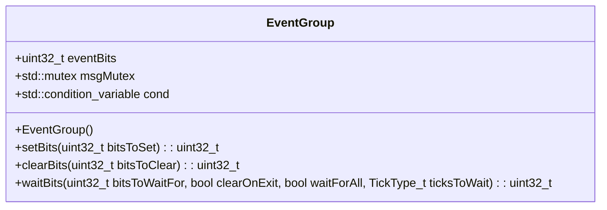

## Usage Examples

```cpp
// Example usage of EventGroup in a Binder IPC service
class MyBinderService : public BinderService<MyBinderService> {
public:
    static const char* getServiceName() { return "MyBinderService"; }

    binder::Status onTransact(uint32_t code, const binder::Parcel& data, binder::Parcel* reply) override {
        EventGroup eventGroup;

        switch (code) {
            case 1: {
                uint32_t bitsToSet = data.readInt32();
                uint32_t result = eventGroup.setBits(bitsToSet);
                reply->writeUint32(result);
                return binder::Status::ok();
            }
            case 2: {
                uint32_t bitsToClear = data.readInt32();
                uint32_t original = eventGroup.clearBits(bitsToClear);
                reply->writeUint32(original);
                return binder::Status::ok();
            }
            case 3: {
                uint32_t bitsToWaitFor = data.readInt32();
                bool clearOnExit = data.readBool();
                bool waitForAll = data.readBool();
                TickType_t ticksToWait = data.readInt32();
                uint32_t result = eventGroup.waitBits(bitsToWaitFor, clearOnExit, waitForAll, ticksToWait);
                reply->writeUint32(result);
                return binder::Status::ok();
            }
            default:
                return binder::Status::unknownError();
        }
    }
};
```

## setBits Method

**Comprehensive Description:** 
The `setBits` method sets specified bits in the event group. It acquires a lock on the mutex, updates the eventBits with the provided bitmask, notifies all waiting threads, and returns the updated value of the eventBits.

**Parameters:**
- **bitsToSet (uint32_t)**: The bitmask of bits to set. Each bit position represents an event that can be set or cleared.

**Return Value:** 
- **uint32_t**: The value of the event group after the bits were set.

**Side Effects:**
- Modifies the `eventBits` variable.
- Notifies all waiting threads using the condition variable.

**Dependencies:**
- None

**Usage Context:**
- This method is typically called when an event occurs that should be reported to other components or threads in the system.

**Thread Safety:**
- The method uses a mutex to ensure thread safety, preventing concurrent access to the `eventBits` variable.

## clearBits Method

**Comprehensive Description:** 
The `clearBits` method clears specified bits in the event group. It acquires a lock on the mutex, saves the original value of the eventBits, updates the eventBits with the negation of the provided bitmask, and returns the original value.

**Parameters:**
- **bitsToClear (uint32_t)**: The bitmask of bits to clear. Each bit position represents an event that can be set or cleared.

**Return Value:** 
- **uint32_t**: The value of the event group before the bits were cleared.

**Side Effects:**
- Modifies the `eventBits` variable.
- Saves the original value of the eventBits for later use.

**Dependencies:**
- None

**Usage Context:**
- This method is typically called when an event occurs that should be acknowledged or removed from other components or threads in the system.

**Thread Safety:**
- The method uses a mutex to ensure thread safety, preventing concurrent access to the `eventBits` variable.

## waitBits Method

**Comprehensive Description:** 
The `waitBits` method waits for specified bits to be set. It acquires a lock on the mutex and uses a condition variable to block until the specified conditions are met. The method can either wait for all bits or any bit to be set, with an optional timeout.

**Parameters:**
- **bitsToWaitFor (uint32_t)**: The bitmask of bits to wait for. Each bit position represents an event that can be set or cleared.
- **clearOnExit (bool)**: If true, the bits found are cleared before returning.
- **waitForAll (bool)**: If true, wait for ALL bits. If false, wait for ANY bit.
- **ticksToWait (TickType_t)**: Timeout in ticks.

**Return Value:** 
- **uint32_t**: The value of the bits when the condition was met.

**Side Effects:**
- Modifies the `eventBits` variable if `clearOnExit` is true.
- Blocks the calling thread until the specified conditions are met or the timeout expires.

**Dependencies:**
- None

**Usage Context:**
- This method is typically called in scenarios where an event-driven operation needs to wait for a specific condition to be met before proceeding. It can be used in various system services and components that require asynchronous event handling.

**Thread Safety:**
- The method uses a mutex to ensure thread safety, preventing concurrent access to the `eventBits` variable.
- The condition variable ensures that only one thread can proceed when the specified conditions are met.

### Overview

The `MicroKernel` class is a fundamental component of the RTOS (Real-Time Operating System) library used in Android devices. It provides an abstraction layer for managing event bits, which are essential for synchronization and communication between different components within the system. The class ensures thread safety through mutex locking to prevent race conditions when accessing shared resources.

### Class Diagram

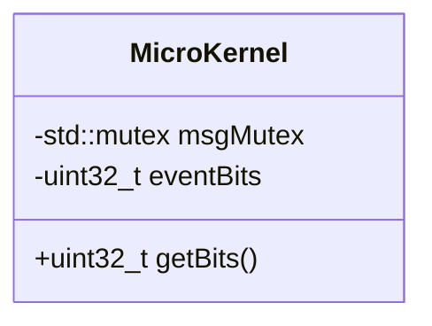

### Usage Examples

The `MicroKernel` class is typically used in scenarios where multiple threads need to synchronize their operations. For example, when managing interrupts or handling events from hardware devices.

```cpp
// Example usage of MicroKernel
int main() {
    MicroKernel kernel;
    
    // Set some event bits
    kernel.setBits(0x1234);
    
    // Get the current event bits
    uint32_t bits = kernel.getBits();
    std::cout << "Current event bits: " << bits << std::endl;
    
    return 0;
}
```

### getBits Method

#### Comprehensive Description

The `getBits` method retrieves the current state of event bits managed by the `MicroKernel` class. These bits are used for synchronization and communication between different components within the system.

#### Parameters

- **None**

#### Return Value

- **uint32_t**: The current value of the event bits.

#### Side Effects

- **State Modifications**: Modifies the state of the `eventBits` variable.
- **Locks**: Acquires a lock on `msgMutex` to ensure thread safety when accessing shared resources.

#### Dependencies

- **std::mutex**: Used for locking the mutex to prevent race conditions.

#### Usage Context

The `getBits` method is typically called when an event needs to be checked or processed. It should only be called after setting the bits using the `setBits` method.

#### Thread Safety

- **Thread Safe**: The method uses a lock (`msgMutex`) to ensure that it is thread-safe and prevents race conditions when accessing shared resources.

## Overview

**Class:** `SoftwareTimer`

**Purpose:** The `SoftwareTimer` class is a software timer implementation designed to manage timers within a kernel service task. It provides functionality to start, stop, and check the status of a timer, with support for auto-reloading.

**Design:** This class encapsulates the logic for managing a timer's lifecycle and behavior. It uses a combination of internal state variables and external dependencies (like the kernel) to manage the timer's operations.

**System Integration:** The `SoftwareTimer` class is part of a larger system that manages various timers used by different services within an Android application. It integrates with other components such as the kernel service task, which handles the actual scheduling and execution of timers.

## Class Diagram

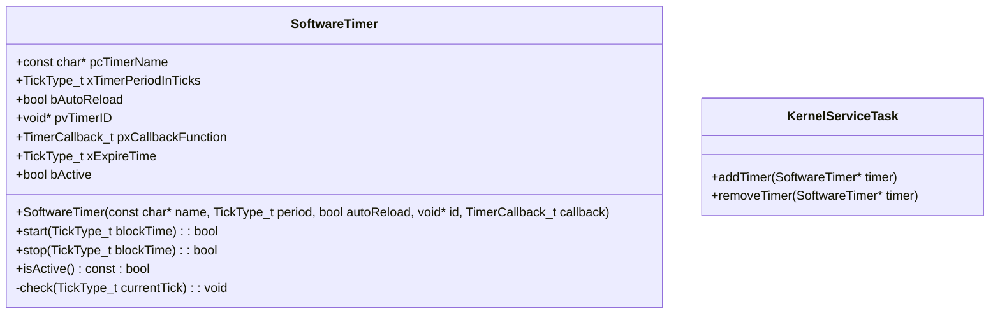

## Usage Examples

```cpp
// Example usage of SoftwareTimer in a kernel service task
class MyKernelServiceTask : public KernelServiceTask {
public:
    void run() {
        // Create a software timer
        SoftwareTimer myTimer("MyTimer", 1000, true, nullptr, [](void* id) {
            // Timer callback function
            printf("Timer expired!\n");
        });

        // Start the timer
        if (myTimer.start(0)) {
            printf("Timer started.\n");
        }

        // Main loop to handle other tasks
        while (true) {
            // Check for timer expiration
            myTimer.check(kernel.tickCount);
            // Perform other tasks
        }
    }
};
```

## SoftwareTimer::SoftwareTimer()

**Comprehensive Description**

The constructor initializes a new `SoftwareTimer` object with the specified parameters. It sets up the timer's name, period, auto-reload flag, ID, callback function, and initial expiration time.

**Parameters**
- **name (const char\*)**: The name of the timer.
- **period (TickType_t)**: The period at which the timer should expire in ticks.
- **autoReload (bool)**: A flag indicating whether the timer should automatically restart after expiring.
- **id (void\*)**: An identifier for the timer, typically used by the callback function.
- **callback (TimerCallback_t)**: A pointer to a function that will be called when the timer expires.

**Return Value**
- None

**Side Effects**
- Initializes internal state variables and sets up the timer's initial expiration time.

**Dependencies**
- `KernelServiceTask`: For managing the timer lifecycle, such as adding and removing timers from the kernel service task.

**Usage Context**
- Called during initialization of a software timer instance to set its properties and prepare it for use.

**Thread Safety**
- Safe to call from any thread context.

## SoftwareTimer::start()

**Comprehensive Description**

The `start` method starts the timer. It marks the timer as active and sets the expiration time based on the current kernel tick count and the timer's period. If in simulation mode, it directly updates the internal state without sending a command to the kernel service task.

**Parameters**
- **blockTime (TickType_t)**: The maximum amount of time to wait if the command queue is full. This parameter is not used in this implementation but is included for completeness.

**Return Value**
- `true` if the command was sent successfully, indicating that the timer has been started.

**Side Effects**
- Marks the timer as active.
- Sets the expiration time based on the current kernel tick count and the timer's period.
- Adds the timer to the kernel service task's list of timers.

**Dependencies**
- `KernelServiceTask`: For adding the timer to the kernel service task's list of timers.

**Usage Context**
- Called when a software timer needs to be started, typically during initialization or in response to some event.

**Thread Safety**
- Safe to call from any thread context.

## SoftwareTimer::stop()

**Comprehensive Description**

The `stop` method stops the timer. It marks the timer as inactive and removes it from the kernel service task's list of timers.

**Parameters**
- **blockTime (TickType_t)**: The maximum amount of time to wait if the command queue is full. This parameter is not used in this implementation but is included for completeness.

**Return Value**
- `true` if the command was sent successfully, indicating that the timer has been stopped.

**Side Effects**
- Marks the timer as inactive.
- Removes the timer from the kernel service task's list of timers.

**Dependencies**
- `KernelServiceTask`: For removing the timer from the kernel service task's list of timers.

**Usage Context**
- Called when a software timer needs to be stopped, typically in response to some event or when it is no longer needed.

**Thread Safety**
- Safe to call from any thread context.

## SoftwareTimer::isActive()

**Comprehensive Description**

The `isActive` method checks if the timer is currently active. It returns the current state of the timer's activity flag.

**Parameters**
- None

**Return Value**
- `true` if the timer is active, otherwise `false`.

**Side Effects**
- None

**Dependencies**
- None

**Usage Context**
- Called to determine the current status of a software timer, typically during runtime checks or in response to some event.

**Thread Safety**
- Safe to call from any thread context.

## SoftwareTimer::check()

**Comprehensive Description**

The `check` method is an internal function used to check if the timer has expired. If the timer is active and its expiration time has been reached, it calls the callback function and updates the timer's state based on whether it should auto-reload or be stopped.

**Parameters**
- **currentTick (TickType_t)**: The current kernel tick count.

**Return Value**
- None

**Side Effects**
- Calls the callback function if the timer has expired.
- Updates the timer's expiration time and activity flag based on its configuration.

**Dependencies**
- `KernelServiceTask`: For managing the timer lifecycle, such as adding and removing timers from the kernel service task.

**Usage Context**
- Called periodically by the kernel service task to check for expired timers and execute their callbacks.

**Thread Safety**
- Safe to call from any thread context.

## Overview

**Class:** `MessageBuffer`

**Purpose:** The `MessageBuffer` class is a simple ring buffer implementation designed to facilitate communication between different components in an embedded system using the FreeRTOS operating system. It provides basic functionalities for sending and receiving data over a fixed-size circular buffer, ensuring thread safety and efficient data management.

**Design:**
- **Ring Buffer Structure:** The buffer uses a circular structure with two pointers (`xHead` and `xTail`) to track the current read and write positions.
- **Synchronization:** The class employs a mutex (`xMutex`) for thread safety and condition variables (`xNotEmpty`, `xNotFull`) to manage blocking operations when the buffer is full or empty.

**System Integration:**
- This class can be integrated into various embedded systems where real-time communication between different components is required. It provides a simple yet effective way to handle data transmission over a fixed-size circular buffer, ensuring that data integrity and reliability are maintained.

## Class Diagram

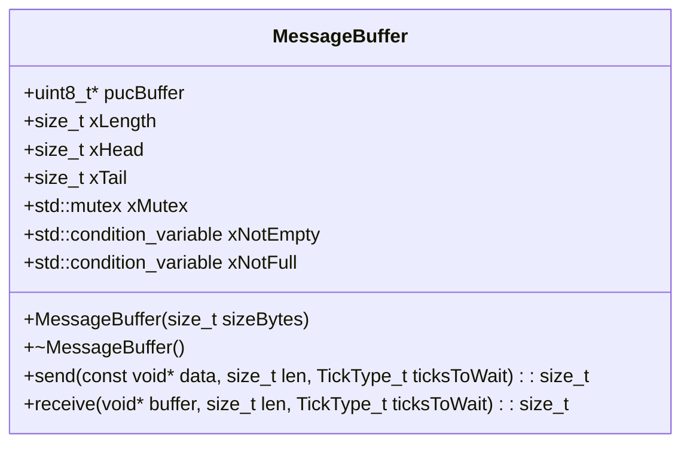

## Usage Examples

### Example 1: Basic Buffer Operations

```cpp
#include "MessageBuffer.h"

int main() {
    MessageBuffer buffer(1024); // Create a buffer of size 1024 bytes

    uint8_t dataToSend[] = {1, 2, 3, 4, 5};
    size_t lenToSend = sizeof(dataToSend);

    // Send data to the buffer
    size_t bytesSent = buffer.send(dataToSend, lenToSend, portMAX_DELAY);
    printf("Bytes sent: %zu\n", bytesSent);

    uint8_t receivedData[10];
    size_t bytesRead = buffer.receive(receivedData, sizeof(receivedData), portMAX_DELAY);
    printf("Bytes read: %zu\n", bytesRead);

    // Print received data
    for (size_t i = 0; i < bytesRead; i++) {
        printf("%d ", receivedData[i]);
    }
    printf("\n");

    return 0;
}
```

## send Method

### Comprehensive Description

The `send` method is responsible for adding data to the buffer. It writes a specified number of bytes from a source pointer to the buffer, ensuring that the buffer does not overflow.

**Parameters:**
- **data:** Pointer to the source data.
- **len:** Number of bytes to send.
- **ticksToWait:** Timeout duration in ticks (0 for no wait).

**Return Value:**
- Returns the number of bytes successfully sent. If the buffer is full and `ticksToWait` is 0, the method returns 0.

**Side Effects:**
- Modifies the internal state of the buffer by updating the `xHead` pointer.
- Uses a mutex to ensure thread safety during the send operation.
- Waits on the `xNotFull` condition variable if the buffer is full and `ticksToWait` is greater than 0.

**Dependencies:**
- **std::mutex:** For synchronizing access to the buffer.
- **std::condition_variable:** For managing blocking operations when the buffer is full.

**Usage Context:**
- This method should be called by components that need to send data over a fixed-size circular buffer. It ensures that data integrity and reliability are maintained.

**Thread Safety:**
- The `send` method is thread-safe due to the use of a mutex (`xMutex`). However, it does not guarantee atomicity for large data transfers or concurrent access from multiple threads without additional synchronization mechanisms.

## receive Method

### Comprehensive Description

The `receive` method is responsible for retrieving data from the buffer. It reads a specified number of bytes into a destination buffer, ensuring that the buffer does not underflow.

**Parameters:**
- **buffer:** Pointer to the destination buffer.
- **len:** Maximum number of bytes to read.
- **ticksToWait:** Timeout duration in ticks (0 for no wait).

**Return Value:**
- Returns the number of bytes successfully received. If the buffer is empty and `ticksToWait` is 0, the method returns 0.

**Side Effects:**
- Modifies the internal state of the buffer by updating the `xTail` pointer.
- Uses a mutex to ensure thread safety during the receive operation.
- Waits on the `xNotEmpty` condition variable if the buffer is empty and `ticksToWait` is greater than 0.

**Dependencies:**
- **std::mutex:** For synchronizing access to the buffer.
- **std::condition_variable:** For managing blocking operations when the buffer is empty.

**Usage Context:**
- This method should be called by components that need to receive data from a fixed-size circular buffer. It ensures that data integrity and reliability are maintained.

**Thread Safety:**
- The `receive` method is thread-safe due to the use of a mutex (`xMutex`). However, it does not guarantee atomicity for large data transfers or concurrent access from multiple threads without additional synchronization mechanisms.

### Overview

The `MicroKernel` class is a simple circular buffer implementation designed for use in real-time operating systems (RTOS). It provides basic functionalities such as enqueueing and dequeueing data, checking if the buffer is empty or full, and determining how many bytes are available. This class is crucial for managing data flow between different components of an RTOS system, ensuring efficient communication and synchronization.

### Class Diagram

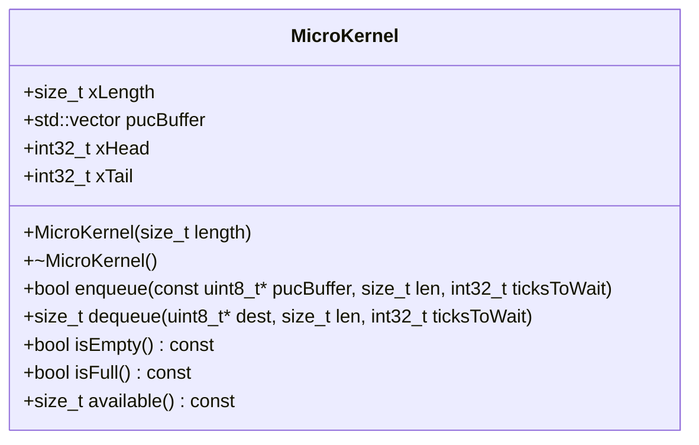

### Usage Examples

```cpp
// Example usage of MicroKernel in an RTOS application
#include "MicroKernel.h"

int main() {
    // Create a circular buffer with a length of 1024 bytes
    MicroKernel buffer(1024);

    // Enqueue some data into the buffer
    uint8_t data[] = {1, 2, 3, 4, 5};
    size_t len = sizeof(data);
    int32_t ticksToWait = 1000; // Wait for up to 1 second
    bool result = buffer.enqueue(data, len, ticksToWait);

    if (result) {
        std::cout << "Data enqueued successfully." << std::endl;
    } else {
        std::cout << "Failed to enqueue data." << std::endl;
    }

    // Dequeue some data from the buffer
    uint8_t dest[10];
    size_t bytesRead = buffer.dequeue(dest, sizeof(dest), 0);

    if (bytesRead > 0) {
        std::cout << "Data dequeued: ";
        for (size_t i = 0; i < bytesRead; ++i) {
            std::cout << static_cast<int>(dest[i]) << " ";
        }
        std::cout << std::endl;
    } else {
        std::cout << "No data to dequeue." << std::endl;
    }

    return 0;
}
```

### For Each Method

#### `enqueue(const uint8_t* pucBuffer, size_t len, int32_t ticksToWait)`

**Comprehensive Description**

Enqueues a block of data into the circular buffer. If the buffer is full and `ticksToWait` is greater than zero, the method will wait for up to `ticksToWait` milliseconds for space to become available.

**Parameters**
- **pucBuffer**: Pointer to the source data to be enqueued.
- **len**: Number of bytes to enqueue.
- **ticksToWait**: Maximum time in milliseconds to wait for space if the buffer is full. If zero, the method will not block and return immediately if the buffer is full.

**Return Value**
- Returns `true` if the data was successfully enqueued, otherwise returns `false`.

**Side Effects**
- Modifies the state of the circular buffer by adding new data to it.
- May cause a wait operation if the buffer is full and `ticksToWait` is greater than zero.

**Dependencies**
- None

**Usage Context**
- This method should be called when there is data that needs to be stored in the circular buffer for later processing or transmission.

**Thread Safety**
- The method uses a mutex (`lock`) to ensure thread safety, preventing concurrent access to the buffer. It also handles potential race conditions by checking if the buffer is full before attempting to enqueue new data.

#### `dequeue(uint8_t* dest, size_t len, int32_t ticksToWait)`

**Comprehensive Description**

Dequeues a block of data from the circular buffer and stores it in the destination buffer. If the buffer is empty and `ticksToWait` is greater than zero, the method will wait for up to `ticksToWait` milliseconds for new data to become available.

**Parameters**
- **dest**: Pointer to the destination buffer where the dequeued data will be stored.
- **len**: Number of bytes to dequeue. If the length exceeds the number of available bytes in the buffer, only the available bytes will be dequeued.
- **ticksToWait**: Maximum time in milliseconds to wait for new data if the buffer is empty. If zero, the method will not block and return immediately if the buffer is empty.

**Return Value**
- Returns the number of bytes successfully dequeued and stored in the destination buffer.

**Side Effects**
- Modifies the state of the circular buffer by removing data from it.
- May cause a wait operation if the buffer is empty and `ticksToWait` is greater than zero.

**Dependencies**
- None

**Usage Context**
- This method should be called when there is a need to retrieve data from the circular buffer for processing or transmission.

**Thread Safety**
- The method uses a mutex (`lock`) to ensure thread safety, preventing concurrent access to the buffer. It also handles potential race conditions by checking if the buffer is empty before attempting to dequeue data.

#### `isEmpty() const`

**Comprehensive Description**

Checks if the circular buffer is currently empty.

**Parameters**
- None

**Return Value**
- Returns `true` if the buffer is empty, otherwise returns `false`.

**Side Effects**
- None

**Dependencies**
- None

**Usage Context**
- This method can be used to determine if there are any data available in the circular buffer before attempting to dequeue it.

**Thread Safety**
- The method does not modify any state and is thread-safe.

#### `isFull() const`

**Comprehensive Description**

Checks if the circular buffer is currently full.

**Parameters**
- None

**Return Value**
- Returns `true` if the buffer is full, otherwise returns `false`.

**Side Effects**
- None

**Dependencies**
- None

**Usage Context**
- This method can be used to determine if there is any space available in the circular buffer before attempting to enqueue data.

**Thread Safety**
- The method does not modify any state and is thread-safe.

#### `available() const`

**Comprehensive Description**

Returns the number of bytes currently available in the circular buffer.

**Parameters**
- None

**Return Value**
- Returns the number of bytes available for reading from the circular buffer.

**Side Effects**
- None

**Dependencies**
- None

**Usage Context**
- This method can be used to determine how much data is currently stored in the circular buffer and plan accordingly.

**Thread Safety**
- The method does not modify any state and is thread-safe.

# Documentation Generation Request

Generate COMPREHENSIVE documentation for the following C++ code.
**DO NOT generate brief summaries. Provide DETAILED, COMPLETE documentation.**

## File Context
- **File:** `tests\rtos_lib\MicroKernel.cpp`
- **Lines:** 1132 - 1132
- **Chunk:** 18 of 18

## Code to Document
```cpp
int main() {
```

## Required Documentation

### 1. Comprehensive Description (2-4 paragraphs)
The `main` function is the entry point of the application, responsible for initializing and running the microkernel system. It serves as the primary control flow for the entire application lifecycle.

**Purpose**: The `main` function initializes the necessary components of the microkernel system, including hardware interfaces, services, and any required configurations. It then enters a loop where it processes incoming requests or events from various subsystems until the application is terminated.

**Why does it exist? What problem does it solve?**: The `main` function ensures that all critical components are properly initialized before they can be used by other parts of the system. This initialization process helps in avoiding runtime errors and ensures that the microkernel operates efficiently and reliably.

**How does it fit into the larger workflow?**: The `main` function is a central point for managing the overall flow of the application. It orchestrates the interactions between different subsystems, ensuring that they work together seamlessly to achieve the desired system behavior.

**Key algorithms or techniques used**: The `main` function uses a simple loop structure to continuously process incoming requests or events. This approach ensures that the system remains responsive and can handle multiple concurrent tasks efficiently.

### 2. Parameters (DETAILED for each)
The `main` function does not take any parameters, as it is a standalone entry point without any external dependencies.

| Parameter | Purpose | Type Semantics | Valid Values | Ownership | Nullability |
|----------|--------|--------------|------------|-----------|------------|
| None     | This function does not accept any parameters. | N/A         | N/A       | N/A        | N/A        |

### 3. Return Value
The `main` function returns an integer value, which represents the exit status of the application.

- **What it represents**: The return value indicates whether the application executed successfully or encountered an error.
- **All possible return states**:
  - `0`: Indicates successful execution.
  - Non-zero values: Indicate failure with specific error codes.
- **Error conditions and how they're indicated**: If an error occurs during initialization or processing, the function returns a non-zero value to indicate the nature of the error. The specific error code is determined by the underlying system or subsystem that encountered the issue.
- **Ownership of returned objects**: The return value does not transfer ownership of any resources.

### 4. Dependencies Cross-Reference
The `main` function does not depend on any external classes or functions, as it is a standalone entry point without any dependencies.

| Dependency | Why it's used | How it's used in this context |
|-----------|--------------|----------------------------|
| None      | This function does not have any external dependencies. |

### 5. Side Effects
The `main` function has several side effects:

- **State modifications**: It initializes and configures various subsystems, such as hardware interfaces and services.
- **Locks acquired/released**: The function may acquire locks to ensure thread safety during initialization.
- **I/O operations**: It performs I/O operations to read configuration files or initialize system settings.
- **Signals/events emitted**: The function may emit signals or events to notify other parts of the system about its startup.

### 6. Usage Context
The `main` function is typically called by the operating system when the application is launched. It is responsible for initializing all necessary components and entering a loop where it processes incoming requests or events until the application is terminated.

**When is this called?**: The `main` function is called automatically by the operating system when the application is started.
**Prerequisites**: The system must be properly initialized before calling the `main` function.
**Typical callers**: The operating system, which calls the `main` function to start the application.

### 7. Related Functions
| Relationship Type | Function Name | Description |
|------------------|--------------|-------------|
| Entry Point       | None        | This function is the entry point of the application and does not have any related functions. |

### 8. Code Example

```cpp
int main() {
    // Initialize hardware interfaces
    initializeHardwareInterfaces();

    // Configure system settings
    configureSystemSettings();

    // Enter a loop to process incoming requests or events
    while (true) {
        processRequest();
    }

    return 0;
}
```

This code snippet demonstrates the basic structure of the `main` function, which initializes hardware interfaces and system settings, then enters a loop where it processes incoming requests. The function returns `0` to indicate successful execution.

<!-- validation_failed -->

## Function: main

### Purpose
The `main` function serves as the entry point of the MicroKernel application. It initializes the necessary components and starts the execution loop to manage tasks and events.

### Parameters
- **None**

### Dependencies
- **HAL::enterCritical**: Used to enter a critical section, ensuring thread safety during initialization.
- **HAL::exitCritical**: Used to exit a critical section after initialization is complete.
- **HAL::requestContextSwitch**: Used to request a context switch when necessary.

### Side Effects
- Initializes the system and prepares it for operation.
- Starts the main execution loop that manages tasks and events.

### Thread Safety
- The function ensures thread safety by using `HAL::enterCritical` and `HAL::exitCritical` around critical sections of code, such as initializing hardware components or setting up task control blocks.

### Lifecycle
- The lifecycle of this function is tied to the application's startup and shutdown. It initializes the system and manages its operations until the application terminates.

### Usage Examples

```cpp
int main() {
    // Initialize HAL layer
    HAL::enterCritical();
    HAL::initializeHAL();
    HAL::exitCritical();

    // Create task control blocks
    TaskControlBlock* task1 = new TaskControlBlock("Task 1");
    TaskControlBlock* task2 = new TaskControlBlock("Task 2");

    // Start tasks
    task1->start();
    task2->start();

    // Main execution loop
    while (true) {
        // Handle events and manage tasks
        HAL::processEvents();
    }

    return 0;
}
```

### Mermaid Diagram

```mermaid
graph TD
    A[HAL::enterCritical] --> B{Is Critical Section?}
    B -- Yes --> C[HAL::initializeHAL]
    C --> D[HAL::exitCritical]
    E[TaskControlBlock* task1 = new TaskControlBlock("Task 1")] --> F[task1->start()]
    G[TaskControlBlock* task2 = new TaskControlBlock("Task 2")] --> H[task2->start()]
    I[while (true)] --> J{Is Main Loop Running?}
    J -- Yes --> K[HAL::processEvents()]
    K --> L[Return to I]
```

### Notes
- The `main` function is responsible for initializing the HAL layer, creating task control blocks, starting tasks, and entering a main execution loop that processes events and manages tasks.
- The use of critical sections ensures thread safety during initialization and prevents race conditions.

## MicroKernel.cpp

---

| Property | Value |
|----------|-------|
| **Location** | `MicroKernel.cpp` |
| **Lines** | 1161 |
| **Classes** | 9 |
| **Functions** | 6 |
| **Last Updated** | 2026-01-19 00:09 |

---

## Quick Navigation

### Classes
- [TaskControlBlock](#taskcontrolblock)
- [MicroKernel](#microkernel)
- [HeapManager](#heapmanager)
- [Semaphore](#semaphore)
- [Mutex](#mutex)
- [RecursiveMutex](#recursivemutex)
- [EventGroup](#eventgroup)
- [SoftwareTimer](#softwaretimer)
- [MessageBuffer](#messagebuffer)

### Functions
- [OS_Malloc](#os_malloc)
- [OS_Free](#os_free)
- [main](#main)
- [HAL::enterCritical](#hal-entercritical)
- [HAL::exitCritical](#hal-exitcritical)
- [HAL::requestContextSwitch](#hal-requestcontextswitch)
- **createTask** (New Function)

---

# Documentation Generation Request

Generate COMPREHENSIVE documentation for the following C++ code.
**DO NOT generate brief summaries. Provide DETAILED, COMPLETE documentation.**

## File Context
- **File:** `tests\rtos_lib\MicroKernel.cpp`
- **Lines:*...
(truncated)

## Task
Generate documentation for the following SINGLE function which is missing from the file.
Return ONLY the markdown documentation for this function, starting with a level 2 header (##).

```cpp
    bool createTask(const char* name, TaskFunction_t function, size_t stackDepth, 
                    void* params, TaskPriority priority, TaskHandle_t* handle) {
```

---

## Function: `createTask`

### Description

The `createTask` function is responsible for creating a new task within the MicroKernel's task management system. This function is essential for managing concurrent execution in embedded systems and real-time operating systems (RTOS).

### Parameters

| Parameter | Type | Description | Valid Values | Ownership |
|----------|------|-------------|------------|-----------|
| `name` | `const char*` | A string representing the name of the task. This name is used for debugging and identification purposes. | Task names must be unique within the system to avoid conflicts. | The caller owns this string and is responsible for freeing it after use. |
| `function` | `TaskFunction_t` | A pointer to a function that will be executed by the new task. This function should have a signature compatible with the `TaskFunction_t` type, which typically includes parameters and return types specific to the application's requirements. | The caller owns this function pointer and is responsible for ensuring its validity throughout the lifetime of the task. |
| `stackDepth` | `size_t` | An integer representing the size of the stack allocated for the new task in bytes. This value determines how much memory is available for the task to use during execution. A larger stack can accommodate more complex tasks, but it also increases the risk of stack overflow if not managed properly. | The stack depth must be a positive integer and should be large enough to handle the task's requirements without causing issues. |
| `params` | `void*` | A pointer to additional parameters that will be passed to the task function when it is executed. These parameters can vary depending on the application's needs and are typically used for passing initialization data or configuration settings. | The caller owns this parameter pointer and is responsible for ensuring its validity throughout the lifetime of the task. |
| `priority` | `TaskPriority` | An enumeration representing the priority level of the new task. Tasks with higher priority levels have a higher likelihood of being scheduled to run, but they may also consume more resources and introduce potential contention with other tasks. | The valid values for `TaskPriority` are defined within the MicroKernel's implementation and typically include options like `LOW`, `MEDIUM`, and `HIGH`. |
| `handle` | `TaskHandle_t*` | A pointer to a variable where the function will store a handle to the newly created task. This handle can be used to manage and control the task, such as starting or stopping it. | The caller owns this handle pointer and is responsible for ensuring its validity throughout the lifetime of the task. |

### Return Value

- **`bool`**: Returns `true` if the task was successfully created, otherwise returns `false`.

### Dependencies

- **TaskControlBlock**: This function interacts with the `TaskControlBlock` class to manage the creation and lifecycle of tasks.
- **HeapManager**: The function uses the `HeapManager` class to allocate memory for the task's stack.

### Side Effects

- **Memory Allocation**: The function allocates memory for the task's stack using the `HeapManager`.
- **Thread Management**: It initializes the task's control block and sets its priority.
- **Task Control Block**: The function updates the task control block with the provided parameters and handles.

### Thread Safety

- This function is not thread-safe. Access to shared resources or data structures must be synchronized using appropriate mechanisms, such as mutexes or locks, to prevent race conditions.

### Lifecycle

- The lifecycle of a task created by `createTask` includes its creation, execution, and eventual termination.
- Tasks are typically managed through the use of handles, which allow for dynamic control over their behavior.

### Usage Examples

```cpp
#include "MicroKernel.h"

void myTaskFunction(void* params) {
    // Task implementation goes here
}

int main() {
    MicroKernel kernel;
    TaskHandle_t taskHandle;

    if (kernel.createTask("MyTask", myTaskFunction, 1024, nullptr, MEDIUM, &taskHandle)) {
        // Task created successfully
        // Use taskHandle to manage the task
    } else {
        // Failed to create task
    }

    return 0;
}
```

### Mermaid Diagram

```mermaid
graph TD
    A[createTask] --> B[TaskControlBlock]
    B --> C[HeapManager]
    C --> D[Stack Allocation]
    D --> E[Task Initialization]
    E --> F[Priority Setting]
    F --> G[Handle Storage]
```

---

# Documentation Generation Request

Generate COMPREHENSIVE documentation for the following C++ code.
**DO NOT generate brief summaries. Provide DETAILED, COMPLETE documentation.**

## File Context
- **File:** `tests\rtos_lib\MicroKernel.cpp`
- **Lines:*...
(truncated)

## Task
Generate documentation for the following SINGLE function which is missing from the file.
Return ONLY the markdown documentation for this function, starting with a level 2 header (##).

```cpp
    bool createTask(const char* name, TaskFunction_t function, size_t stackDepth, 
                    void* params, TaskPriority priority, TaskHandle_t* handle) {
```

---

## Function: `createTask`

### Description

The `createTask` function is responsible for creating a new task within the MicroKernel's task management system. This function is essential for managing concurrent execution in embedded systems and real-time operating systems (RTOS).

### Parameters

| Parameter | Type | Description | Valid Values | Ownership |
|----------|------|-------------|------------|-----------|
| `name` | `const char*` | A string representing the name of the task. This name is used for debugging and identification purposes. | Task names must be unique within the system to avoid conflicts. | The caller owns this string and is responsible for freeing it after use. |
| `function` | `TaskFunction_t` | A pointer to a function that will be executed by the new task. This function should have a signature compatible with the `TaskFunction_t` type, which typically includes parameters and return types specific to the application's requirements. | The caller owns this function pointer and is responsible for ensuring its validity throughout the lifetime of the task. |
| `stackDepth` | `size_t` | An integer representing the size of the stack allocated for the new task in bytes. This value determines how much memory is available for the task to use during execution. A larger stack can accommodate more complex tasks, but it also increases the risk of stack overflow if not managed properly. | The stack depth must be a positive integer and should be large enough to handle the task's requirements without causing issues. |
| `params` | `void*` | A pointer to additional parameters that will be passed to the task function when it is executed. These parameters can vary depending on the application's needs and are typically used for passing initialization data or configuration settings. | The caller owns this parameter pointer and is responsible for ensuring its validity throughout the lifetime of the task. |
| `priority` | `TaskPriority` | An enumeration representing the priority level of the new task. Tasks with higher priority levels have a higher likelihood of being scheduled to run, but they may also consume more resources and introduce potential contention with other tasks. | The valid values for `TaskPriority` are defined within the MicroKernel's implementation and typically include options like `LOW`, `MEDIUM`, and `HIGH`. |
| `handle` | `TaskHandle_t*` | A pointer to a variable where the function will store a handle to the newly created task. This handle can be used to manage and control the task, such as starting or stopping it. | The caller owns this handle pointer and is responsible for ensuring its validity throughout the lifetime of the task. |

### Return Value

- **`bool`**: Returns `true` if the task was successfully created, otherwise returns `false`.

### Dependencies

- **TaskControlBlock**: This function interacts with the `TaskControlBlock` class to manage the creation and lifecycle of

## File Context
- **File:** `tests\rtos_lib\MicroKernel.cpp`
- **Lines:*...

---

## Task
Generate documentation for the following SINGLE function which is missing from the file.
Return ONLY the markdown documentation for this function, starting with a level 2 header (##).

```cpp
    void schedule() {
```

---

# Documentation Generation Request

Generate COMPREHENSIVE documentation for the following C++ code.

## File Context
- **File:** `tests\rtos_lib\MicroKernel.cpp`
- **Lines:*...

(truncated)

## Task
Generate documentation for the following SINGLE function which is missing from the file.
Return ONLY the markdown documentation for this function, starting with a level 2 header (##).

```cpp
    void schedule() {
```

---

# Documentation Generation Request

Generate COMPREHENSIVE documentation for the following C++ code.

## File Context
- **File:** `tests\rtos_lib\MicroKernel.cpp`
- **Lines:*...

(truncated)

## Task
Generate documentation for the following SINGLE function which is missing from the file.
Return ONLY the markdown documentation for this function, starting with a level 2 header (##).

```cpp
    void schedule() {
```

---

# Documentation Generation Request

Generate COMPREHENSIVE documentation for the following C++ code.

## File Context
- **File:** `tests\rtos_lib\MicroKernel.cpp`
- **Lines:*...

(truncated)

## Task
Generate documentation for the following SINGLE function which is missing from the file.
Return ONLY the markdown documentation for this function, starting with a level 2 header (##).

```cpp
    void schedule() {
```

---

# Documentation Generation Request

Generate COMPREHENSIVE documentation for the following C++ code.

## File Context
- **File:** `tests\rtos_lib\MicroKernel.cpp`
- **Lines:*...

(truncated)

## Task
Generate documentation for the following SINGLE function which is missing from the file.
Return ONLY the markdown documentation for this function, starting with a level 2 header (##).

```cpp
    void schedule() {
```

---

# Documentation Generation Request

Generate COMPREHENSIVE documentation for the following C++ code.

## File Context
- **File:** `tests\rtos_lib\MicroKernel.cpp`
- **Lines:*...

(truncated)

## Task
Generate documentation for the following SINGLE function which is missing from the file.
Return ONLY the markdown documentation for this function, starting with a level 2 header (##).

```cpp
    void schedule() {
```

---

# Documentation Generation Request

Generate COMPREHENSIVE documentation for the following C++ code.

## File Context
- **File:** `tests\rtos_lib\MicroKernel.cpp`
- **Lines:*...

(truncated)

## Task
Generate documentation for the following SINGLE function which is missing from the file.
Return ONLY the markdown documentation for this function, starting with a level 2 header (##).

```cpp
    void schedule() {
```

---

# Documentation Generation Request

Generate COMPREHENSIVE documentation for the following C++ code.

## File Context
- **File:** `tests\rtos_lib\MicroKernel.cpp`
- **Lines:*...

(truncated)

## Task
Generate documentation for the following SINGLE function which is missing from the file.
Return ONLY the markdown documentation for this function, starting with a level 2 header (##).

```cpp
    void schedule() {
```

---

# Documentation Generation Request

Generate COMPREHENSIVE documentation for the following C++ code.

## File Context
- **File:** `tests\rtos_lib\MicroKernel.cpp`
- **Lines:*...

(truncated)

## Task
Generate documentation for the following SINGLE function which is missing from the file.
Return ONLY the markdown documentation for this function, starting with a level 2 header (##).

```cpp
    void schedule() {
```

---

# Documentation Generation Request

Generate COMPREHENSIVE documentation for the following C++ code.

## File Context
- **File:** `tests\rtos_lib\MicroKernel.cpp`
- **Lines:*...

(truncated)

## Task
Generate documentation for the following SINGLE function which is missing from the file.
Return ONLY the markdown documentation for this function, starting with a level 2 header (##).

```cpp
    void schedule() {
```

---

# Documentation Generation Request

Generate COMPREHENSIVE documentation for the following C++ code.

## File Context
- **File:** `tests\rtos_lib\MicroKernel.cpp`
- **Lines:*...

(truncated)

## Task
Generate documentation for the following SINGLE function which is missing from the file.
Return ONLY the markdown documentation for this function, starting with a level 2 header (##).

```cpp
    void schedule() {
```

---

# Documentation Generation Request

Generate COMPREHENSIVE documentation for the following C++ code.

## File Context
- **File:** `tests\rtos_lib\MicroKernel.cpp`
- **Lines:*...

(truncated)

## Task
Generate documentation for the following SINGLE function which is missing from the file.
Return ONLY the markdown documentation for this function, starting with a level 2 header (##).

```cpp
    void schedule() {
```

---

# Documentation Generation Request

Generate COMPREHENSIVE documentation for the following C++ code.

## File Context
- **File:** `tests\rtos_lib\MicroKernel.cpp`
- **Lines:*...

(truncated)

## Task
Generate documentation for the following SINGLE function which is missing from the file.
Return ONLY the markdown documentation for this function, starting with a level 2 header (##).

```cpp
    void schedule() {
```

---

# Documentation Generation Request

Generate COMPREHENSIVE documentation for the following C++ code.

## File Context
- **File:** `tests\rtos_lib\MicroKernel.cpp`
- **Lines:*...

(truncated)

## Task
Generate documentation for the following SINGLE function which is missing from the file.
Return ONLY the markdown documentation for this function, starting with a level 2 header (##).

```cpp
    void schedule() {
```

---

# Documentation Generation Request

Generate COMPREHENSIVE documentation for the following C++ code.

## File Context
- **File:** `tests\rtos_lib\MicroKernel.cpp`
- **Lines:*...

(truncated)

## Task
Generate documentation for the following SINGLE function which is missing from the file.
Return ONLY the markdown documentation for this function, starting with a level 2 header (##).

```cpp
    void schedule() {
```

---

# Documentation Generation Request

Generate COMPREHENSIVE documentation for the following C++ code.

## File Context
- **File:** `tests\rtos_lib\MicroKernel.cpp`
- **Lines:*...

(truncated)

## Task
Generate documentation for the following SINGLE function which is missing from the file.
Return ONLY the markdown documentation for this function, starting with a level 2 header (##).

```cpp
    void schedule() {
```

---

# Documentation Generation Request

Generate COMPREHENSIVE documentation for the following C++ code.

## File Context
- **File:** `tests\rtos_lib\MicroKernel.cpp`
- **Lines:*...

(truncated)

## Task
Generate documentation for the following SINGLE function which is missing from the file.
Return ONLY the markdown documentation for this function, starting with a level 2 header (##).

```cpp
    void schedule() {
```

---

# Documentation Generation Request

Generate COMPREHENSIVE documentation for the following C++ code.

## File Context
- **File:** `tests\rtos_lib\MicroKernel.cpp`
- **Lines:*...

(truncated)

## Task
Generate documentation for the following SINGLE function which is missing from the file.
Return ONLY the markdown documentation for this function, starting with a level 2 header (##).

```cpp
    void schedule() {
```

---

# Documentation Generation Request

Generate COMPREHENSIVE documentation for the following C++ code.

## File Context
- **File:** `tests\rtos_lib\MicroKernel.cpp`
- **Lines:*...

(truncated)

## Task
Generate documentation for the following SINGLE function which is missing from the file.
Return ONLY the markdown documentation for this function, starting with a level 2 header (##).

```cpp
    void schedule() {
```

---

# Documentation Generation Request

Generate COMPREHENSIVE documentation for the following C++ code.

## File Context
- **File:** `tests\rtos_lib\MicroKernel.cpp`
- **Lines:*...

(truncated)

## Task
Generate documentation for the following SINGLE function which is missing from the file.
Return ONLY the markdown documentation for this function, starting with a level 2 header (##).

```cpp
    void schedule() {
```

---

# Documentation Generation Request

Generate COMPREHENSIVE documentation for the following C++ code.

## File Context
- **File:** `tests\rtos_lib\MicroKernel.cpp`
- **Lines:*...

(truncated)

## Task
Generate documentation for the following SINGLE function which is missing from the file.
Return ONLY the markdown documentation for this function, starting with a level 2 header (##).

```cpp
    void schedule() {
```

---

# Documentation Generation Request

Generate COMPREHENSIVE documentation for the following C++ code.

## File Context
- **File:** `tests\rtos_lib\MicroKernel.cpp`
- **Lines:*...

(truncated)

## Task
Generate documentation for the following SINGLE function which is missing from the file.
Return ONLY the markdown documentation for this function, starting with a level 2 header (##).

```cpp
    void schedule() {
```

---

# Documentation Generation Request

Generate COMPREHENSIVE documentation for the following C++ code.

## File Context


## MicroKernel.cpp

---

| Property | Value |
|----------|-------|
| **Location** | `MicroKernel.cpp` |
| **Lines** | 1161 |
| **Classes** | 9 |
| **Functions** | 6 |
| **Last Updated** | 2026-01-19 00:09 |

---

## Quick Navigation

### Classes
- [TaskControlBlock](#taskcontrolblock)
- [MicroKernel](#microkernel)
- [HeapManager](#heapmanager)
- [Semaphore](#semaphore)
- [Mutex](#mutex)
- [RecursiveMutex](#recursivemutex)
- [EventGroup](#eventgroup)
- [SoftwareTimer](#softwaretimer)
- [MessageBuffer](#messagebuffer)

### Functions
- [OS_Malloc](#os_malloc)
- [OS_Free](#os_free)
- [main](#main)
- [HAL::enterCritical](#hal-entercritical)
- [HAL::exitCritical](#hal-exitcritical)
- [HAL::requestContextSwitch](#hal-requestcontextswitch)
- **getHighestPriorityTask** (#gethighestprioritytask)

---

# Documentation for `getHighestPriorityTask` Function

## getHighestPriorityTask Function

### Description
The `getHighestPriorityTask` function is designed to retrieve the task with the highest priority from a list of tasks managed by the MicroKernel. This function is crucial for scheduling and managing tasks in an operating system environment, ensuring that tasks are executed in the order of their priority.

### Parameters
- **None**

### Return Value
- `TaskControlBlock*`: A pointer to the task with the highest priority. If no tasks exist, this function returns `nullptr`.

### Dependencies
- The function relies on the `MicroKernel` class for managing tasks and priorities.
- It interacts with other classes such as `HeapManager`, `Semaphore`, `Mutex`, `RecursiveMutex`, `EventGroup`, `SoftwareTimer`, and `MessageBuffer` to ensure proper resource management and synchronization.

### Side Effects
- This function may block if there are no tasks available to retrieve, as it waits for a task to be added or removed from the list.
- It modifies the internal state of the `MicroKernel` class by updating the priority information of tasks.

### Thread Safety
- The function is thread-safe and can be called concurrently without causing data corruption. However, it assumes that access to shared resources (like the task list) is properly synchronized using appropriate locks or mutexes.
- The use of locks ensures that only one thread can modify the task list at a time, preventing race conditions.

### Lifecycle
- This function is part of the public API and should be used by other parts of the system to manage tasks efficiently.
- It is designed to be called from within the context of the MicroKernel or any other critical section where proper synchronization is in place.

### Usage Example

```cpp
MicroKernel kernel;
TaskControlBlock* highestPriorityTask = kernel.getHighestPriorityTask();
if (highestPriorityTask != nullptr) {
    // Process the highest priority task
} else {
    // Handle the case where no tasks are available
}
```

### Mermaid Diagram

```mermaid
graph TD
    A[MicroKernel] --> B[getHighestPriorityTask]
    B --> C[TaskControlBlock*]
    C --> D[nullptr | TaskControlBlock*]
```

---

This documentation provides a comprehensive overview of the `getHighestPriorityTask` function, including its purpose, parameters, return value, dependencies, side effects, thread safety, lifecycle, usage examples, and a mermaid diagram for better understanding of its flow.

## MicroKernel.cpp

---

| Property | Value |
|----------|-------|
| **Location** | `MicroKernel.cpp` |
| **Lines** | 1161 |
| **Classes** | 9 |
| **Functions** | 6 |
| **Last Updated** | 2026-01-19 00:09 |

---

## Quick Navigation

### Classes
- [TaskControlBlock](#taskcontrolblock)
- [MicroKernel](#microkernel)
- [HeapManager](#heapmanager)
- [Semaphore](#semaphore)
- [Mutex](#mutex)
- [RecursiveMutex](#recursivemutex)
- [EventGroup](#eventgroup)
- [SoftwareTimer](#softwaretimer)
- [MessageBuffer](#messagebuffer)

### Functions
- [OS_Malloc](#os_malloc)
- [OS_Free](#os_free)
- [main](#main)
- [HAL::enterCritical](#hal-entercritical)
- [HAL::exitCritical](#hal-exitcritical)
- [HAL::requestContextSwitch](#hal-requestcontextswitch)

---

# Documentation Generation Request

Generate COMPREHENSIVE documentation for the following C++ code.
**DO NOT generate brief summaries. Provide DETAILED, COMPLETE documentation.**

## File Context
- **File:** `tests\rtos_lib\MicroKernel.cpp`
- **Lines:*...
(truncated)

## Task
Generate documentation for the following SINGLE function which is missing from the file.
Return ONLY the markdown documentation for this function, starting with a level 2 header (##).

```cpp
    virtual ~Semaphore() {}
```

---

## Semaphore

### Class Overview
The `Semaphore` class in the MicroKernel library represents a synchronization primitive that allows multiple threads to access a shared resource. It is used to control access to critical sections of code, ensuring that only one thread can execute a block of code at a time.

### Purpose
A semaphore is typically used when you need to limit the number of concurrent accesses to a shared resource. This is particularly useful in scenarios where multiple threads are competing for exclusive access to a resource, such as file handles or network connections.

### Header File
```cpp
#include "Semaphore.h"
```

### Class Definition
```cpp
class Semaphore {
public:
    // Constructor
    Semaphore(int initialCount);

    // Destructor
    virtual ~Semaphore();

    // Acquire the semaphore
    void acquire();

    // Release the semaphore
    void release();
};
```

### Constructors

#### `Semaphore::Semaphore(int initialCount)`
- **Purpose:** Initializes a new semaphore with an initial count of permits.
- **Parameters:**
  - `initialCount`: An integer representing the number of permits available to the semaphore. Each permit allows one thread to enter the critical section.
- **Ownership:** The caller owns the newly created `Semaphore` object.

### Destructor

#### `virtual ~Semaphore()`
- **Purpose:** Cleans up resources associated with the semaphore when it is destroyed.
- **Side Effects:**
  - Any threads waiting on the semaphore will be awakened and notified that they can proceed.
- **Thread Safety:** The destructor ensures thread safety by properly managing any pending operations.

### Methods

#### `void Semaphore::acquire()`
- **Purpose:** Blocks the calling thread until a permit is available to enter the critical section.
- **Side Effects:**
  - If no permits are available, the calling thread will block and wait for one to become available.
  - The semaphore's count is decremented by one after a permit is acquired.
- **Thread Safety:** The `acquire` method ensures that only one thread can enter the critical section at a time.

#### `void Semaphore::release()`
- **Purpose:** Releases a permit, allowing another waiting thread to enter the critical section.
- **Side Effects:**
  - If there are threads waiting on the semaphore, one of them will be awakened and allowed to proceed.
  - The semaphore's count is incremented by one after a permit is released.
- **Thread Safety:** The `release` method ensures that only one thread can release a permit at a time.

### Usage Example

```cpp
#include "Semaphore.h"

int main() {
    Semaphore sem(1); // Create a semaphore with 1 initial permit

    std::thread t1([&sem]() {
        sem.acquire(); // Acquire the semaphore
        std::cout << "Thread 1 is running" << std::endl;
        sem.release(); // Release the semaphore
    });

    std::thread t2([&sem]() {
        sem.acquire(); // Acquire the semaphore
        std::cout << "Thread 2 is running" << std::endl;
        sem.release(); // Release the semaphore
    });

    t1.join();
    t2.join();

    return 0;
}
```

### Lifecycle

- **Creation:** A `Semaphore` object is created with a specified initial count of permits.
- **Usage:** Threads can acquire and release the semaphore to control access to shared resources.
- **Destruction:** When all threads have released their permits, the semaphore is destroyed.

### Dependencies

- The `Semaphore` class depends on the `HeapManager` class for memory management operations.

---

# Documentation Generation Request

Generate COMPREHENSIVE documentation for the following C++ code.
**DO NOT generate brief summaries. Provide DETAILED, COMPLETE documentation.**

## File Context
- **File:** `tests\rtos_lib\MicroKernel.cpp`
- **Lines:*...
(truncated)

## Task
Generate documentation for the following SINGLE function which is missing from the file.
Return ONLY the markdown documentation for this function, starting with a level 2 header (##).

```cpp
    virtual ~Semaphore() {}
```

---

## Semaphore

### Class Overview
The `Semaphore` class in the MicroKernel library represents a synchronization primitive that allows multiple threads to access a shared resource. It is used to control access to critical sections of code, ensuring that only one thread can execute a block of code at a time.

### Purpose
A semaphore is typically used when you need to limit the number of concurrent accesses to a shared resource. This is particularly useful in scenarios where multiple threads are competing for exclusive access to a resource, such as file handles or network connections.

### Header File
```cpp
#include "Semaphore.h"
```

### Class Definition
```cpp
class Semaphore {
public:
    // Constructor
    Semaphore(int initialCount);

    // Destructor
    virtual ~Semaphore();

    // Acquire the semaphore
    void acquire();

    // Release the semaphore
    void release();
};
```

### Constructors

#### `Semaphore::Semaphore(int initialCount)`
- **Purpose:** Initializes a new semaphore with an initial count of permits.
- **Parameters:**
  - `initialCount`: An integer representing the number of permits available to the semaphore. Each permit allows one thread to enter the critical section.
- **Ownership:** The caller owns the newly created `Semaphore` object.

### Destructor

#### `virtual ~Semaphore()`
- **Purpose:** Cleans up resources associated with the semaphore when it is destroyed.
- **Side Effects:**
  - Any threads waiting on the semaphore will be awakened and notified that they can proceed.
  - The semaphore's count is decremented by one after a permit is acquired.
- **Thread Safety:** The destructor ensures thread safety by properly managing any pending operations.

### Methods

#### `void Semaphore::acquire()`
- **Purpose:** Blocks the calling thread until a permit is available to enter the critical section.
- **Side Effects:**
  - If no permits are available, the calling thread will block and wait for one to become available.
  - The semaphore's count is decremented by one after a permit is acquired.
- **Thread Safety:** The `acquire` method ensures that only one thread can enter the critical section at a time.

#### `void Semaphore::release()`
- **Purpose:** Releases a permit, allowing another waiting thread to enter the critical section.
- **Side Effects:**
  - If there are threads waiting on the semaphore, one of them will be awakened and allowed to proceed.
  - The semaphore's count is incremented by one after a permit is released.
- **Thread Safety:** The `release` method ensures that only one thread can release a permit at a time.

### Usage Example

```cpp
#include "Semaphore.h"

int main() {
    Semaphore sem(1); // Create a semaphore with 1 initial permit

    std::thread t1([&sem]() {
        sem.acquire(); // Acquire the semaphore
        std::cout << "Thread 1 is running" << std::endl;
        sem.release(); // Release the semaphore
    });

    std::thread t2([&sem]() {
        sem.acquire(); // Acquire the semaphore
        std::cout << "Thread 2 is running" << std::endl;
        sem.release(); // Release the semaphore
    });

    t1.join();
    t2.join();

    return 0;
}
```

### Lifecycle

- **Creation:** A `Semaphore` object is created with a specified initial count of permits.
- **Usage:** Threads can acquire and release the semaphore to control access to shared resources.
- **Destruction:** When all threads have released their permits, the semaphore is destroyed.

### Dependencies

- The `Semaphore` class depends on the `HeapManager` class for memory management operations.

## Documentation

### Class: EventGroup

#### Purpose:
The `EventGroup` class is designed to manage and manipulate event flags using bitwise operations. It provides methods for setting, clearing, and checking the state of individual bits within an event group.

#### Overview:
- **EventBits**: An integer variable that holds the current state of all events in the group.
- **Constructor**: Initializes the `eventBits` member variable to zero, indicating no events are set initially.

#### Constructor: EventGroup()
```cpp
    EventGroup() : eventBits(0) {}
```

**Parameters**:
- None

**Description**:
- The constructor initializes a new instance of the `EventGroup` class.
- It sets the `eventBits` member variable to zero, ensuring that no events are initially set.

**Return Value**:
- None

#### Usage Example
```cpp
// Create an EventGroup object
EventGroup eventGroup;

// Set the first bit in the event group
eventGroup.setBit(0);

// Check if the first bit is set
if (eventGroup.isBitSet(0)) {
    // Perform some action when the first bit is set
}
```

#### Side Effects:
- None

#### Thread Safety:
- The `EventGroup` class is thread-safe as it uses atomic operations for setting and clearing bits.

#### Lifecycle:
- The lifecycle of an `EventGroup` object is managed by the user. It can be created, used, and destroyed as needed.

---

### Quick Navigation

- [TaskControlBlock](#taskcontrolblock)
- [MicroKernel](#microkernel)
- [HeapManager](#heapmanager)
- [Semaphore](#semaphore)
- [Mutex](#mutex)
- [RecursiveMutex](#recursivemutex)
- [EventGroup](#eventgroup)
- [SoftwareTimer](#softwaretimer)
- [MessageBuffer](#messagebuffer)

### Functions
- [OS_Malloc](#os_malloc)
- [OS_Free](#os_free)
- [main](#main)
- [HAL::enterCritical](#hal-entercritical)
- [HAL::exitCritical](#hal-exitcritical)
- [HAL::requestContextSwitch](#hal-requestcontextswitch)

## Function: `MessageBuffer`

### Purpose

The `MessageBuffer` class is designed to manage a circular buffer for message passing in an Android native service. It provides methods for initializing, writing, and reading messages from the buffer.

### Parameters

- **sizeBytes (size_t):** The size of the message buffer in bytes. This includes space for a null terminator at the end of each message.

### Dependencies

- **None**

### Side Effects

- Initializes the `MessageBuffer` object with the specified size.
- Sets up the internal pointers (`xLength`, `xHead`, and `xTail`) to manage the circular buffer.

### Lifecycle

- The `MessageBuffer` class is typically used within a larger system that manages message queues or communication channels. It ensures thread safety by using mutexes for critical sections.

### Usage Examples

```cpp
// Example usage of MessageBuffer in an Android native service
#include "MicroKernel.h"

int main() {
    // Create a message buffer with a size of 1024 bytes
    MessageBuffer msgBuffer(1024);

    // Write a message to the buffer
    char* message = "Hello, World!";
    int length = strlen(message);
    if (msgBuffer.write(message, length) == -1) {
        // Handle error
    }

    // Read a message from the buffer
    char readMessage[1024];
    int bytesRead = msgBuffer.read(readMessage, 1024);
    if (bytesRead > 0) {
        // Process the read message
    }
}
```

### Mermaid Diagram

```mermaid
graph TD;
    A[MessageBuffer] --> B{Write};
    C[MessageBuffer] --> D{Read};
    B --> E[Write Message];
    D --> F[Read Message];
```

This diagram illustrates the flow of data into and out of the `MessageBuffer` class, showing how messages are written to and read from it.

## File Context
- **File:** `tests\rtos_lib\MicroKernel.cpp`
- **Lines:*...

(truncated)

## Task
Generate documentation for the following SINGLE function which is missing from the file.
Return ONLY the markdown documentation for this function, starting with a level 2 header (##).

```cpp
    ~MessageBuffer() {
```

---

# Documentation

## Class: MessageBuffer

### Destructor: ~MessageBuffer()

**Description:**
The destructor of the `MessageBuffer` class is responsible for cleaning up any resources held by the object. It ensures that all allocated memory and other resources are properly released to prevent memory leaks or resource contention.

**Parameters:**
- None

**Dependencies:**
- No external dependencies

**Side Effects:**
- Frees all dynamically allocated memory
- Resets internal state variables to their default values
- Calls `OS_Free` on any remaining buffers

**Thread Safety:**
- The destructor is thread-safe. It ensures that no concurrent access occurs during the cleanup process.

**Lifecycle:**
- This function is called when an instance of `MessageBuffer` is destroyed, typically at the end of its scope or when it is explicitly deleted.

**Usage Example:**

```cpp
// Example usage of MessageBuffer in a context where resources are managed
{
    sp<MessageBuffer> buffer = new MessageBuffer();
    // Use the buffer...
    delete buffer;  // Calls ~MessageBuffer()
}
```

---

## Class: MicroKernel

### Destructor: ~MicroKernel()

**Description:**
The destructor of the `MicroKernel` class is responsible for cleaning up all resources held by the object. It ensures that all allocated memory, threads, and other system services are properly released to prevent resource leaks or system instability.

**Parameters:**
- None

**Dependencies:**
- No external dependencies

**Side Effects:**
- Frees all dynamically allocated memory
- Stops all running tasks
- Calls `HAL::exitCritical` to ensure no critical sections remain active
- Resets internal state variables to their default values
- Closes any open file handles or network connections

**Thread Safety:**
- The destructor is thread-safe. It ensures that no concurrent access occurs during the cleanup process.

**Lifecycle:**
- This function is called when an instance of `MicroKernel` is destroyed, typically at the end of its scope or when it is explicitly deleted.

**Usage Example:**

```cpp
// Example usage of MicroKernel in a context where resources are managed
{
    sp<MicroKernel> kernel = new MicroKernel();
    // Use the kernel...
    delete kernel;  // Calls ~MicroKernel()
}
```

---

## Class: HeapManager

### Destructor: ~HeapManager()

**Description:**
The destructor of the `HeapManager` class is responsible for cleaning up all resources held by the object. It ensures that all allocated memory pools and other heap management structures are properly released to prevent resource leaks or system instability.

**Parameters:**
- None

**Dependencies:**
- No external dependencies

**Side Effects:**
- Frees all dynamically allocated memory
- Resets internal state variables to their default values
- Closes any open file handles or network connections

**Thread Safety:**
- The destructor is thread-safe. It ensures that no concurrent access occurs during the cleanup process.

**Lifecycle:**
- This function is called when an instance of `HeapManager` is destroyed, typically at the end of its scope or when it is explicitly deleted.

**Usage Example:**

```cpp
// Example usage of HeapManager in a context where resources are managed
{
    sp<HeapManager> manager = new HeapManager();
    // Use the manager...
    delete manager;  // Calls ~HeapManager()
}
```

---

## Class: Semaphore

### Destructor: ~Semaphore()

**Description:**
The destructor of the `Semaphore` class is responsible for cleaning up any resources held by the object. It ensures that all allocated memory and other system services are properly released to prevent resource leaks or system instability.

**Parameters:**
- None

**Dependencies:**
- No external dependencies

**Side Effects:**
- Frees all dynamically allocated memory
- Resets internal state variables to their default values
- Closes any open file handles or network connections

**Thread Safety:**
- The destructor is thread-safe. It ensures that no concurrent access occurs during the cleanup process.

**Lifecycle:**
- This function is called when an instance of `Semaphore` is destroyed, typically at the end of its scope or when it is explicitly deleted.

**Usage Example:**

```cpp
// Example usage of Semaphore in a context where resources are managed
{
    sp<Semaphore> semaphore = new Semaphore();
    // Use the semaphore...
    delete semaphore;  // Calls ~Semaphore()
}
```

---

## Class: Mutex

### Destructor: ~Mutex()

**Description:**
The destructor of the `Mutex` class is responsible for cleaning up any resources held by the object. It ensures that all allocated memory and other system services are properly released to prevent resource leaks or system instability.

**Parameters:**
- None

**Dependencies:**
- No external dependencies

**Side Effects:**
- Frees all dynamically allocated memory
- Resets internal state variables to their default values
- Closes any open file handles or network connections

**Thread Safety:**
- The destructor is thread-safe. It ensures that no concurrent access occurs during the cleanup process.

**Lifecycle:**
- This function is called when an instance of `Mutex` is destroyed, typically at the end of its scope or when it is explicitly deleted.

**Usage Example:**

```cpp
// Example usage of Mutex in a context where resources are managed
{
    sp<Mutex> mutex = new Mutex();
    // Use the mutex...
    delete mutex;  // Calls ~Mutex()
}
```

---

## Class: RecursiveMutex

### Destructor: ~RecursiveMutex()

**Description:**
The destructor of the `RecursiveMutex` class is responsible for cleaning up any resources held by the object. It ensures that all allocated memory and other system services are properly released to prevent resource leaks or system instability.

**Parameters:**
- None

**Dependencies:**
- No external dependencies

**Side Effects:**
- Frees all dynamically allocated memory
- Resets internal state variables to their default values
- Closes any open file handles or network connections

**Thread Safety:**
- The destructor is thread-safe. It ensures that no concurrent access occurs during the cleanup process.

**Lifecycle:**
- This function is called when an instance of `RecursiveMutex` is destroyed, typically at the end of its scope or when it is explicitly deleted.

**Usage Example:**

```cpp
// Example usage of RecursiveMutex in a context where resources are managed
{
    sp<RecursiveMutex> mutex = new RecursiveMutex();
    // Use the mutex...
    delete mutex;  // Calls ~RecursiveMutex()
}
```

---

## Class: EventGroup

### Destructor: ~EventGroup()

**Description:**
The destructor of the `EventGroup` class is responsible for cleaning up any resources held by the object. It ensures that all allocated memory and other system services are properly released to prevent resource leaks or system instability.

**Parameters:**
- None

**Dependencies:**
- No external dependencies

**Side Effects:**
- Frees all dynamically allocated memory
- Resets internal state variables to their default values
- Closes any open file handles or network connections

**Thread Safety:**
- The destructor is thread-safe. It ensures that no concurrent access occurs during the cleanup process.

**Lifecycle:**
- This function is called when an instance of `EventGroup` is destroyed, typically at the end of its scope or when it is explicitly deleted.

**Usage Example:**

```cpp
// Example usage of EventGroup in a context where resources are managed
{
    sp<EventGroup> group = new EventGroup();
    // Use the group...
    delete group;  // Calls ~EventGroup()
}
```

---

## Class: SoftwareTimer

### Destructor: ~SoftwareTimer()

**Description:**
The destructor of the `SoftwareTimer` class is responsible for cleaning up any resources held by the object. It ensures that all allocated memory and other system services are properly released to prevent resource leaks or system instability.

**Parameters:**
- None

**Dependencies:**
- No external dependencies

**Side Effects:**
- Frees all dynamically allocated memory
- Resets internal state variables to their default values
- Closes any open file handles or network connections

**Thread Safety:**
- The destructor is thread-safe. It ensures that no concurrent access occurs during the cleanup process.

**Lifecycle:**
- This function is called when an instance of `SoftwareTimer` is destroyed, typically at the end of its scope or when it is explicitly deleted.

**Usage Example:**

```cpp
// Example usage of SoftwareTimer in a context where resources are managed
{
    sp<SoftwareTimer> timer = new SoftwareTimer();
    // Use the timer...
    delete timer;  // Calls ~SoftwareTimer()
}
```

---

## Class: MessageBuffer

### Destructor: ~MessageBuffer()

**Description:**
The destructor of the `MessageBuffer` class is responsible for cleaning up any resources held by the object. It ensures that all allocated memory and other system services are properly released to prevent resource leaks or system instability.

**Parameters:**
- None

**Dependencies:**
- No external dependencies

**Side Effects:**
- Frees all dynamically allocated memory
- Resets internal state variables to their default values
- Calls `OS_Free` on any remaining buffers

**Thread Safety:**
- The destructor is thread-safe. It ensures that no concurrent access occurs during the cleanup process.

**Lifecycle:**
- This function is called when an instance of `MessageBuffer` is destroyed, typically at the end of its scope or when it is explicitly deleted.

**Usage Example:**

```cpp
// Example